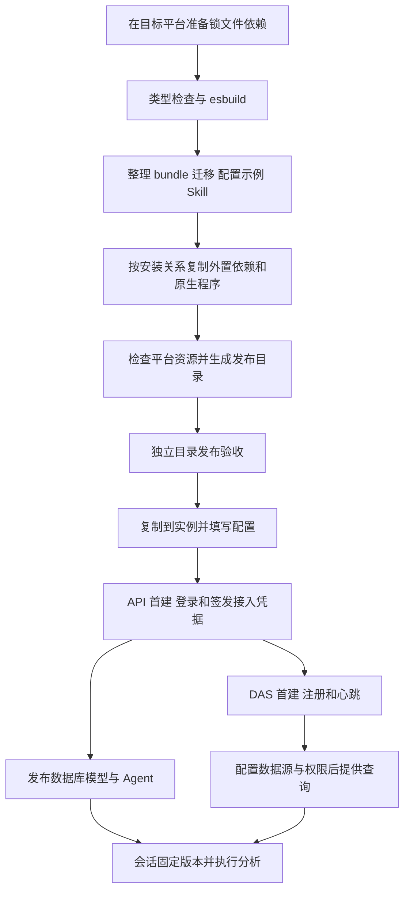

# API 与 DAS 部署

## 平台和环境

工作区使用 Node.js `>=24.19.0 <25`、pnpm `11.22.0`。构建时在对应系统和 CPU 架构准备依赖，使用同一套 Node 脚本产包。

| 系统    | 目标目录                     |
| ------- | ---------------------------- |
| Windows | `win32-x64`、`win32-arm64`   |
| Linux   | `linux-x64`、`linux-arm64`   |
| macOS   | `darwin-x64`、`darwin-arm64` |

当前实机验收为 Windows x64。其他五种目标已有平台规则测试，完整启动验收需在对应环境执行。API 随包携带官方 Codex 平台程序；发布目录应整体复制到同系统、同架构的部署机。DAS 中的 `oracledb` 也从目标环境已安装的包复制。Oracle 实际数据库连接沿用驱动的部署要求，本轮链路验收使用 SQL Server。

首次准备构建环境时，由操作者在工作区根目录执行：

```shell
pnpm install --frozen-lockfile
```

保留 optional dependencies，它们包含 Codex 原生平台包。脚本发现必需依赖或当前平台 Codex 缺失时会报错；在对应环境恢复锁文件依赖后重新构建。本项目打包脚本只复制已安装依赖。

## 构建与发布验收

在 `ai-data/` 工作区根目录执行：

```shell
pnpm --filter @ai-data/api --filter @ai-data/data-access build
pnpm test:release
```

两个应用构建均先做类型检查，再用 esbuild 生成 `dist/index.js`，随后整理自身发布目录。只重新整理已有最新 bundle 时执行 `pnpm release`，或 `node scripts/prepare-release.mjs api` / `das`。`release` 本身不重新编译源码。

```text
release/<platform>-<arch>/
├─ api/
│  ├─ dist/index.js
│  ├─ node_modules/
│  ├─ migrations/
│  ├─ skills/                         完整业务 Skill 与子文档
│  ├─ config/api.config.example.json
│  ├─ package.json
│  └─ release-info.json
└─ das/
   ├─ dist/index.js
   ├─ node_modules/
   ├─ migrations/
   ├─ config/das.config.example.json
   ├─ package.json
   └─ release-info.json
```

发布目录包含普通文件和完整外置运行资源，可整体移动。`release-info.json` 记录目标平台、架构、Node 要求、服务与外置依赖版本。编译进 bundle 的依赖仍由项目锁文件追溯。

`test:release` 把两个产物复制到系统临时目录，清除开发加载环境，创建随机隔离 SQL 库并执行生产入口。默认从 `apps/api/config/api.config.json` 读取 SQL 连接，或由 `SQLSERVER_TEST_CONFIG` 指向测试配置；账号需有创建、删除隔离库的权限。验收覆盖注册、查询、官方进程、Skill、会话恢复和程序更新；模型使用本机固定 Responses 夹具。详情见 [TESTING.md](TESTING.md)。

## 首次配置与启动

将各服务目录复制到独立实例目录，例如 Windows 的 `D:/services/ai-data/api`、`D:/services/ai-data/das`，或 Linux/macOS 的 `/opt/ai-data/api`、`/opt/ai-data/das`。部署机需要上述兼容版本的 Node；运行依赖已经随包携带。构建输出目录用于重新产包，实例放在独立位置。

1. 分别复制配置示例为 `config/api.config.json`、`config/das.config.json`。
2. 准备 API 与 DAS 各自的 SQL Server 元数据库并填写连接。服务启动执行随包迁移。API 当前业务结构为完整首建 `001_initial_api_schema.sql`，需使用匹配此基线的库；旧开发库的切换见 [首建迁移说明](../任务交接/API首建迁移整合说明.md)。
3. API 配置初始化管理员和 `trusted_data_access_services`，其中 `service_id` 与 DAS 的 `service.service_id` 一致。设置监听地址、端口及数据库证书参数。示例默认启用 SQL TLS 并校验证书，应按实际证书环境填写。
4. 需要对话时设 `analysis_runtime.enabled: true`。保持 `skills_directory: "skills"` 和 `state_directory: "secrets/codex-runtime"`，或者使用实例自己的固定路径。该配置还可设置调度 `concurrency`、`poll_ms`；模型和 Agent 在服务启动后通过接口发布到数据库。
5. 进入 API 实例目录启动：

```shell
node dist/index.js
```

API 启动完成后可访问 `GET /health`。首次启动生成实例 `secrets/jwt-private.pem` 和 `secrets/jwt-public.pem`；模型发布时生成凭据主密钥，Agent 发布时固定 Skill，运行时保存官方历史，均位于配置的状态目录。空模型库也可正常启动、登录和使用配置管理接口。

6. 登录 API，使用管理员 Access Token 调用 `POST /admin/data-access/services/<service_id>/credential`，将响应的 `credential` 原文保存为 DAS 实例的 `secrets/api-registration.jwt`。该 POST 可发送空请求体；发送空体时省略 JSON Content-Type。
7. 将 API 的 `secrets/jwt-public.pem` 复制为 DAS 的 `secrets/api-public.pem`。填写 DAS 的 `api.base_url`。示例中的两个 `../secrets/...` 路径相对 DAS 的 `config/` 目录解析。
8. 进入 DAS 实例目录执行同样的 `node dist/index.js`。确认 DAS `/health` 正常，并使用管理员调用 API 的 `GET /internal/data-access/services` 查看注册、心跳和来源健康状态。
9. 通过 API 管理接口配置 DAS 的连接凭据、数据源和暴露对象，再配置业务目录及用户权限。SQL Server 数据源需要按 `source_id` 填写 DAS `sqlserver_transports` 的 TLS 参数；新增数据源随后由心跳上报。

两个服务可分开部署。DAS 注册回调地址由 API 根据请求来源地址和 DAS 上报的端口、协议确定，API 需要能够连接该地址。启动工作目录固定为对应实例根目录，确保相对 Skill 和状态路径稳定。

## 首次发布模型与 Agent

启用对话的组织需要先发布模型，再发布绑定它的 Agent。以下 PowerShell 示例使用初始化管理员，API 地址按实际监听端口填写。模型地址、模型名称和认证使用实际服务的值；该服务须支持 Responses 协议。完整字段和管理权限见[Agent 配置接口](AGENT-CONFIGURATION.md)。

```powershell
$apiBase = 'http://127.0.0.1:3101'
$adminCredential = Get-Credential -Message '输入 API 管理员账号和密码'
$loginBody = @{
    username = $adminCredential.UserName
    password = $adminCredential.GetNetworkCredential().Password
} | ConvertTo-Json
$login = Invoke-RestMethod "$apiBase/auth/login" -Method Post -ContentType 'application/json; charset=utf-8' -Body $loginBody
$headers = @{ Authorization = "Bearer $($login.accessToken)" }

$model = @{
    model_id = 'analysis-model'
    version = 1
    name = '分析模型'
    protocol = 'responses'
    base_url = 'http://127.0.0.1:8000/v1'
    model = '替换为模型名称'
    api_key = '替换为模型密钥'
}
Invoke-RestMethod "$apiBase/models" -Method Post -Headers $headers -ContentType 'application/json; charset=utf-8' -Body ($model | ConvertTo-Json)

$tools = Invoke-RestMethod "$apiBase/agent-tools" -Headers $headers
$agent = @{
    agent_id = 'default'
    version = 1
    name = '分析助手'
    instructions = '通过业务工具核对口径和授权目录，依据查询证据回答；条件不明确时先澄清。'
    model_id = 'analysis-model'
    model_version = 1
    tool_names = @($tools.items | ForEach-Object { $_.name })
    skill_names = @('query-analysis', 'query-dsl')
    limits = @{ timeout_ms = 180000; max_tool_calls = 30; max_context_bytes = 65536 }
}
Invoke-RestMethod "$apiBase/agents" -Method Post -Headers $headers -ContentType 'application/json; charset=utf-8' -Body ($agent | ConvertTo-Json -Depth 5)
```

无认证的模型服务可省略 `api_key`。可在模型中设置 `context_window`，在 Agent 的 `limits` 中调整单轮预算。示例给默认 Agent 开放当前已注册工具，每次执行仍校验当前用户权限；也可按业务需要选取工具子集。

两次发布成功后，`GET /models`、`GET /agents` 可查看公开配置，创建会话时省略 `agent_id` 即绑定 `default`。指定其他 Agent 时在 `POST /conversations` 中提交 `agent_id`。首次发布即时供新会话使用，API 无需为此重启。后续发布同一标识时递增版本；旧会话继续使用原版本。

## 更新程序与持久状态

更新前停止两个服务并备份数据库、实际配置及状态。Windows 上同时确认 API 启动的 Codex 子进程已经退出，以免原生程序文件仍被占用。把新发布包中的 `dist/`、`node_modules/`、`migrations/`、API `skills/`、`package.json`、`release-info.json` 和配置示例放入原实例。依赖目录整体替换可避免旧版本文件残留；实例中的实际配置和持久目录继续使用原内容。

本次模型配置调整需从旧 `analysis_runtime` 中移除 `active_provider`、`providers`、`context_window`、`timeout_ms`、`max_tool_calls`、`max_context_bytes`。模型参数和 Agent 预算通过数据库管理接口维护；已有模型与 Agent 版本继续有效。

必须配套保留：

- API `config/api.config.json`、JWT 密钥目录、`analysis_runtime.state_directory` 的完整内容及 API 元数据库。默认状态目录下含模型加密主密钥、Agent 固定版本资源和官方线程历史，SQL 线程映射与文件历史配套使用。
- DAS `config/das.config.json`、`secrets/` 及 DAS 元数据库。主密钥用于解密数据库中的连接凭据，注册文件和 API 公钥也保留在实例中。
- 自定义到实例外部的配置、密钥、Skill 快照和运行状态路径。

部署后重新启动并检查健康、注册和查询。公共 `skills/` 更新后，新 Agent 配置版本可采用新资源，已有会话继续使用已固定的版本。打包脚本会拒绝覆盖包含实际配置或 `secrets/` 的构建输出目录，以免把部署实例当成可再生成产物。


