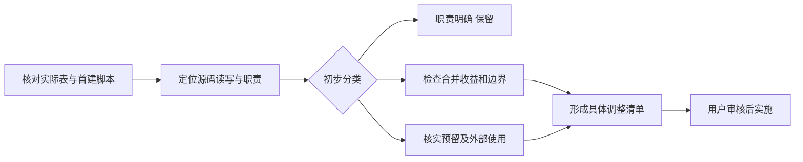

# 69 张系统表职责与精简初审

日期：2026-10-06。范围：本机会话中已只读核对的 `ai_to_bi` 系统库、当前首建脚本及 API/DAS 源码。API 63 张领域表、DAS 5 张领域表，共用 1 张迁移记录表，共 69 张；独立演示业务库的 24 张表另计。

## 判断口径

- **保留**：当前有明确的职责或独立生命周期，本次未发现优先合并理由。
- **检查合并**：有实际用途，但存在一对一附属数据、重复技术机制或相近存储结构，值得进一步比较方案；不等于已经确定合并。
- **核实预留**：本次未检索到业务源码直接读写；删除前仍需确认数据、外部使用方和后续需求。

本次只列职责与初步判断，代码、数据库结构和数据保持现状。表少几张是否值得，须结合事务锁、权限、唯一约束、查询方式及迁移成本判断；不预设最终表数量。

## 1. 账号与权限：17 张

| 表名 | 当前职责 | 初步判断与原因 |
| --- | --- | --- |
| `organizations` | 组织资料和租户归属 | 保留：组织隔离基础。 |
| `users` | 用户资料、认证与状态 | 保留：账号主体。 |
| `roles` | 角色定义 | 保留：多人复用角色。 |
| `permissions` | 功能权限定义 | 保留：权限代码与角色分开管理。 |
| `user_roles` | 用户与角色的多对多关系 | 保留：支持一个账号多个角色。 |
| `role_permissions` | 角色与功能权限的多对多关系 | 保留：角色授权基础。 |
| `auth_sessions` | 登录会话、刷新令牌摘要和撤销状态 | 保留：一个用户可有多次登录。 |
| `user_department_scopes` | 账号可访问的部门范围 | 保留：参与部门授权。 |
| `data_scopes` | 角色或用户引用的数据范围规则 | 保留：当前认证加载与管理页使用。 |
| `role_data_scopes` | 角色绑定的数据范围规则 | 保留：与用户例外授权来源不同。 |
| `user_data_scopes` | 用户单独绑定的数据范围规则 | 保留：承载账号例外范围。 |
| `role_object_permissions` | 角色的数据对象访问权限 | 保留：对象授权。 |
| `role_column_permissions` | 角色的字段访问与输出控制 | 保留：列权限和脱敏相关配置。 |
| `role_row_policies` | 角色的对象级行过滤策略 | 保留：实际查询授权。 |
| `catalog_policy_versions` | 策略版本、历史内容与发布记录 | 保留：授权追溯和模型线程兼容性判断。 |
| `identity_providers` | 外部身份提供方配置 | 核实预留：未发现业务源码直接读写。 |
| `external_identities` | 外部身份与本地账号绑定 | 核实预留：未发现业务源码直接读写。 |

主要依据：`apps/api/src/auth/sql-auth-repository.ts`、`sql-user-admin-reader.ts`，以及 `catalog/sql-catalog-repository.ts`、`catalog-admin/sql-catalog-admin-repository.ts`。通用数据范围和对象行策略当前均参与授权，不能仅凭名称相似就删除其中一套。

## 2. 模型与 Agent：4 张

| 表名 | 当前职责 | 初步判断与原因 |
| --- | --- | --- |
| `agents` | Agent 身份、当前版本及启停 | 保留：当前状态与历史配置分开。 |
| `agent_definitions` | Agent 固定版本的完整定义 | 保留：旧会话继续使用原版本。 |
| `model_configurations` | 模型配置身份与当前状态 | 保留：模型资源主体。 |
| `model_configuration_versions` | 模型各版本配置及加密凭据 | 保留：固定版本与凭据生命周期。 |

主要依据：`apps/api/src/agents/sql-agent-repository.ts`、`models/sql-model-repository.ts`。

## 3. API 数据目录与接入：3 张

| 表名 | 当前职责 | 初步判断与原因 |
| --- | --- | --- |
| `data_access_services` | DAS 实例注册、心跳与会话记录 | 保留：服务发现和调度。 |
| `api_dataset_configs` | API 维护的业务目录说明与查询配置 | 保留：业务语义由 API 管理。 |
| `approved_relations` | 获准使用的对象关系、版本与启停 | 保留：关系查询和独立版本校验。 |

主要依据：`apps/api/src/data-access/sql-data-access-service-registry.ts`、`catalog/sql-catalog-repository.ts`、`catalog/sql-relation-storage.ts`。这些表与 DAS 的物理对象白名单职责不同。

## 4. 对话与分析运行：13 张

| 表名 | 当前职责 | 初步判断与原因 |
| --- | --- | --- |
| `conversations` | 会话归属、标题及绑定 Agent | 保留：会话主体。 |
| `conversation_messages` | 会话消息及顺序 | 保留：一对多消息记录。 |
| `conversation_submissions` | 提问去重与消息、运行的关联回执 | 检查合并：比较与其他幂等回执的共用方案。 |
| `analysis_runs` | 每轮分析的身份、状态和时间索引 | 保留：运行主体。 |
| `analysis_run_states` | 每轮分析的完整状态 JSON | 检查合并：与运行表一对一，评估放回运行记录的锁与大字段成本。 |
| `analysis_run_events` | SSE 事件序号与重连回放内容 | 保留：按游标增量读取。 |
| `analysis_steps` | 可更新的分析步骤记录 | 保留：步骤状态与追加事件的语义不同。 |
| `analysis_evidence` | 查询结果证据及来源范围 | 保留：结果复用、授权和导出的依据。 |
| `analysis_tool_audits` | 工具调用记录及执行代次 | 保留：调用成功失败与证据不是同一件事。 |
| `analysis_run_operations` | 运行操作的防重复提交记录 | 检查合并：比较统一幂等记录，保留运行级唯一性和事务。 |
| `analysis_dispatches` | 待调度运行的可信登录会话引用 | 检查合并：记录较薄，可评估并入运行表；必须保留“是否可派发”的区别。 |
| `analysis_codex_threads` | 产品会话到官方线程的映射与上下文指纹 | 检查合并：与会话一对一，可评估作为会话的运行时字段。 |
| `analysis_memory_contexts` | 按运行和租约代次固定的记忆、知识上下文 | 保留：同一运行可能有多次接管，不能当作简单一对一附属字段。 |

主要依据：`apps/api/src/conversations/sql-conversation-repository.ts`、`analysis-runs/sql-analysis-run-repository.ts`、`runtime/sql-runtime-repository.ts`。

## 5. 偏好、知识、指标与后台学习：15 张

| 表名 | 当前职责 | 初步判断与原因 |
| --- | --- | --- |
| `user_preferences` | 账号偏好、版本及自动应用设置 | 保留：偏好主体。 |
| `preference_operations` | 保存、确认等偏好操作的幂等回执 | 检查合并：与其他幂等表比较，保留账号隔离及原结果回放。 |
| `preference_confirmations` | 冲突或恢复自动应用时的待确认变更 | 保留：有独立状态和版本基准，不只是日志。 |
| `preference_sources` | 偏好来源及是否已经计入观察 | 保留：用于去重计数，不能直接塞进普通审计日志。 |
| `preference_audits` | 偏好变更审计 | 检查合并：评估是否需要偏好专用审计表，须先明确统一审计需求。 |
| `knowledge_candidates` | 待审核知识的内容与状态 | 保留：候选可修改，正式版本不可覆盖。 |
| `knowledge_sources` | 候选来源和支持者 | 保留：参与候选可见范围和来源去重。 |
| `knowledge_reviews` | 固定内容的审核记录 | 保留：支持多次审核与历史追溯。 |
| `knowledge_heads` | 正式知识身份及启停状态 | 保留：启停不应覆盖历史内容。 |
| `knowledge_versions` | 正式知识版本及生效时间 | 保留：历史、定时生效和运行追溯。 |
| `knowledge_operations` | 知识操作的幂等回执 | 检查合并：与其他幂等表比较，保留组织、账号和操作范围。 |
| `metric_definitions` | 指标的版本化计算定义 | 保留：确定性计算入口。 |
| `metric_publications` | 指标版本与正式知识发布的关联 | 保留：读取指标时实际用于生效、启停和范围判断。 |
| `memory_intents` | 分析期间产生的待处理学习意图 | 保留：分析成功后才转入后台队列，生命周期不同。 |
| `memory_events` | 后台学习任务、租约与重试 | 保留：独立消费与失败恢复。 |

主要依据：`apps/api/src/preferences/sql-preference-repository.ts`、`knowledge/sql-knowledge-repository.ts`、`metrics/sql-metric-repository.ts`、`memory/persist-memory-intents.ts`、`memory/sql-memory-event-repository.ts`。

## 6. 报表：11 张

| 表名 | 当前职责 | 初步判断与原因 |
| --- | --- | --- |
| `report_templates` | 可编辑报表定义的当前记录与访问设置 | 保留：这里是基础报表定义，名称容易与组织模板混淆。 |
| `report_template_versions` | 报表定义的不可变历史版本 | 保留：运行绑定固定定义版本。 |
| `saved_reports` | 已保存结果快照及来源 | 保留：定义版本与结果版本独立。 |
| `report_executions` | 一次参数执行的状态、条件及结果 | 保留：执行记录、超时和幂等职责。 |
| `analysis_artifacts` | 分析运行与报表产物的关联 | 保留：支持从对话选择并保存具体产物。 |
| `report_blocks` | 可复用报表块的当前定义 | 检查合并：已有读写接口；与报表定义结构接近，评估共用定义存储。 |
| `report_block_versions` | 可复用报表块的历史版本 | 检查合并：与报表块一并评估，保留版本语义。 |
| `analysis_report_contexts` | AI 修订目标、基准版本与待提交定义 | 检查合并：评估运行上下文的组织方式；必须保留成功后提交及刷新恢复。 |
| `report_revision_requests` | AI 修改请求去重及运行关联 | 检查合并：比较与其他请求回执共用，保留报表和账号范围。 |
| `report_narratives` | 绑定某次执行的 AI 分析说明 | 保留：同一次结果可有多次说明。 |
| `report_template_publications` | 组织模板发布与报表定义版本的关联 | 检查合并：与知识版本中的绑定信息有重叠，需核对外键和完整性收益。 |

主要依据：`apps/api/src/reports/sql-report-definition-repository.ts`、`sql-report-execution-repository.ts`、`sql-report-revision-repository.ts`、`report-artifact.ts`，以及 `knowledge/sql-knowledge-repository.ts`。报表块在 `routes/report-management-routes.ts` 已有接口，不能直接按未使用功能删除。

## 7. DAS：5 张

| 表名 | 当前职责 | 初步判断与原因 |
| --- | --- | --- |
| `data_source_configs` | 业务数据源类型、连接引用和资源限制 | 保留：数据源主体。 |
| `data_source_secrets` | 加密连接凭据 | 保留：密钥管理和数据源配置独立。 |
| `exposed_source_objects` | 物理对象暴露白名单及能力 | 保留：DAS 执行边界。 |
| `api_dataset_response_mappings` | HTTP 数据集返回值到标准字段的映射 | 保留：HTTP 连接器专属配置，已有仓储。 |
| `query_audit_logs` | DAS 查询执行审计 | 保留：记录实际数据访问。 |

主要依据：`apps/data-access/src/metadata/` 下的数据源、密钥、暴露对象、映射和审计仓储。

## 8. 迁移记录：1 张

| 表名 | 当前职责 | 初步判断与原因 |
| --- | --- | --- |
| `schema_migrations` | 已执行迁移的标记 | 保留：API/DAS SQL 脚本据此避免重复首建。 |

主要依据：API/DAS 的 `migrations/000_schema_migrations.sql`、`001` 首建脚本和 `packages/metadata/src/sqlserver/sqlserver-migrations.ts`。

## 初步结论与后续核对顺序

本次分为 **54 张保留、13 张检查合并、2 张核实预留**。13 张候选表不代表可减少 13 张，合并还可能需要新的公共表或字段。

1. 优先核实两张外部身份表的实际用途、数据和外部使用方。
2. 检查三张一对一或薄记录表：运行状态、调度身份引用、官方线程映射。
3. 比较五张请求／幂等回执表：提问提交、运行操作、偏好操作、知识操作、报表修改请求。不同隔离键、返回结构和锁序必须保留，不能直接拼在一起。
4. 核对报表与报表块是否需要独立存储，以及报表上下文、模板发布映射和偏好审计的拆分收益。

以上是初审方向，完整重构方案需要逐项列迁移、索引、外键、权限、事务及回归影响后再审核。

