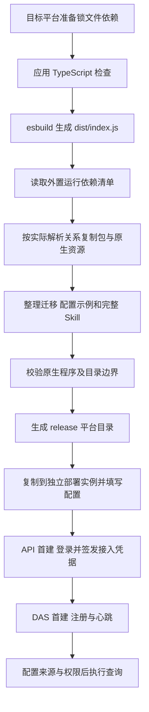
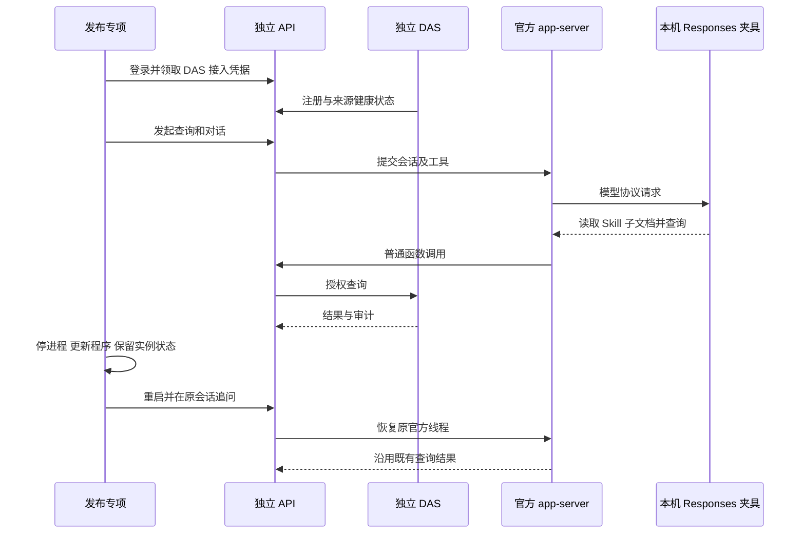

# API 与 DAS 多平台打包交付说明

日期：2026-09-21。用户回复“开始吧”批准[实施清单](API与DAS多平台打包实施清单.md)，由主代理单独完成。本轮沿用已安装依赖，依赖安装、升级和卸载为 0。

## 交付结果

API 与 DAS 已接入统一发布整理脚本，应用构建后生成 `ai-data/release/<platform>-<arch>/api|das`。当前 Windows x64 的两个目录已生成，并从独立临时目录完成真实启动、注册、查询及官方线程恢复验收。前端可据此接入后端环境。

各目标使用同一套 Node 脚本在相应系统与 CPU 架构产包。Windows、Linux、macOS 的 x64/arm64 共六种目标已有规则覆盖；本机实测范围是 `win32-x64`。其他五种目标的完整产包与运行验收需在对应环境补齐。

操作入口见 [DEPLOYMENT.md](../ai-data/DEPLOYMENT.md)，构建交接见 [BUILD.md](BUILD.md)。部署环境使用 Node.js `>=24.19.0 <25`，进入对应实例根目录执行 `node dist/index.js`。

## 主要改动

| 文件或范围                              | 结果                                                                                                                         |
| --------------------------------------- | ---------------------------------------------------------------------------------------------------------------------------- |
| `scripts/runtime-dependencies.json`     | 维护 API 的 `@openai/codex-sdk`、DAS 的 `oracledb` 外置入口                                                                  |
| `scripts/copy-runtime-dependencies.mjs` | 按现有安装关系复制 dependencies、peer 和平台 optional，保留 npm 别名、同名多版本、原生资源与许可证，转换 pnpm 链接为普通文件 |
| `scripts/prepare-release.mjs`           | 整理 bundle、迁移、配置示例、API 完整 Skill，检查平台原生程序并生成 ESM package 与发布元信息                                 |
| 两应用和根 `package.json`               | 构建后整理单个应用，新增根 `release`、`test:release` 命令                                                                    |
| 两个发布配置示例                        | API 显式指定随包 `skills`；DAS 公钥和注册凭据相对本服务配置目录指向 `secrets`                                                |
| 新增脚本测试与发布集成测试              | 验证复制关系、路径边界、资源、独立运行与恢复；专项通过独立入口收集                                                           |
| 忽略规则、部署和交接文档                | 发布生成目录独立管理，补齐首次部署、更新与验收命令                                                                           |

本轮生产业务模块、数据库结构和依赖版本保持既有实现。原开发库未重建。配置示例从已跟踪的示例整理，实例连接配置和密钥在部署时提供。

当前 API 携带 `@openai/codex-sdk@0.154.0`、`@openai/codex@0.154.0` 及 `@openai/codex-win32-x64` 安装别名对应的平台资源；DAS 携带 `oracledb@7.0.1`。每个包的真实名称、版本、安装名称和相对路径记录于各自 `release-info.json`。

## 构建与启动流程



每个服务在临时 staging 目录完成复制与检查后替换自身生成目录。缺失依赖时保留原产物；发现输出目录含实际配置或 `secrets` 时拒绝覆盖。发布目录和清理路径逐级核对，拒绝通过链接写入其他位置。

更新程序时保留实际配置、JWT 密钥、API 模型凭据主密钥、DAS 主密钥、Agent 固定版本资源、官方线程历史及两侧元数据库。源 Skill 更新由新 Agent 配置版本采用，已有版本继续使用其固定资源。

## 实际验证

| 检查             | 本轮结果                                                                                                                                |
| ---------------- | --------------------------------------------------------------------------------------------------------------------------------------- |
| 普通与工程测试   | 1214 项通过：API 574、DAS 409、contracts 168、metadata 28、工程 35                                                                      |
| 新增打包行为测试 | 上述工程测试中新增 20 项，覆盖 ESM-only、别名、多版本、peer、循环依赖、六目标 optional 选择、链接转换、缺失依赖、原生程序检查及输出保护 |
| 独立发布专项     | 1 项完整链路通过；使用真实 SQL Server、两个生产 bundle 和官方 Codex 原生进程                                                            |
| 类型检查         | API、DAS、contracts、metadata 通过                                                                                                      |
| Lint             | 全工作区 ESLint 通过                                                                                                                    |
| 构建             | API、DAS 使用已安装 TypeScript/esbuild CLI 构建并完成发布整理                                                                           |
| 格式与差异       | 本轮源码及文档格式、`git diff --check` 和 72 条本地文档链接通过；全量格式检查仅报告既有 `pnpm-lock.yaml` 差异，锁文件未改动             |

新增脚本测试先确认缺失实现的预期失败，再补实现。发布验收实际检查：

1. 将 API、DAS 发布包复制到系统临时目录，遍历确认文件不含链接；清除开发加载环境后，两个外置入口都解析到临时发布目录。
2. 随机创建两个 SQL 测试库，服务生产入口完成首建并通过健康检查。API 初始化管理员、登录、签发 DAS 接入凭据，DAS 完成注册并上报健康来源。
3. 通过 API 管理代理保存连接凭据、配置来源和暴露对象。API 查询得到去重就诊人次 3，DAS 写入执行审计。
4. 发布包内真正的官方 app-server 调用本机 Responses 夹具，读取随包 Skill 正文及完整关系查询子文档，再执行普通函数查询，保存正确证据和回答。
5. 停止两个服务及官方进程，重新复制程序资源，逐文件比较实际配置、密钥及状态哈希；重启后恢复同一会话和官方线程，追问使用之前的结果且没有新增 SQL 查询。
6. 完成后清理本次启动的进程、随机数据库及专属临时目录。



Windows 验收夹具使用 `taskkill /PID <本夹具进程> /T /F` 清理测试进程树，解决 Node 退出后原生子进程短暂占用可执行文件的问题。当前沙箱限制此命令，最终专项在获准的沙箱外环境通过；受限尝试留下的随机库和专属临时目录已单独清理。初次将普通测试与全工作区 Lint 并行时，Lint 扫到了测试临时生成的官方文件；测试完成后全工作区 Lint 已通过。

本轮模拟模型响应只用于打包资源与协议验收。既有真实模型业务调优安排、其他平台实机验收，以及前端交互和文件导出按各自阶段推进。

## 复跑命令

在 `ai-data/` 工作区根目录：

```shell
pnpm --filter @ai-data/api --filter @ai-data/data-access build
pnpm test:engineering
pnpm test:release
```

`test:release` 使用 `apps/api/config/api.config.json` 中的 SQL 连接，或 `SQLSERVER_TEST_CONFIG` 指定的配置，仅对随机验收库操作。Windows 测试环境需要能管理其自身启动的进程树。
