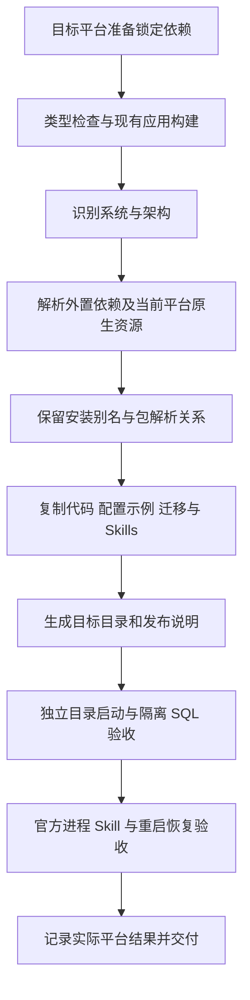

# API 与 DAS 多平台打包实施清单

日期：2026-09-21。状态：用户回复“开始吧”批准本清单，已实施，见[交付说明](API与DAS多平台打包交付说明.md)。用户要求支持多平台，由主代理单独执行。本清单承接 [BUILD.md](BUILD.md) 的依赖清单与复制脚本方案，明确文件、平台、资源和验收范围。

## 1. 目的与交付物

把当前 API、DAS 整理为按系统和架构区分的独立部署目录。部署机准备兼容 Node.js、填写配置和服务凭据后，分别进入服务目录执行 `node dist/index.js`。前端随后使用这套后端环境联调。

交付包括多平台通用的 Node 打包脚本、外置运行依赖清单、配置示例、迁移与 Skill 资源、部署说明，以及当前可用平台上的隔离启动和服务联通验收。

主代理单独实施，子代理数量为 0。沿用已安装依赖；新增依赖为 0。安装、升级、卸载继续由用户操作。

## 2. 当前代码核对

| 项目         | 已核对事实                                                                                                  | 本次处理                                                       |
| ------------ | ----------------------------------------------------------------------------------------------------------- | -------------------------------------------------------------- |
| 构建         | API 和 DAS 使用 TypeScript 检查与 esbuild，产出各自 `dist/index.js`                                         | 保留已有构建，完成后整理对应平台的发布目录                     |
| Node.js      | 工作区要求 `>=24.19.0 <25`；本机 `v24.19.0`，`win32/x64`                                                    | 发布包声明相同运行要求，记录实际目标系统与架构                 |
| API 外置入口 | `@openai/codex-sdk@0.154.0` 依赖同版 `@openai/codex`；生产入口使用 ESM 定位 SDK                             | 支持 ESM 导出与包资源定位，保留官方运行时依赖链                |
| Codex 平台包 | 官方包声明 Windows、Linux、macOS 的 x64/arm64 可选包；平台包使用 npm 别名，包内 `name` 仍为 `@openai/codex` | 按实际安装名保留解析关系，根据目标系统、架构收集已安装原生资源 |
| DAS 外置入口 | `oracledb@7.0.1` 是现有 external，启动模块顶层导入                                                          | 随 DAS 包复制已安装运行资源，验证发布目录内可解析加载          |
| API 资源     | 配置、迁移及 JWT 密钥默认相对应用文件；Skill 源目录可通过 `analysis_runtime.skills_directory` 指定          | 发布示例显式配置 `skills`，沿用已有解析规则                    |
| 持久状态     | API 模型密钥、Agent 固定 Skill 版本与官方线程状态位于配置的运行状态目录；DAS 主密钥位于实例 `secrets`       | 部署和升级保留配置、密钥、官方状态及固定版本资源               |
| DAS 凭据路径 | 凭据和 API 公钥的相对路径以 DAS 配置文件目录为基准；开发示例公钥路径跨向 API 源码目录                       | 发布示例改为本服务 `secrets` 下的凭据和 API 公钥副本           |
| 发布入口     | 当前还没有运行依赖复制脚本或完整发布资源整理                                                                | 新增脚本和验证入口                                             |

现有业务代码、首建结构与已通过的报表、知识、查询行为作为本次基线。当前完整首建验收已通过，开发库切换仍另行安排。

## 3. 多平台方式

使用同一套 Node 脚本，在对应目标平台安装锁定依赖并产包。构建目标由当前 Node 的 `process.platform` 和 `process.arch` 确定，输出名称明确系统与架构。各包携带该目标所需原生资源。

| 输出目标       | 系统与架构          | 本轮可执行的验证                                       |
| -------------- | ------------------- | ------------------------------------------------------ |
| `win32-x64`    | Windows x64         | 本机真实打包、目录迁移、启动、SQL 和协议验收           |
| `win32-arm64`  | Windows ARM64       | 目标识别与资源选择规则自动化测试；运行验收需要对应环境 |
| `linux-x64`    | Linux x64           | 目标识别与资源选择规则自动化测试；运行验收需要对应环境 |
| `linux-arm64`  | Linux ARM64         | 目标识别与资源选择规则自动化测试；运行验收需要对应环境 |
| `darwin-x64`   | macOS Intel         | 目标识别与资源选择规则自动化测试；运行验收需要对应环境 |
| `darwin-arm64` | macOS Apple Silicon | 目标识别与资源选择规则自动化测试；运行验收需要对应环境 |

平台范围依据当前已安装官方包的声明及项目运行时解析代码。本机仅安装 Windows x64 的 Codex 平台包；其他目标包由对应环境准备依赖后生成。跨平台支持与实际运行验收分别记录，发布目录中的原生程序必须与部署机匹配。

各目标环境使用工作区已声明的 pnpm 版本和锁文件，由用户执行 `pnpm install --frozen-lockfile` 准备依赖。脚本只读取已安装依赖；缺少当前目标必需包时列明缺项并终止打包，不把缺少原生程序的目录标记为完整交付。

## 4. 实施工作清单

| 顺序 | 工作项       | 具体行为                                                                                                               |
| ---- | ------------ | ---------------------------------------------------------------------------------------------------------------------- |
| 1    | 外置依赖清单 | 维护 API 的 SDK 入口与 DAS 的 Oracle 驱动入口；从当前 bundle 与运行时调用核对最终外置资源                              |
| 2    | 运行依赖复制 | 从各应用实际安装位置解析，收集运行依赖、必要 peer 与匹配目标的 optional 依赖；保留别名、同名不同版本、许可证和运行资源 |
| 3    | 包解析与路径 | 正确处理 ESM-only 导出、受 exports 限制的 package.json 定位、pnpm 链接及官方平台包；发布资源全部在产包目录内解析       |
| 4    | 发布资源整理 | 复制 bundle、配置示例、迁移、完整 Skill 源目录；生成 ESM `package.json`、目标与依赖版本说明                            |
| 5    | 构建入口     | 两应用构建成功后自动整理各自发布目录；提供单独重建发布目录的命令，复用已有 bundle                                      |
| 6    | 部署示例     | API 显式指定 `skills`；DAS 使用本服务保存的 API 公钥和注册凭据；说明首次部署、重启和更新步骤                           |
| 7    | 发布验收     | 验证复制后的目录可脱离工作区依赖启动，完成 API/DAS 注册、授权 SQL、官方进程、Skill 加载及重启恢复                      |
| 8    | 文档与交接   | 保存使用说明、流程图、实际平台与测试结果，供前端联调和后续目标平台复验                                                 |

目录整理写入工作区内专用的 `release/<目标>/`，以应用为单位生成；删除或替换前校验路径始终处于对应产物目录。失败时返回明确错误，不继续后续验收。部署实例的实际配置、密钥与状态由部署流程持久保存，打包不读取开发环境真实配置或运行历史。

第一版交付目录形态，部署通过目录复制完成。操作系统服务托管、容器、云端 CI 和自动上传发布按后续部署需要另列清单。

## 5. 文件增删改

以下路径相对 `ai-data/` 工作区，任务交接文档位于其上一级。

| 操作           | 文件或目录                                                                                                                                        | 用途                                                                     |
| -------------- | ------------------------------------------------------------------------------------------------------------------------------------------------- | ------------------------------------------------------------------------ |
| 新增           | `scripts/runtime-dependencies.json`                                                                                                               | 外置运行依赖入口                                                         |
| 新增           | `scripts/copy-runtime-dependencies.mjs`                                                                                                           | 安装位置解析、依赖图及物理文件复制                                       |
| 新增           | `scripts/prepare-release.mjs`                                                                                                                     | 按当前平台整理单个或两个服务的 bundle、资源和部署元信息                  |
| 新增           | `scripts/tests/copy-runtime-dependencies.test.mjs`                                                                                                | ESM、别名、peer/optional、版本隔离、缺失依赖与链接复制测试               |
| 新增           | `scripts/tests/prepare-release.test.mjs`                                                                                                          | 发布目录、资源、目标识别、路径边界及失败处理测试                         |
| 新增           | `scripts/test-release.mjs`                                                                                                                        | 校验发布目录存在并调度对应隔离验收，避免普通测试要求预先产包             |
| 新增           | `apps/api/tests/integration/release.integration.ts`                                                                                               | 独立 API/DAS 产物启动、真实 HTTP/SQL、官方进程及恢复验证                 |
| 按复用需要修改 | `apps/api/tests/integration/dialogue-das-fixture.ts`、`dialogue-model-fixture.ts`、`agent-startup.integration.ts`、`vitest.integration.config.ts` | 提供发布产物路径和复用隔离连接、启动、协议夹具；发布专项使用明确入口收集 |
| 修改           | 根 `package.json`、两应用 `package.json`                                                                                                          | 根发布/验收入口及应用构建后整理步骤；依赖版本保持现状                    |
| 新增           | `apps/api/config/api.release.config.example.json`                                                                                                 | 发布布局中的 API 配置示例                                                |
| 新增           | `apps/data-access/config/das.release.config.example.json`                                                                                         | 独立 DAS 目录的注册凭据与公钥路径示例                                    |
| 修改 / 新增    | `.gitignore`、`.prettierignore`、`eslint.config.mjs`                                                                                              | 发布产物使用独立目录，不纳入源码检查及 Git 跟踪                          |
| 新增           | `DEPLOYMENT.md`                                                                                                                                   | 各平台准备、产包、配置、启动及程序更新步骤                               |
| 修改           | `TESTING.md`、`../任务交接/BUILD.md`、`../任务交接/README.md`、`../AGENTS.md`                                                                     | 命令、状态及交接入口                                                     |
| 新增           | `../任务交接/API与DAS多平台打包交付说明.md`                                                                                                       | 变更、流程图、验收结果与平台边界                                         |
| 生成           | `release/<platform>-<arch>/api/`、`release/<platform>-<arch>/das/`                                                                                | 两个可分别部署的服务目录                                                 |

源码文件计划删除为 0。发布脚本仅清理自身生成的应用产物与测试临时目录。第一版通过已有 `skills_directory` 配置适配资源布局，保持生产业务模块职责；如果实际 bundle 暴露额外运行依赖或资源定位不兼容，先报告具体差异及调整清单。

## 6. 发布目录和命令

```text
release/
└─ <platform>-<arch>/
   ├─ api/
   │  ├─ package.json
   │  ├─ release-info.json
   │  ├─ dist/index.js
   │  ├─ node_modules/
   │  ├─ config/api.config.example.json
   │  ├─ migrations/
   │  └─ skills/                         完整入口与 references
   └─ das/
      ├─ package.json
      ├─ release-info.json
      ├─ dist/index.js
      ├─ node_modules/
      ├─ config/das.config.example.json
      └─ migrations/
```

`release-info.json` 记录服务版本、目标系统、架构、Node 要求及所携依赖版本，供部署时识别正确包。部署时另行创建实际配置与 `secrets/`，使用实例自身的数据库、凭据和持久运行状态。

拟提供以下入口，实施后以最终脚本为准：

```powershell
# 工作区根目录：现有 build 结束后生成当前目标的两个发布目录
pnpm build

# 已有当前 bundle 时，单独重新整理发布目录
pnpm release

# 已产包后的隔离验收
pnpm test:release
```

执行验证时继续直接调用已安装 CLI，避免依赖整理。上述命令只面向已准备好依赖的环境。每个平台分别保存自己的输出目录；部署机启动服务使用 `node dist/index.js`。

## 7. 配置、持久化与升级

API 发布示例设置 `analysis_runtime.skills_directory: "skills"` 和 `state_directory: "secrets/codex-runtime"`。迁移和默认 JWT 密钥路径继续相对服务目录。修改 Skill 源文件后，通过新的 Agent 配置版本形成新的固定资源；已有 Agent 版本及会话按其原资源运行。

DAS 发布示例从 `config/` 解析 `../secrets/api-registration.jwt` 和 `../secrets/api-public.pem`。API 公钥由部署操作提供给 DAS，注册凭据由现有受控接口签发。两个服务可以部署在不同目录或不同机器，地址通过配置连接。

程序更新替换代码、依赖、迁移及包内示例；实际配置、JWT 密钥、模型凭据主密钥、DAS 主密钥、Agent 固定资源和官方线程状态继续保留。数据库与对应密钥、运行状态配套备份和恢复。验收在隔离实例验证更新后这些资源仍可使用。

## 8. 验证清单

### 自动化行为

1. 首先编写依赖复制和发布目录的 BDD/TDD 场景，确认新行为预期失败，再实现。
2. ESM-only 导出、npm 别名与包内名称不同、同名多版本、必要 peer、平台 optional 选择均能按安装时关系解析；循环依赖终止遍历。
3. 缺少当前目标必需依赖或原生可执行文件时，打包明确失败；其他平台可选包不影响当前目标产包。
4. 复制后的包与资源没有指向工作区的链接，Node 从发布目录解析实际依赖；Unix 原生程序执行位得到保留。
5. 资源完整包含当前迁移与 Skill 子文档，只从配置示例生成部署模板；既有开发配置、密钥和官方历史不进入包。
6. 重复生成同一服务产物结果稳定，应用之间互不清理，非法输出路径不能导致工作区之外的删除。

### 当前平台真实验收

1. 把两个发布目录复制到独立临时位置，限制模块解析不能回到工作区 `node_modules`；验证外置依赖实际路径。
2. 使用随机隔离 SQL Server 数据库，验证 API/DAS 首建、启动及健康检查。
3. API 签发 DAS 接入凭据，DAS 注册和心跳正常；从 API 完成授权查询，DAS 返回结果并写审计。
4. 从发布包启动真正的官方 app-server，使用本地模拟 Responses 服务核对普通函数、Skill 正文和子文档加载；这项用于验证打包资源，不改现有真实模型业务调优安排。
5. 重启服务及官方进程，验证持久会话和线程映射恢复；重新复制程序文件后，既有配置、密钥与状态保持可用。
6. 测试结束清理本次创建的进程、数据库及临时目录。开发库重建不属于本清单。

### 工程验收

运行新增脚本测试、受影响配置与启动测试、发布专项，以及项目要求的类型、Lint、格式、普通测试和构建检查。当前锁文件格式问题作为已有状态记录；本轮文件必须通过格式检查。最终记录各平台的产包与运行验收状态，其他平台使用同一专项在对应环境补验。

## 9. 执行流程



本次获准范围为以上文件和验收，已由主代理单独完成。需要用户执行的依赖操作当前为 0；其他平台环境准备时按锁文件安装并分别验收。
