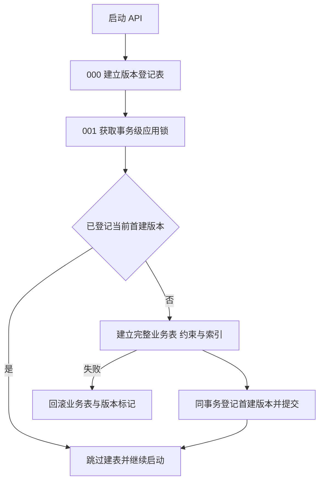

# API 首建迁移整合

日期：2026-09-20。用户要求将发布前 API 的业务迁移统一到 `001`，主代理已完成整合与验证。

## 范围

- 保留 `000_schema_migrations.sql` 建立版本登记表。
- 新增 `001_initial_api_schema.sql`，汇总原 `001` 至 `009` 的 37 张业务表、字段、约束和索引，移除九份原文件。
- 消息与分析运行关联、会话及运行的 Agent 绑定字段直接进入建表定义；首建使用完整结构。
- 保留事务级应用锁、DDL 与版本标记同事务提交，以及重复启动跳过已应用首建的行为。
- 同步迁移文件清单测试、真实 SQL 验收、运行说明和第 10 步方案；发布前第 10 步结构继续加入这份首建文件。
- 使用现有依赖和隔离测试数据库验证。本轮不重建当前开发库；旧迁移记录的数据库需要另行重建后使用新的首建基线。

## 验收场景

| 场景                           | 预期                                                     |
| ------------------------------ | -------------------------------------------------------- |
| 发现 API 迁移文件              | 仅加载 `000` 与完整的 `001`                              |
| 空库首次执行                   | 全部业务模块结构建立，只登记 `001_initial_api_schema`    |
| 再次执行迁移                   | 业务数据及版本记录保持一致                               |
| 检查消息、Agent 与模型凭据结构 | 关联字段、可空性、绑定约束及查询索引与现有业务一致       |
| 提交前注入错误                 | 本次全部业务表和版本标记回滚，后续文件停止，修复后可重跑 |
| API 仓储与运行集成             | 当前认证、会话、指标、证据、Agent 和模型操作继续通过     |

## 执行流程

## 验证记录

- 先修改迁移发现测试，确认其因旧文件清单而失败；完成整合后该测试通过。
- 迁移专项 4 项通过：API、DAS 首建与重复执行，以及两者提交前失败的完整回滚和恢复；其余 28 项 DAS 查询用例未选中。
- API SQL 业务集成 27 项通过，覆盖分析运行、权限、指标、报告、Agent、模型版本与凭据。
- API 构建产物启动验收 1 项通过：隔离库初始化、启动、登录、默认资源读取及创建固定 Agent 版本会话。
- API 和 DAS 类型检查、修改测试文件的 ESLint、API 构建、本轮文档及测试格式检查、`git diff --check` 通过。
- 测试使用本轮创建的隔离库，清理钩子正常结束；当前开发库与业务数据保持原状。
