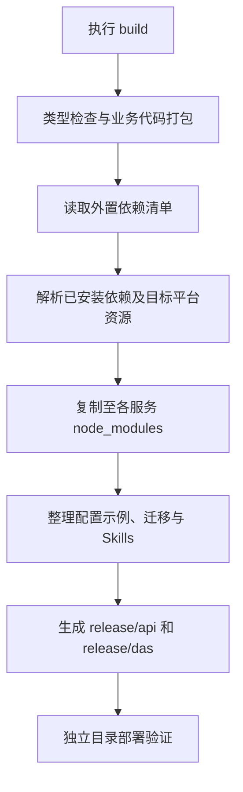

# API 与 DAS 构建部署方案

记录日期：2026-09-16。状态：方案留档，发布脚本及目录调整待实施。

**后续开始 build、发布打包或部署目录相关工作时，先阅读本文，再按当时的代码和依赖提交具体实施清单供用户审核。** 本次仅保存方案。

## 1. 构建目标与当前状态

目标是生成 `release/api/`、`release/das/` 两个可独立部署的目录。部署环境准备兼容的 Node.js，复制对应目录并填写配置后，在服务目录执行 `node dist/index.js`。

当前两个应用通过 TypeScript 检查和 esbuild 生成 `dist/index.js`，业务代码和多数 JavaScript 依赖已合并。完整发布目录的自动整理尚未实现。

当前已确认的外置依赖入口：

| 应用 | 入口依赖            | 原因                                                 |
| ---- | ------------------- | ---------------------------------------------------- |
| API  | `@openai/codex-sdk` | 运行时从 SDK 的依赖位置解析官方 Codex 及平台原生程序 |
| DAS  | `oracledb`          | 构建将其标为 external，现有驱动模块在顶层导入该包    |

最终外置清单须结合届时的构建产物核查。当前项目 Node.js 版本范围为 `>=24.19.0 <25`，实施时以项目声明为准。

## 2. 依赖清单与复制脚本

采用“依赖清单 + Node.js 复制脚本”，构建完成后自动执行，也可单独执行依赖整理。以下拟定文件路径均相对 pnpm 工作区 `ai-data/`。

`scripts/runtime-dependencies.json` 只维护外置依赖入口，初始示例：

```json
{
  "api": ["@openai/codex-sdk"],
  "das": ["oracledb"]
}
```

`scripts/copy-runtime-dependencies.mjs` 负责：

1. 从对应应用已安装的依赖中解析真实包目录。
2. 递归收集运行依赖，以及运行所需的可选依赖、peer 依赖和目标平台包；保留实际版本及正确的包解析关系。
3. 将包文件复制到各自发布目录的 `node_modules/`，包括原生程序、运行资源和许可证等随包文件。
4. 将 pnpm 指向开发目录的链接转为发布包内的实际文件，发布目录应能整体迁移。原开发依赖保留。
5. 缺少必需包或目标平台运行时时报错，说明需要用户处理的依赖。

Codex 平台运行时跟随依赖关系自动收集，清单无需逐个列出。当前依赖采用 pnpm 链接布局，单纯复制应用下的链接目录不足以构成独立部署包。

脚本使用现有 Node.js 能力，当前方案不预计增加依赖。依赖安装、升级、卸载仍由用户执行；脚本只整理已有依赖。按目标服务器的操作系统和 CPU 架构准备发布包，平台运行时必须匹配。

## 3. 拟定发布目录

以下是目标结构，尚未生成和验证：

```text
release/
├─ api/
│  ├─ package.json              ESM 声明及运行要求
│  ├─ dist/index.js
│  ├─ node_modules/             必要的外置运行依赖
│  ├─ config/                   配置示例；实际配置由部署环境填写
│  ├─ migrations/
│  ├─ skills/
│  │  ├─ query-analysis/SKILL.md
│  │  └─ query-dsl/SKILL.md
│  └─ secrets/                  部署时创建并持久保留
└─ das/
   ├─ package.json
   ├─ dist/index.js
   ├─ node_modules/             必要的外置运行依赖
   ├─ config/
   ├─ migrations/
   └─ secrets/                  部署时创建并持久保留
```

发布包提供配置示例。真实连接配置、密钥和已有运行历史由部署环境管理，升级保留这些文件；源码、开发工具与测试文件不作为发布内容。

API 和 DAS 分别进入自己的发布目录执行 `node dist/index.js`。两个服务可独立部署，连接地址及凭据文件路径按实际部署配置。

## 4. Skills 与运行状态路径

- Skills 目标位置为 API 启动目录下的 `skills/`，拟通过配置指定目录，默认使用该位置。用户直接维护这里的 Skill 文件，第一版按修改后重启 API 生效。
- 当前 API 固定读取源码布局中的 `packages/skills/`，再复制到官方运行目录加载。改为直接加载部署目录中的 Skills，需要在实施时调整路径并验证当前 Codex 版本的加载协议；这部分目前尚未完成。
- API 官方线程历史继续使用相对启动工作目录的 `secrets/codex-runtime/`，SQL 中的线程映射与该状态目录配套保留。
- 配置、迁移和密钥文件的默认路径应逐项对照新目录核查，尤其是 DAS 引用 API 公钥的位置。

## 5. 后续实施范围

| 拟增改文件或模块                                        | 目的                                                           |
| ------------------------------------------------------- | -------------------------------------------------------------- |
| 新增 `scripts/runtime-dependencies.json`                | 维护两个应用的外置依赖入口                                     |
| 新增 `scripts/copy-runtime-dependencies.mjs`            | 收集并复制运行依赖                                             |
| 新增 `scripts/tests/copy-runtime-dependencies.test.mjs` | 验证依赖复制及包解析行为                                       |
| 修改两个应用的 `package.json` 构建流程                  | 接入发布整理步骤                                               |
| 发布资源整理逻辑                                        | 收集构建产物、配置示例、迁移、Skills 和运行所需的 package.json |
| API 配置、入口及 Skill 加载相关代码                     | 适配发布目录中的 Skills，验证实际加载                          |
| 部署文档与交接入口                                      | 记录最终命令、目录及验证结果                                   |

资源整理逻辑的具体落点、最终依赖清单及路径调整，在正式实施前核查并提交审核。当前工作范围为 API、DAS。

## 6. 构建流程与验收



实施时围绕以下场景验证；下列内容为验收要求，并非已有通过记录：

- 发布目录迁移后，包解析和运行资源全部来自发布目录，能够脱离开发工作区使用。
- 入口依赖、传递依赖及同名不同版本能正确解析；缺少必需依赖时构建明确失败。
- 两个服务均可通过 Node.js 启动，健康检查、隔离测试库连接及迁移正常。
- Codex 官方进程启动成功，指定 Skills 正文实际加载，API → DAS 授权查询通过。
- 服务重启后可恢复线程；更新程序时保留实际配置、密钥及官方运行状态。

完成实施后，在本目录补充最终交付说明、流程图和实际验证结果。
