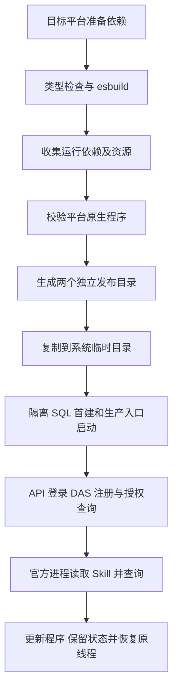

# API 与 DAS 构建部署

更新日期：2026-09-21。用户已批准[多平台实施清单](API与DAS多平台打包实施清单.md)，由主代理单独完成。操作步骤见[部署说明](../ai-data/DEPLOYMENT.md)，本轮范围、流程和验证见[交付说明](API与DAS多平台打包交付说明.md)。

## 构建入口

在 pnpm 工作区 `ai-data/` 执行：

```shell
pnpm --filter @ai-data/api --filter @ai-data/data-access build
pnpm test:release
```

应用的 `build` 依次执行 TypeScript、esbuild 和 `scripts/prepare-release.mjs api|das`。根 `pnpm build` 也会执行这些应用构建。已有最新 bundle 时可执行 `pnpm release` 单独整理，后者不重新编译源码。

Node.js 要求 `>=24.19.0 <25`。各目标在对应系统和架构准备锁文件依赖，再使用相同 Node 脚本产包。安装、升级和卸载由用户操作；本轮使用已安装依赖。

| 系统    | 架构        | 目标目录                                      |
| ------- | ----------- | --------------------------------------------- |
| Windows | x64 / arm64 | `release/win32-x64` / `release/win32-arm64`   |
| Linux   | x64 / arm64 | `release/linux-x64` / `release/linux-arm64`   |
| macOS   | x64 / arm64 | `release/darwin-x64` / `release/darwin-arm64` |

Windows x64 已产包并完成独立运行验收。其余五种目标完成规则测试，需在对应环境执行相同构建和专项验收。

## 运行依赖与发布资源

外置入口由 `scripts/runtime-dependencies.json` 管理：API 为 `@openai/codex-sdk`，DAS 为 `oracledb`。`copy-runtime-dependencies.mjs` 从现有安装解析完整运行依赖，包括必要 peer、匹配平台的 optional、npm 别名和同名多版本；转换 pnpm 链接为普通文件，保留原生程序、运行资源和许可证。包定位兼容 ESM-only 导出。

API 通过 SDK 的依赖链携带官方 `@openai/codex` 和当前平台包。生成前检查对应原生程序，缺失即报错。依赖版本写入 `release-info.json`。

```text
release/<platform>-<arch>/
├─ api/
│  ├─ package.json
│  ├─ release-info.json
│  ├─ dist/index.js
│  ├─ node_modules/
│  ├─ config/api.config.example.json
│  ├─ migrations/
│  └─ skills/                         含 references 子文档
└─ das/
   ├─ package.json
   ├─ release-info.json
   ├─ dist/index.js
   ├─ node_modules/
   ├─ config/das.config.example.json
   └─ migrations/
```

每个服务先在临时目录准备完整资源，检查通过后替换自身输出。输出包含实际配置或 `secrets/` 时拒绝覆盖。生成目录纳入 Git、Lint、格式工具的忽略规则。

## 部署和更新

把完整服务目录复制到同平台、同架构的独立实例位置，准备兼容 Node.js。实际配置从随包示例生成，进入各实例根目录执行 `node dist/index.js`。

API 示例显式设置 `skills_directory: "skills"` 与 `state_directory: "secrets/codex-runtime"`。DAS 示例公钥、接入凭据路径相对 `config/` 指向实例的 `secrets/`。API 首建后签发接入凭据，DAS 使用该凭据注册并持续上报心跳。

更新程序时保留实际配置、JWT 密钥、API 模型主密钥、DAS 主密钥、Agent 固定 Skill 版本、官方历史及各自数据库。公共 Skill 更新通过新的 Agent 配置版本生效，已有会话继续使用固定版本。详细启动顺序、注册接口、网络与升级步骤见[部署说明](../ai-data/DEPLOYMENT.md)。

API 的 `analysis_runtime` 仅维护启停、目录、并发和轮询。API 可先启动并登录，再通过管理接口发布数据库模型和 Agent；模型地址、凭据及 Agent 预算由数据库版本管理。本地和发布目录配置已按此同步，见[模型数据库配置交付](模型数据库配置交付说明.md)。

## 验收流程



`pnpm test:release` 使用随机隔离 SQL 库，本机固定 Responses 响应配合真实官方 app-server，验证资源、普通函数和恢复行为。默认从 API 本地配置读取 SQL 连接；可用 `SQLSERVER_TEST_CONFIG` 指定测试连接。普通测试与日常 SQL 集成默认不收集该专项。
