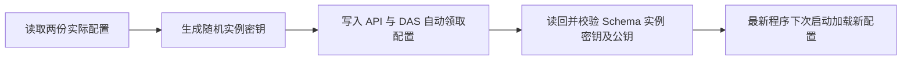

# DAS 实际配置同步记录

日期：2026-10-06。用户要求将本机旧配置更新为自动领取配置，本轮已完成实际文件写入与读回校验。

## 配置变更

- `ai-data/apps/api/config/api.config.json`：为匹配且已启用的 DAS 实例写入随机 `registration_secret`。
- `ai-data/apps/data-access/config/das.config.json`：写入相同的 `api.registration_secret`，移除 `api.registration_credential_path` 配置项。
- 密钥由 32 个随机字节生成，以 Base64URL 表示；密钥原文仅保存在实际配置中。

两份实际文件均通过当前 API/DAS 配置 Schema。已读回确认实例与密钥匹配、其他配置字段保持一致、API 与 DAS 公钥一致、公钥文件与原 JWT 文件内容保持不变。依赖操作和子代理均为 0。

本记录确认实际配置已落盘，补充此前交付文档与本机旧配置不一致的情况。服务未重启，构建产物未更新；源码开发服务下次启动采用新配置，使用构建版时需先构建包含自动领取功能的最新程序。

