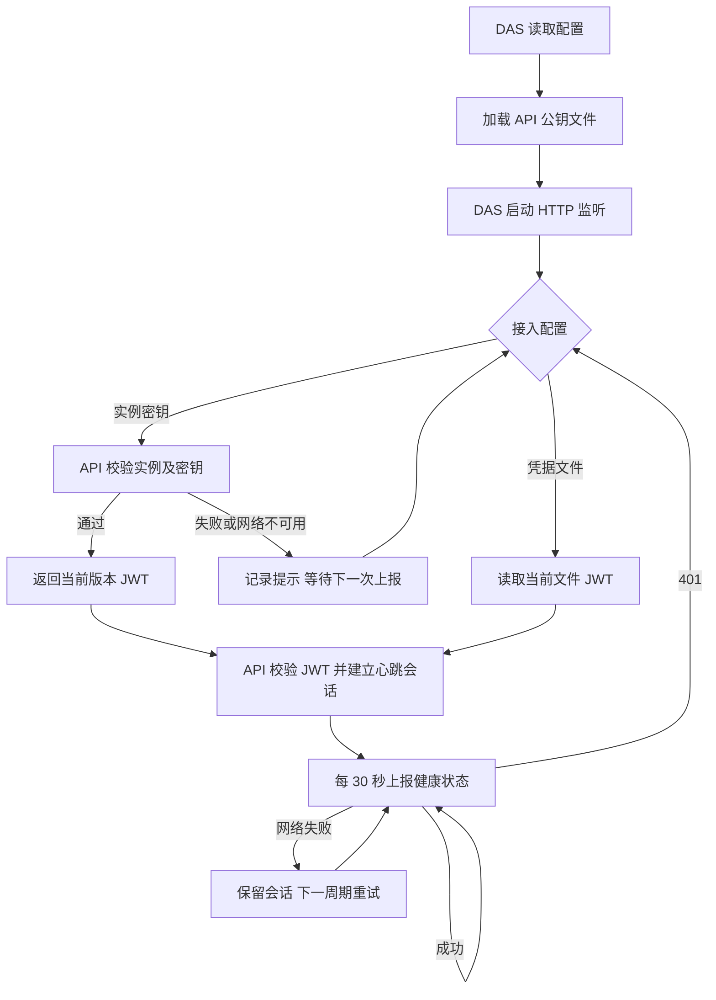

# DAS 自动领取接入凭据交付说明

日期：2026-10-06。已按用户批准的方案完成：实例在配置中保存接入密钥，DAS 自动领取注册 JWT，继续使用 API 公钥文件验签。

## 交付结果

API 在 `trusted_data_access_services` 中支持可选的 `registration_secret`。DAS 在 `api.registration_secret` 中配置相同值，启动监听后调用 `POST /internal/data-access/credential`，以 Bearer 密钥及 `{ service_id }` 领取 `{ service_id, credential }`，再完成原有注册和心跳。

自动领取返回的 JWT 只在注册调用中保存。心跳使用 API 签发的随机会话凭据；心跳返回 401 时重新领取 JWT 并注册。API 暂未启动、网络故障或领取失败由已有 30 秒上报周期继续尝试。同一实例的并发上报继续串行合并。

API 仅向已启用且密钥匹配的实例签发凭据，密钥比较使用固定长度摘要及常量时间比较。新入口沿用全局限流与 Authorization 日志脱敏，响应设置 `Cache-Control: no-store`。DAS 检查响应结构及实例身份，禁止自动跟随重定向，连接错误和领取错误不输出原始响应或请求配置。

## 配置与生效

| 配置位置                             | 字段                               | 规则                                                                                    |
| ------------------------------------ | ---------------------------------- | --------------------------------------------------------------------------------------- |
| API `trusted_data_access_services[]` | `registration_secret`              | 可选；配置后允许对应实例自动领取；32—256 位字母、数字、下划线或连字符，部署时使用随机值 |
| DAS `api`                            | `registration_secret`              | 自动领取的实例密钥，必须与 API 对应实例一致                                             |
| DAS `api`                            | `registration_credential_path`     | 文件接入路径，与 `registration_secret` 必须且只能配置一项                               |
| DAS `api`                            | `jwt_verification_public_key_path` | 继续必填，实际加载文件；相对路径以 DAS 配置目录为基准                                   |

开发和发布配置示例已使用自动领取方式，示例中的密钥占位值需要替换。本机实际配置已同步一个由 32 随机字节生成的 Base64URL 密钥：

- `ai-data/apps/api/config/api.config.json`：为匹配的已启用 DAS 实例增加 `registration_secret`。
- `ai-data/apps/data-access/config/das.config.json`：配置同一密钥，改用自动领取方式。
- 两份实际配置已通过正式 Schema 和实例／密钥匹配校验。实际配置由 Git 忽略，凭据内容未写入交付文件。
- API 公钥路径和内容保持一致，既有 JWT 文件保留。本机运行服务未在本轮重启，重启 API 与 DAS 后新配置生效。

旧部署可以继续使用文件接入及管理员领取接口。轮换接入身份时同时更换两端密钥并递增 API 的 `credential_version`，重启后旧密钥、JWT 和会话失效。跨机器部署继续使用 HTTPS 或受保护链路。

## 主要文件

| 分类       | 文件与职责                                                                                                                                                       |
| ---------- | ---------------------------------------------------------------------------------------------------------------------------------------------------------------- |
| 共享合同   | `packages/contracts/src/health/data-access-session.ts`、对应类型及 `src/index.ts`：领取请求和响应                                                                |
| API        | `src/config/api-config.ts`、`src/data-access/data-access-session-service.ts`、`src/routes/data-access-routes.ts`、`src/app-types.ts`：配置、密钥认证和 HTTP 装配 |
| DAS        | `src/config/das-config.ts`、`src/api/data-access-heartbeat-client.ts`、`src/index.ts`：配置互斥、自动领取、恢复与公钥加载                                        |
| 配置示例   | API/DAS 各两份开发及发布示例                                                                                                                                     |
| 测试       | 对应合同、配置、会话、认证路由、心跳客户端测试及 API 测试装配；发布集成夹具显式选择原有文件接入方式                                                              |
| 设计及交接 | `需求文档/technical-design.md`、本轮实施清单、真实进程验收脚本、结果与本交付说明                                                                                 |

上述源码相对 `ai-data/`。执行者为主代理，子代理、依赖操作和数据库结构变更均为 0。既有锁文件改动保留；ai-book 本轮未修改。

## 验证结果

按实施清单先添加测试，首次共 36 项因新字段、方法及端点尚未实现而失败，确认后完成实现。

| 检查                                | 结果                                                          |
| ----------------------------------- | ------------------------------------------------------------- |
| API 包级测试                        | 90 个文件、704 项通过                                         |
| DAS 包级测试                        | 47 个文件、444 项通过                                         |
| contracts 包级测试                  | 27 个文件、199 项通过                                         |
| 工程规则                            | 42 项通过                                                     |
| API、DAS、contracts 类型检查与 lint | 通过                                                          |
| 本轮源码、测试、示例及交付文件格式  | 通过                                                          |
| API/DAS 生产 bundle                 | 按现有 TypeScript／esbuild 参数构建通过                       |
| 实际本机配置                        | 两端 Schema、实例及密钥匹配通过，公钥内容核对通过             |
| 隔离 SQL 与真实 API/DAS 进程        | 9 项检查通过，见[原始结果](DAS自动领取接入凭据验收/结果.json) |

真实进程检查包含：API 晚启动重试、自动领取及注册、公钥验证管理请求、API 重启后原 DAS 进程恢复、错误密钥及跨实例拒绝、实例停用、密钥和版本轮换、公钥文件缺失导致启动失败，以及日志凭据检查。运行 7 次临时服务进程，结束后全部关闭；两个随机命名的隔离数据库和两个临时目录已清理。正式业务库未写入。

首次 API 全量测试及真实进程验收受到沙箱子进程限制（`spawn EPERM`）影响；获准在沙箱外复验后全部通过。配置只读校验使用的 TS 加载器同样经授权在沙箱外完成。本轮构建验证为 API/DAS bundle 与实际进程启动，完整发布包及真实模型业务对话未重跑。

复验脚本：[真实进程验收.mjs](DAS自动领取接入凭据验收/真实进程验收.mjs)。在项目根目录运行 `node 任务交接/DAS自动领取接入凭据验收/真实进程验收.mjs`；要求已有最新的 API/DAS bundle，配置中的 SQL Server 测试连接允许创建及清理隔离库，并允许启动临时子进程。

## 执行流程

