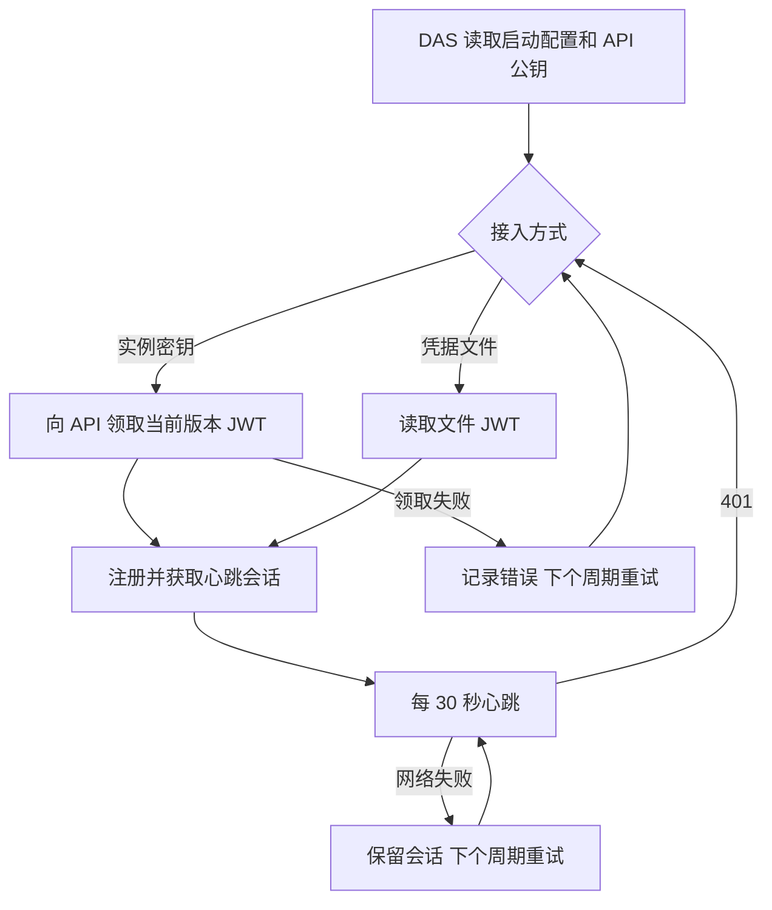

# DAS 自动领取接入凭据实施清单

日期：2026-10-06。用户已批准配置实例接入密钥、DAS 自动领取 JWT 的方案，并确认保留 API 公钥文件。

## 目的与范围

API 在已批准实例上配置 `registration_secret`，DAS 使用对应密钥调用 `POST /internal/data-access/credential`，领取当前版本的接入 JWT，再完成已有注册与心跳。JWT 只用于进程内注册请求；公钥继续从 `jwt_verification_public_key_path` 加载。

已有文件接入方式继续可用。DAS 必须在 `registration_secret` 和 `registration_credential_path` 中选择一项；API 未配置接入密钥的实例仍可由系统管理员签发文件凭据。自动领取失败由现有 30 秒心跳周期重试；401 触发重新领取及注册，其他运行期网络故障保留会话。

## 文件与操作

- 修改共享合同 `packages/contracts/src/health/data-access-session.ts`、类型文件及 `src/index.ts`，增加凭据领取请求和响应校验。
- 修改 API `src/config/api-config.ts`、`src/data-access/data-access-session-service.ts`、`src/routes/data-access-routes.ts`、`src/app-types.ts`，增加实例密钥配置、校验和内部领取入口。
- 修改 DAS `src/config/das-config.ts`、`src/api/data-access-heartbeat-client.ts`、`src/index.ts`，接入自动领取、互斥配置与安全错误提示。
- 修改 API/DAS 开发及发布配置示例；为本机实际开发配置生成匹配的随机接入密钥并保留公钥路径。既有凭据文件保留。
- 扩充对应配置、合同、会话与 HTTP 路由测试，调整 API 测试装配；在任务交接目录保存跨服务验收和交付说明，并追加交接入口。
- 依赖操作 0，数据库结构变更 0，子代理 0。沿用已安装 CLI；不修改 ai-book。

## BDD 场景与验证

| 前提与操作                           | 预期                                                           |
| ------------------------------------ | -------------------------------------------------------------- |
| 两端配置相同随机密钥，DAS 启动       | 领取绑定该实例与当前版本的 JWT，注册成功，后续心跳使用会话凭据 |
| 密钥错误、实例未知、停用或未配置密钥 | 401，不能签发凭据或建立健康实例，响应不包含密钥                |
| 使用 A 实例密钥领取 B 的凭据         | 拒绝，实例身份保持隔离                                         |
| 递增版本并更换密钥                   | 旧密钥、旧 JWT 和旧会话失效；新密钥可领取并注册                |
| API 重启或会话失效                   | DAS 收到 401 后重新领取并注册，恢复心跳                        |
| API 尚未启动或暂时不可用             | 本次失败信息不包含凭据，下个周期继续尝试                       |
| 响应包含错误实例、未知字段或无效结构 | 拒绝使用响应，后续仍可重试                                     |
| 多个上报同时进入                     | 同一轮领取和注册串行合并，避免重复替换会话                     |
| 自动配置省略 JWT 文件路径            | 启动配置有效；公钥文件仍必填并实际读取                         |
| 同时配置密钥和文件路径，或两者均缺失 | 启动校验拒绝并指出配置错误                                     |
| 旧配置使用 JWT 文件                  | 原有注册、重新读文件和管理员领取流程继续通过                   |

按场景先添加测试并确认目标行为失败，再实施。完成后运行共享合同、API、DAS 测试、类型、lint、相关格式检查和构建；使用隔离环境验证正式 API/DAS 进程启动、自动注册与重启恢复。正式业务数据保持原状。

