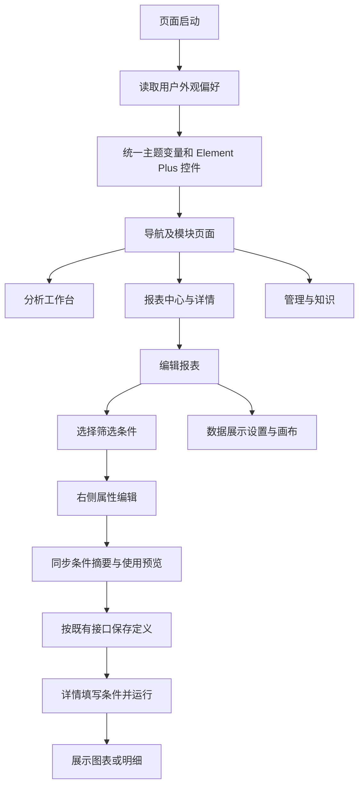

# Web 全站 Linear 风格交付说明

日期：2026-10-04。授权：用户认可效果稿后要求“直接改全部 web ui”。执行依据见[实施清单](Web全站Linear风格实施清单.md)。

## 交付结果

现有 Web 各模块已统一采用中性色背景、细分隔线、紧凑控件和清晰的文字层级。覆盖登录、公共导航、分析工作台、报表中心与详情、报表编辑与画布、知识与偏好，以及模型、Agent、用户、角色权限、数据、知识审核、后台任务管理。

亮色、暗色、跟随系统和橄榄绿、蓝色、青色、紫罗兰四种配色继续可选。页面读取用户已有外观偏好；本轮主要截图使用“暗色＋紫罗兰”。在页面右上角的“外观”中可以切换到这个组合。

## 主要改动

| 部位 | 结果 |
| --- | --- |
| 公共框架 | 统一侧栏、顶部导航、模块图标、账号区、页边距、标题层级及当前项样式。 |
| Element Plus 控件 | 统一输入框、选择器、按钮、表格、分页、弹层和对话框的尺寸、边框、颜色与焦点反馈。 |
| 分析工作台 | 对话内容与输入区采用一致的阅读宽度；消息、工具过程、Markdown 和结果区域采用新的视觉层级。流式、取消及完成后过程折叠沿用原有逻辑。 |
| 报表中心 | 卡片展示类型图标、名称、说明、更新时间及归属；卡片作为独立报表的入口。 |
| 报表详情 | 筛选条件采用紧凑的横排控件，标签和值位于同一行；图表、明细及运行信息统一配色和间距。 |
| 筛选编辑 | 左侧选择条件，右侧编辑该条件的名称、字段关联、默认值和高级设置；列表下方即时展示使用预览。窄屏按顺序排列。 |
| 数据与展示、画布 | 设置、预览、属性和 AI 修改区域统一视觉；画布沿用现有节点、连线光流及执行状态。 |
| 管理与知识 | 统一列表与详情布局、页签、表单宽度、分区、保存区及任务列表。 |
| 图表 | 坐标轴、网格线和主题文字统一；柱图使用实色与圆角顶部，饼图保留辅助纹理，ARIA 描述继续启用。 |

## 文件范围

以下代码路径均相对于 `ai-data/apps/web/`。

新增：

- `src/styles/controls.css`：公共 Element Plus 控件样式。
- `tests/e2e/ui-refresh.spec.ts`：条件列表、属性面板、预览联动、增删与窄屏回归。
- `tests/e2e/ui-gallery.spec.ts`：全站页面截图及关键布局检查。

修改：

- `src/main.ts`：加载公共控件样式。
- `src/styles/theme.css`、`app.css`、`analysis.css`、`content.css`、`reports.css`、`report-editor.css`、`management.css`：公共主题与各模块布局。
- `src/app/app-layout.vue`、`navigation-menu.vue`：导航与账号呈现。
- `src/features/reports/pages/report-center.vue`、`report-editor.vue`：卡片信息与编辑布局。
- `src/features/reports/components/parameter-editor.vue`、`parameter-form.vue`：条件选择、属性编辑及紧凑表单。
- `src/features/knowledge/knowledge.css`、`src/shared/results/result-chart.vue`：知识页和图表呈现。
- `tests/e2e/report-filter-ui.spec.ts`、`analysis.spec.ts`、`knowledge.spec.ts`：按实际控件名称与导航完成时机更新定位，保留业务断言。

交接新增本说明、实施清单及[截图审核目录](Web全站Linear风格验收/审核.html)。审核目录包含 34 张 PNG、截图清单和可复用生成脚本；交接 README 追加本轮记录。

依赖安装、升级、卸载、文件删除和子代理数量均为 0。API、DAS、业务数据库及配置未在本轮改动。

## 执行流程



## 验证结果

| 检查 | 结果 |
| --- | --- |
| Web 单元测试 | 35 个文件、167 项通过。 |
| Vue 与 Node TypeScript | 通过。 |
| ESLint、Prettier | 通过。 |
| Vite 生产构建 | 通过。依赖分块体积提示仍存在，未影响构建。 |
| 浏览器完整回归 | 本轮执行 78 个场景，首次 74 项通过、4 项失败；定位为测试定位或等待时机问题，修正后分批复验通过，详见下方。 |
| 生产预览专项 | 13 项通过，包含首次失败项、流式与取消、多主题图表、筛选语义、新属性面板及全站截图。 |
| 最终图表复验 | 图表实色调整后重新构建，四套明暗配色与报表截图 2 项通过。 |
| 截图尺寸 | 30 张桌面 PNG 均为 1920×1080，另有 4 张 1024/390 宽度适配图。 |

首次浏览器失败的四处为：分析完成后的依据按钮名称已变更；知识模板跳转中旧页面和目标页面短暂同时存在同名标题；截图用例等待流式完成的时间不足；Element Plus 选择器的点击命中占位层。分别改为实际按钮名、等待目标 URL、按流式场景增加等待时间、使用键盘展开选择器。最终专项覆盖这些用例。这里记录的是分批验证结果，并非一次执行 78 项全部通过。

浏览器验证覆盖实际 HTTP 流式与取消、完成后折叠、结果权限失效、报表保存/编辑/运行/筛选/分享/导出/历史、画布大节点场景及管理、知识相关流程。截图来自实际 Web 和现有隔离验收数据；管理页使用已有测试响应。长表单截图展示首屏。真实 rj 模型及生产数据链路未在此次视觉改造中重新验收。

## 查看与复现

优先打开[全站审核目录](Web全站Linear风格验收/审核.html)，按分类或页面名称筛选，点击图片查看原始尺寸。推荐先看 06 报表中心、07/08 报表详情、15/16 筛选条件，再看管理页。截图文件与尺寸见[清单](Web全站Linear风格验收/截图清单.json)。

已有开发服务运行时刷新 Web 即可加载改动；外观选择暗色和紫罗兰，可查看截图对应的主题。依赖沿用当前安装结果。

在 `ai-data/apps/web/` 下，可使用已有 CLI 重跑验证：

```powershell
node node_modules/vue-tsc/bin/vue-tsc.js -p tsconfig.app.json
node node_modules/typescript/bin/tsc -p tsconfig.node.json
node node_modules/eslint/bin/eslint.js .
node node_modules/prettier/bin/prettier.cjs --check .
node node_modules/vitest/vitest.mjs run
node node_modules/vite/bin/vite.js build
$env:WEB_E2E_PREVIEW='1'
node node_modules/@playwright/test/cli.js test --reporter=line
```

重新生成截图可将最后一条命令的测试范围改为 `tests/e2e/ui-gallery.spec.ts`。然后在项目根目录执行：

```powershell
node '任务交接/Web全站Linear风格验收/生成审核目录.mjs'
```

本轮完成全站风格落地，后续可以继续按截图编号提出具体页面意见。组合看板维持二期安排。
