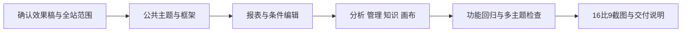

# Web 全站 Linear 风格实施清单

日期：2026-10-04。

依据：用户认可《Linear风格效果稿-2026-10-04》并明确要求“直接改全部 web ui”。本清单将已确认的全站视觉范围落实为执行文件与验收项目，由主代理单独实施。

## 目的与范围

统一 Web 的中性色表面、字体层级、控件尺寸、间距、分隔线、菜单与状态样式，并将报表筛选编辑改为条件列表与属性面板。覆盖登录、公共导航、分析工作台、报表中心/详情/编辑/画布、知识与偏好，以及模型、Agent、用户、权限、数据、知识审核和后台任务管理。

沿用 Vue、Element Plus、Lucide、ECharts 与 Vue Flow；亮暗模式及已有配色均纳入。原有业务权限、数据合同、流式分析、过程折叠、报表保存执行、导出和画布运行行为作为回归基线。

## 文件增删改

- 修改 `ai-data/apps/web/src/styles/{theme,app,analysis,content,reports,report-editor,management}.css` 及 `features/knowledge/knowledge.css`，统一基础与各模块样式。
- 修改 `src/app/app-layout.vue`、`navigation-menu.vue`、`shared/ui/appearance-picker.vue` 等公共呈现，按页面需要调整各模块 Vue 模板。
- 修改 `features/reports/pages/` 与参数编辑、表单、绑定、预览等组件，将条件选择与属性编辑清晰分开。
- 必要时新增报表条件设置子组件及共用样式文件，保持现有领域归属。
- 修改主题或交互受影响的已有 Web 测试；新增全站浏览器视觉与交互验收场景及截图输出。
- 在本任务交接目录保存交付说明、流程图、完整页面截图及检查结果。
- 不计划删除文件；新增文件在交付清单中逐项记录。

## 执行顺序

1. 核对现有页面、测试和设计稿，保存验收范围。
2. 统一主题变量、Element Plus 控件、导航、标题和页面框架。
3. 完成报表中心、详情及条件编辑结构；调整图表与画布呈现。
4. 调整分析与内容展示、知识偏好和所有管理页。
5. 验证亮暗、四种配色、宽屏与手机布局及核心业务交互。
6. 保存截图与交付记录。

## 依赖操作

无需安装、升级或卸载依赖，使用项目已有 CLI。执行者为主代理，子代理数量 0。

## 验证

- Web 单元测试、Vue/Node 类型检查、ESLint、Prettier、生产构建。
- 浏览器回归覆盖登录/导航/主题、分析流式与折叠、结果表格与图表、报表保存与运行/编辑/画布/分享/导出，以及管理与知识页面。
- 新增场景验证条件行切换与属性编辑同步、增删条件、宽屏属性面板与手机布局、键盘可达性和主操作可见性。
- 全部模块以 1920 × 1080 截图；关键页面增加暗色、其他主题与手机截图，检查溢出和浏览器错误。
- 测试使用现有隔离验收数据，业务 API/数据库代码与配置不属于本次视觉改造范围。

