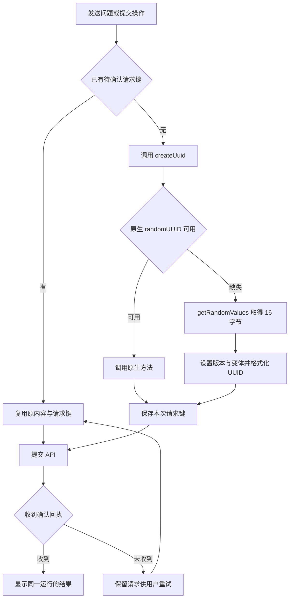

# Web 局域网 UUID 兼容交付说明

日期：2026-10-08。用户审核修复清单并回复“可以”，由主代理单独完成。依赖操作为 0。

## 修复结果

普通 HTTP 局域网来源中，发送对话原本在生成请求幂等键时抛出 `crypto.randomUUID is not a function`，消息尚未提交 API。Web 现在通过共享 `createUuid()` 生成 UUID：原生方法可用时直接调用；缺失时从 `crypto.getRandomValues()` 取得 16 字节加密随机数，设置版本 4 与标准变体，输出标准 UUID 字符串。

9 个现有文件中的 16 处调用已统一接入，覆盖对话发送/澄清、报表执行/修改/分析说明、画布区块、知识、偏好及流程图标识。现有状态逻辑继续保存请求键，回执丢失后的重试复用同一问题、同一键和同一运行。

源码和 `ai-data/apps/web/dist/` 已更新。使用正在运行的 Web dev 时刷新页面即可加载修改；监听地址可继续保持 `0.0.0.0`。构建产物需由使用者按原部署方式更新到实际站点。

## 实现位置

以下路径相对于 `ai-data/apps/web/`：

| 文件                                                         | 改动                                      |
| ------------------------------------------------------------ | ----------------------------------------- |
| `src/shared/identity/create-uuid.ts`                         | 新增原生及加密随机字节两条 UUID 生成路径  |
| `src/features/analysis/stores/analysis-workspace.ts`         | 对话发送、澄清请求使用共享方法            |
| `src/features/reports/stores/report-workspace.ts`            | 报表执行请求使用共享方法                  |
| `src/features/reports/stores/report-revisions.ts`            | AI 修改、澄清使用共享方法                 |
| `src/features/reports/stores/report-narratives.ts`           | 分析说明、澄清使用共享方法                |
| `src/features/reports/components/presentation-editor.vue`    | 章节和区块标识使用共享方法                |
| `src/features/reports/components/report-template-submit.vue` | 模板提交的幂等键使用共享方法              |
| `src/features/knowledge/components/knowledge-board.vue`      | 知识提交、修改和回退标识使用共享方法      |
| `src/features/preferences/components/preferences-panel.vue`  | 偏好修改和确认标识使用共享方法            |
| `src/shared/content/diagram.ts`                              | Mermaid 渲染标识使用共享方法              |
| `tests/shared/identity/create-uuid.test.ts`                  | 原生接收者、随机字节、版本和变体验证      |
| `tests/features/analysis/analysis-workspace.test.ts`         | 原生/兼容路径均验证重复点击与回执丢失重试 |
| `tests/e2e/http-uuid.spec.ts`                                | 非安全上下文下发送、重试与流程图渲染验收  |

## 请求流程

## 验证结果

- 实现前，新增对话场景准确复现 `AnalysisWorkspace.send` 中 `crypto.randomUUID is not a function`；共享方法测试因目标模块尚未新增而失败。
- 实现后，5 个相关测试文件、32 项测试通过，包含 UUID 原生/兼容路径、对话及报表重试逻辑。
- Chromium 浏览器专项分别在 Vite dev 和最新构建的 preview 中通过。页面地址为普通 HTTP 测试域名，明确断言 `isSecureContext === false`、`crypto.randomUUID` 缺失及 `getRandomValues` 可用，随后完成发送、服务端接受后的回执丢失重试、同一运行校验和流程图渲染。
- 本机系统代理最初对测试域名返回 503，未到达应用。最终测试保留页面普通 HTTP 来源，仅通过浏览器路由将网络目的地改写到本机隔离服务；开发和构建模式均通过。录像关闭。
- Web 应用及浏览器测试类型检查通过，本轮文件 ESLint、Prettier、`git diff --check` 通过。
- Web Vite 构建通过，保留已有图表依赖的分块体积提示。API/DAS 进程和真实业务数据库未操作。

## 适用范围与已知限制

本次处理 UUID 生成兼容。检查中另发现 `src/features/exports/export-controller.ts` 的导出指纹和 `src/features/reports/components/report-template-submit.vue` 的模板定义摘要仍使用 `crypto.subtle.digest()`；这两条 SHA-256 路径在普通 HTTP 来源下需要单独处理。本次未改变摘要算法或服务端校验，使用这两项功能时仍需 HTTPS 或本机可信来源。

浏览器边界参考：[randomUUID](https://developer.mozilla.org/en-US/docs/Web/API/Crypto/randomUUID)、[getRandomValues](https://developer.mozilla.org/en-US/docs/Web/API/Crypto/getRandomValues)、[安全上下文](https://w3c.github.io/webappsec-secure-contexts/#is-origin-trustworthy)。实施范围见[实施清单](Web局域网UUID兼容实施清单.md)。

## 后续更新

2026-10-08 用户追加授权后，已完成上述两处 SHA-256 的 HTTP 兼容，并在左下角用户区增加连接环境提示。最新实现、验收及截图见[Web 摘要兼容与连接状态交付说明](Web摘要兼容与连接状态交付说明.md)。
