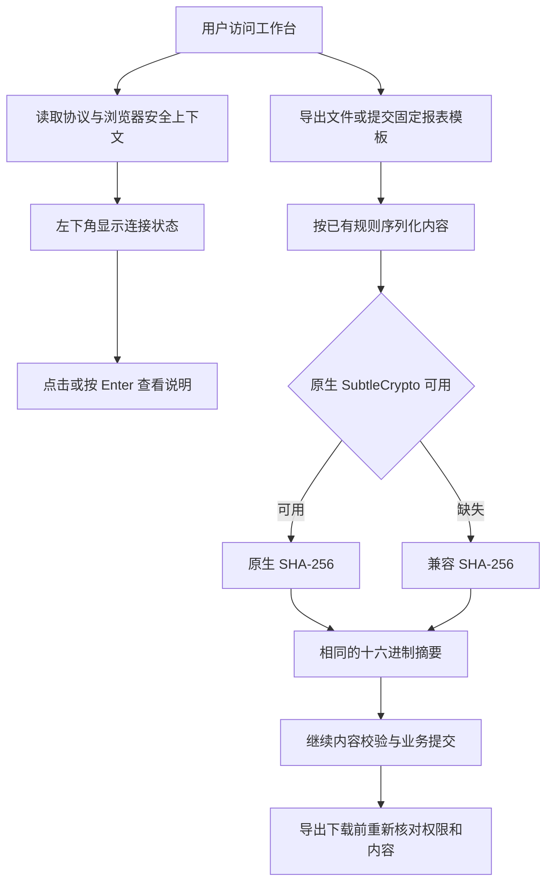

# Web 摘要兼容与连接状态交付说明

日期：2026-10-08。用户要求处理导出、模板提交的普通 HTTP 限制，并在左下角用户区域显示连接环境。主代理单独完成，依赖操作为 0。

## 交付结果

导出与报表模板提交现在共用 `sha256Hex()`。安全上下文中使用原生 `crypto.subtle.digest`，原生接口缺失时使用相同 SHA-256 算法计算 UTF-8 内容摘要。导出仍对原 JSON 内容计算指纹，模板仍对 `stableStringify` 后的固定定义计算摘要；下载前权限复核、内容变化拒绝及服务端摘要校验保持原规则。

左下角用户名下新增可点击的连接状态，手机在导航抽屉底部展示同一组件。提示支持键盘打开、Escape 关闭，采用已有弹层和主题样式。

| 环境                         | 显示          | 说明                                              |
| ---------------------------- | ------------- | ------------------------------------------------- |
| HTTPS 且浏览器认可安全上下文 | HTTPS 已加密  | 连接使用 HTTPS，浏览器安全上下文 API 可用         |
| 本机 HTTP 且被浏览器信任     | 本机 HTTP     | 浏览器信任该来源，但连接未使用 HTTPS 加密         |
| 被浏览器额外信任的 HTTP 来源 | HTTP 可信来源 | 明确保留 HTTP 未加密事实                          |
| 普通 HTTP                    | HTTP 未加密   | 琥珀色提示，点击说明非安全上下文及 HTTPS 访问建议 |
| 其他受限环境                 | 受限连接环境  | 说明浏览器上下文限制                              |

源码及 `ai-data/apps/web/dist/` 已更新。Web dev 刷新页面后生效，用户现有 `0.0.0.0` 监听设置继续有效。

## 实现位置

以下路径相对于 `ai-data/apps/web/`：

| 文件                                                         | 职责                                         |
| ------------------------------------------------------------ | -------------------------------------------- |
| `src/shared/crypto/sha256.ts`                                | 原生与兼容 SHA-256 摘要                      |
| `src/features/exports/export-controller.ts`                  | 导出来源指纹使用共享摘要方法                 |
| `src/features/reports/components/report-template-submit.vue` | 固定定义摘要使用共享方法                     |
| `src/shared/security/connection-context.ts`                  | 协议、安全上下文和本机来源的展示规则         |
| `src/app/account-footer.vue`                                 | 用户信息、连接标记和说明弹层                 |
| `src/app/app-layout.vue`                                     | 桌面左下角及手机导航抽屉接入                 |
| `src/styles/app.css`                                         | 状态颜色、布局、手机对齐及说明文字           |
| `tests/shared/crypto/sha256.test.ts`                         | 标准摘要、UTF-8、补位边界、多块及错误保留    |
| `tests/shared/security/connection-context.test.ts`           | HTTPS、本机 HTTP、普通 HTTP 及受限上下文规则 |
| `tests/features/reports/export-controller.test.ts`           | 原生/兼容两种路径的导出生命周期              |
| `tests/e2e/http-environment.spec.ts`                         | HTTP 导出、模板提交、连接提示及截图          |

## 执行流程

## 验证结果

- 实现前，缺少 `crypto.subtle` 的导出场景确认失败，错误位于摘要调用；实现后 3 个相关单元测试文件、22 项通过。
- 摘要测试涵盖空字符串、`abc` 标准向量、中文与 emoji、零字节及未配对代理项、55/56/63/64 等补位边界和多块文本；原生及兼容结果均与 Node.js 服务端 SHA-256 一致。最终来源识别规则另复验 5 项通过。
- dev 浏览器的 4 项新场景分批通过。最新构建产物复验 5 项全部通过：普通 HTTP 下五千行 Excel 下载、模板摘要提交、桌面/手机提示、可信本机 HTTP 提示，以及上一轮对话发送与回执丢失重试。
- Excel 使用实际导出 Worker 生成并重新打开核对，包含 5,000 行完整数据，末行科室正确。模板使用已有知识候选合同夹具，提交的固定定义摘要与 Node.js 独立计算一致。
- HTTP 专项明确断言浏览器非安全上下文和 SubtleCrypto 缺失，通过浏览器路由将网络请求发送到本机隔离服务。真实业务库与模型未参与。
- 桌面提示位置、键盘交互、深浅色文字对比度至少 4.5:1、手机底部可见和页面不横向溢出均通过；人工查看最终截图，手机用户信息左对齐。
- Web 应用与浏览器测试类型、修改文件 ESLint、Prettier、`git diff --check` 通过，Web 构建通过。构建保留已有图表依赖分块体积提示。

首次浏览器验收中，五千行文件压缩超过测试默认 8 秒等待，专项等待调整为 45 秒后通过；提示弹层采用 dialog 语义后正确暴露展开状态；手机抽屉继承的右对齐已修正。全部录像关闭。

## 验收附件

- [桌面连接说明](Web摘要兼容与连接状态验收/桌面HTTP连接说明.png)
- [浅色左下角状态](Web摘要兼容与连接状态验收/桌面连接状态-亮色.png)
- [深色左下角状态](Web摘要兼容与连接状态验收/桌面连接状态-暗色.png)
- [手机导航底部状态](Web摘要兼容与连接状态验收/手机导航连接状态.png)
- [HTTP 导出的五千行 Excel](Web摘要兼容与连接状态验收/HTTP科室明细.xlsx)

实施范围见[实施清单](Web摘要兼容与连接状态实施清单.md)。此前 UUID 兼容见[上一轮交付](Web局域网UUID兼容交付说明.md)。
