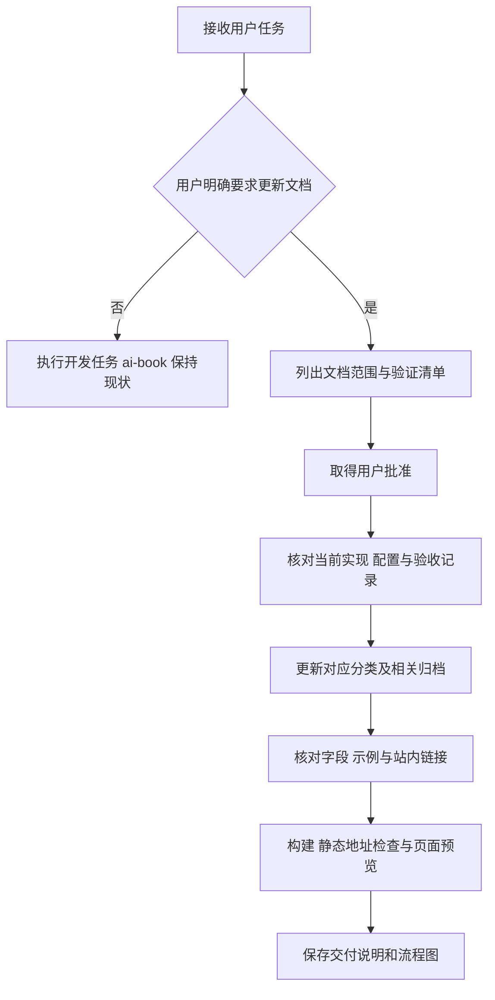

# ai-book 文档改造交付说明

交付日期：2026-09-22。用户已批准旧文档清理与七类文档重建，并明确删除内容不备份、仅在用户明确要求更新文档时修改 ai-book。本次由主代理单独完成，依赖操作为 0。

## 交付内容

旧项目的 121 篇分类 Markdown（指南 12 篇、API 92 篇、开发 17 篇，含分类目录页）已删除，赞助页 `docs/personal.md` 已删除，未创建备份。首页重新编写，保留现有主题资源与 6 个 `@pages` 功能页。当前站点共 75 个 Markdown 页面。

| 分类     | 本次内容                                                                                                         |
| -------- | ---------------------------------------------------------------------------------------------------------------- |
| 指南     | 项目职责、快速上手、核心概念、当前完成状态                                                                       |
| API 参考 | 认证、会话、运行、SSE、模型与 Agent、查询、目录权限、报表、指标、偏好、知识、后台任务、DAS、健康接口及嵌套字段表 |
| 开发指南 | 工程入口、授权执行、运行恢复、模型进程、参数化数据集、关系聚合、验证与文档维护                                   |
| 部署运维 | 环境打包、首次启动、DAS 接入、配置参考、升级恢复、故障排查                                                       |
| 使用手册 | 对话分析、报表导出、个人偏好                                                                                     |
| 管理手册 | 账号角色、数据权限、模型与 Agent、知识审核、报表模板、后台任务                                                   |
| 归档记录 | 更新索引及 2026-09-20 至 2026-09-22 的已交付主题                                                                 |

接口、字段和命令依据当前 `ai-data/apps/api`、`apps/data-access`、共享合同、配置 Schema 和既有验收记录整理。字段参考覆盖 59 个选定 Schema，嵌套对象通过锚点链接展开。

首页与站点元信息统一为 AI BI；导航提供七类入口。现有 Teek 永久链接功能使用 `createRewrites` 输出对应静态文件，侧边栏同步按重写映射生成，因此文档直达与刷新可正常工作。归档文件使用唯一的两位排序号。

## 更新触发规则

已将以下要求写入项目根 `AGENTS.md`、`ai-book/AGENTS.md`、`ai-book/README.md` 和任务交接入口，并在开发指南说明：

> 只有用户明确要求更新文档时，才按获准范围修改 ai-book，包括说明、归档、首页和站点配置。日常开发、功能新增、接口调整和问题修复均不自动触发更新。

README 保留原有内容并追加更新时机与阅读入口。



## 文件范围

- 重建 `ai-book/docs/01.指南`、`02.API`、`03.开发`，新增 `04.部署运维`、`05.使用手册`、`06.管理手册`、`07.归档记录`；修改首页，删除赞助页。
- 修改 `ai-book/docs/.vitepress/config.ts` 和 `teekConfig.ts` 的站点信息、导航、永久链接与侧边栏配置。
- 修改根 `AGENTS.md`、`ai-book/AGENTS.md`、`ai-book/README.md`、`任务交接/README.md`，新增本交付说明。
- 既有 `@pages` 功能页仅随 Markdown 格式化处理。业务代码、数据库、依赖清单与锁文件不在本次改动范围内。

## 验证结果

| 检查       | 结果                                                                                           |
| ---------- | ---------------------------------------------------------------------------------------------- |
| 页面结构   | 75 个 Markdown 页面及 75 个唯一页面地址（包含首页）                                            |
| 文档引用   | 840 处站内链接与锚点检查通过，导航地址存在                                                     |
| JSON 示例  | 28 个 JSON 代码块解析通过                                                                      |
| 合同示例   | 16 个主要请求或 SSE 示例通过实际 Zod Schema 校验                                               |
| 路由对照   | 104 条字面量 API 路由均在说明中出现；动态拼接的启停、关系管理和 DAS 代理另行核对               |
| 站点构建   | 使用现有 VitePress CLI 构建通过                                                                |
| 静态访问   | 首页及 74 个永久地址均返回 HTTP 200，深层页面可直接打开                                        |
| 浏览器预览 | 首页、部署目录、DAS 接入、认证接口、嵌套字段表与归档页面可显示；目录、侧边栏和字段锚点跳转正常 |
| 旧内容检查 | Markdown 及构建的文档输出未检出旧项目 DataFramework、LangChain、LlamaIndex、Pluggy 说明        |

验证使用已安装的 CLI，命令从项目根目录执行：

```powershell
node ai-book/node_modules/vitepress/bin/vitepress.js build ai-book/docs
```

本次为文档与站点配置变更，验证没有调用真实模型或业务数据库。接口示例校验用于检查合同合法性，不等同于重新执行后端全量验收。

## 已知提示与内容边界

- 构建仍有主题字体文件在构建阶段未解析及部分产物超过 500 kB 的提示。浏览器出现 `Hydration completed but contains mismatches` 提示；本次检查的正文、导航、表格和代码块均可显示与操作，该主题提示保留记录。
- Web 交互和 Excel、Word、PDF 文件生成仍按项目实际进度标注待实现。后端已交付不等同于 Web 界面已完成。
- 多平台发布的实机验收范围为 Windows x64，其他五种目标仍待对应环境验收。
- 第 7 步真实模型收尾复验通过；第 8 步后续真实模型专项的失败与待调优状态分别记录，未合并为全部通过。

阅读入口：[ai-book README](../ai-book/README.md)。
