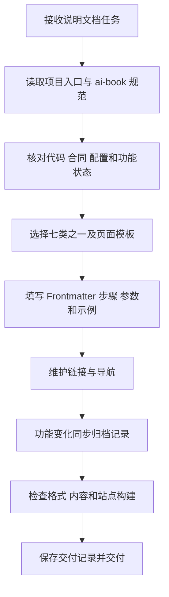

# ai-book 说明文档规范交付说明

日期：2026-09-22。用户要求参考 `ai-book` 现有写法，建立以后编写说明的规范；随后要求保留 README 原文，并增加“归档记录”作为更新内容分类。主代理单独执行，依赖操作为 0。

## 交付内容

- 新增 [ai-book/AGENTS.md](../ai-book/AGENTS.md)：说明文档统一编写位置、七类目录、命名与 Frontmatter、永久链接、操作说明、API 参考、开发说明、归档记录模板及验证要求。
- 在 [ai-book/README.md](../ai-book/README.md) 原文后追加规范入口与七类说明，保留原有启动、打包命令。
- 在根 [AGENTS.md](../AGENTS.md) 和[任务交接入口](README.md) 追加规范链接，供后续执行者接手。

七类为：指南、API 参考、开发指南、部署运维、使用手册、管理手册、归档记录。保留现有 `01.指南`、`02.API`、`03.开发` 编号，其余分类按规范随内容建立页面和导航。

归档按日期或实际发布版本记录新增、调整、修复、升级事项和验证范围，并链接到当前功能说明。规范同时要求依据 API/DAS/Web 实际实现核对接口与操作，Web 操作说明随实际页面验收补齐。

## 编写流程

## 验证

- 本轮 5 份 Markdown 的 Prettier 格式检查通过，已跟踪修改的 `git diff --check` 通过。
- README 原有启动与打包两行逐字保留，新增内容追加在后。
- 本轮文档共 57 个本地文件链接检查通过；现有站点 129 份 Markdown 中的 127 个永久链接没有重复。
- 使用已安装的 VitePress 执行 `node node_modules/vitepress/bin/vitepress.js build docs`，构建成功，耗时约 104 秒。
- 构建前后 152 个站点源文件哈希一致；本轮新增规范与维护入口位于站点源码之外，分类页面随后续内容建设。
- 构建日志提示现有 iconfont 字体资源在运行时解析，以及部分 bundle 超过 500 kB。站点构建正常结束，浏览器中的字体资源表现未在本轮验收。
