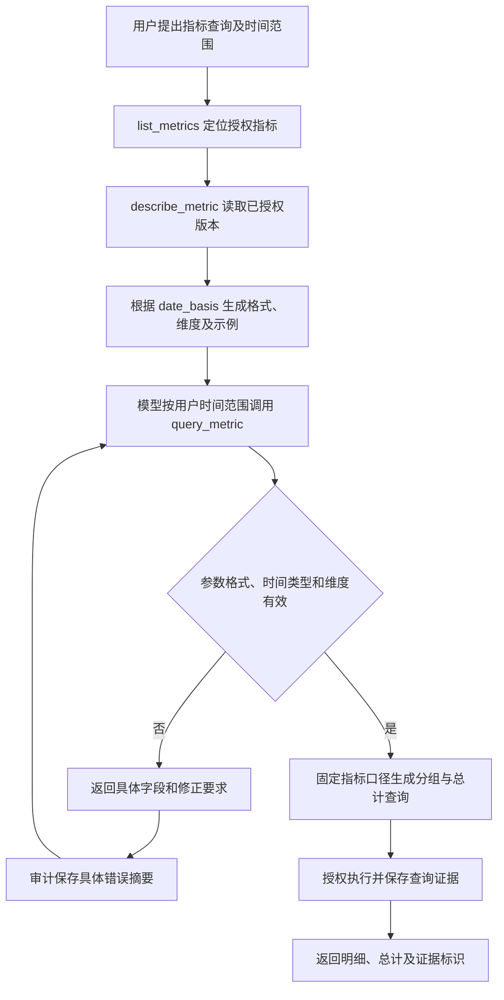

# query_metric 参数提示修复交付说明

日期：2026-10-08。用户报告 `query_metric` 经常失败，了解时间格式来源后回复“可以”，批准工具参数说明、指标详情、错误提示及对应测试。主代理单独完成，依赖操作为 0。

## 问题与结果

排查时，当日工具审计的 `query_metric` 共 15 次调用，11 次为 `INVALID_INPUT`，4 次成功。门诊指标 `demo-outpatient-visits` 的时间依据为 `t.visited_at`，类型为 `datetime`；8 月科室排名曾两次传入仅日期的起止参数，补齐空格分隔的时分秒后成功。其他失败还包括 ISO `T` 分隔、仅月份和混入其他文本。

原先发送给模型的 `start/end` JSON Schema 只有字符串类型，严格日期校验的规则未转换成格式说明。指标服务又把时间类型不匹配、重复维度和未发布维度合并成一个错误，模型难以据此修正。

修复后，模型通过授权指标的 `describe_metric` 获取 `query_requirements`：

- `time_format`：由数据库指标定义的 `date_basis.data_type` 决定。`date` 对应 `YYYY-MM-DD`，`datetime` 对应 `YYYY-MM-DD HH:mm:ss`。
- `timezone: UTC+8`、`range_bounds: inclusive`：明确时区及包含起止值的边界。
- `allowed_dimensions`：该指标已发布的完整维度字段名。
- `example`：按该指标时间类型生成的可通过校验的格式示例，并提示实际范围取自当前用户问题。

工具 Schema 同时说明日期格式、空格分隔、起止顺序和维度来源。时间类型、未发布维度与重复维度各自返回具体错误；非法日期、月份、混合格式和倒序范围会标出相应字段。具体错误同时写入模型返回值及工具审计的 `output_summary`，可从分析依据或数据库审计查看。

时间依据仍使用已发布指标字段，实际时间范围按调用方明确传入的值执行。严格日历校验、授权、租约、查询幂等与完整总计继续生效。

## 执行流程

## 文件变更

| 文件 | 用途 |
| --- | --- |
| `ai-data/apps/api/src/metrics/metric-query-requirements.ts` | 新增指标时间格式映射及调用要求生成 |
| `ai-data/apps/api/src/metrics/metric-service.ts` | 分别报告时间类型、重复维度、未发布维度错误 |
| `ai-data/apps/api/src/runtime/tool-contracts.ts` | 工具及字段说明，带字段路径的起止范围校验 |
| `ai-data/apps/api/src/runtime/analysis-tools.ts` | 授权详情附加调用要求，参数错误进入模型输出与审计 |
| `ai-data/apps/api/tests/runtime/metric-tools.test.ts` | 新增 17 项工具格式、权限、错误及修正查询测试 |
| `ai-data/apps/api/tests/integration/business-acceptance.ts` | 增加隔离 SQL 的错误审计、修正查询与证据幂等验收 |
| `ai-data/apps/api/tests/integration/metric-model.integration.ts` | 新增显式启用的真实模型参数验收 |

API 本地产物 `ai-data/apps/api/dist/index.js` 已重新生成。本轮新增实施清单、本交付说明和真实模型验收附件，并向任务交接 README 追加记录。

## 验证结果

| 验证 | 结果及边界 |
| --- | --- |
| 新增测试基线 | 实施前 17 项中 15 项按预期失败，2 项通过；确认缺少的说明、错误和详情行为 |
| API 普通测试 | 93 个文件、734 项通过，包含新增 17 项 |
| 指标工具最终专项 | 17 项通过 |
| 隔离 SQL 集成 | `analysis.integration.ts` 22 项通过；新增场景验证参数修正后分组和总计、失败摘要持久化、两份证据及重试复用 |
| 真实模型参数验收 | 当前配置的 `rj-model-v1`，1 项通过；依次调用 `list_metrics`、`describe_metric`、`query_metric`，查询一次成功 |
| 静态检查 | API 类型检查、生产构建类型检查、本轮 ESLint 与 Prettier 全部通过 |
| API 构建 | esbuild 生成 `apps/api/dist/index.js`，成功 |

真实模型验收问题为“查询 2026 年 8 月各科室门诊就诊人次，列出科室明细及总计。”模型自行填写 `2026-08-01 00:00:00` 至 `2026-08-31 23:59:59` 及已发布维度 `v.department`，没有复制示例中的 1 月范围。验收使用实际官方 Harness、生产工具定义与参数校验，指标及查询结果采用测试样本；真实 SQL 链路由上表的隔离 SQL 测试另行验证。工具输入输出见[真实模型验收记录](query_metric参数提示验收/真实模型验收.json)。单次模型通过说明本场景可用，实际失败率仍需后续业务调用观察。

验收过程中，测试夹具的查询类型曾出现 TypeScript 错误，改为按关系查询合同解析后通过。新增模型测试的目录检查最初放在 `finally` 内触发 `no-unsafe-finally`，已移到创建临时目录之后、运行之前；路径校验保留，最终 lint 通过。

## 生效方式

API 开发模式重新加载源码后生效；以 `node dist/index.js` 启动时，需要重启 API 使用更新后的本地产物。本轮未重启实际运行服务，也未替换 `release/` 中的部署程序。数据库表结构及指标定义无需调整。

运行上下文指纹包含完整工具定义，下一轮对话会按更新后的工具说明建立匹配的官方运行上下文，并沿用系统提供的已授权历史消息与证据。历史审计保留原记录，新调用开始保存具体参数错误。
