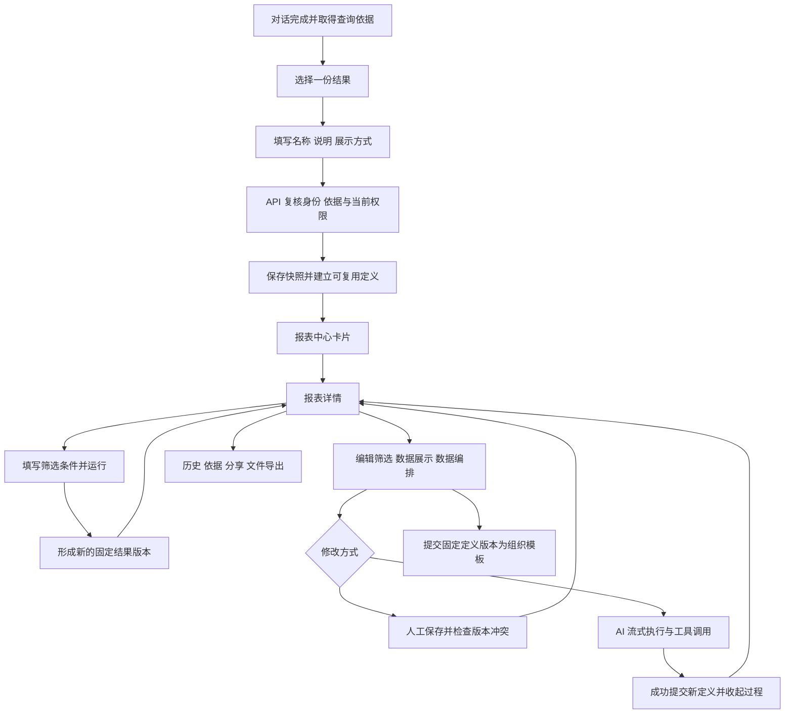

# 一期基础报表改造交付说明

日期：2026-10-04。用户在 12 张效果稿后回复“可以 你这样改”，本轮按[执行清单](一期基础报表改造执行清单.md)完成实施。主代理单独处理；依赖安装、升级、卸载、表结构变更及迁移均为 0。

## 1. 交付结果

一份新报表以一个图表或一份明细表作为主体，可修改名称、补充说明、设置筛选条件并反复执行。报表中心改为紧凑卡片，详情和编辑围绕该份结果展开。组合看板仍按已确认的二期安排推进。

| 范围             | 实际行为                                                                                                             |
| ---------------- | -------------------------------------------------------------------------------------------------------------------- |
| 报表中心         | 类型图标、名称、说明、更新时间和操作菜单；作者可快捷修改名称与说明。搜索及排序作用于已加载报表，保留继续加载入口。   |
| 详情             | 顶部条件、单份结果、图表／表格切换、显示列选择、实际执行条件及结果版本；AI 分析放入侧边抽屉。                        |
| 筛选条件编辑     | 参数、默认值、相对时间、绑定关系及使用预览；日期参数使用日期控件。                                                   |
| 数据与展示       | 名称、说明、来源查询和图表／表格配置；右侧以保存过的结果预览草稿展示方式。                                           |
| 数据编排         | 沿用查询节点、关系、属性编辑和带流光的连线；保留键盘操作、缩放、自动布局与减少动画设置。                             |
| AI 修改          | 右侧辅助面板，按事件顺序展示文字、工具及进度；成功后收起过程，最终说明保持可见。停止、澄清、恢复和版本读取继续生效。 |
| 分享、导出、历史 | 抽屉集中显示现有操作；Excel、Word、PDF 使用格式选项，继续基于固定保存结果生成文件。                                  |
| 从对话保存       | 选中一份已保存查询结果，填写名称、说明与展示配置；API 复核依据和权限，保存快照及可复用定义。                         |
| 组织模板         | 弹窗明确提交指定定义版本，沿用组织知识审核流程。                                                                     |

实际页面见[截图审核目录](一期基础报表验收/审核.html)：12 张桌面图均为 **1920×1080（16:9）**，另有 1 张 390×844 手机编辑图。[截图索引](一期基础报表验收/截图索引.json)保留尺寸和页面说明。

## 2. 主要实现与文件

以下源码相对于 `ai-data/`。

| 文件或目录                                                                                                               | 改动                                                                                 |
| ------------------------------------------------------------------------------------------------------------------------ | ------------------------------------------------------------------------------------ |
| `packages/contracts/src/reports/report-definition.ts`、`report.ts`、`report-management.ts`                               | 定义及保存输入增加可选说明；摘要增加说明、显示类型和更新时间，沿用现有 JSON 持久化。 |
| `apps/api/src/reports/report-management-service.ts`                                                                      | 从当前已授权的定义与快照生成卡片摘要，按 dayjs 比较更新时间。                        |
| `apps/api/src/reports/report-query-service.ts`                                                                           | 从所选结果建立定义时保留说明，继续复用原查询转换与批准关系。                         |
| `apps/web/src/features/reports/pages/`                                                                                   | 卡片中心、单份结果详情及三个编辑入口。                                               |
| `apps/web/src/features/reports/components/report-metadata-editor.vue`                                                    | 卡片名称／说明编辑，复用版本保存和冲突核对。                                         |
| `apps/web/src/features/reports/components/report-preview.vue`                                                            | 用已保存结果预览当前展示草稿，并标明结果版本。                                       |
| `apps/web/src/features/reports/components/save-result-report.vue`、`models/selected-result.ts`                           | 对话中选定一份依据的保存表单与请求构造。                                             |
| `apps/web/src/features/reports/components/parameter-form.vue`、`parameter-editor.vue`、`presentation-editor.vue`         | 筛选、配置和预览布局。                                                               |
| `apps/web/src/features/reports/components/report-revision.vue`、`stores/report-revisions.ts`、`report-revision-types.ts` | 有序事件回放及完成后过程折叠。                                                       |
| `apps/web/src/features/reports/models/definition-editor.ts`                                                              | 首个查询建立单份展示，后续辅助查询用于数据编排。                                     |
| `apps/web/src/shared/results/result-table.vue`                                                                           | 显示列选择，至少保留一列；原始结果和导出范围保持一致。                               |
| `apps/web/src/features/analysis/components/run-panel.vue`                                                                | 每份查询结果的保存入口。                                                             |
| `apps/web/src/features/exports/export-panel.vue`                                                                         | 三种文件格式的选择界面。                                                             |
| `apps/web/src/main.ts` 与报表样式                                                                                        | 补齐已安装 Element Plus 组件样式，接入主题和响应式布局。                             |
| API、contracts、Web 对应测试                                                                                             | 摘要、所选结果、重命名冲突、AI 恢复、页面交互及导出回归。                            |

本轮未删除业务文件。工作区既有改动保留，`ai-book` 未更新。

## 3. 执行流程

定义版本、执行记录和结果版本各自保留。编辑条件或展示配置后，已保存结果仍表达其原执行范围；预览注明“使用上次保存结果”，新查询条件需要运行才能产生新数据。

## 4. 兼容与失败处理

- 既有多内容报表保留原定义与历史，在详情中通过“报表内容”逐项查看。首次进入采用原有顺序中的第一份数据内容。
- 卡片重命名沿用定义版本检查，遇到冲突先读取最新内容；请求结果不确定时提供保存结果核对。
- 从对话保存只传递选定依据的引用。API 负责查询转换和当前权限复核，客户端不会将权限注入条件写成用户筛选。
- 保存结果不确定时暂停重复提交，提示到中心核对；明确的权限失败保留输入，可在权限恢复后重试。
- 历史、分享和导出继续校验完整来源权限。列显示选择只影响页面，文件生成继续遵守已保存数据的完整性与截断限制。
- 旧结果仍在显示期间再次执行，页面展示运行状态；“运行完成”只在当前执行确实完成时显示。

## 5. 验证结果

| 检查               | 结果与范围                                                                                                                                                                                 |
| ------------------ | ------------------------------------------------------------------------------------------------------------------------------------------------------------------------------------------ |
| API 普通测试       | **685 项、90 个文件通过**；日志见[API 测试记录](一期基础报表API测试.log)。最后统一时间比较方式后，管理服务 4 项及类型、lint、格式专项复验通过。                                            |
| Web 普通测试       | **164 项、34 个文件通过**；日志见[Web 测试记录](一期基础报表Web测试.log)。包含单结果保存、定义编辑、流式时间线与 AI 恢复后的完成折叠。                                                     |
| contracts 普通测试 | **189 项、27 个文件通过**。                                                                                                                                                                |
| 工程规则           | **42 项通过**。                                                                                                                                                                            |
| API 隔离 SQL       | `report-flow.integration.ts` **9 项通过**，实际经过 API、DAS HTTP 和 SQL。验证两份查询依据中只选一份保存、说明持久化、自动建立定义及摘要类型。                                             |
| 浏览器             | 本轮相关 **29 个场景分批通过**，其中最终 Web 生产预览的基础报表与导出专项 **10 项通过**。覆盖重命名冲突、单结果切换、列选择、编辑预览、失败保留输入、历史、权限、AI 取消恢复、画布与主题。 |
| 文件导出           | 实际下载 Excel、Word、PDF，校验 Excel 单元格、Word 文档结构、PDF 中文及图片；覆盖五千行结果与固定历史快照。                                                                                |
| 页面尺寸与主题     | 12 张桌面图均为 1920×1080；窄屏编辑无横向溢出。相关分享、导出和画布用例覆盖八套亮暗配色。                                                                                                  |
| 类型、lint、格式   | API、contracts、Web 类型检查及本轮涉及文件的 lint／格式检查通过。                                                                                                                          |
| Web 生产构建       | 通过；保留已有大体积 chunk 提示，见[构建记录](一期基础报表构建.log)。                                                                                                                      |

浏览器关键入口：`apps/web/tests/e2e/report-bi.spec.ts`、`reports.spec.ts`、`report-editor.spec.ts`、`exports.spec.ts`、`export-boundaries.spec.ts`。SQL 入口：`apps/api/tests/integration/report-flow.integration.ts`。

首次回归中发现的旧运行状态误显已修复；原有测试定位器已依据新编辑入口和格式选项调整。所需 Element Plus 对话框、日期、单选、下拉等样式已补齐并重新构建、采集截图。

## 6. 验证边界与审核入口

截图来自本轮生产构建和隔离的确定性验收接口，使用测试数据。中心截图主要呈现旧多内容报表兼容样例；“AI 修改”截图为提交前状态。成功提交、工具事件顺序与完成后折叠由行为测试覆盖。

本轮 SQL 集成使用临时 API／DAS 元数据库并清理，模型执行采用确定性执行器。本轮没有重跑 rj 实际模型，因此本交付不将浏览器或替身测试作为实际模型效果验收。此前实际模型验收记录仍保留在对应阶段文档中。

审核先看[实际页面目录](一期基础报表验收/审核.html)，设计依据见[已批准效果稿](基础报表效果稿-2026-10-03/审核.html)。全模块第 11 步验收仍按后续整体安排推进，本轮完成的是已批准的报表页面改造。
