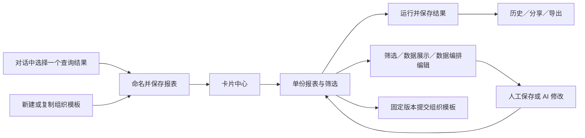

# 一期基础报表改造执行清单

日期：2026-10-04。用户在 12 张效果稿后回复“可以 你这样改”，批准本轮实施。主代理单独执行。

## 目的与范围

一份报表围绕一个图表或一份明细表长期复用。中心采用名称、说明、类型、更新时间构成的紧凑卡片；日期与科室放在筛选条件中。按已批准效果稿接通查看、编辑、AI 修改、分享、导出、历史、从对话保存及组织模板提交。

1. 中心：卡片布局、名称搜索、已加载项目排序、作者快捷重命名，摘要补齐类型、说明和更新时间。
2. 详情：顶部筛选、单份结果主体、图表与表格切换、列选择、结果实际条件和历史依据。旧多块报表通过选择内容逐项查看，保留原始定义与快照。
3. 编辑：筛选条件、数据与展示、数据编排三个入口；筛选预览、单份展示配置及已保存结果预览。沿用已有查询、参数、关系、画布和版本保存能力。
4. AI：右侧辅助面板，展示流式文字与工具过程，成功后收起过程，保留停止、澄清、恢复及新版本读取。
5. 分享、导出、历史和模板：按批准的抽屉／弹窗组织现有功能，保留权限与完整性校验。
6. 对话结果：选择一份已保存查询依据，填写名称、说明及展示配置，建立可复用报表。复用现有定义接口；转换只使用原请求与批准关系，不把权限注入条件写成用户筛选。
7. 验收：行为测试、类型和工程检查、生产浏览器真实交互及 1920×1080 截图；交付记录和流程图保存到任务交接。

## 文件增删改

- 修改 contracts/reports 的定义与摘要合同，增加可选说明及摘要显示类型／更新时间；API 报表管理服务从已授权定义和快照生成摘要。JSON 持久化沿用现有结构。
- 修改 Web features/reports 的中心、详情、编辑页面及参数、展示、AI、分享、模板组件；新增单结果转换、摘要和预览组件／模型。
- 修改 shared/results 表格列选择及 features/analysis 结果保存入口；修改 exports/export-panel 展示。
- 修改 reports.css、report-editor.css 等相应样式；新增／更新相关单测和浏览器用例。
- 更新本目录的审核状态、执行与交付记录。保留既有视觉稿和历史记录。
- 无计划删除业务文件；无表结构、迁移、依赖安装、升级或卸载。组合看板列入二期。

## 验证重点

先补有业务价值的失败测试，再实现。验证摘要来自授权对象、重命名并发冲突不覆盖他人更新、单结果转换保留查询语义、筛选与实际结果分离、历史切换只读、分享权限、导出完整性、AI 取消恢复，以及宽屏／窄屏与亮暗主题。测试写入使用隔离环境。

