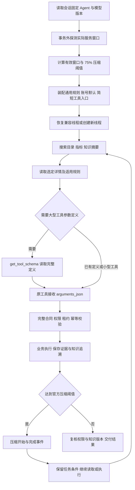

# 上下文按需加载与自动压缩交付

日期：2026-09-27。执行者：主代理；子代理 0 个；依赖操作 0；数据库结构变更 0。

用户以“开始”批准[六项修改清单](上下文按需加载与自动压缩修改清单.md)，随后明确同意[普通函数按需读取参数定义](延迟工具兼容性调整清单.md)。

## 1. 交付结果

实际模型窗口现在由 API 探测并传给官方运行时。rj 返回 32,768，自动压缩阈值计算为 24,576；真实长会话已经出现压缩开始、完成，随后继续查询并在重启后恢复同一线程。

大型工具定义、完整指标知识和目录字段改为按任务读取。相同费用问题首轮输入减少 54.3%，10 类费用与 2,263,158.00 元总计仍与 SQL 基准一致。

已发布 `default v2`，固定模型继续为 `analysis-model v1`。新建会话使用 v2 资源；旧会话仍绑定其原版本。专用 `context-acceptance v1` 完成验收后停用，保留版本、会话和证据。发布记录见[默认 Agent](上下文按需加载与自动压缩验收/默认Agent发布.json)。

## 2. 实际改动

| 范围       | 实现与影响                                                                                                                                                                                                                        |
| ---------- | --------------------------------------------------------------------------------------------------------------------------------------------------------------------------------------------------------------------------------- |
| 模型能力   | 新增 `models/model-capabilities.ts` 和类型文件。按名称匹配 `/v1/models`，llama.cpp 核对 `/props`，取服务实际窗口；显式值仍按 Agent 优先于模型，存在服务值时取较小值。成功缓存 60 秒、并发合并，限定超时、响应大小与重定向。       |
| 压缩装配   | 新增 `runtime/context-budget.ts`，调整 `agent-runtime.ts`、`codex-analysis-harness.ts` 等装配。创建和恢复均传窗口及 75% 阈值；窗口变化进入线程兼容性判断。无服务值和显式值时返回可定位的配置错误。                                |
| 工具参数   | `tool-contracts.ts`、`analysis-tools.ts` 新增 `get_tool_schema`。仅启用该工具的新 Agent 将四项大型工具改为 `arguments_json` 入口；限制 65,536 字节，解码后使用原完整合同。未启用或未装配工具不能读取定义。                        |
| 发现与详情 | 新增 `model-discovery-result.ts`；目录、指标、知识列表只提供摘要与分页，字段和定义由详情获取。目录搜索按空白拆分关键词并排序，权限过滤先于输出。                                                                                  |
| 规则与追溯 | `memory-runtime.ts` 初始保留通用正式规则与账号默认；对象、指标规则在详情或查询前读取。未读取适用规则时返回 `rules_required`，容量检查失败的正文不会标为已读取。实际读取知识按运行与租约合并持久化，交付前复核知识版本与权限指纹。 |
| 并发事务   | `analysis-run-service.ts` 合并知识追溯，`sql-analysis-run-repository.ts` 修复并发工具引出的锁循环：短查询先定位不可变会话归属，事务内再按会话、运行顺序加锁。并发合并、去重和取消后的拒绝写入通过真实 SQL 验证。                  |
| Skill      | 更新 `query-analysis/SKILL.md` 和 `query-dsl/SKILL.md`，说明任务入口、摘要/详情、正式规则、参数定义读取与错误修正。已发布快照保留，新内容通过新 Agent 版本生效。                                                                  |
| 验证配置   | ESLint 与 Prettier 忽略 `secrets/` 中官方运行时生成的资源，检查对象保持为项目源码。Web 增加压缩状态的浏览器断言。                                                                                                                 |

四项大型工具为 `query_dataset`、`save_report_definition`、`save_user_preference`、`create_knowledge_candidate`。工具名及其业务服务保持对应；授权、租约、幂等键、证据和审计在 API 执行。

当前官方 0.154.0 的原生延迟工具在自定义模型接入中未形成可发现、可调用的闭环。隔离验证记录见[兼容性证据](上下文按需加载与自动压缩验收/延迟工具兼容性.json)。本次交付使用用户批准的普通函数方案。

## 3. 同题前后计量

| 项目                          |                 修改前 |   本轮实测 |
| ----------------------------- | ---------------------: | ---------: |
| 费用问题首轮输入 tokens       |                 11,365 |      5,190 |
| 初始工具定义 UTF-8 字节       |                 37,925 |     11,175 |
| 初始 memory UTF-8 字节        |                  9,511 |        545 |
| 初始完整指标知识条数          |                      6 |          0 |
| 费用答复前最后一次输入 tokens |                 20,756 |     14,543 |
| 最后一次输入与输出合计 tokens |                 23,954 |     16,166 |
| 费用工具输出合计字节          |                 36,184 |     18,374 |
| 费用分类与金额                | 10 类、2,263,158.00 元 | 与基准一致 |

工具定义体积减少约 70.5%。token 使用模型实际 usage，字节量按 JSON 序列化单独计算，两种计量不可互换。当前 runtime 的有效窗口显示为 31,129，是官方运行时对传入 32,768 的有效预算折算；压缩触发配置为 24,576。

本轮费用共调用 14 次工具，约 342 秒完成，期间 3 次 `query_metric` 时间类型/统计维度错误，修正后成功。原成功样本为 8 次工具、约 243 秒；因此本次结果证明上下文减少和压缩有效，不证明整体查询更快，也不表示模型参数错误已经全部解决。

定义读取专项完成 `get_tool_schema → query_dataset → 10 条分类结果`，JSON 字符串正常解码；业务查询仍经历一次参数修正。简单数据源问题仅调用一次 `list_sources`，首轮 5,141 tokens，工具返回 41 字节。

完整计量和公开错误见[上下文前后计量](上下文按需加载与自动压缩验收/上下文前后计量.json)、[费用结果](上下文按需加载与自动压缩验收/fees-业务验收.json)、[参数定义专项](上下文按需加载与自动压缩验收/schema-业务验收.json)。记录未复制模型内部推理内容。

## 4. 验证结果

| 检查                | 结果                                                                                                                      |
| ------------------- | ------------------------------------------------------------------------------------------------------------------------- |
| API 单元与协议测试  | 79 文件、616 项通过；包含真实官方进程的请求采样与重启。                                                                   |
| 其他工作区测试      | contracts 168、metadata 28、DAS 409、Web 66 项通过。                                                                      |
| 工程规则            | 42 项通过。                                                                                                               |
| SQL 集成            | 41 项通过：记忆事件、Agent 版本、分析运行、报表事务；使用独立测试数据库并清理。                                           |
| Chromium 工作台回归 | 原 8 项通过；新增压缩状态显示/结束/续接 1 项通过。                                                                        |
| 真实 rj             | 费用基准、普通函数参数定义、单次数据源调用均通过。                                                                        |
| 长会话              | 8 页、1,200 条、720,600 总计；真实压缩后继续第 8 页，官方进程重建后恢复同一线程。参数定义可在压缩及重启后重新读取。       |
| 格式、类型与 lint   | 本轮相关源码格式通过；全工作区类型检查、lint 通过。全量格式检查仅报告现有 `pnpm-lock.yaml` 格式差异，锁文件未在本轮修改。 |
| 构建                | `pnpm build` 通过；API/DAS Windows x64 发布包及 Web 静态产物生成。Web 保留已有大体积分块提示。                            |

真实压缩记录：[长会话](上下文按需加载与自动压缩验收/长会话压缩验收.json)、[参数定义重读与恢复](上下文按需加载与自动压缩验收/参数定义压缩恢复验收.json)。补充场景在压缩与重启后同时保留了合成口径版本 `synthetic-count-v2`、用户条件 `department-A`、日期、校验码及 `page-1` 至 `page-8` 证据引用，数值断言通过。正式页面结果与版本验证：[浏览器记录](上下文按需加载与自动压缩验收/浏览器与版本验收.json)。压缩 UI 使用隔离 SSE 场景验证，真实模型压缩使用隔离官方线程，两者分别记录。

## 5. 执行流程

## 6. 后续接续

当前开发启动仍为工作区 `pnpm dev`。要体验新参数装配，请新建分析会话并使用“分析助手 · v2”。历史 v1 会话继续保留旧参数与 Skill 快照；实际窗口探测和压缩修复属于公共运行层。

第 5 步报表中心与详情按[已批准清单](前端第5步实施清单.md)接续。本轮完成的是上下文与压缩修复，不将其记录为第 5 步页面交付。
