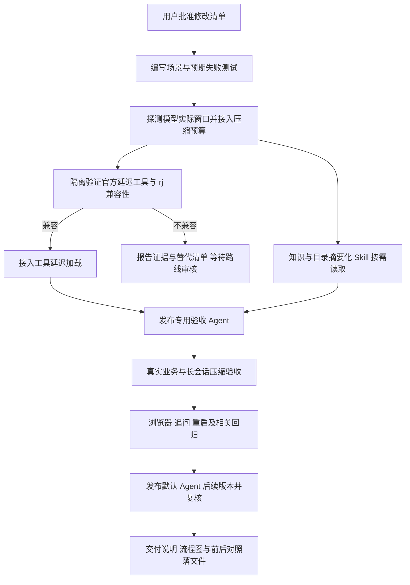

# 上下文按需加载与自动压缩修改清单

日期：2026-09-27。状态：**实施与验收完成**，见[交付说明](上下文按需加载与自动压缩交付说明.md)。工具定义采用用户追加批准的[普通函数兼容方案](延迟工具兼容性调整清单.md)。

执行者：主代理单独实施，子代理 0 个。依赖安装、升级、卸载均为 0，沿用当前 Codex 0.154.0、Node 和现有测试工具。

## 1. 目的与依据

让简单问题使用必要上下文，让复杂问题逐步读取相关定义，并使官方运行时按当前模型服务的实际窗口自动压缩后继续执行。

已确认：首个费用请求输入 11,365 tokens；18 个工具定义约 38 KB；初始知识包含 6 个完整指标；目录发现返回完整字段。rj 的两个能力接口均返回当前窗口 32,768，而项目未读取这一信息，官方运行时使用了 244,800 tokens 的压缩阈值。

依据见[上下文诊断](前端第4步业务造数与验收/20260927-模型复验/上下文增长与压缩诊断.md)和[实际模型能力响应](前端第4步业务造数与验收/20260927-模型复验/模型能力探测.json)。字节量用于比较装配体积，实际 token 用量按模型响应和官方运行日志分别记录。

本轮范围为 API 模型装配、分析工具、知识投影、Skill 入口及相关测试。Web 通过已有压缩事件做联调验收。前端第 5 步仍按已批准清单接续，不并入本次上下文改动。

## 2. 六项修改

### 1）自动读取模型服务能力

- 在运行装配阶段请求已配置模型服务的 `GET /v1/models`，按模型名称准确匹配条目；对可识别的 llama.cpp 服务使用 `GET /props` 补充或核对实际窗口，兼容 base URL 已带 `/v1` 和路径前缀的情况。
- 采用运行时 `n_ctx`；`n_ctx_train` 仅作为训练能力信息记录。
- 显式配置值沿用 Agent 优先于模型的顺序。有服务实测值时，有效窗口取实测值与显式配置值中的较小值；未配置时直接采用服务实测值。
- 探测不到可用字段时采用显式配置；两者均缺失则返回可定位的配置错误，提示补充模型窗口。禁止再悄悄使用未知模型的大窗口默认值。
- 探测使用现有加密凭据，在服务端解密后调用配置目标。限定超时、响应大小和重定向；日志只保存能力值与来源。
- 成功结果按组织、模型版本和连接配置缓存 60 秒，并合并同一配置的并发探测。过期后重读，失败不使用过期值冒充当前能力。探测放在数据库事务之外，管理列表不触发模型探测。

验收：32K、64K 两组服务响应得到对应窗口；训练窗口不能覆盖服务窗口；覆盖多模型匹配、配置冲突、缓存过期、401、超时、字段缺失与 URL 前缀。

### 2）把实际窗口接入官方自动压缩

- 向 `thread/start` 和 `thread/resume` 同时传入 `model_context_window` 与 `model_auto_compact_token_limit`。
- 拟以有效窗口的 **75%** 作为初始压缩触发点，剩余空间供工具返回、模型输出及压缩处理。当前 32,768 对应 24,576；服务窗口改变时随之计算。这是触发压缩的预算，不是停止长任务的条件。
- 保留官方压缩执行和现有 `contextCompaction` 事件持久化、SSE 推送；压缩后继续同一业务会话。
- 检查恢复线程的配置是否实际生效。模型能力或工具装配变化纳入兼容性判断；普通追问沿用官方线程，必要重建时按既有恢复流程复核历史权限。
- 75% 只是待实测的初始预算；验收必须覆盖单次工具结果导致用量跃升，不能把“配置已传入”当作“压缩一定及时且成功”。如果当前运行时的实际行为需要改变预算方案，先提交具体证据及调整清单。

验收：运行日志中的窗口和阈值与计算值一致；真实 rj 出现压缩开始、压缩完成，随后还能查询、回答、追问及重启恢复。

### 3）工具定义按需加载

已通过当前安装的官方二进制导出协议确认：`dynamicTools` 的函数定义支持 `deferLoading`。同版本官方源码包含工具发现及加载逻辑。[协议定义](https://github.com/openai/codex/blob/rust-v0.154.0/codex-rs/protocol/src/dynamic_tools.rs)、[工具发现实现](https://github.com/openai/codex/blob/rust-v0.154.0/codex-rs/core/src/tools/handlers/tool_search.rs)。

**首先做独立兼容性验证**：用隔离线程检查当前 rj 是否接受发现工具对应的 Responses 请求，以及能否完成“发现 → 加载 → 调用 → 恢复”。协议存在不等于当前模型服务已经兼容；当前尚未验证该闭环。

通过后采用以下装配：

- 初始保留简短的发现与控制工具：数据源、目录搜索/列表、指标列表、知识索引、个人偏好读取、Skill 子文档读取及澄清；仅开放 Agent 原本允许的工具。
- 查询执行、详情读取、报表保存、偏好保存、知识提交等工具注册到官方运行时，完整参数定义延迟进入模型请求。
- 模型发现所需工具后仍调用原业务工具，复用完整 Zod 参数校验、授权、租约、证据、幂等与审计。
- 通过实际发往模型的请求核实定义是否延迟出现；不能只检查 API 到 app-server 的注册消息。
- 验证压缩和重启后已发现工具仍可用，或能够重新发现。

若 rj 不支持该协议，先报告具体失败与替代清单，再审核技术路线；本清单不授权自动升级运行时、引入 MCP 服务或改成自制通用执行协议。其余独立修改继续按获准范围完成。

### 4）知识改成索引与详情分离

- 初始上下文保留必要业务规则、有效账号默认、停用标识及待确认事项；完整指标定义通过指标工具获取。
- `get_published_knowledge` 不指定 ID 时返回有界、可分页的索引，包含知识 ID、版本、类型、名称和适用范围；指定 ID 与版本时才返回完整内容。索引支持关键词及范围筛选，分页能够找到后续记录。
- 通用生效业务规则保留必要正文；与已选择数据源、对象或指标关联的规则在详情阶段补齐，不能因正文精简而跳过正式口径。
- `get_user_preferences` 返回账号偏好内容，解除它与企业知识全量快照的耦合。一般偏好自动应用、冲突确认与相对时间重新解析沿用用户已确认规则。
- 将“传给模型的精简内容”与“用于追溯的实际读取记录”分开。按需读取的知识 ID、版本和适用内容继续记录到运行记忆，重复读取按 ID/版本去重，写入仍检查租约。
- 线程恢复仍复核知识可见性、启停和版本变化；使用这些元信息维护兼容性判断，避免把每轮检索词直接放入线程指纹造成频繁重建。

验收：简单数据源问题不再带入 6 个完整指标；选择费用指标后能够获得准确口径；分页、权限撤销、知识停用、个人默认及相对日期行为均正确。

### 5）目录返回摘要，Skill 引导按需读取

- `list_datasets`、`search_catalog` 给模型的结果只保留对象 ID、名称、简要业务说明、对象类型和查询能力；完整字段、参数、粒度、唯一键与关联由 `describe_dataset` 返回。
- `list_metrics` 返回 ID、名称、版本、简要时间依据与适用范围；完整查询结构由 `describe_metric` 返回。列表增加有界筛选/分页，详情保留完整业务含义。
- 多关键词搜索按空白拆词，对已授权内容匹配并按命中情况排序，再做稳定排序和数量限制。覆盖 `支付流水 支付 payment`；搜索只使用当前可见字段。
- 在模型工具边界做摘要投影，保留管理接口原有完整返回结构。
- 精简两个 Skill 的入口，正文保留选择路径、口径与证据规则；DSL 细节和示例继续放在按需子文档。
- 修订失败恢复指引：根据错误和对象能力选择正确查询类型；相同参数已明确失败后应检查详情并修改参数，避免原样循环。本项通过指引和回归验证改善，不新增强行终止整轮的重复次数阈值。

验收：发现列表不带完整字段或 DSL，详情足以构造正确查询；多关键词能找到支付对象；table/view 与参数化对象选择正确分支；费用结果与现有 SQL 基准一致。

### 6）整体验收与交付记录

- 按 BDD 场景先写行为测试，确认新行为的预期失败，再实施和回归。
- 用同一业务问题、同一数据和模型比较首轮输入 tokens、工具定义字节、知识字节、目录回包字节、工具调用次数、最后一次请求用量与结果正确性。
- 增加真实长会话验收：达到实际压缩阈值，观察官方压缩事件并验证压缩后继续工具调用和追问。准备有界验收数据，避免通过重复无效调用制造长度。
- 浏览器核对压缩状态、结果、证据、刷新与追问，沿用当前 Web 组件。
- 保存修改前后对照、测试范围、未通过项、配置与 Agent 版本、交付说明和流程图。

## 3. 文件增删改范围

以下代码路径相对于 `ai-data/`。实施中如需扩大到新模块、数据库结构或依赖变更，先补充清单。

### 新增代码

| 文件                                              | 职责                                   |
| ------------------------------------------------- | -------------------------------------- |
| `apps/api/src/models/model-capabilities.ts`       | 请求能力接口、校验响应、缓存及来源判定 |
| `apps/api/src/models/model-capabilities-types.ts` | 已解析服务能力及探测依赖的类型         |
| `apps/api/src/runtime/context-budget.ts`          | 有效窗口及压缩阈值计算                 |
| `apps/api/src/runtime/model-discovery-result.ts`  | 数据集、指标与知识索引的模型侧摘要投影 |

### 修改代码与资源

| 文件                                                                  | 主要修改                                             |
| --------------------------------------------------------------------- | ---------------------------------------------------- |
| `apps/api/src/models/model-service.ts`                                | 区分配置校验与运行能力装配，接入能力探测             |
| `apps/api/src/agents/create-agent-configuration.ts`                   | 注入能力探测服务，避免管理流程无必要的上游请求       |
| `apps/api/src/runtime/agent-runtime.ts`                               | 事务外装配实际窗口、压缩预算及兼容性依据             |
| `apps/api/src/harness/harness-types.ts`                               | 补充延迟工具标识、压缩阈值及能力来源所需内部类型     |
| `apps/api/src/harness/codex-analysis-harness.ts`                      | 传递上下文与压缩配置、延迟加载工具定义               |
| `apps/api/src/runtime/tool-contracts.ts`                              | 知识/指标索引筛选分页参数与准确工具描述              |
| `apps/api/src/runtime/analysis-tools.ts`                              | 工具加载策略、发现结果摘要、按需知识读取记录         |
| `apps/api/src/memory/memory-runtime.ts`                               | 拆分账号默认、知识索引、详情和模型输入投影           |
| `apps/api/src/runtime/analysis-executor.ts`                           | 初始内容装配、知识复核和线程兼容性判断               |
| `apps/api/src/runtime/runtime-types.ts`、`create-analysis-runtime.ts` | 同步运行装配依赖与类型                               |
| `apps/api/src/analysis-runs/analysis-run-service.ts`                  | 在现有记忆记录中按租约合并实际读取知识               |
| `apps/api/src/catalog/business-catalog-service.ts`                    | 多关键词搜索与稳定排序                               |
| `packages/skills/query-analysis/SKILL.md`、`query-dsl/SKILL.md`       | 按需发现、详情读取及失败修正路径                     |
| `packages/skills/query-dsl/references/*.md`                           | 同步涉及的查询选择与错误修正说明，保留已有分主题结构 |

### 测试与交接

- 新增与四个新模块行为对应的 `apps/api/tests/models/model-capabilities.test.ts`、`apps/api/tests/runtime/context-budget.test.ts`、`apps/api/tests/runtime/model-discovery-result.test.ts`。
- 新增 `apps/api/tests/harness/deferred-tools-protocol.test.ts`：使用真实已安装官方进程和受控模型响应检查请求内容、工具发现及恢复协议。
- 扩展已有模型服务、Agent 运行、工具、记忆、执行器、运行服务、目录测试，以及 `tests/harness/` 中相关用例和进程夹具。
- 扩展 `apps/api/tests/integration/dialogue.integration.ts` 及相关夹具，补知识追溯、压缩和继续运行场景；真实模型结果与确定性测试分别记录。
- 在 `任务交接/上下文按需加载与自动压缩验收/` 保存真实验证脚本、统计 JSON 和必要截图；新增 `任务交接/上下文按需加载与自动压缩交付说明.md`。
- `任务交接/README.md` 追加状态和入口；按实际实现同步 `需求文档/technical-design.md` 与 `需求文档/development-checklist.md` 对应条目。

删除文件：0。依赖操作：0。预计复用现有 JSON 记忆记录和模型配置，无数据库表结构变更；不要求用户重新安装环境。

## 4. 配置生效与现有会话

Skill 按已发布 Agent 版本固定，修改源码后不能覆盖旧版本快照。验收先通过现有管理 API 发布本次专用 Agent 版本，绑定新的 Skill 指纹和现有模型版本；工具授权集合及其他预算继承原配置。

验收成功后，通过现有管理 API 发布 `default` 的后续版本供新会话使用，并重启本机开发 API 使代码生效。此配置发布和开发服务重启包含在拟审批范围内；旧版本及旧会话保留其资源绑定，另做追问兼容性验证。模型窗口自动探测生效不需要为 rj 手填固定 32K。

新版本号以实施时数据库现有最大版本为准，交付记录写明实际值。本轮不原位改写已发布 Agent、模型或 Skill 快照。业务基准继续使用已有 `ai_bi_demo` 合成数据，新增报表与偏好测试记录归专用验收账号或隔离库。

## 5. 验收清单

| 场景           | 通过标准                                                               |
| -------------- | ---------------------------------------------------------------------- |
| 能力探测       | 使用实际服务窗口，记录来源；异常有明确回退或配置错误                   |
| 延迟加载兼容性 | rj 完成工具发现、加载和调用；实际请求证实无关完整定义未提前发送        |
| 简单问题       | 仅查询数据源时，初始输入不含完整报表保存结构及全部指标定义             |
| 目录与知识     | 列表为有界摘要，详情可获取；分页完整；授权和知识状态变化正确处理       |
| 费用业务       | 10 个费用分类及总计 2,263,158.00 元与当前固定验收条件下的 SQL 基准一致 |
| 正式口径与偏好 | 按需加载不漏适用规则；当前问题优先、一般偏好应用和冲突确认仍正确       |
| 自动压缩       | 日志阈值正确，真实压缩开始并完成，后续查询与回答成功                   |
| 连续性         | 压缩后保留问题、日期、指标版本、用户条件及证据引用；重启和追问正常     |
| Web            | 压缩事件展示、工具记录、结果与证据、刷新恢复无回归                     |
| 工程检查       | 相关包格式、类型、lint、行为测试、集成和构建检查通过；失败明确记录     |

首轮体积按修改前后的实测值交付，不在未运行前承诺节省比例。减少输入不能以丢失业务口径、授权或结果正确性为代价。

## 6. 执行流程

本次提交的是上述实施范围；批准后开始修改业务代码。工具协议不兼容或需要扩大技术路线时，按项目协作规则单独报告。
