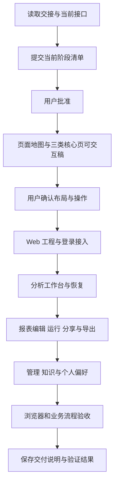

# 前端 Agent 交接文档

日期：2026-09-22。用途：指导 AI BI 前端的页面设计、交互实现、API 接入与阶段验收。

用户已确认本文的交接方向：先提交页面地图和核心页面可交互稿，确认整体布局与操作方式后，扩展页面并逐步接入真实接口。接手 Agent 应先提交当前阶段的文件、依赖和验证清单，按项目协作规则获得批准后实施。

## 1. 目标与当前状态

产品面向运营、业务和管理人员，主流程是自然语言提问、确认口径、取得表格和图表、查看证据、继续追问，以及保存和复用报表。管理人员通过独立入口维护用户、数据权限、模型、Agent 和企业知识。

API 与 DAS 已完成当前阶段的后端交付。Web 技术基线为 Vue 3 + Vite + TypeScript；当前 `ai-data/apps/` 只有 `api` 和 `data-access`，`apps/web` 尚未建立。工作区已有 `dev:web` 脚本入口，前端应用及其构建、测试配置仍需创建。

| 范围                       | 当前状态及前端责任                                                                                       |
| -------------------------- | -------------------------------------------------------------------------------------------------------- |
| 登录、用户、会话、分析运行 | 已有 API；前端负责登录态、消息、澄清、运行状态、恢复与结果展示                                           |
| 模型与 Agent               | 数据库版本管理、启停、会话固定版本已实现；前端负责选择、配置和版本信息呈现                               |
| 统一报表                   | 定义、执行、快照、对话修改、模板审核、分享与导出内容已有 API；前端负责详情、参数表单、画布和文件生成     |
| 偏好、知识与后台任务       | 已有 API；前端负责查看、编辑、审核发布、状态与重试入口                                                   |
| Web 页面与文件下载         | 尚待实现及浏览器验收；后端通过不能代替这部分验收                                                         |
| 真实模型                   | 第 7 步收尾复验通过；第 8 步后续真实模型专项失败，待调优。接口及确定性用例验收与真实模型业务验收分别记录 |

已交付接口决定当前可接入能力。需求文档中的规划项先核对实现；缺少接口的操作按第 8 节登记并审核。

## 2. 接手阅读顺序

项目根目录为 `D:/porject_new_2026/ai-data`，Node/pnpm 工作区为其下的 `ai-data/`。

先读以下入口，再按当前模块阅读详细材料：

1. [项目协作规则](../AGENTS.md)、[任务交接](README.md)、[开发规范](../需求文档/development-standards.md)。
2. [产品需求](../需求文档/requirements.md)、[技术设计](../需求文档/technical-design.md)的 Web 职责和前端组织部分。
3. [结果交付与文件导出](../需求文档/result-delivery-and-export.md)、[统一报表接口](../ai-data/REPORTS.md)。
4. 当前模块的 API 说明、路由、服务与合同；下表给出入口。

| 模块                   | 说明入口                                                                                               | 实现入口                                                                                                                                                                                                    |
| ---------------------- | ------------------------------------------------------------------------------------------------------ | ----------------------------------------------------------------------------------------------------------------------------------------------------------------------------------------------------------- |
| 认证、用户             | [认证与用户](../ai-book/docs/02.API/02.认证与用户.md)                                                  | [认证路由](../ai-data/apps/api/src/routes/auth-routes.ts)、[用户路由](../ai-data/apps/api/src/routes/user-admin-routes.ts)                                                                                  |
| 会话、运行、SSE        | [分析运行](../ai-data/ANALYSIS-RUNTIME.md)、[SSE 事件](../ai-book/docs/02.API/05.SSE事件.md)           | [会话路由](../ai-data/apps/api/src/routes/conversation-routes.ts)、[运行路由](../ai-data/apps/api/src/routes/analysis-routes.ts)                                                                            |
| 报表、画布、分享、导出 | [统一报表接口](../ai-data/REPORTS.md)、[第 9 步交付](第9步交付说明.md)                                 | [管理路由](../ai-data/apps/api/src/routes/report-management-routes.ts)、[执行路由](../ai-data/apps/api/src/routes/report-execution-routes.ts)                                                               |
| 目录、关系、权限       | [目录与权限](../ai-book/docs/02.API/08.业务目录与权限.md)                                              | [目录路由](../ai-data/apps/api/src/routes/catalog-routes.ts)、[策略管理路由](../ai-data/apps/api/src/routes/catalog-admin-routes.ts)、[关系路由](../ai-data/apps/api/src/routes/catalog-relation-routes.ts) |
| 模型、Agent、Skill     | [模型与 Agent](../ai-book/docs/02.API/06.模型与Agent.md)、[第 8 步交付](第8步交付说明.md)              | [Agent 路由](../ai-data/apps/api/src/routes/agent-routes.ts)、[模型资源路由](../ai-data/apps/api/src/routes/model-resource-routes.ts)                                                                       |
| 偏好、知识、任务       | [记忆与知识接口](../ai-data/MEMORY-KNOWLEDGE.md)、[第 10 步交付](第10步交付说明.md)                    | [偏好路由](../ai-data/apps/api/src/routes/preference-routes.ts)、[知识路由](../ai-data/apps/api/src/routes/knowledge-routes.ts)、[任务路由](../ai-data/apps/api/src/routes/memory-event-routes.ts)          |
| DAS 管理               | [DAS 接入](../ai-data/SERVICE-AUTH.md)、[DAS 管理接口](../ai-book/docs/02.API/14.DAS管理与内部接口.md) | [API 的 DAS 路由](../ai-data/apps/api/src/routes/data-access-routes.ts)                                                                                                                                     |

共享类型和运行时校验从 [contracts 公共出口](../ai-data/packages/contracts/src/index.ts)经 `@ai-data/contracts` 导入。具体字段、状态、权限与成功响应以当前路由、共享合同、服务行为及对应测试为准；说明用于理解流程。较早的设计和开发清单可能包含后续规划，遇到差异先明确差异对当前页面的影响。

## 3. 页面地图与职责

以下是功能分区，最终菜单名称、路由和布局在第一轮设计中提出。业务使用入口与管理入口按当前用户权限呈现。

| 分区              | 页面及主要操作                                                     | 设计重点                                                   |
| ----------------- | ------------------------------------------------------------------ | ---------------------------------------------------------- |
| 登录与应用框架    | 登录、身份状态、主导航、登录过期和退出                             | 恢复访问目标；切换身份后清理原用户状态；深层链接可刷新     |
| 分析工作台        | 会话列表、新建会话、Agent 选择、消息流、追问、澄清、取消、运行详情 | 问题、进度、待办和结果层次清楚；查询条件和证据按需展开     |
| 报表中心          | 当前可访问报表、我的与共享视图、模板入口                           | 分类以返回的作者和授权资料为依据；列表翻页遵守实际游标合同 |
| 报表详情          | 参数、表格、图表、分析说明、历史版本、分享、导出                   | 明确当前定义和正在查看的执行结果；旧结果保留原参数与时间   |
| 报表编辑          | 表单、画布、对话修改；参数增删改；查询和展示配置                   | 三个入口编辑同一份定义，切换时保留编辑内容和基准版本       |
| 知识与个人偏好    | 指标口径查阅、我的知识候选、个人偏好和自动应用开关                 | 正式口径、候选内容、个人习惯各有适用范围和状态             |
| 用户与权限管理    | 用户列表、创建、详情、启停、部门范围；对象、列和行策略             | 变更范围、当前版本、发布结果及冲突可见                     |
| DAS 与数据管理    | 健康实例、数据源诊断、对象发现、目录、业务配置和关系发布           | 展示当前接口确实提供的实例、目录和操作结果                 |
| 模型与 Agent 管理 | 模型发布与启停、Agent 配置、工具和 Skill 选择、版本读取            | 发布形成新版本；现有会话固定版本；凭据只呈现公开状态       |
| 知识与任务管理    | 候选负责人、审核、发布、生效时间、历史与回滚；后台失败任务重试     | 审核绑定固定内容版本；重试依据任务状态及错误原因           |

第一轮典型管理页选“模型与 Agent 管理”，可验证列表、表单、版本、启停和错误提示这一组通用交互。

## 4. 第一轮设计交付

先交付页面地图、菜单层级与主要用户流程，再提供下列核心页面的可交互稿：

1. **分析工作台**：新会话、已有会话、运行中、等待澄清、结果完成、失败及空结果。
2. **报表详情**：参数编辑与运行、结果切换、表格图表、历史版本、分享和导出状态；展示进入三种编辑方式的路径。
3. **模型与 Agent 管理**：列表、详情、创建新版本、工具/Skill 选择、启停和保存失败。

原型使用符合实际合同的虚构数据，并明确当前使用模拟数据。页面上的关键操作应有可检查的结果状态；真实接口和真实模型的接入状态分别标记。

视觉方案需统一字体、间距、表格、表单、图标、主次操作、焦点、加载、空态、错误和禁用状态。优先考虑业务人员阅读分析结果与管理员处理密集配置的效率；桌面与窄屏的导航、表格、详情面板如何调整需在方案中说明。长文本、长字段名、键盘操作与图表颜色可辨识性纳入检查。

配色、明暗主题、组件库、画布库和导出库尚待前端 Agent 提出具体方案并由用户审核；已有 ai-book 主题用于文档站，不能据此认定业务 Web 的视觉方案已经确定。

用户确认这组核心页面后，按相同组件和状态规则扩展其余页面，再分模块接入真实 API。

## 5. 关键交互约定

### 5.1 登录与身份

- 登录和刷新响应中的令牌字段为 `accessToken`、`refreshToken`、`expiresIn`；用户管理、运行快照等接口另有自己的字段约定，在 API client 中逐项适配。
- 业务请求使用 Bearer Access Token。刷新可通过服务端设置的 HttpOnly Cookie 完成；并发请求统一协调刷新，失败后呈现重新登录入口。
- 登录状态以 `/auth/me` 返回的当前身份为依据；前端权限控制用于展示入口，API 负责最终授权。
- 退出或切换账号时停止原身份的 SSE 订阅并清理结果缓存。操作失败保留当前用户尚未提交的输入，允许其判断下一步。

### 5.2 分析工作台

新建会话时选择可用 Agent。省略版本时 API 绑定创建时的最新版本，既有会话继续使用已绑定版本；在会话中显示当前 Agent 及版本信息。

同一会话串行推进运行，不同会话可独立运行。一次消息、澄清回答等业务操作创建稳定幂等键；网络重试复用原键，用户明确发起的新操作使用新键。重复提交保护既体现在按钮状态，也体现在请求标识上。

运行进度、工具摘要、表格图表、最终答案按 SSE 类型分别处理。`final_answer` 表示答复内容，结束状态以运行快照和终态事件为准。澄清提交稳定 `option_id` 或自定义输入，并绑定当前问题；偏好冲突确认沿用这条回答流程。

取消请求后以服务端状态收敛界面；晚到事件按运行归属和序号处理。失败后的操作须区分“确认原请求结果”“重连已有运行”和“用户发起新一轮分析”，不能把普通查询或发送消息当成通用网络重试。

### 5.3 SSE 与恢复

- 订阅 `GET /analysis-runs/:id/events`，采用能够携带 `Authorization` 与 `Last-Event-ID` 请求头的流式方式。
- 按运行维护已处理序号，解析完整事件后再推进游标，按运行和序号去重；注释心跳不计为业务事件。
- 断线先核对登录态和运行快照，再恢复订阅。页面刷新后，以持久化会话、运行、证据和事件恢复可用内容。
- 渲染状态与回放游标保持一致：页面内容尚未恢复时不能只用旧游标跳过重建所需事件。
- 上下文压缩按 `context_compaction` 的开始/完成状态展示短暂进度；运行结束、等待澄清等场景同步收敛提示。
- 暂未保存的浏览器明细在刷新后可能不可用，需准确提示；重新查询由用户明确发起。

### 5.4 表格、图表与证据

结果区域同时呈现或提供展开入口：查询条件、时间范围、数据来源、可用指标版本、数据时间和结果完整性。数据时间与报告生成时间分别表达。

SSE 表格最多携带 100 行 / 256 KiB 样本。依据 `sampled`、`result_row_count`、`result_truncated` 判断展示范围，完整行数据按对应证据或结果接口取得；如果保存结果本身已截断，保留这一状态。

完整结果在浏览器内分页并虚拟渲染，页大小变化后修正页码。页码、页大小与虚拟窗口不改变已取得的数据范围。业务总量未知时明确显示未知，不从样本行数推导总量。

图表依据受控结果与查询引用生成；保持图表、表格和说明的来源一致。Markdown、图表配置和工具输出均经受控渲染，用户界面只展示当前身份有权读取的内容。

### 5.5 报表定义、执行与快照

| 标识           | 含义                             | 页面行为                                              |
| -------------- | -------------------------------- | ----------------------------------------------------- |
| 定义 `version` | 参数、查询和展示配置版本         | 编辑提交 `expected_version`；保存定义后由用户显式运行 |
| `execution_id` | 使用固定定义和实际参数的一次执行 | 结果、证据与分析说明绑定该次执行                      |
| 快照 `version` | 同一报表保存的历史结果版本       | 按快照版本查看；与定义版本独立递增                    |

表单、画布、对话共用 `ReportDefinition`。画布节点坐标保存在 `editor_layout`，查询关系、筛选、聚合与参数绑定保存在实际查询项中；提供同表多别名和多字段关系的准确表达。关系图读取为一层关系，按需展开；可执行方向和连接方式服从已批准关系。

定义更新提交完整内容，包括需要保留的分享名单。分享变更也会推进定义版本；保存后更新编辑基准。收到 `409 CONFLICT` 时保留本地编辑，提示读取新版本并处理差异。

对话修改只有运行成功完成后才提交新定义。分析说明绑定指定执行，新结果不能直接沿用旧执行的说明作为本次结论。普通报表执行读取 `/report-executions/:id`；对话修改和说明生成按返回的分析运行回执接入 SSE，二者按实际合同分别处理。

模板以当前访问者权限执行。历史快照读取、分享和导出均由 API 检查完整来源范围；原快照不可访问时，可引导有权读取定义的用户按当前权限新建执行。

### 5.6 导出

- Excel 使用完整可导出结果的全部行，多查询结果按业务含义分表，保留类型、条件和数据时间。
- Word 组织用户可见的问题、澄清、回答、分析说明及必要汇总；文字和表格可编辑，图表可嵌入图片。
- PDF 提供可阅读、可打印的中文图表与分析内容，检查长表表头和分页。
- 文件生成使用当前已有数据或经 API 授权读取的导出内容包；导出本身不重新执行业务查询。
- 完整 Excel 导出要求完整数据。已保存快照只有截断范围时，必须明确已有范围与完整性；不能把其标为全量明细。
- 生成中、数据缺失、结果截断、权限失效和生成失败均有明确状态。下载内容与页面所选执行或历史快照保持一致。

### 5.7 管理、知识与个人偏好

权限配置和关系发布使用实际读取到的版本；按接口读取 `x-policy-version`、`x-config-version`。角色模拟接口返回授权后的 DSL 和脱敏规则，不是业务数据执行结果。

模型、Agent 以发布新版本方式维护，旧会话保持固定版本。模型接口不返回凭据原文；发布新模型版本需要该版本完整认证配置，不能将“已配置”的占位文字当作真实密钥提交，也不能把省略凭据理解为自动继承。

企业知识经候选、负责人、固定版本审核、发布和生效流程进入正式使用；报表模板沿用该审核流程。修改候选后，旧审核不能发布新内容。

个人一般偏好可直接保存和使用；偏好冲突或拟恢复用户停用的自动应用时才确认。当前明确修改直接执行。相对时间如“本年”保持相对语义，在使用时按东八区重新解析。个人偏好界面展示作用范围、自动应用状态与当前版本。

## 6. API 接入速查

下列是 API 原始路径，没有统一 `/api` 前缀。代理前缀在 Web 工程与部署方案中统一处理。完整请求体和权限从第 2 节的路由与合同读取。

| 用户操作                       | 主要接口                                                                                                                                                          |
| ------------------------------ | ----------------------------------------------------------------------------------------------------------------------------------------------------------------- |
| 登录、刷新、退出、当前身份     | `POST /auth/login`、`POST /auth/refresh`、`POST /auth/logout`、`GET /auth/me`                                                                                     |
| 会话列表、新建、读取、发送消息 | `GET/POST /conversations`、`GET /conversations/:id`、`POST /conversations/:id/messages`                                                                           |
| 运行、澄清、取消、证据与事件   | `GET /analysis-runs/:id`、`POST /analysis-runs/:id/answers`、`POST /analysis-runs/:id/cancel`、`GET /analysis-runs/:id/evidence`、`GET /analysis-runs/:id/events` |
| 报表创建与编辑                 | `POST /report-definitions`、`GET/PUT /reports/:id/definition`、`POST /reports/:id/revisions`                                                                      |
| 报表运行与说明                 | `POST /reports/:id/execute`、`GET /report-executions/:id`、`POST/GET /report-executions/:id/narratives`                                                           |
| 报表管理、分享与模板           | `GET /reports`、`GET /reports/:id/versions`、`PUT /reports/:id/sharing`、`GET /report-templates`、`GET/POST /report-blocks`                                       |
| 读取导出内容                   | `GET /reports/:id/export-content`、`GET /report-executions/:id/export-content`、`GET /conversations/:id/export-content`                                           |
| 指标、偏好、知识、任务         | `/metrics`、`/me/preferences`、`/knowledge-candidates`、`/knowledge`、`/admin/knowledge-candidates`、`/admin/memory-events` 对应读写操作                          |
| 模型与 Agent                   | `/models`、`/agents` 的列表、版本发布、详情和启停；`GET /skills`、`GET /skills/:id`、`GET /agent-tools`                                                           |
| 目录与数据权限                 | `/catalog/datasets/:sourceId`、`/admin/catalog/*`、`/catalog/:sourceId/objects/:objectId/relations`                                                               |
| DAS 诊断与管理                 | `GET /internal/data-access/services`、`GET /internal/data-access/catalog/:sourceId`、`/admin/data-access/services/:serviceId/*` 的管理代理                        |

最后一行的接口由 **API** 提供并校验用户管理权限；浏览器连接 API，DAS 内部注册、心跳和执行属于服务之间的职责。

### 浏览器联调前确认

1. 当前 API 装配未注册 CORS 插件。优先提出开发代理及生产同源代理方案；如果需要跨域，单列后端改动清单审核。
2. 刷新 Cookie 当前 `Path=/auth`，生产环境启用 `Secure`。若浏览器使用 `/api/auth/*`，代理必须同时处理 Cookie 路径的一致性和退出清除；只重写请求路径不足以完成刷新流程。
3. SSE 代理保留流式传输，核对缓冲和连接超时。跨域方案还需允许认证、游标请求头及前端读取版本响应头。
4. API 启动与模型/Agent 首次发布按[部署说明](../ai-data/DEPLOYMENT.md)执行，状态通过 `/health`、`/ready` 等实际端点核对。使用用户提供的账号和本地配置，示例与原型使用虚构数据。

## 7. 工程组织

新应用位置为 `ai-data/apps/web`，工作区包名沿现有脚本约定使用 `@ai-data/web`。

沿用 Vue Router、Pinia、Vue Query、ECharts、Zod 的前端设计基线，详见[依赖清单的 Web 部分](../需求文档/dependencies.md)。这些是已规划的用途，安装现状和版本需在实施清单中核对；组件库、画布和文件生成库按具体需要提出，安装、升级、卸载由用户操作。

按 feature 组织 `auth`、`chat`、`reports`、`knowledge`、`preferences`、`admin` 等模块。页面负责布局和组件组合；请求封装放 `api`，交互流程放 `composables`，事件转换和纯规则放 `domain`，跨页面展示状态放 `stores`。通用请求、流式解析和基础 UI 进入 `shared`。

Pinia 管理必要的 UI 状态，服务端读取和失效由查询层管理，SSE 按运行维护状态。浏览器明细按结果生命周期保留，避免多份大数组及跨用户缓存。复用包遵守公开出口，Web 不引用 API 或 DAS 的应用源码。

日期统一使用 dayjs，业务时间显式按东八区处理；会话接口的 ISO 日期和其他接口的业务时间字符串在客户端按各自合同转换。图表、表格和导出共享相同结果与格式化规则。

## 8. 已知接入缺口与处理方式

截至本文日期，以下内容需在对应页面开始实施前明确；它们不妨碍先完成核心页面设计和已具备接口的流程。

| 页面需要                                 | 当前观察                                                                         | 接手处理                                                     |
| ---------------------------------------- | -------------------------------------------------------------------------------- | ------------------------------------------------------------ |
| 角色、部门、用户例外范围的选择器         | 用户创建和策略接口接收相关 ID，但当前路由未提供完整选项列表及角色管理流程        | 确认现有配置来源；需要新接口时列出字段、权限和调用场景供审核 |
| 普通用户选择报表分享对象                 | `/admin/users` 有用户管理权限要求，普通作者不能直接依赖它列出组织成员            | 确认获准的成员查询方式，再完成分享对象选择                   |
| 普通用户在画布中选择数据源               | 目录读取需要已知 `sourceId`；实例源列表来自管理诊断接口                          | 确认可见数据源入口，避免把管理权限接口当成普通用户选项接口   |
| 会话重命名、删除、归档；目录策略一键回滚 | 当前会话和策略路由未提供这些独立操作                                             | 页面操作按已实现能力设计；新增能力作为单独清单审核           |
| Skill 在线编辑及通用审计列表             | 当前 Skill 提供列表和 Markdown 读取；已有运行级证据/工具记录不能视为通用审计 API | 先交付现有读取能力，扩大范围时说明所需接口                   |
| 失联实例和完整数据源配置清单             | 当前实例诊断只返回健康实例，管理写入与对象发现不等同于完整配置读取 API           | 明确列表覆盖范围，避免把未返回的实例推断为从未配置           |

发现其他缺口时，记录“页面操作、已有接口、缺失字段或行为、建议补充、受影响阶段”，交用户审核。后端代码、迁移和服务部署的改造需要具体批准。

## 9. 实施顺序与阶段成果

| 阶段              | 工作                                                           | 交付与确认点                                         |
| ----------------- | -------------------------------------------------------------- | ---------------------------------------------------- |
| A：页面设计       | 阅读入口、页面地图、三类核心页可交互稿、公共组件与状态方案     | 用户确认布局、操作和视觉方向；说明模拟与真实接入范围 |
| B：工程与基础接入 | 建立 Web 包、路由、请求层、身份与代理；登录和权限入口          | 登录、刷新、退出及深层链接可运行                     |
| C：分析工作台     | 会话、Agent、消息、澄清、SSE、恢复、取消、结果与证据           | 确定性接口场景通过，真实模型专项单独记录             |
| D：报表与导出     | 中心、详情、参数、表单/画布/对话编辑、模板、分享及三种文件     | 同一份定义跨入口连续编辑，历史结果和导出正确         |
| E：管理与知识     | 用户、数据权限、目录关系、模型/Agent、知识审核、偏好与后台任务 | 按角色完成端到端管理流程，处理已获准的接入缺口       |
| F：整体验收       | 多用户、异常、恢复、窄屏、大表与构建检查                       | 提供实际通过项、未验收项和交付说明                   |

阶段 A 的模型与 Agent 页面在阶段 E 接入完整真实管理流程。C 阶段所需的模型、Agent 与测试账号，可先依据既有部署流程准备。每阶段实施前说明实际文件范围、依赖操作和验证方式；已批准范围持续完成，新增范围另行审核。

## 10. 验收清单

行为实现遵循开发规范中的 BDD/TDD：先定义业务场景，再落实对应测试并实现。纯视觉稿以页面和交互检查验收，真实接口和模型结果按实际执行情况记录。

| 场景                               | 验收预期                                                                                    |
| ---------------------------------- | ------------------------------------------------------------------------------------------- |
| 登录过期、刷新并发、退出后重新登录 | 刷新流程可完成；失败回到登录；原身份的订阅与缓存被清理                                      |
| 两个账号及一个账号的多个会话       | 消息、事件、证据和结果分别归属正确；同一会话遵守串行运行                                    |
| 澄清、重复点击、请求超时重试       | 回答对应当前问题；幂等重试不重复提交新任务                                                  |
| 网络断开、页面刷新、服务重启后恢复 | 恢复已保存内容，事件有序去重，终态与 API 一致                                               |
| 取消与迟到事件、失败与空结果       | 已结束状态不被旧消息覆盖；失败与有效空结果清楚区分                                          |
| 完整结果、SSE 样本和截断结果       | 行数、完整性和可导出范围准确，分页与虚拟滚动保持一致                                        |
| 表单、画布、对话交替编辑           | 同一报表及版本链连续；参数、查询、关系与展示配置可恢复                                      |
| 版本冲突和旧执行结果               | 本地编辑得到保留与处理；历史结果展示原定义、参数和说明                                      |
| 分享撤回、权限收窄、模板执行       | 服从服务端当前授权；按访问者权限生成新结果的入口正确                                        |
| Excel、Word、PDF                   | Excel 覆盖全部可导出行；Word 文字表格可编辑；PDF 中文与分页可读；导出前后业务查询次数不增加 |
| 模型/Agent 新版本和凭据            | 公开状态与新版本提交语义正确；旧会话保持固定版本                                            |
| 个人偏好与企业知识                 | 一般偏好直接生效，冲突按确认流程处理；企业知识经固定版本审核后生效                          |
| 桌面、窄屏、长文本与大表           | 主操作可达，表格和图表可读，键盘焦点可见，常用操作流畅                                      |

联调复用[测试说明](../ai-data/TESTING.md)及对应路由、报表和 SSE 合同用例，测试数据使用获准的隔离环境。模型专项失败时记录输入、运行状态与公开错误，分别判断前端、接口和模型问题。

Web 包建立后需提供格式、类型、lint、行为测试和构建入口；使用已安装 CLI 完成相应检查。交付记录列出实际运行的命令、通过情况和未验收环境，浏览器验收保留关键页面及流程证据。

## 11. 协作与文档规则

- 实施前提供目的、范围、文件增删改、依赖和验证清单；额外优化、架构变化及后端补充先审核。
- 子代理需先说明数量、分工和范围并取得用户明确批准。
- 依赖安装、升级和卸载由用户执行；提供准确命令与工作目录。
- 保留工作区既有未提交改动；数据库、实际配置、发布目录等操作按明确批准范围执行。
- 每阶段完成后在 `任务交接/` 保存交付说明、流程图与实际验证结果；README 保留原文并追加入口。
- **只有用户明确要求更新文档时，才按批准范围修改 ai-book。日常前端开发、接口接入和问题修复不自动更新 ai-book。** 本文可引用 ai-book 作为读取资料。

## 12. 本次交接交付范围

本次创建此文档，并在任务交接 README 追加接手入口。本文确定前端接手的页面范围、关键合同、实施顺序、接口缺口和验收依据；前端工程与页面实现由后续获准阶段推进。

交付检查：两份交接文件通过 Prettier 格式检查，69 处本地引用的目标均存在，`git diff --check` 通过。流程图见第 9 节；本次验证范围为交接文档。

## 13. 2026-09-27 分步实施入口

后续执行按[前端实施流程](前端实施流程.md)划分为 11 步，原 A—F 阶段与新步骤的对应关系见该文档第 1 节。第 2 步单独安排环境准备与依赖安装：Agent 提供依赖版本、文件准备范围和准确命令，用户执行安装、升级、卸载及浏览器运行时下载，Agent 使用已安装工具验证。

完整步骤、安装前提、分阶段命令、流程图及逐步交付规则均保存在该流程中。当前已完成流程整理，页面设计与工程实施按具体清单批准后开始。
