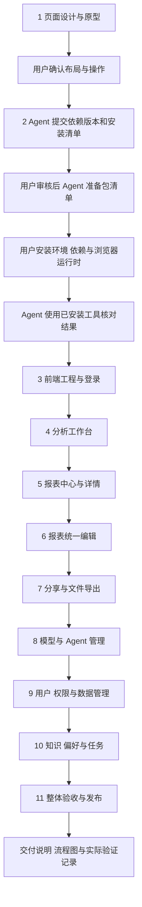

# 前端实施流程

2026-09-28 画布参考补充：用户指定截图作为第 6 步画布参考，清单已调整为铺满工作区的点阵画布、悬浮工具栏、带端口的节点、落点关联菜单及底部 AI 输入面板；目录和属性按需展开，继续支持现有亮暗模式及四套配色。原图已保存到[画布参考](前端第6步参考/画布参考.png)，整体实施仍按[第 6 步清单](前端第6步实施清单.md)审核。

2026-09-28 第 6 步准备：已保存[新建与统一编辑报表实施清单](前端第6步实施清单.md)，涵盖参数／查询表单、查询画布、展示与版本保存、AI 修改及真实业务验收；提出普通用户可用数据源接口和免费的 `@vue-flow/core@1.48.2` 依赖。当前待用户审核，业务代码与依赖声明尚未修改；批准后先准备声明，由用户安装。第 5 步完成状态保持有效。

2026-09-28 最新进度：**前端第 5 步报表中心与详情已完成实施和验收，下一步为第 6 步新建与编辑报表。** 第 4 步业务验收和上下文按需加载、自动压缩修复均已完成。第 5 步使用正式 API 和现有依赖，主代理单独实施；Web 85 项、报表 API 33 项、报表合同 7 项、工程规则 42 项、原有 Chromium 18 项及报表构建产物 8 项通过。正式库当前报表列表为空，真实登录、入口及错误处理已验证；交付及流程图见[第 5 步交付说明](前端第5步交付说明.md)。下面保留此前阶段记录。

日期：2026-09-27。本文保存前端的 11 步实施顺序、环境安装分工、依赖准备、命令使用前提和各步验收要求。

本轮用户要求补充独立的环境安装步骤，由用户执行安装，Agent 提供依赖与命令，并将整个流程落文件。当前完成流程整理；各步功能实施仍按具体清单审核后执行。

当前安排补充：用户随后要求先在另一个数据库创建至少 10 张业务表，继续第 4 步最后验收，并先讨论表数量与目标库；追加要求覆盖住院和费用。建议在当前 SQL Server 新建 `ai_bi_demo`，准备 24 张基础、门诊、住院及费用表，约 48 万行合成数据，详见[造数与验收讨论稿](前端第4步业务造数与验收讨论稿.md)。方案待确认；第 5 步清单暂放，尚未开始编码。下面的完成项保持原验证范围。

已完成进度（2026-09-27）：**第 4 步开发、自动化验收及正式模型对话已完成；当前准备独立业务库方案，真实业务查询验收待执行。** 用户安装四个 Web 专用渲染依赖后，主代理完成会话、提问澄清、认证 SSE 与恢复、Markdown／代码／流程图、分页虚拟表格、图表和依据展示。66 项 Web 测试、17 项 Chromium 场景、2 项生产产物场景，以及相关 API／合同、工程规则、类型、lint、格式和 Web 构建通过。正式 Web/API/DAS、SQL 账号登录、rj 模型及默认 Agent 发布、浏览器工具调用、SSE、刷新恢复和同会话追问已通过；业务数据源当前为空，真实业务 SQL、表格和证据联调将在造数方案获准并接入后执行，详见[正式联调记录](开发启动命令交付说明.md#11-模型发布与真实浏览器对话通过)。管理页面尚未实施，模型与 Agent 管理原排第 8 步，用户、权限和数据管理原排第 9 步。[第 5 步报表中心与详情清单](前端第5步实施清单.md)已落文件，按用户最新安排暂放。结果与验证边界见[第 4 步交付说明](前端第4步交付说明.md)。

## 1. 接手入口与当前状态

- 项目根目录：`D:/porject_new_2026/ai-data`。
- Node/pnpm 工作区：`D:/porject_new_2026/ai-data/ai-data`。
- 前端应用位置：`ai-data/apps/web`，包名为 `@ai-data/web`。
- 当前 `apps` 下已有 `api`、`data-access`、`web`；Web 应用入口与运行脚本已完成，根 `dev:web` 可启动正式应用，业务模块按后续步骤接入。
- 技术基线为 Vue 3、Vite、TypeScript，按 feature 组织页面、组件、请求、交互与领域逻辑。
- 页面与业务规则以[前端 Agent 交接文档](前端Agent交接文档.md)为依据，字段与行为结合当前路由、共享合同及测试核对。
- 继续遵守[项目入口](../AGENTS.md)、[开发规范](../需求文档/development-standards.md)和[依赖清单](../需求文档/dependencies.md)。

本流程使用“前端第 N 步”编号，与后端已有第 7、8、9、10 步记录分别引用。原前端交接中的 A—F 是阶段划分，下面 11 步是执行粒度：A 对应第 1 步，B 对应第 2—3 步，C 对应第 4 步，D 对应第 5—7 步，E 对应第 8—10 步，F 对应第 11 步。

## 2. 实施分工

| 工作                         | 负责人               | 执行要求                                                       |
| ---------------------------- | -------------------- | -------------------------------------------------------------- |
| 每步实施清单                 | Agent                | 写明目的、影响范围、文件增删改、依赖和验证方式，交用户审核     |
| 页面方向与实施范围确认       | 用户                 | 确认后开始对应范围的工作                                       |
| 依赖选型与安装准备           | Agent                | 核对现有版本、兼容关系、安装位置及命令；获准后准备对应清单文件 |
| 环境、依赖及浏览器运行时安装 | 用户                 | 安装、升级、卸载和需要下载运行时的命令均由用户执行             |
| 工程实现与验证               | Agent                | 使用已安装工具完成获准范围，按实际结果记录通过和未验收项       |
| 后续新增依赖                 | Agent 提出，用户执行 | 在需要使用的步骤补充依赖和命令，沿用相同分工                   |
| 交付记录                     | Agent                | 每步保存交付说明、流程图、实际验证结果，并追加交接入口         |

当前按主代理单独执行安排。需要子代理时，先说明数量、分工和范围，再取得用户明确批准。

2026-09-27 用户明确指定本次 Chromium 由 Agent 安装；该下载与启动验收已完成。工作区依赖重装继续由用户执行。

## 3. 十一步实施顺序

| 步骤                        | 工作内容                                                                                        | 主要交付与验收点                                                                                                    |
| --------------------------- | ----------------------------------------------------------------------------------------------- | ------------------------------------------------------------------------------------------------------------------- |
| **1. 页面设计与原型**       | 页面地图、菜单层级、视觉规范；分析工作台、报表详情、模型与 Agent 管理三个核心可交互稿           | 用符合合同的虚构数据展示关键操作和状态；检查桌面、窄屏、长文本与键盘操作；用户确认布局、交互与视觉方向              |
| **2. 环境准备与依赖安装**   | 核对 Node/pnpm、确定首批依赖版本和安装位置；准备 Web 包依赖声明；用户安装依赖及所需浏览器运行时 | 保存依赖清单、完整命令、安装输出和版本结果；Web 工作区包及本地 CLI 可解析；安装完成后进入工程实现                   |
| **3. 前端工程与登录**       | Vue 入口、路由、公共组件、请求层、登录刷新、退出、权限入口、开发代理和错误状态                  | 登录、并发刷新、过期处理、退出、身份切换和深层链接可用；原身份的 SSE 与结果缓存得到清理                             |
| **4. 分析工作台**           | 会话、Agent 选择、消息、澄清、SSE、取消、恢复、表格图表、查询条件与证据                         | 跑通提问、澄清、结果和追问；覆盖事件去重、刷新恢复、空结果、失败、取消竞态与账号隔离；真实模型专项单独记录          |
| **5. 报表中心与详情**       | 报表列表、参数、执行、表格图表、分析说明、定义与结果历史                                        | 当前定义、实际参数、执行 ID 和快照版本准确对应；保存定义后由用户显式运行；旧结果保留原条件与说明                    |
| **6. 报表统一编辑**         | 参数与查询表单、画布、对话编辑；查询关系、展示配置与布局保存                                    | 三个入口编辑同一份定义；切换保留编辑内容；处理参数引用、关系方向和版本冲突；AI 修改按成功运行提交                   |
| **7. 分享与文件导出**       | 分享对象选择与授权；Excel、Word、PDF 生成和下载状态；补充获准的分享对象查询接口                 | 导出绑定所选执行或快照；Excel 覆盖全部可导出行；Word 文字表格可编辑；PDF 中文和分页可读；导出前后业务查询次数不增加 |
| **8. 模型与 Agent 管理**    | 模型配置、Agent 配置、工具和 Skill 选择、版本发布、启停                                         | 新会话使用选定配置；旧会话保持绑定版本；凭据展示和新版本提交符合实际接口；配置失败可处理                            |
| **9. 用户、权限与数据管理** | 用户、角色与部门选项、对象/列/行权限、DAS、目录、业务配置和关系发布                             | 按管理权限完成流程；策略与配置版本正确；角色模拟与数据执行准确区分；所需后端缺口经清单审核并验收                    |
| **10. 知识、偏好与任务**    | 企业知识候选审核发布、组织模板、个人偏好、后台任务与重试                                        | 审核绑定固定内容版本；一般偏好直接保存，冲突和恢复自动应用遵循确认规则；相对时间按使用日期解析；任务重试遵循状态    |
| **11. 整体验收与发布**      | 多角色完整流程、异常恢复、大表、窄屏、文件检查、质量检查、构建和部署                            | 记录实际通过项与待验证环境；静态站点、代理、Cookie、SSE 和刷新路由可用；保存最终交付说明及流程图                    |

里程碑：第 4 步交付浏览器分析主流程；第 7 步交付报表编辑、运行、分享和文件交付流程；第 11 步完成整体交付。第 4 步联调所需账号、模型和 Agent 可通过既有管理接口准备，第 8 步提供完整管理页面。

## 4. 第 2 步：环境与依赖准备

### 4.1 当前核对结果

以下是 2026-09-27 的本机只读核对结果，后续安装前再次确认实际环境。

| 项目         | 项目要求或声明                     | 本次观察                                        | 处理方式                                              |
| ------------ | ---------------------------------- | ----------------------------------------------- | ----------------------------------------------------- |
| Node.js      | `>=24.19.0 <25`                    | `v24.19.0`                                      | 满足当前项目要求，沿用                                |
| pnpm         | `packageManager: pnpm@11.22.0`     | 项目外层目录执行 `pnpm --version` 返回 `12.4.1` | 安装阶段使用明确指定的 `11.22.0` 命令，并确认实际输出 |
| Web 工作区包 | `@ai-data/web`                     | 包清单、安装版本与正式 Vue TSC 命令验收通过     | 进入第 3 步工程与登录清单审核                         |
| TypeScript   | Web 为 `6.0.3`，catalog 为 `7.0.2` | Web 与其他包均按各自声明实装                    | Vue SFC 类型检查随第 3 步工程实施验收                 |
| ESLint       | catalog 为 `^10.9.0`               | 工作区已有配置与 CLI                            | 核对 Vue 插件和解析器的兼容性后接入                   |
| Vitest       | catalog 为 `^4.1.11`               | 后端包已有 CLI                                  | 核对 Web 测试环境后复用                               |
| Vite         | 锁文件已有 `8.2.2` 的间接依赖      | 后端测试工具链可见                              | Web 正式使用时声明直接依赖，并与 Vue 插件一起核对版本 |

`catalog` 仅维护多个工作区包共用的依赖，单包专用依赖直接在所属 `package.json` 声明版本。声明版本与锁文件中的实际解析版本分别记录。新增 Vue 工具链若与现有 TypeScript、ESLint 或 Vite 不兼容，先报告具体问题和调整清单，按审核结果处理。

### 4.2 首批依赖清单

以下包来自前端技术基线及其质量检查需要。版本已按[第 2 步实施清单](前端第2步实施清单.md)声明，实际安装与工具启动验收通过；正式应用接入在第 3 步进行。

| 类别           | 依赖                                                      | 用途与安装位置                                   | 版本依据                                                    |
| -------------- | --------------------------------------------------------- | ------------------------------------------------ | ----------------------------------------------------------- |
| 页面与导航     | `vue`、`vue-router`                                       | Web 运行依赖                                     | `3.5.43`、`4.6.4`                                           |
| 状态与请求缓存 | `pinia`、`@tanstack/vue-query`                            | Web 运行依赖；分别管理 UI 状态和服务端读取状态   | `3.0.4`、`5.104.0`                                          |
| 基础组件       | `element-plus`                                            | Web 运行依赖，统一主题与表格控件                 | `2.14.6`                                                    |
| 图表与图标     | `echarts`、`vue-echarts`、`lucide-vue-next`               | Web 运行依赖                                     | `6.1.0`、`8.3.0`、`1.0.0`                                   |
| 共享合同       | `@ai-data/contracts`                                      | Web 运行依赖，使用公共出口                       | `workspace:*`                                               |
| 校验与时间     | `zod`、`dayjs`                                            | Web 直接使用时声明依赖，复用 workspace catalog   | 当前 catalog 为 `4.4.3`、`^1.11.23`                         |
| 开发构建       | `vite`、`@vitejs/plugin-vue`、`@vue/compiler-sfc`         | Web 开发依赖                                     | `8.2.2`、`6.0.9`、`3.5.43`                                  |
| 类型检查       | `typescript`、`vue-tsc`、`@types/node`                    | Web 开发依赖；Node 类型用于构建及测试配置        | TypeScript `6.0.3`，Vue TSC `3.3.11`；Node 类型复用 catalog |
| 静态检查       | `eslint`、`eslint-plugin-vue`、`vue-eslint-parser`        | ESLint 在 Web 声明；Vue 插件与解析器由根包声明   | 复用 ESLint，新增 `10.11.1`、`10.4.1`                       |
| 格式化         | `prettier`                                                | 复用工作区配置及版本，Web 提供对应检查入口       | 当前 catalog 为 `^3.9.6`                                    |
| 业务与组件测试 | `vitest`、`@vue/test-utils`、`@vue/compiler-dom`、`jsdom` | Web 开发依赖                                     | 复用 Vitest，新增 `2.5.1`、`3.5.43`、`30.1.1`               |
| 浏览器测试     | `@playwright/test`                                        | Web 开发依赖，落实已规划的 Playwright 端到端验收 | `1.63.0`；本次 Chromium 已授权 Agent 安装并验证             |

Vue 的单文件组件类型检查采用 `vue-tsc`，用途见 [Vue 官方 TypeScript 说明](https://vuejs.org/guide/typescript/overview.html)。浏览器测试采用 Playwright Test 的包和运行时分工，见 [Playwright 官方安装说明](https://playwright.dev/docs/intro)。

### 4.3 按功能补充的依赖

| 引入时机  | 需要确定的能力                          | 审核依据                                                 |
| --------- | --------------------------------------- | -------------------------------------------------------- |
| 第 1—2 步 | UI 组件库：已选定 Element Plus          | 已完成版本声明；安装与后续页面接入按第 2—3 步验收        |
| 第 4 步前 | Markdown 渲染、内容净化、大表虚拟渲染   | 受控内容展示、当前结果规模及已选组件库的覆盖能力         |
| 第 6 步前 | 查询画布                                | 节点、端口、关系方向、坐标恢复和实际报表定义合同         |
| 第 7 步前 | Excel、Word、PDF 文件生成及中文字体资源 | 完整结果、可编辑文字表格、中文排版、分页与浏览器生成要求 |

每次补充均列出包名、精确版本、用途、文件影响和用户执行命令，按对应步骤审核。前端通过 API 访问数据，数据库连接和 DAS 内部认证由已有后端承担。

### 4.4 安装前的文件准备

第 2 步按以下顺序完成，保证安装命令有可用的项目清单：

1. Agent 核对依赖的版本与兼容范围，提交安装实施清单。
2. 用户审核后，Agent 准备 `ai-data/apps/web/package.json`：专用包直接声明版本，共用包引用 catalog。检查依赖安装脚本后按精确版本配置许可。现有 `apps/*` 已覆盖 Web 包。
3. Agent 向用户提供本次确定的包名、版本、安装命令和预期结果。
4. 用户执行包管理器及依赖安装，生成或更新 `ai-data/pnpm-lock.yaml` 和本地依赖目录。
5. 用户执行所需浏览器运行时安装，Agent 使用已安装 CLI 核对结果。
6. 第 3 步实现应用入口、Vue 配置、页面和登录流程。

Web 包清单已准备完成，可以执行下列安装命令。Agent 随后使用已安装的 CLI 验证，避免验证过程自行下载或整理依赖。

### 4.5 交给用户的 PowerShell 命令

**A. 环境版本核对。** 工作目录为内层 pnpm 工作区，同时核对 Node 和 npm 是否可用；固定版本的 pnpm 通过下一组命令准备。

```powershell
Set-Location -LiteralPath 'D:\porject_new_2026\ai-data\ai-data'
node --version
npm --version
```

**B. 获取并调用项目声明的 pnpm 版本。** 由用户执行，首次运行可能将 `pnpm@11.22.0` 下载到 npm 缓存；预期输出 `11.22.0`。这种方式按命令选择版本，保留现有全局 pnpm。命令形式和缓存行为见 [npm exec 官方说明](https://docs.npmjs.com/cli/v11/commands/npm-exec/)。

```powershell
Set-Location -LiteralPath 'D:\porject_new_2026\ai-data\ai-data'
npm exec --yes --package=pnpm@11.22.0 -- pnpm --version
```

**C. 首次安装已审核的 Web 依赖。** 执行前，第 2 步的包清单和 catalog 已准备并确认；此命令安装工作区依赖，并允许为新增包更新锁文件。安装命令影响整个工作区依赖解析，完成后核对 API/DAS 的既有版本变化是否在批准范围内。

```powershell
Set-Location -LiteralPath 'D:\porject_new_2026\ai-data\ai-data'
if (-not (Test-Path -LiteralPath '.\apps\web\package.json')) {
    throw '请先完成前端第 2 步的 Web 包清单准备与审核。'
}
npm exec --yes --package=pnpm@11.22.0 -- pnpm install --no-frozen-lockfile
if ($LASTEXITCODE -ne 0) { throw '依赖安装失败，请保留报错。' }

npm exec --yes --package=pnpm@11.22.0 -- pnpm --filter @ai-data/web rebuild vue-demi
if ($LASTEXITCODE -ne 0) { throw 'vue-demi rebuild 失败，请保留报错。' }
```

**D. 安装浏览器测试运行时。** 在已审核的 `@playwright/test` 完成安装后，由用户下载 Chromium；后续如需其他浏览器，在对应验收清单中追加。Playwright 的包安装和浏览器下载是分别执行的步骤，见 [官方安装说明](https://playwright.dev/docs/intro)。

本次用户已明确授权 Agent 执行以下命令，安装与启动验收通过。

```powershell
Set-Location -LiteralPath 'D:\porject_new_2026\ai-data\ai-data'
& '.\apps\web\node_modules\.bin\playwright.cmd' install chromium
```

**E. 后续按已有锁文件复现环境。** 适用于依赖声明与锁文件一致的后续安装；新增依赖进入已审核清单时使用 C，安装后重新核对锁文件。`--frozen-lockfile` 的行为见 [pnpm 官方安装说明](https://pnpm.io/cli/install)。

```powershell
Set-Location -LiteralPath 'D:\porject_new_2026\ai-data\ai-data'
npm exec --yes --package=pnpm@11.22.0 -- pnpm install --frozen-lockfile
```

### 4.6 安装验收

- 记录用户实际执行的命令、工作目录、Node 与 pnpm 版本、安装结果及需要处理的提示。
- 核对 `apps/web/package.json`、catalog、锁文件和实际解析版本是否一致。
- 使用 Web 本地 CLI 读取 Vite、Vue 类型检查、ESLint、Vitest、Playwright 的版本，确认命令可执行。
- 浏览器下载完成后验证可启动；第 3 步再验收真实应用启动、类型检查和构建。
- 依赖冲突按实际错误处理；需要调整现有版本时先说明受影响包及验证范围。

## 5. 各步必须遵守的业务约束

| 所在步骤  | 实施约束                                                                                                                      |
| --------- | ----------------------------------------------------------------------------------------------------------------------------- |
| 第 3 步   | 当前 API 原始路径没有 `/api` 前缀；开发及生产代理方案要同时考虑刷新 Cookie 的 `Path=/auth`、生产 `Secure`、SSE 流式传输及超时 |
| 第 4 步   | SSE 携带认证与 `Last-Event-ID`；按运行和序号去重；恢复内容与游标保持一致；发送和澄清使用稳定幂等键                            |
| 第 4—7 步 | 区分 SSE 样本、已保存结果和浏览器已有完整结果；分页与虚拟窗口共用行数据；完整性、实际返回行数和可导出范围准确                 |
| 第 5—7 步 | 定义版本、执行 ID 与快照版本分别管理；保存提交 `expected_version`；冲突时保留本地编辑；分享和导出服从当前授权                 |
| 第 6 步   | 表单、画布和对话共用 `ReportDefinition`；画布坐标与可执行查询分别保存；普通用户可见数据源入口须在画布接入前明确               |
| 第 7 步   | 普通作者的分享对象选择需要获准的组织成员查询方式；文件生成使用已有结果或授权导出内容                                          |
| 第 8 步   | 发布模型版本提供该版本要求的完整认证配置；凭据公开状态不能作为真实密钥提交；旧会话继续使用绑定版本                            |
| 第 9 步   | 角色、部门、例外范围选项及完整配置读取等缺口逐项审核；健康 DAS 列表按实际接口覆盖范围展示                                     |
| 第 10 步  | 企业知识和模板经过固定版本审核；个人一般偏好直接保存，冲突及恢复自动应用按用户规则确认                                        |
| 第 11 步  | 前端、确定性接口和真实模型分别记录验收结果；构建与发布前阅读 [BUILD](BUILD.md)，部署涉及的系统软件仍由用户安装                |

具体接入缺口和页面状态清单继续参照[前端 Agent 交接文档](前端Agent交接文档.md)。发现新增后端需求时，写明页面操作、已有接口、缺失行为、建议补充与受影响步骤，再交用户审核。

## 6. 流程图



每步实施前提交清单，批准后完成该步并保存交付。后续步骤需要补充依赖时，重复“Agent 提交依赖和命令 → 用户安装 → Agent 验证”的分工。

## 7. 文件与交付管理

- 当前总流程保存在本文件，后续状态与步骤调整在此维护。
- 每步具体清单使用 `任务交接/前端第N步实施清单.md`；每步完成后使用 `任务交接/前端第N步交付说明.md`，保存主要改动、流程图、验证命令、结果及未完成项。
- 页面设计及原型的具体文件在第 1 步清单中确定，正式应用代码位于 `ai-data/apps/web`。
- 新交付在任务交接 README 追加入口，保留原有内容。
- ai-book 的使用、开发及部署说明按用户明确要求的文档更新范围编写。

## 8. 本轮交付与验证记录

本轮新增本文件，在任务交接 README 和前端 Agent 交接文档中追加入口，保存 11 步计划、安装分工、依赖准备和条件明确的命令。前端业务实现尚未开始。

已完成本机版本及工作区只读核对：Node `v24.19.0`，外层目录 pnpm `12.4.1`；项目声明 pnpm `11.22.0`；`apps/web` 尚未建立。依赖安装、浏览器下载和新增工具链兼容性验收属于第 2 步待执行工作。

本轮验证结果：

- 使用已安装的 Prettier CLI 检查本文件、任务交接 README 和前端 Agent 交接文档，三份文件格式检查通过。
- 检查三份文件中的 78 处本地引用，目标均存在。
- 对照本轮开始时的 Git 内容，确认原有两份交接文档的正文完整保留，仅追加入口。
- `git diff --check` 通过。本轮范围为流程文档，前端功能、依赖安装和浏览器运行时验收按各步另行记录。

## 9. 前端第 1 步进度（2026-09-27）

用户回复“来开始”后，已完成[第 1 步实施清单](前端第1步实施清单.md)中的页面地图、[页面设计方案](前端页面设计方案.md)及三个核心可交互原型。交付与流程图见[第 1 步交付说明](前端第1步交付说明.md)，浏览器操作和截图见[检查记录](前端原型/qa/检查记录.md)。

原型与本轮检查已完成。用户随后认可当前风格，回复“element plus 吧”确认 UI 库，并回复“来吧”批准第 2 步的[具体清单](前端第2步实施清单.md)。第 2 步安装、编译器兼容性和浏览器验收现已通过，记录见[交付说明](前端第2步交付说明.md)。

## 10. 第 3 步清单（2026-09-27）

用户要求验收后提交下一步清单。已按现有代码整理[第 3 步工程与登录清单](前端第3步实施清单.md)，覆盖工程与主题、认证生命周期、权限导航、同源代理、API 测试辅助入口和行为验收。主代理单独实施，计划依赖操作为 0。用户已批准原清单，并追加主题切换需求；模式、配色及保存方式的建议见该清单第 8 节，待讨论定稿。

## 11. 第 4 步业务验收与第 5 步接续（2026-09-27）

用户已批准 24 表独立业务库造数，并要求第 4 步成功后直接实施第 5 步。业务库及接入完成，23 项 SQL/API 基准、住院真实模型与浏览器通过；门诊、费用和指标发布仍待修复及复验。当前模型端口拒绝连接，事务目录后端缺陷的额外改动范围待审核。

接续依据：[业务验收阶段记录](前端第4步业务造数与验收/阶段记录.md)、[事务目录修复清单](前端第4步事务目录修复清单.md)、[已批准的第 5 步实施清单](前端第5步实施清单.md)。

### 模型恢复后的复验更新

事务目录修复与指标发布现已完成；23 项正式 SQL/API、82 项相关普通测试、7 项 SQL 集成通过。门诊、住院真实模型及浏览器验收通过。费用 v2 的分类和总计、模型实际查询证据均与 SQL 一致，但模型最终答复流中断，因此第 4 步整体仍待收尾。

第 5 步业务页面保持原前置条件，测试准备保存于交接目录。可选择先推进第 5 步并保留费用待验收，或先适配 32k／恢复模型后继续原顺序；具体范围及确认依据见[接续清单](费用模型复验与第5步接续清单.md)。

## 12. 第 6 步当前进度（2026-09-28）

第 4 步及上下文修复、第 5 步已按后续交接记录通过。用户批准第 6 步并安装 Vue Flow 后，统一表单、查询画布、光流、版本保存和同页 AI 修改已完成，正式三份报表、六项 SQL 对账及 rj 修改通过。

用户随后回复“可以”批准[只读绑定接口补项](前端第6步AI修改恢复补充清单.md)。接口和前端刷新恢复已完成，覆盖澄清、停止、失败、成功、读取重试及权限核对；34 项生产浏览器回归和正式 rj 历史任务恢复通过，**第 6 步整体完成**。页面、报表链接、交付范围及流程图见[第 6 步交付说明](前端第6步交付说明.md)，测试明细见[验收记录](前端第6步验收/验收记录.md)。下一步为第 7 步“分享与文件导出”，实施前先提交具体清单。

## 13. 第 7 步清单（2026-09-28）

已按用户要求保存[第 7 步实施清单](前端第7步实施清单.md)，覆盖成员分享与撤回、固定来源导出、Excel 完整结果、Word 可编辑内容、PDF 中文分页，以及权限和文件验收。分享设置和候选成员读取、相关路由的授权与缓存调整作为明确后端补项一并审核。

候选包和固定字体的版本、免费许可、来源及哈希见[依赖核对记录](前端第7步依赖核对.json)。审核后先准备 Web 专用依赖声明，再由用户安装和下载字体；兼容性验证通过后实施功能。当前第 6 步已完成，第 7 步清单待审核，业务实施尚未开始。

### 第 7 步获准与依赖准备更新

用户回复“开始吧”后，Web 六项精确依赖声明及固定字体来源说明已准备。当前进入用户安装依赖和下载字体阶段，命令与执行流程见[第 7 步交付说明](前端第7步交付说明.md)。安装完成后核对版本、资源及浏览器 Worker／中文文件兼容性，通过后继续已批准的功能与验收。第 7 步整体进行中。

### 第 7 步安装核对更新

用户完成包安装后，六项实际依赖、Web 类型和生产构建通过；独立 Chromium Worker 的 Excel、Word 及英文 PDF 样例生成与内容回读通过。中文字体及许可证仍待下载，中文 PDF 验证为当前接续项。样例、脚本与实际结果已保存至[第 7 步交付说明](前端第7步交付说明.md)所列验收文件，业务功能在该前置验证完成后接续。

### 本机字体验证更新

用户明确选择本机免费 Noto 后，字体副本和 OFL 已准备。实际 Worker 的可变字重加载失败，已保存[字体兼容调整清单](前端第7步字体兼容调整清单.md)，建议采用原计划的静态 Noto 常规／粗体并重新验证中文。当前等待资源准备分工确认，库版本及业务范围保持原批准清单。


### 第 7 步完成（2026-09-28）

按用户后续授权下载原计划静态 Noto 字体，中文 PDF 常规／粗体兼容性通过。作者分享、固定来源导出、Excel 全量表、Word 可编辑文档、PDF 中文分页及权限和任务清理均已完成。正式三份报表和已有会话只读导出、Word 实机、十万行容量与浏览器验收通过。依赖由用户安装，Agent 安装操作为 0。

当前第 1—7 步已按各自交付记录完成。下一步为第 8 步管理页面；功能范围先整理为实施清单，按协作规则审核后执行。完整文件、流程图、检查和边界见[第 7 步交付说明](前端第7步交付说明.md)。


## 14. 第 8 步清单（2026-09-30）

第 7 步已完成。用户要求提交下一步清单，现已保存[第 8 步模型与 Agent 管理实施清单](前端第8步实施清单.md)，按管理页面装配、模型、Agent、工具与 Skill、版本及权限恢复、验收交付六项推进。

模型每个版本显式提交完整认证；Agent 绑定固定模型和资源，启停作用于当前资源状态。现有管理接口的身份刷新和禁止缓存作为明确补项随清单审核。主代理单独实施，无新增依赖；当前清单待审核。


## 15. 第 8、9 步联合执行清单（2026-09-30）

用户要求第 8、9 步一起安排，现以[联合实施清单](前端第8-9步联合实施清单.md)作为当前审核入口，原编号保留用于追踪。模型与 Agent、用户及授权资料、DAS 与数据源、业务目录与关系、对象／列／行权限共同实施并联合验收；具体顺序为合同及接口补项 → 模型 → Agent → 用户 → 数据接入 → 业务目录与关系 → 数据权限 → 联调交付。

现有读取与保存流程的 A—H 后端补项、文件范围、依赖及验收均已明确。主代理单独执行，计划依赖操作、表结构修改与迁移均为 0。当前为清单待审核阶段，业务实施尚未开始；完成本轮后继续第 10 步知识、偏好与后台任务。


### 第 8、9 步联合完成（2026-09-30）

用户批准联合清单及整数部门兼容补项后，五个管理页、相关 API/DAS 管理合同与保存流程已完成。类型、lint、构建和各包回归通过；20 项隔离 SQL、8 项生产预览浏览器场景及真实 rj 三轮验证通过。两个部门的住院／费用查询、行范围、隐藏字段和关系查询均与 SQL 基准一致，验收临时环境已清理。

本机数据库自动发现受自签名证书限制，手填库名后的接入和查询通过。功能范围、全部验证结果及流程图见[第 8—9 步交付说明](前端第8-9步交付说明.md)。当前第 1—9 步已按各自交付记录完成，下一步为第 10 步知识、偏好与后台任务，具体实施范围另行提交清单。


## 2026-10-03 第 9 步 SQL Server 业务连接参数补项完成

用户回复“干”批准 Web 管理清单。数据库凭据表单已支持加密连接与证书信任，已有凭据可单独修改选项并保留密码；保存后数据库发现、对象发现与业务查询采用同一设置，DAS 元数据库连接仍由独立启动配置控制。并发修订、旧配置兼容、连接缓存更新及失败回读均已接入。

真实 Web 开启信任后发现目标库成功，取得 24 个对象；DAS 重启后住院查询 4,000 人次与 SQL 基准一致。类型、lint、包级回归、隔离 SQL、浏览器及 Web 构建通过，临时环境已清理。交付、流程图和具体检查记录见[连接参数交付说明](前端第9步SQLServer连接参数Web管理交付说明.md)。依赖操作和表结构变更均为 0；下一步仍为前端第 10 步。


## 2026-10-03 前端第 10 步清单待审核

用户要求继续准备下一步。已核对个人偏好、知识候选与审核、正式版本、组织模板及记忆任务的现有代码，保存[第 10 步实施清单](前端第10步实施清单.md)，按共享合同与页面、个人偏好、企业知识与候选、审核与正式知识、组织模板、后台任务、统一交互与权限、验收交付八项推进。

负责人选项、停用与待生效知识管理读取、固定模板预览、偏好删除后的版本基准及相关请求边界等 A—G 后端补项一并列入审核。沿用 Element Plus 和当前主题，主代理单独实施；预计依赖操作、表结构和迁移均为 0。文件范围、验证方式和流程图均在清单中。

本轮只完成清单及交接入口，尚未实施第 10 步业务代码。按根 AGENTS.md 先审核清单再执行；第 11 步整体验收与发布在本步完成后安排。


### 第 10 步完成（2026-10-03）

知识与偏好、知识审核、后台任务和组织模板已接入，A—G 合同与接口补项完成。单元、路由、隔离 SQL、生产预览和真实 rj 验证通过，部门住院基准 124 人次对账一致，停用后不再自动应用。具体流程、检查范围和结果见[交付说明](前端第10步交付说明.md)。下一步为第 11 步整体验收与发布；本轮依赖和表结构操作均为 0。
