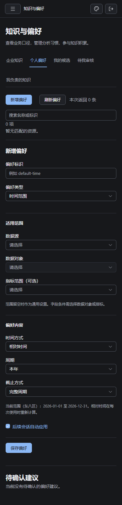
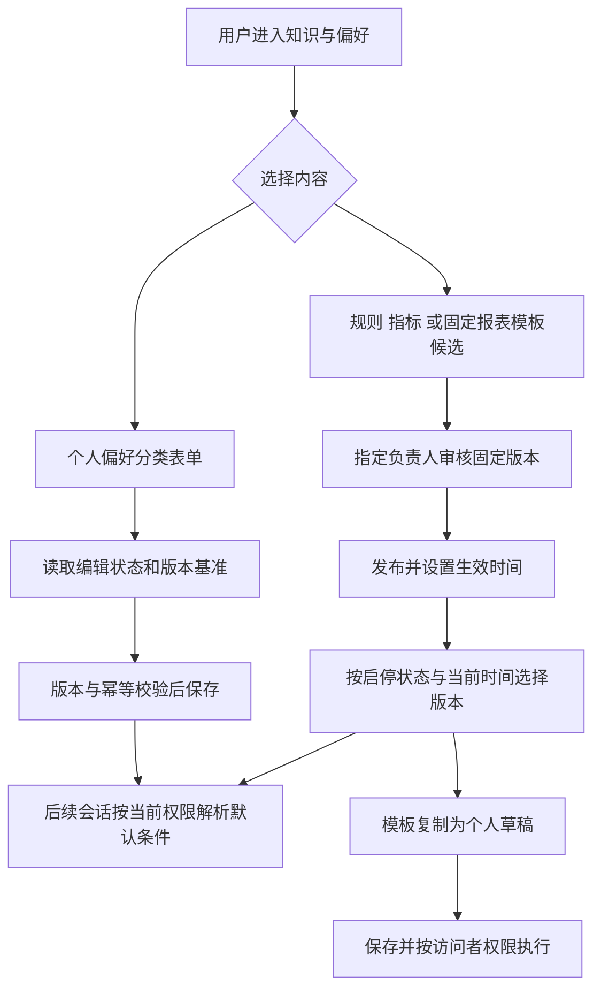
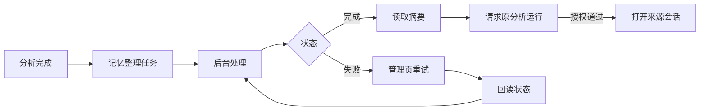

# 前端第 10 步交付：知识、偏好与后台任务

日期：2026-10-03。用户回复“开始”批准[实施清单](前端第10步实施清单.md)及 A—G 接口补项，已完成实施与本步验收。主代理单独完成，依赖操作、数据库结构变更和迁移均为 0。

## 交付内容

| 入口                  | 当前能力                                                                   |
| --------------------- | -------------------------------------------------------------------------- |
| `/knowledge`          | 企业正式知识、六类个人偏好、我的候选、待我审核和我负责的知识。             |
| `/settings/knowledge` | 组织候选、有效负责人搜索、固定版本审核、发布、停用、启用、历史版本和回滚。 |
| `/settings/tasks`     | 记忆整理任务摘要、状态筛选、有界刷新、失败重试和授权后的来源会话跳转。     |
| 报表详情              | 将选中的已保存定义版本提交为模板候选，绑定版本与 SHA-256 摘要。            |
| 企业知识与报表中心    | 发现已发布组织模板，复制定义到新的个人草稿，保存后显式运行。               |

页面沿用 Element Plus、系统字体、亮暗模式和四套配色。知识与偏好使用列表和详情布局；窄屏改为上下排列，表单保存区随正文滚动，避免遮住末尾控件。知识正文复用安全 Markdown；模板展示参数、查询及分区和块的结构预览。

### 个人偏好

支持指标、时间范围、筛选条件、分组、展示方式和查询习惯。字段及指标选项来自当前授权目录；条件保留数字、日期等合同类型。相对时间按东八区预览，保存“本年”等语义，使用时重新解析。

编辑绑定已读版本，首次保存读取编辑状态；删除后重新设置沿用删除记录的版本基准。同一操作的重试保留幂等键，版本冲突保留草稿并要求核对。待确认建议显示当前设置、建议和来源，可返回原会话完成澄清，或在偏好页显式修改。

### 知识与审核

规则和指标支持提交、修订、来源补充及撤回。指标复用报表查询编辑器，并在指标字段对与已批准关系之间转换，保留连接类型、过滤和聚合信息。无法对应当前关系时阻止保存并保留原内容。

管理员分配负责人；普通负责人可以从个人入口审核自己的分配事项。审核绑定候选版本，修改后进入新一轮审核。正式管理区同时显示启停状态、最新发布版本和当前生效版本；未来版本可管理，普通阅读及运行按生效时间选择版本。回滚创建新版本并保留历史。

### 模板与任务

模板预览先验证候选可见性，再核对固定定义摘要和完整查询权限。原报表的新版本不改变候选。模板复制仅建立当前用户的草稿；保存、执行继续使用当前权限。

任务列表选择最近 50／100／200 条，仅在页面可见且存在待处理任务时每 5 秒刷新。仅失败任务可重试，提交后回读状态；超时及冲突先核对结果。来源跳转先请求原分析运行接口，任务管理身份本身不授予私有会话访问权。

## 接口与文件范围

本轮新增读取入口：

- `GET /me/preferences/:key/edit-state`：当前账号的有效、已删除或未创建状态与版本基准。
- `GET /admin/knowledge`、`GET /admin/knowledge/:id`：经过内容授权的启停状态、最新及当前版本。
- `GET /admin/knowledge/owner-options`：同组织有效账号的有界搜索。
- `GET /knowledge-candidates/:id/template-definition`：授权后的固定模板定义。

公开管理 Schema 和推导类型归入 contracts；API 装配相应仓储及服务能力，相关知识、偏好、指标、模板与任务入口复核当前身份并设置 `Cache-Control: no-store`。Web 复用管理请求边界、草稿离页保护、换号清理及迟到响应隔离。

具体应用、共享合同和测试文件见[变更文件清单](前端第10步验收/变更文件.json)，共 55 个本轮涉及文件。说明和验收记录保存在任务交接目录。

## 验证结果

| 检查                   | 结果                                                                                         | 证据                                                                                                                 |
| ---------------------- | -------------------------------------------------------------------------------------------- | -------------------------------------------------------------------------------------------------------------------- |
| API 单元与路由         | 89 个测试文件，677 项通过                                                                    | [检查汇总](前端第10步验收/检查汇总.json)                                                                             |
| contracts              | 188 项通过                                                                                   | [日志](前端第10步验收/contracts-test.txt)                                                                            |
| Web 单元               | 155 项通过                                                                                   | [日志](前端第10步验收/web-test.txt)                                                                                  |
| 工程规则               | 42 项通过                                                                                    | [日志](前端第10步验收/engineering.txt)                                                                               |
| 隔离 SQL               | 知识、偏好、记忆任务 3 个文件，26 项通过                                                     | [命令与结果](前端第10步验收/检查汇总.json)                                                                           |
| 生产预览               | 本步及报表编辑、画布、报表中心共 29 个场景；28 项首轮通过，主题场景修正动画等待后复验通过    | [首轮](前端第10步验收/browser-preview.txt)、[主题复验](前端第10步验收/browser-themes.txt)                            |
| 类型、lint、格式、构建 | API/contracts/Web 类型通过；最终 lint 无问题；本轮 55 文件格式和 diff 检查通过；Web 构建通过 | [最终 lint](前端第10步验收/lint-final.txt)、[格式](前端第10步验收/format.json)、[构建](前端第10步验收/web-build.txt) |
| 真实 API/DAS/Web       | 模板固定版本、权限、持久化读取与执行对账通过                                                 | [真实验收](前端第10步验收/真实业务验收.json)、[界面复验](前端第10步验收/真实界面复验.json)                           |
| 真实 rj                | 同账号两个新会话使用本年偏好和正式规则；停用后的新会话停止自动应用                           | [三轮运行记录](前端第10步验收/真实业务验收.json)                                                                     |

真实业务验证使用当前源码启动 API/DAS，随机建立临时元数据库；业务库 `ai_bi_demo` 只读。普通部门账号本年住院统计的独立 SQL 基准为 **124 人次**；个人模板执行与两轮 rj 查询均得到 124。原报表修改到 v2 后，模板审核预览仍读取提交时的 v1。

模型服务能力接口返回 32,768 上下文窗口。首次在沙箱中运行因局域网访问 `EACCES` 中断；沙箱外按同一场景完成三轮验证，保留[网络限制记录](前端第10步验收/沙箱网络限制.json)。所有本次临时服务、数据库和临时目录已清理，验收结果标记 `cleaned_up: true`。

浏览器覆盖六类偏好、删除重建、离页草稿、冲突与撤权清理、指标编辑、普通负责人审核、模板提交与复制、任务重试及来源拒绝；外观检查覆盖亮暗四配色和 1440／1024／390px。修复了偏好表单底部遮挡；切换分类时在请求期间显示禁用状态。

## 执行流程图

## 后续安排

下一步是前端第 11 步“整体验收与发布”，按单独清单审核后执行。本轮 Web 构建仍有较大资源分包提示，资源包优化及整体发布验证归入第 11 步。本步未发现待修复的阻塞问题；验证环境为 Windows、本机 Chromium、SQL Server 演示业务库及现有 rj 服务。
