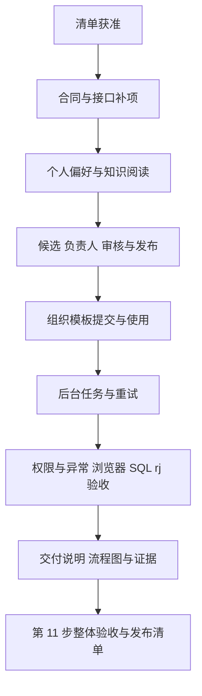
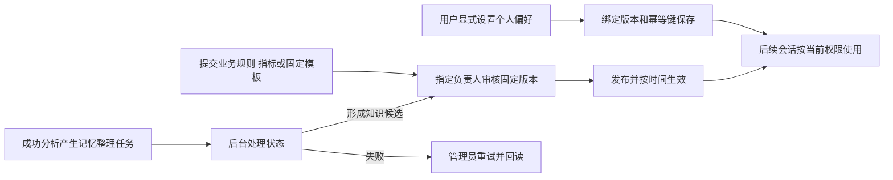

# 前端第 10 步实施清单：知识、偏好与后台任务

日期：2026-10-03。状态：**用户已回复“开始”批准本清单，实施与本步验收完成。** 第 1—9 步及 SQL Server 连接参数补项已按各自交付记录完成。

本清单属于[前端实施流程](前端实施流程.md)中的第 10 步。后端已有的[第 10 步交付](第10步交付说明.md)提供领域服务，本轮将其接入 Web，并补齐下文明确列出的接口。

## 1. 目标与界面

交付三个现有导航入口和报表模板操作，沿用 Element Plus、亮暗模式、四套配色、系统字体、管理页布局及已有 Markdown 渲染。

| 入口                           | 使用者                   | 页面内容                                                                     |
| ------------------------------ | ------------------------ | ---------------------------------------------------------------------------- |
| `/knowledge` 知识与偏好        | 登录用户                 | 企业知识、个人偏好、我的候选与待我审核；按当前身份展示可访问记录和操作。     |
| `/settings/knowledge` 知识审核 | 系统管理员、知识管理员   | 组织候选、负责人分配、审核记录、正式知识管理；审核与发布仍按负责人权限执行。 |
| `/settings/tasks` 后台任务     | 系统管理员、知识管理员   | 当前后端的记忆整理任务列表、状态、尝试次数、错误码与失败重试。               |
| 报表详情及新建报表入口         | 有对应权限的作者或使用者 | 将已保存定义的固定版本提交为组织模板候选；使用已发布模板新建个人报表。       |

页面采用顶部分类与筛选、左侧记录列表、右侧详情和操作；窄屏调整为上下结构。任务采用表格，窄屏优先显示任务标识、状态和操作。确认框用于删除、撤回、发布、停用、回滚等有明确影响的动作。

## 2. 当前实现核对

| 模块     | 已有能力                                                                                       | 接入时需要处理的事项                                                                   |
| -------- | ---------------------------------------------------------------------------------------------- | -------------------------------------------------------------------------------------- |
| Web      | 三个导航入口及权限配置；管理反馈、离页保护、换号清理、Markdown、报表编辑器                     | 三个入口当前仍使用 `module-page.vue` 占位。                                            |
| 个人偏好 | `/me/preferences` 列表、详情、保存、删除、自动应用；`/me/preferences/confirmations` 待确认列表 | 表单、版本与幂等处理、待确认事项展示和会话衔接。                                       |
| 知识候选 | 提交、修改、撤回、来源、负责人、固定版本审核、发布与审核历史                                   | 管理员当前缺少专用负责人选项；来源与审核记录等部分合同还在 API 内部。                  |
| 正式知识 | 生效版本读取、历史版本、启停、回滚                                                             | 普通列表仅返回启用且已生效内容，响应不含启停状态；管理页需要另行读取停用与待生效记录。 |
| 组织模板 | `report_template` 候选、定义版本摘要校验、`/report-templates` 已发布目录                       | Web 尚无提交和使用流程；审核者需要按候选权限读取固定模板定义。                         |
| 后台任务 | `/admin/memory-events` 与 `/:id/retry`                                                         | 当前只有记忆任务，列表默认 50、最多 200 条；返回状态摘要，不含私有意图正文。           |
| 请求边界 | 后台任务已经刷新身份；个人偏好、知识路由主要使用 `loadContext`                                 | 将本轮相关入口补齐当前身份复核、禁止缓存和严格输入校验。                               |

主要依据：`apps/api/src/routes/preference-routes.ts`、`knowledge-routes.ts`、`memory-event-routes.ts`，`preferences/preference-service.ts`、`knowledge/knowledge-service.ts`、`reports/report-template-service.ts`，以及 `packages/contracts/src/memory/`、`knowledge/`。

候选、正式知识及版本列表目前有最多 200 条的读取上限。本轮页面准确标注“本次返回记录”，筛选和计数基于实际返回内容；任务可选择 50／100／200 条，采用手动刷新和页面可见时的有界轮询。

## 3. 八项执行顺序

### 1）共享合同与页面接入

- 把三个占位入口接入按需加载的 feature 页面，复用现有请求层、认证恢复与管理组件。
- 普通用户在“知识与偏好”访问自己的候选；被分配为负责人但没有 `knowledge:manage` 的用户，通过“待我审核”处理分配给自己的记录。
- 管理员可分配负责人；普通知识管理员的管理身份不自动赋予其他负责人的审核与发布权限。前端动作与现有服务端规则对应。
- 将候选更新、回滚、来源记录、审核记录等 Web 所需结构提升为共享 Schema 与推导类型；API 保持原有输入和响应字段兼容。

### 2）个人偏好

- 展示类型、适用范围、当前值、自动应用、版本、更新时间、使用次数与来源。
- 支持六类既有结构：指标、时间范围、筛选条件、分组、展示方式、查询习惯。采用分类表单和已授权的数据源／对象／字段／指标选择器。
- 时间选择支持合同中的本年、本季、本月、去年、上月及固定日期；区分完整周期和截至今天，按东八区预览当前日期范围，保存相对语义。
- 普通手动保存、修改、开启或关闭自动应用是当前用户的明确指令，按现有规则直接提交；删除显示影响确认。
- 创建绑定预期不存在的版本，编辑绑定已读版本；同一次操作重试沿用幂等键，内容变化或重新建立版本基准后生成新键。
- 待确认事项展示原因、当前设置、拟变更内容及来源。正在等待澄清的事项跳转原会话，通过已有真实用户回答流程确认；其他事项可查看建议并进入个人设置显式修改。页面不另行改写分析运行的确认状态。
- 对于已删除后重新设置同一偏好的情况，读取当前账号该键的编辑状态和版本基准，再由用户显式保存；删除标记不作为偏好内容展示。列表未返回该键不能被当作服务端从未存在，保存继续校验预期版本。

### 3）企业知识与我的候选

- 企业知识展示当前可访问、已启用且已生效的业务规则、指标与组织模板，包含适用范围、版本、负责人和生效时间。
- 业务规则使用标题、正文和适用范围表单，正文使用现有安全 Markdown 预览。
- 我的候选支持提交、查看、修改、补充来源及撤回；来源从当前账号可访问的会话、运行和证据中选择，手动提交也可使用既有的无会话来源语义。
- 指标候选展示和编辑完整既有指标合同，包括查询、统计口径、去重和时间规则；复用报表查询编辑能力。服务端继续验证字段权限和指标定义。
- 修改已审核内容形成新的候选版本，并重新进入待审状态。已发布内容的修改通过新候选进入审核。
- 来源显示经过服务端授权的引用；会话和证据链接继续按原有访问权限读取，不因为知识可见就展开其他账号的私有会话正文。

### 4）审核与正式知识管理

- 按类型、状态、负责人筛选候选；详情展示固定候选版本、内容、来源和历史审核。
- 管理员从组织内有效账号选项分配负责人；负责人仍须具备相应业务数据访问权，选中账号本身不授予数据权限。
- 审核提交明确的通过／驳回和意见；发布绑定审核通过的候选版本，并显式设置东八区生效时间。
- 正式知识区区分“已启用／已停用”“当前生效版本／最新发布版本／待生效版本”，支持历史查看、启停和回滚。
- 回滚创建一个新的发布版本，保留原历史；预览来源版本和生效时间后提交。
- 内容版本冲突保留本地草稿，显示最新状态后由用户重新核对；保存或发布回执不确定时先读取候选或版本记录，不自动新增发布。

### 5）组织报表模板

- 报表详情增加“提交为组织模板”操作，绑定用户选中的**已保存定义版本**；通过 `stableStringify(definition)` 与 SHA-256 生成摘要，服务端重新校验。
- 模板候选走统一负责人、审核和发布流程。审核详情展示固定版本的参数、查询与版式预览；原报表后续编辑不替换候选内容。
- 企业知识／新建报表入口读取已发布模板，用户选择后复制定义到新的个人报表草稿；服务端保存与执行均复核访问者当前权限。
- 保存为个人报表后由用户显式运行，参数按新操作填写，不将作者的历史执行结果作为访问者的新结果。
- 模板停用、未来生效、源定义变化和权限收窄均按服务端目录及授权结果更新页面。

### 6）后台任务

- 展示 `pending / processing / done / failed` 对应的等待、处理中、完成、失败状态，以及尝试次数、创建／更新时间和稳定错误码。
- 只有 `failed` 可重试。提交后回读状态；若请求超时或返回冲突，先刷新再决定是否仍能重试，避免把已进入下一轮处理的任务重复派发。
- 轮询仅在页面可见且需要更新时运行，离页、退出、换号或权限失败时停止，清理旧身份记录。
- 当前任务合同提供的 `analysis_run_id` 用于定位关联记录；只有能通过原运行接口授权的用户才进入来源会话。
- 调度并发、租约、超时和最大尝试次数继续使用现有服务配置；本页负责观察与已有失败重试动作。

### 7）统一异常、权限与交互

- 补齐加载、空结果、读取失败、保存中、403、404、409、回执丢失及重试反馈。
- 切换记录、分页视图、页面和账号时处理未保存草稿；迟到响应不能恢复已清理的旧状态。
- 当前身份撤权后及时清空页面与选项；组织、账号和权限范围由服务端认证上下文确定。
- 对长正文、长标识、空来源、停用指标及已失效对象给出可定位的说明；表单保持键盘可操作、焦点可见。

### 8）业务验收与交付

- 先写 BDD 场景及预期失败测试，再按已批准范围实现和回归。
- 使用随机隔离 API/DAS 元数据库、独立运行目录和测试账号；`ai_bi_demo` 仅执行发现和只读对账。
- 跑通普通用户、指定负责人、知识管理员、系统管理员及其他组织账号的权限场景。
- 保存浏览器截图、SQL/API 结果、真实模型结果及清理记录，生成第 10 步交付说明和流程图。

## 4. 随本清单审核的后端补项

以下为拟实施内容，当前尚未编写。它们服务于上面的页面流程，纳入本轮明确审核范围。

| 编号 | 页面操作及现有缺口                                                         | 具体补充与权限边界                                                                                                                                                                                                                                               |
| ---- | -------------------------------------------------------------------------- | ---------------------------------------------------------------------------------------------------------------------------------------------------------------------------------------------------------------------------------------------------------------- |
| A    | Web 不能导入 API 内部的来源、审核、修改和回滚结构                          | 新增或整理 `packages/contracts/src/knowledge/knowledge-management.ts` 及类型文件；API 使用公共合同，内部持久化结构继续归 API。                                                                                                                                   |
| B    | 知识管理员未必有用户管理权限，负责人目前需要填写账号 ID                    | 增加 `GET /admin/knowledge/owner-options`，支持关键词及有界数量；仅系统／知识管理员可读，仅返回本组织有效账号的 ID、登录名、显示名称，不带用户管理详情。分配仍由原服务校验。                                                                                     |
| C    | 普通知识列表无法回读停用状态和待生效版本                                   | 增加 `GET /admin/knowledge`、`GET /admin/knowledge/:id` 管理读取；返回启停状态、最新版本及当前生效版本等明确字段。系统／知识管理员按管理范围读取，普通负责人仅读取自己负责的知识，并逐条复核内容、来源和数据权限。原 `/knowledge` 的生效过滤保持原语义。         |
| D    | 审核模板时仅有报表 ID、版本及摘要，原报表的私有权限未必允许直接打开        | 增加 `GET /knowledge-candidates/:id/template-definition`；先校验候选可见性、固定摘要与完整查询范围，再返回被审核的固定定义。该端点只提供此候选的定义预览。                                                                                                       |
| E    | 部分读取使用缓存身份，相关响应未统一禁止缓存                               | `preference-routes.ts`、`knowledge-routes.ts`，以及本轮使用的 `/report-templates`、指标目录入口补 `refreshContext`、`no-store` 和严格查询校验；任务重试补 `no-store`。业务权限规则继续由领域服务执行。                                                           |
| F    | 管理状态及模板预览需要装配新读取能力                                       | 更新知识仓储、服务、报表模板服务、`create-memory-services.ts`／`create-report-services.ts` 和 API 装配类型；仅使用现有知识头、版本、候选、用户和报表定义数据。                                                                                                   |
| G    | 删除后的偏好保留递增版本，但普通详情返回不存在，页面无法安全重新设置同一键 | 增加 `GET /me/preferences/:key/edit-state`，只读取当前组织、当前账号；返回未创建／有效／已删除状态及版本基准，有效记录按现有规则复核内容与来源权限，删除记录只返回最小状态。用户显式保存仍走原接口、预期版本和幂等校验；旧确认和后台任务不能据此恢复已删除偏好。 |

新增管理读取返回类型与响应结构先进入共享合同，再接 API 和 Web。历史知识版本中的敏感内容仍逐条授权，管理列表不会通过状态摘要泄漏不可访问内容。

本轮不新增表或迁移。若实施发现现有结构无法支持上述范围，先提供具体兼容性问题及调整清单，再按项目规则确认。

## 5. 文件增删改范围

以下路径相对 `ai-data/`；组件可按职责继续拆分到所列 feature 目录。

| 类型           | 文件或目录                                                                                                                      | 用途                                                    |
| -------------- | ------------------------------------------------------------------------------------------------------------------------------- | ------------------------------------------------------- |
| 新增           | `apps/web/src/features/knowledge/{pages,components,api,stores}/`                                                                | 知识阅读、候选、审核和正式版本管理。                    |
| 新增           | `apps/web/src/features/preferences/{components,api,stores}/`                                                                    | 分类偏好表单、范围选择、版本与幂等状态、待确认展示。    |
| 新增           | `apps/web/src/features/tasks/{pages,components,api,stores}/`                                                                    | 任务列表、刷新、失败重试和生命周期清理。                |
| 修改           | `apps/web/src/app/router.ts`、必要的 `navigation.ts`                                                                            | 替换三个占位入口，保留权限导航的一致性。                |
| 修改／新增     | `apps/web/src/features/reports/pages/`、`components/`、`stores/` 及 `api/`                                                      | 模板提交、模板预览和基于模板新建草稿。                  |
| 复用／按需修改 | `apps/web/src/shared/management/`、现有主题样式及 `main.ts`                                                                     | 管理交互、局部布局、Element Plus 已安装组件的样式导入。 |
| 新增／修改     | `packages/contracts/src/knowledge/`、`src/memory/`、`src/index.ts`                                                              | 上述公开管理合同与类型出口，保持已有字段兼容。          |
| 修改／按需新增 | `apps/api/src/routes/{preference-routes,knowledge-routes,memory-event-routes,report-management-routes,metric-report-routes}.ts` | A—E、G 合同、读取和请求边界。                           |
| 修改／按需新增 | `apps/api/src/knowledge/`、`reports/report-template-service.ts`                                                                 | 管理状态查询、负责人候选、固定模板预览。                |
| 修改           | `apps/api/src/preferences/preference-service.ts` 及相关类型                                                                     | 偏好编辑状态及删除后的版本基准读取。                    |
| 修改           | `apps/api/src/app-types.ts`、`app.ts`、`index.ts`、相关 `create-*-services.ts`                                                  | 新接口能力装配及测试替身对齐。                          |
| 新增／修改     | contracts、API、Web 对应测试；`apps/web/tests/e2e/knowledge.spec.ts` 及支持夹具                                                 | 合同、领域、授权、SQL、浏览器与异常恢复验收。           |
| 交接           | 本清单、`任务交接/前端第10步交付说明.md`、`前端第10步验收/`，追加 README 和前端实施流程                                         | 范围、执行记录、流程图和实际验证结果。                  |

删除文件：0 项。既有工作区修改保留。`ai-book` 继续遵守用户明确发起后才更新的规则。

## 6. 依赖与执行分工

- **预计新增、升级、卸载依赖均为 0 项，当前无需执行安装命令。** 使用已安装的 Vue、Element Plus、dayjs、Zod、Markdown、报表编辑组件和 Playwright。
- 模板摘要使用浏览器标准加密 API，服务端沿用 Node `crypto`；正文预览沿用现有清理流程。
- 主代理单独实施，子代理 0 个。
- 数据库表结构、迁移和现有数据库重建均为 0 项。正式业务数据只读，验收管理写入进入随机隔离元数据库。
- 本轮范围为第 10 步；第 11 步的整体发布、资源包优化和工作区其他格式整理按后续清单安排。

## 7. 行为与验收清单

| 场景                                     | 预期                                                                                                   |
| ---------------------------------------- | ------------------------------------------------------------------------------------------------------ |
| 普通用户保存偏好并开启新会话             | 同账号可读取；其他账号／组织不可见；当前明确条件优先于默认。                                           |
| 保存“本年”等相对时间                     | 存储相对语义，在跨月／跨年和实际使用时按东八区重新解析。                                               |
| 停用、删除、重新设置、版本冲突及重复提交 | 自动应用规则正确；用户能按当前删除版本重新设置；幂等重试不重复写入；旧基准不能覆盖新值或恢复删除内容。 |
| 待确认建议与会话澄清                     | 建议不视为已批准，原会话的真实用户确认与恢复流程仍可完成。                                             |
| 候选审核后修改内容                       | 形成新候选版本，原审核记录可查，新版本需重新审核。                                                     |
| 指定负责人没有知识管理权限               | 能从自己的入口处理分配事项；不能分配他人或读取组织管理清单。                                           |
| 管理员、普通负责人、其他组织访问         | 角色、归属及业务数据范围逐层正确；撤权后旧页面清理。                                                   |
| 未来生效、停用、重新启用和回滚           | 普通阅读与运行仅采用当时生效的启用版本；管理页能准确回读状态。                                         |
| 固定模板审核期间原报表改变               | 审核始终展示提交版本和摘要，发布结果不被新报表定义替换。                                               |
| 普通用户使用已发布模板                   | 新个人报表按访问者权限保存和运行，结果与受权 SQL 基准一致。                                            |
| 任务失败后重试                           | 仅失败任务可重新派发；运行中／完成任务被拒绝；重复点击及超时先核对状态。                               |
| 任务列表与来源展示                       | 仅显示已获准摘要；任务管理权限不授予其他账号的私有会话访问权。                                         |
| 亮暗四配色、1440／1024／390px            | 主操作、长正文、表单和任务状态可读可操作，无页面横向溢出。                                             |
| 离页、换号、断网、回执丢失               | 草稿和迟到响应按既有管理规则处理，不混入旧身份内容。                                                   |

验证使用已安装工具，按改动范围执行共享合同、API、Web 单元测试、工程规则、类型、lint、本轮文件格式、Web 构建及生产预览浏览器检查。API/DAS 采用当前源码在隔离环境运行，保存 API SQL 与业务联调结果。

真实模型专项使用现有 rj 模型：验证同账号跨会话应用个人偏好、正式知识版本参与运行、停用后后续运行不继续自动应用。查询口径和范围与独立 SQL 基准核对；模型结果与确定性代码验收分别记录。模型服务异常时保留具体待验收项，不将跳过记为通过。

## 8. 执行与业务流程图

## 9. 清单编制阶段记录

本轮只完成现有代码和依赖声明的只读核对、实施清单及交接入口；未运行业务写入、安装依赖或修改应用代码。具体实施遵循根 [AGENTS.md](../AGENTS.md) 中“实施前先给用户清单……取得明确批准后执行”的协作规则。

## 10. 实施交付（2026-10-03）

本清单八项工作及 A—G 补项已完成，验证、流程图及后续边界见[前端第 10 步交付说明](前端第10步交付说明.md)。依赖操作、表结构和迁移为 0，验收临时环境已清理。
