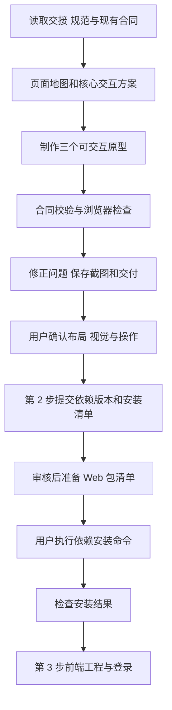

# 前端第 1 步交付说明

日期：2026-09-27。用户回复“来开始”后，主代理按[实施清单](前端第1步实施清单.md)完成页面设计与三个核心交互原型。当前状态：原型与本轮检查完成；用户认可现有风格并确认采用 Element Plus，接续[第 2 步环境与依赖实施清单](前端第2步实施清单.md)。

## 1. 本步交付

- [页面设计方案](前端页面设计方案.md)：页面地图、菜单归属、三页布局、交互状态、视觉规则、接口映射和流程图。
- [原型入口](前端原型/index.html)：分析工作台、报表详情、模型与 Agent 管理。
- [实际检查记录与截图](前端原型/qa/检查记录.md)：桌面、窄屏、主要流程和异常交互的实际结果。
- [完整实施流程](前端实施流程.md)：11 步顺序与环境安装分工。

本步文件集中在任务交接目录。原型使用原生 HTML/CSS/JavaScript、系统字体、SVG 和虚构数据，通过已有 Node 预览；新增依赖为 0。状态存于当前页面内存，刷新恢复初始示例。

## 2. 预览与操作

在项目根目录执行以下命令即可启动本机预览；这是已有 Node 的启动命令：

```powershell
Set-Location D:\porject_new_2026\ai-data
node .\任务交接\前端原型\preview.mjs
```

默认仅监听 `127.0.0.1:4178`。若已启动，直接访问以下地址；终端中 Ctrl+C 可停止预览。

| 页面         | 地址                                          | 建议查看                                           |
| ------------ | --------------------------------------------- | -------------------------------------------------- |
| 分析工作台   | [打开分析页](http://127.0.0.1:4178/#analysis) | 新建分析、Agent、提问澄清、结果、证据、分页        |
| 报表详情     | [打开报表页](http://127.0.0.1:4178/#report)   | 修改月份再运行、切换历史、三种编辑入口、分享和导出 |
| 模型与 Agent | [打开管理页](http://127.0.0.1:4178/#settings) | 配置详情、发布新版本、启停和历史版本               |

每页右上角“演示场景”切换失败、空态、冲突等状态，并可打开页面地图。原型可直接用浏览器打开 `index.html`；本机服务器方式便于持续检查。

## 3. 主要改动与行为

分析页围绕问题、结论和依据组织内容，新会话选择启用的 Agent 并固定版本，取消和失败保留原问题。完成后图表和表格引用同一组结果。

报表详情分别展示当前定义、准备执行的参数和所选历史结果。修改参数或保存定义后，已有结果继续标注原条件；运行才新增快照。三个编辑入口演示共用草稿，冲突保留草稿。导出格式与生成状态绑定所选结果。

管理页提供模型和 Agent 列表、公开配置、固定版本、启停和发布表单。Skill 工具依赖得到校验；发布失败保留输入；模型凭据仅展示配置状态。

## 4. 验证结果与边界

已完成浏览器操作检查：提问澄清完成、运行取消、失败空态、分页、参数执行、历史切换、草稿切换、冲突恢复、分享、导出状态、Agent 发布启停、模型发布失败重试、窄屏长标题、Esc 和焦点恢复。

固定 Agent、模型、报表定义和澄清数据通过四项共享合同校验；汇总数据为 7 月 11,560、8 月 12,480，相差 920，环比约 8.0%。最后一次浏览器 error/warn 日志读取为空。

静态验证：三个脚本 `node --check` 通过；本轮文件 Prettier 检查通过；本地 Markdown 引用检查通过；`git diff --check` 通过。交接 README 原有正文保留并追加入口。

原型用于页面和交互确认。画布展示节点关系，对话编辑应用预设修改，完整编辑器在第 6 步完成；文件生成在第 7 步完成；登录、真实接口、SSE、模型调用、权限和真实文件验收按后续步骤记录。

## 5. 执行与后续流程



用户已确认 Element Plus，下一步按第 2 步清单审核文件范围与依赖版本，再准备安装所需包文件。依赖的安装、升级、卸载及浏览器运行时下载均由用户执行。
