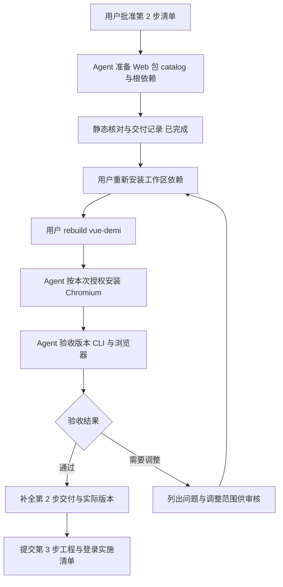
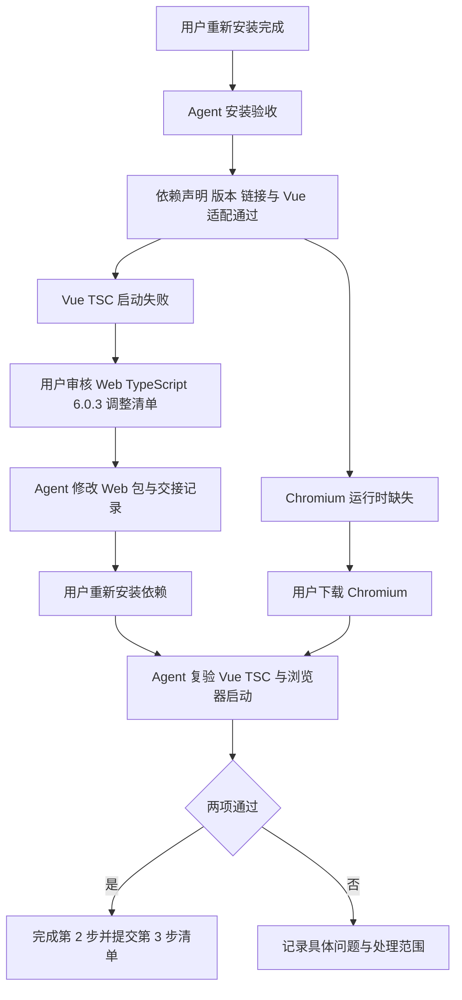
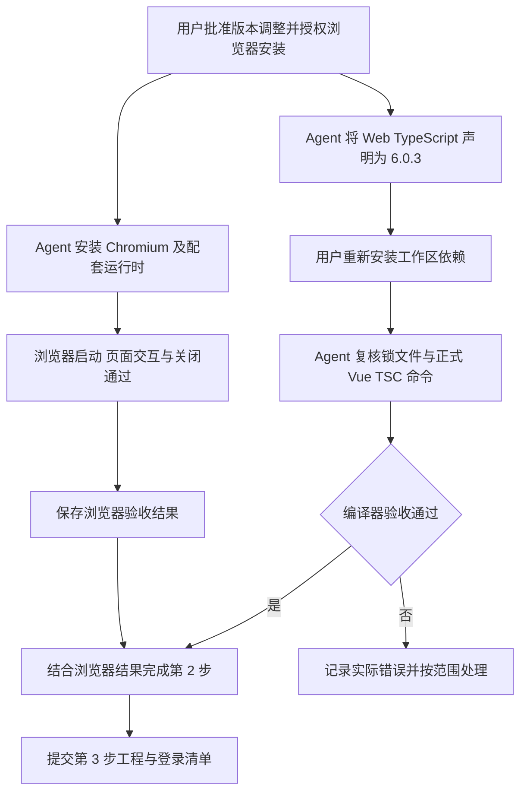
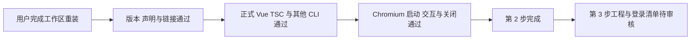

# 前端第 2 步交付说明：环境与依赖验收

日期：2026-09-27。用户回复“来吧”批准[第 2 步实施清单](前端第2步实施清单.md)，由主代理单独实施。最新状态：**第 2 步安装验收通过。Web 已实装 TypeScript `6.0.3`，正式 Vue TSC 命令正常，Chromium 启动与页面交互通过。** 最终复验见第 9 节，接续的[第 3 步工程与登录清单](前端第3步实施清单.md)已提交待审核。

## 1. 主要改动

| 文件                                                                               | 改动与目的                                                                                      |
| ---------------------------------------------------------------------------------- | ----------------------------------------------------------------------------------------------- |
| [Web 包](../ai-data/apps/web/package.json)                                         | 新建 `@ai-data/web`，声明 11 项运行依赖、13 项开发依赖，为 Vue 3 与 Element Plus 页面准备工具链 |
| [工作区 catalog](../ai-data/pnpm-workspace.yaml)                                   | 保留 14 项跨包共用版本，单包专用依赖在所属包直接声明；允许 `vue-demi@0.14.10` 安装脚本          |
| [根包](../ai-data/package.json)                                                    | 增加 `eslint-plugin-vue`、`vue-eslint-parser`，供后续根 ESLint 配置导入                         |
| [DAS 包](../ai-data/apps/data-access/package.json)                                 | 将该包独用的 `p-limit` 移为直接版本声明，保留 `^7.3.1`                                          |
| [实施清单](前端第2步实施清单.md)、[总流程](前端实施流程.md)、[交接入口](README.md) | 更新准备状态、完整版本清单与命令，README 追加记录                                               |

核心版本为 Vue `3.5.43`、Element Plus `2.14.6`、Vite `8.2.2`、Vue TSC `3.3.11`、Playwright `1.63.0`；Web 的 TypeScript 独立声明为 `6.0.3`，其余版本见实施清单第 3 节。catalog 的 TypeScript `7.0.2` 继续供后端和共享包使用。

页面沿用已确认原型的主题。应用入口、路由、登录、主题接入、Vue/TS/ESLint 配置与运行脚本属于第 3 步；当前阶段交付依赖声明。

## 2. 用户安装命令记录

Web 包文件已按获准版本修改，用户已完成安装并通过验收。以下保留本次更新锁文件与编译器链接的命令：

```powershell
Set-Location -LiteralPath 'D:\porject_new_2026\ai-data\ai-data'
npm exec --yes --package=pnpm@11.22.0 -- pnpm install --no-frozen-lockfile
if ($LASTEXITCODE -ne 0) { throw '依赖安装失败，请保留报错。' }
```

Node 已确认为 `v24.19.0`，安装元数据记录 pnpm `11.22.0`。`vue-demi` 已适配 Vue 3，Chromium 已安装并验证；Web 的 TypeScript 实装版本、正式 Vue TSC 启动及后端依赖解析均已复核。本阶段安装操作已完成。

## 3. 首次包文件准备验证

以下记录形成于用户首次安装之前；安装报错后的修正与验证见第 6 节。

- Node `v24.19.0` 可用；通过已有 Node 与 Prettier 解析 JSON/YAML，包文件语法有效。
- 逐项核对 Web 运行与开发依赖，所有外部包均有 catalog 声明，新增 18 项版本与实施清单一致。
- 与 Git 基线比较，根包仅增加两项获准开发依赖；已有 catalog 和工作区设置完整保留。
- `apps/*` 覆盖 Web 包；共享合同包名与公共入口有效。安装后的工作区链接待验证。
- 锁文件 SHA-256 与修改前一致：`7a16b924f57dfc6c2cde92f956590046265d0dbfd18517d4f95e574434adadcc`。
- 文件格式、本地引用和差异空白检查通过，结果见下方记录。

本轮依赖操作为 0。上述检查验证文件准备结果，实际工具链与应用运行按下面的阶段验收。

### 文档与格式检查记录

- 使用已有 Prettier 检查 7 份本轮文件，全部通过。
- 检查 4 份交接文档中的 65 处本地引用，目标均存在；README 的 Git 基线正文完整保留。
- 使用 PowerShell 解析器检查 9 段命令，语法通过，仅解析、未执行安装。
- `git diff --check` 通过。

## 4. 安装后接续

用户安装完成后，Agent 已使用已安装工具核对锁文件、实际包版本、共享合同链接、CLI 运行和 Chromium 启动条件，并复核 API/DAS 既有依赖的解析变化，以及根 `typescript-eslint` 自身解析的 TypeScript 版本；实际结果见第 7 节，版本关系和检查口径见实施清单第 4、6 节。

安装验收已完成，当前进入第 3 步清单审核。Vue SFC 类型检查、组件测试、应用启动和生产构建在第 3 步接入后验证；大表性能按真实结果组件的专项用例验证。

### 安装前复核（2026-09-27）

用户要求再次核对当前是否需要补充依赖。复核 Web 与根包声明、catalog、第 3 步工程与登录范围后，结论为：**当前没有必须补加的依赖，可以执行第 2 节安装命令。** 本次复核沿用已准备的包文件。

现有清单覆盖 Vue 入口、路由、状态与请求缓存、Element Plus 控件、图标、共享合同校验，以及类型检查、lint、组件测试和浏览器测试。主题沿用 CSS 变量，组件与对应 CSS 显式引入；Element Plus 支持 CSS 变量主题，依据见[官方主题说明](https://element-plus.org/en-US/guide/theming.html#by-css-variables)。实际应用配置和运行结果仍按第 3 步验收。

用户补充的选型要求继续有效：组件、所需插件、导出功能和字体均采用免费且许可允许项目商用的方案。Markdown、AI 展示组件、流程图、查询画布及文件导出需要提前形成整体选型方案，明确职责、接入阶段和验证要求，再按阶段安装；目前这些候选不构成工程与登录阶段的安装前置条件。

## 5. 执行流程



## 6. 安装报错与依赖归属修正（2026-09-27）

用户运行 `pnpm install --no-frozen-lockfile`，输出 `Already up to date` 后以 `ERR_PNPM_IGNORED_BUILDS` 退出，列出 `vue-demi@0.14.10`。包解析和文件准备已发生，安装因依赖脚本仍待批准而未成功完成。用户同时要求单包专用依赖直接在所属包声明版本。

`vue-demi` 由 `@tanstack/vue-query` 间接引入。本次完整读取已安装包的 `postinstall.js` 和 `utils.js`，确认 Vue 3 分支读取已安装 Vue 版本，并将自身 `lib/v3` 的三个适配文件复制到 `lib`。依据：[安装脚本](https://github.com/vueuse/vue-demi/blob/v0.14.10/scripts/postinstall.js)、[文件适配实现](https://github.com/vueuse/vue-demi/blob/v0.14.10/scripts/utils.js)。

### 本次改动

- `pnpm-workspace.yaml` 中的待决定占位值改为 `"vue-demi@0.14.10": true`，匹配已检查的精确版本；依据 [pnpm allowBuilds](https://pnpm.io/settings/build#allowbuilds)。
- 16 项 Web 专用依赖迁回 Web 包；5 项根包独用的 ESLint 相关依赖迁回根包；DAS 独用的 `p-limit` 迁回 DAS 包。共迁出 22 项，所有声明版本或范围保持一致。
- catalog 留下 14 项共用依赖：`@types/node`、`eslint`、`prettier`、`typescript`、`tsx`、`esbuild`、`vitest`、`zod`、`mssql`、`dayjs`、`axios`、`pino`、`fastify`、`jose`。
- 用户安装产生的 `minimumReleaseAgeExclude` 两项配置保持原值；既有构建许可继续有效。
- 报错当时的重试顺序为：用户先重新安装以更新锁文件的版本声明，再对 Web 的 `vue-demi` 执行 [rebuild](https://pnpm.io/cli/rebuild)。该适配已通过第 7 节验收，当前命令见第 2 节。

### 本次验证与接续

本次仅调整配置与交接文档，验证结果如下：

- 核对全部 6 个工作区包：22 项迁移声明的实际版本范围前后一致，包脚本与其余字段保持原样；catalog 的 14 项依赖均有至少两个工作区包引用。
- JSON 解析与 YAML 格式解析通过；逐项比较工作区设置，改动仅涉及专用 catalog 项、已检查版本的脚本许可及说明注释。
- 用户安装后的锁文件 SHA-256 保持为 `a5dc3e296e9f8ff0c3973dc41955636347afc35eedcb3ca9488424e0f1de47cf`；安装目录元数据哈希保持一致。Agent 未运行安装、rebuild 或直接执行安装脚本。
- 4 份交接文档中的 66 处本地引用全部有效，README 仅追加；9 段 PowerShell 命令语法通过。
- 本轮文件格式和 `git diff --check` 通过。安装与 rebuild 的实际成功结果待用户执行后验收，Chromium 启动验收继续按本步清单执行。

## 7. 用户重新安装后的验收（2026-09-27）

用户回复“搞定了 你看看”，本轮使用已有 Node、已安装包及本地 CLI 验收。用户没有提供重试命令的完整输出，以下结论依据当前文件、安装元数据和实际执行结果。依赖安装、rebuild、升级及浏览器下载操作均为 0。

### 实际检查结果

| 检查项              | 结果   | 依据                                                                                                             |
| ------------------- | ------ | ---------------------------------------------------------------------------------------------------------------- |
| Node 与安装器       | 通过   | Node `v24.19.0`；安装元数据记录 `pnpm@11.22.0`                                                                   |
| 构建脚本与 Vue 适配 | 通过   | `pendingBuilds` 为空；`vue-demi@0.14.10` 加载后为 Vue 3 模式，Vue 版本 `3.5.43`；Vue Query 插件可加载            |
| 声明与安装版本      | 通过   | 全部 6 个工作区包的依赖声明与锁文件一致；根包和 Web 的已安装直接依赖版本与锁文件一致                             |
| catalog 归属        | 通过   | 14 项 catalog 依赖均由至少两个工作区包引用；单包专用项直接声明版本                                               |
| 共享合同链接        | 通过   | Web 的 `@ai-data/contracts` 解析到本工作区 `packages/contracts/src/index.ts`                                     |
| 本地 CLI 启动       | 通过   | Vite `8.2.2`、ESLint `10.9.0`、Vitest `4.1.11`、Playwright `1.63.0` 的 `--version` 均以退出码 0 完成             |
| Vue 检查插件        | 通过   | 根 `eslint-plugin-vue` 与 `vue-eslint-parser` 可加载；`typescript-eslint@8.67.0` 自身继续解析 TypeScript `6.0.3` |
| Vue TSC 启动        | 失败   | `vue-tsc@3.3.11` 使用 Web 的 TypeScript `7.0.2` 时，访问 `typescript/lib/tsc` 报 `ERR_PACKAGE_PATH_NOT_EXPORTED` |
| Chromium 启动       | 待安装 | Playwright 启动失败，预期的 `chromium_headless_shell-1243` 可执行文件不存在；标准 Chromium `1243` 路径也不存在   |

Web 实装版本与实施清单一致，其中 Element Plus 为 `2.14.6`、Vue Router 为 `4.6.4`、Pinia 为 `3.0.4`、Vue Query 为 `5.104.0`、ECharts 为 `6.1.0`、Vue ECharts 为 `8.3.0`、Lucide 为 `1.0.0`。共享版本实际解析为 dayjs `1.11.23`、Zod `4.4.3`、Node 类型 `26.2.0` 和 Prettier `3.9.6`。

与 Git 基线比较，API、DAS、contracts、metadata 的已有直接依赖版本号均保持一致；这四个包的 Vitest 锁文件条目新增 `(jsdom@30.1.1)` peer 解析后缀，Vitest 仍为 `4.1.11`。这是引入 Web DOM 测试依赖后的解析变化。本轮进行了安装与工具启动核对，业务测试按后续具体实施范围执行。

### Vue TSC 兼容性与最小调整清单

已安装的 Vue TSC 默认定位 `typescript/lib/tsc`，TypeScript 7.0.2 的 `exports` 未提供该入口，因此即使仅查询版本也会失败。安装前 peer 声明的 `>=5.0.0` 不能证明这组版本实际可运行。官方仓库已有同类报告，见 [Vue Language Tools #6121](https://github.com/vuejs/language-tools/discussions/6121)。

为核实调整方向，本轮给 Vue TSC 的 `run` 函数显式传入已有检查工具内部的 TypeScript `6.0.3` 编译器路径，执行版本诊断，输出 `Version 6.0.3` 并以退出码 0 完成。该检查只证明这条编译器入口可启动；正式 Web CLI 及 Vue SFC 检查仍须在用户完成后续安装和工程接入后验证。

| 项目           | 拟调整范围                                                                                                                                |
| -------------- | ----------------------------------------------------------------------------------------------------------------------------------------- |
| 目的           | 恢复 Web 的 Vue 类型检查器启动，继续使用已选 Vue 3 与 Element Plus                                                                        |
| 包文件         | 仅将 `ai-data/apps/web/package.json` 的开发依赖 `typescript` 从 `catalog:` 改为精确版本 `6.0.3`                                           |
| 版本归属与影响 | Web 单独维护这一编译器版本；API、DAS 与共享包继续使用 catalog 中的 `7.0.2`，类型检查配置在第 3 步接入                                     |
| 文件维护       | 同步本交付说明、实施清单、总流程及任务交接 README；本次调整无需新增或删除文件                                                             |
| 依赖操作       | 获准后 Agent 准备包文件；用户重新安装，生成锁文件和 Web 的编译器链接，并执行 Chromium 下载                                                |
| 验证           | 核对声明与锁文件、重新执行标准 Web `vue-tsc --version`、核对后端解析变化，启动 Chromium 打开最小页面并关闭；Vue SFC 类型检查在第 3 步执行 |

上述清单在本次安装验收时提交审核；用户随后批准版本调整，并指定 Chromium 由 Agent 安装。获准后的实施结果见第 8 节。

### 接续流程



本轮验收后的锁文件 SHA-256 为 `3385664bea5a1513cbf822b27162a18a00bfaf74016c796b837ff5cf358f3e55`。Agent 本轮仅更新交接记录，包文件、工作区设置、锁文件与安装元数据保持本轮检查时的内容。

交付文档验证：4 份文档的 68 处本地引用有效，9 段 PowerShell 命令仅解析且语法通过；Prettier 与 `git diff --check` 通过，README 历史正文保留；6 份包文件、工作区配置、锁文件和安装元数据共 9 份文件的哈希核对一致。

## 8. Web 编译器调整与 Chromium 安装（2026-09-27）

用户回复“同意 ts 降低版本，Chromium 你安装”，批准第 7 节的 Web 编译器调整，并明确授权 Agent 执行本次浏览器下载。

### 改动与执行结果

- `ai-data/apps/web/package.json` 的 `devDependencies.typescript` 从 `catalog:` 改为精确版本 `6.0.3`。Web 现在有 17 项直接版本声明、6 项 catalog 引用及 1 项共享合同 workspace 引用。
- 工作区 catalog 继续维护 TypeScript `7.0.2`，后端和共享包继续引用该版本。工作区设置和其他包文件沿用原内容。
- 同步本交付说明、实施清单、总流程，并在任务交接 README 追加结果；本次没有新增或删除项目文件。
- Agent 从内层工作区执行已安装的 Playwright CLI，退出码为 0：

```powershell
& '.\apps\web\node_modules\.bin\playwright.cmd' install chromium
```

Playwright `1.63.0` 下载 Chromium `153.0.8010.12`（revision `1243`）及配套 Headless Shell、FFmpeg `1011`、Winldd `1007`。浏览器缓存位于 `C:\Users\rain\AppData\Local\ms-playwright`，安装过程使用 Playwright 官方 CDN。

### 已验证与接续

使用 Web 已安装的 `@playwright/test` 实际启动默认无头 Chromium，打开本地构造的最小页面，验证页面标题、按钮点击后的输出变化，并关闭页面和浏览器。浏览器报告 `153.0.8010.12`，所有断言通过，进程退出码 0。

包文件当前声明 TypeScript `6.0.3`，Web 现有依赖链接仍解析为 `7.0.2`。用户须执行第 2 节命令更新依赖；完成后再核对正式 Web `vue-tsc --version` 与锁文件，当前不将编译器切换记为已验收。前一轮使用已有 `6.0.3` 编译器路径进行的诊断结果保留在第 7 节。

本轮 Agent 执行浏览器安装命令 1 次，工作区依赖安装、升级与 rebuild 为 0。锁文件 SHA-256 保持为 `3385664bea5a1513cbf822b27162a18a00bfaf74016c796b837ff5cf358f3e55`，安装元数据 SHA-256 保持为 `be0bdf0b139086034ba457de34cbcfee04d30f6f1bfd164f5977e141cc0c783d`。

文件验收通过：Web 包仅修改获准的 TypeScript 字段，其他 8 份依赖声明、工作区配置、锁文件和安装元数据的哈希保持一致；5 份本轮文件通过 Prettier，4 份交接文档的 68 处本地引用有效，9 段 PowerShell 命令语法通过，README 历史正文保留，`git diff --check` 通过。



## 9. 最终安装复验与第 2 步完成（2026-09-27）

用户完成重装后要求“校验后给下一步的清单”。本轮使用已有工具验收，依赖和浏览器安装操作均为 0。

| 检查             | 实际结果                                                                                                 |
| ---------------- | -------------------------------------------------------------------------------------------------------- |
| 工作区声明与安装 | 6 个包的声明与锁文件一致；80 项外部依赖声明与安装版本一致                                                |
| Web 编译器       | TypeScript `6.0.3`；Vue TSC 包版本 `3.3.11`；标准本地 `vue-tsc --version` 输出 `Version 6.0.3`，退出码 0 |
| 其他包编译器     | API、DAS、contracts、metadata 仍实装 TypeScript `7.0.2`                                                  |
| 工具启动         | Vite `8.2.2`、ESLint `10.9.0`、Vitest `4.1.11`、Playwright `1.63.0` 的版本命令均以退出码 0 完成          |
| Vue 适配与链接   | `vue-demi` 为 Vue 3 模式，Vue `3.5.43`；共享合同解析到工作区公共入口；待执行构建脚本为空                 |
| 根检查工具       | `typescript-eslint` 自身继续解析 TypeScript `6.0.3`                                                      |
| Chromium         | 版本 `153.0.8010.12`，重新启动、打开最小页面、校验标题与点击结果、关闭浏览器全部通过                     |
| 后端依赖变化     | 相对 Git 基线，已有直接依赖版本号保持一致；Vitest 的 jsdom peer 后缀与第 7 节记录一致                    |

安装后的锁文件 SHA-256 为 `85367538b87c00cca84d526c83974188b5ff536717f6495406834c4f03dc3750`，安装元数据 SHA-256 为 `dc5e02c4d6684163fa02822d29bd122e56f649a20abb4242b8385a47ccbdae15`。版本核对中曾因检查脚本使用 CommonJS 解析 ESM-only 包入口而中断，随后改为读取已安装包元数据，80 项全部核对通过；该中断不属于项目依赖运行错误。

**第 2 步按安装验收范围完成。** 当前确认的是工具链与浏览器可用，正式 Vue 应用的类型检查、组件测试和生产构建按[第 3 步实施清单](前端第3步实施清单.md)执行。该清单依据当前认证路由、Cookie、错误合同、工作区规则和已确认主题编写，待用户审核。

本轮文档检查：5 份文件通过 Prettier，82 处本地引用有效，9 段 PowerShell 命令语法通过，`git diff --check` 通过。README 原文完整保留并追加记录；本轮开始时记录的 9 份包文件、工作区配置、锁文件及安装元数据哈希保持一致。


