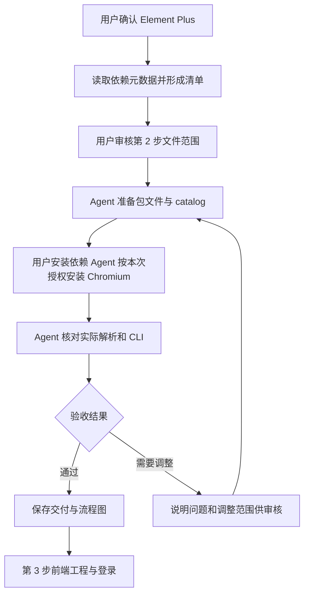

# 前端第 2 步实施清单：环境与依赖

日期：2026-09-27。用户已批准本清单，并追加批准 Web 的 TypeScript 降为 `6.0.3`、指定 Chromium 由 Agent 安装。**第 2 步安装验收已完成**：用户重装后的声明、锁文件与实装版本一致，正式 Vue TSC 和其他 CLI 正常，Chromium 启动与页面交互通过。结果见[第 2 步交付说明第 9 节](前端第2步交付说明.md#9-最终安装复验与第-2-步完成2026-09-27)，接续[第 3 步实施清单](前端第3步实施清单.md)。

## 1. 目的与本步交付

为 Vue 3 + Element Plus 正式前端准备可复现的开发、构建、静态检查和浏览器测试环境。页面视觉沿用已确认原型，业务实现从第 3 步开始。本步验收区分“依赖声明可解析”和“真实应用已启动”。

## 2. 获准文件范围

| 操作         | 文件                                       | 目的                                                                                           |
| ------------ | ------------------------------------------ | ---------------------------------------------------------------------------------------------- |
| 新增         | `ai-data/apps/web/package.json`            | 建立 `@ai-data/web` 工作区包，声明本清单中的运行与开发依赖                                     |
| 修改         | `ai-data/pnpm-workspace.yaml`              | catalog 保留 14 项跨包共用版本；为已检查的 `vue-demi@0.14.10` 声明安装脚本许可                 |
| 修改         | `ai-data/package.json`                     | 在根开发依赖增加 `eslint-plugin-vue`、`vue-eslint-parser`，供第 3 步根 ESLint 配置统一接入 Vue |
| 修改         | `ai-data/apps/data-access/package.json`    | 将 DAS 独用的 `p-limit` 版本直接写入所属包，保留原版本范围                                     |
| 用户安装生成 | `ai-data/pnpm-lock.yaml`、各依赖目录       | 由用户安装命令解析并生成，安装后核对既有包变化                                                 |
| 维护         | 本清单、`前端实施流程.md`、任务交接 README | 记录实际版本、安装状态和接手入口，README 追加记录                                              |
| 新增         | `任务交接/前端第2步交付说明.md`            | 分别记录包文件准备、安装验收的命令、结果和流程图                                               |

Web 包先包含名称、私有包标记、ES module 类型和依赖声明。Vue 入口、Vite 配置、TS 配置、Vue ESLint 规则和各业务脚本在第 3 步具体清单中实施。环境核对直接调用已安装 CLI。

## 3. 环境与选定版本

Node 当前为 `v24.19.0`，符合项目 `>=24.19.0 <25`。项目声明 pnpm `11.22.0`，安装时明确调用此版本。Web 包目前有 17 项直接版本声明、6 项 `catalog:` 引用，共享合同使用 `workspace:*`。Web 的 TypeScript 独立声明为 `6.0.3`，catalog 中的 `7.0.2` 继续供其他包使用。

### 3.1 Web 运行依赖

| 包                    | 声明版本                 | 用途                              |
| --------------------- | ------------------------ | --------------------------------- |
| `vue`                 | `3.5.43`                 | Vue 3 运行时                      |
| `vue-router`          | `4.6.4`                  | 页面与会话路由                    |
| `pinia`               | `3.0.4`                  | 跨页面 UI 状态                    |
| `@tanstack/vue-query` | `5.104.0`                | API 读取、缓存、失效与请求状态    |
| `element-plus`        | `2.14.6`                 | 统一基础控件、普通表格及 Table V2 |
| `echarts`             | `6.1.0`                  | 分析图表                          |
| `vue-echarts`         | `8.3.0`                  | 图表 Vue 组件集成                 |
| `lucide-vue-next`     | `1.0.0`                  | 统一图标                          |
| `@ai-data/contracts`  | `workspace:*`            | 通过公共出口复用合同              |
| `zod`                 | 沿用 catalog：`4.4.3`    | 输入与接口结构校验                |
| `dayjs`               | 沿用 catalog：`^1.11.23` | 项目统一日期处理                  |

表中的 Web 专用包在 Web 包文件中使用精确版本。Vue Router 选择已核对的 4.x、Pinia 选择 3.x，配合 Vue 3 的常规显式路由与状态用法。Vite 沿用现有锁文件可见的 8.2.2。

### 3.2 Web 开发依赖

| 包                   | 声明版本或已有 catalog | 用途                              |
| -------------------- | ---------------------- | --------------------------------- |
| `vite`               | `8.2.2`                | 开发服务器与静态构建              |
| `@vitejs/plugin-vue` | `6.0.9`                | Vue 单文件组件编译                |
| `@vue/compiler-sfc`  | `3.5.43`               | 与运行时同版本的 SFC 编译器       |
| `vue-tsc`            | `3.3.11`               | Vue 模板与 TypeScript 类型检查    |
| `typescript`         | `6.0.3`                | Web 独立编译器版本，配合 Vue TSC  |
| `@types/node`        | catalog：`^26.2.0`     | 构建与测试配置类型                |
| `eslint`             | catalog：`^10.9.0`     | 使用根配置执行检查                |
| `prettier`           | catalog：`^3.9.6`      | 使用工作区格式规则                |
| `vitest`             | catalog：`^4.1.11`     | 业务与组件测试                    |
| `@vue/test-utils`    | `2.5.1`                | Vue 组件测试辅助                  |
| `@vue/compiler-dom`  | `3.5.43`               | 与 Vue 及测试工具保持一致的编译器 |
| `jsdom`              | `30.1.1`               | 组件测试 DOM 环境                 |
| `@playwright/test`   | `1.63.0`               | 浏览器端到端测试                  |

### 3.3 根开发依赖增项

| 包                  | 声明版本  | 安装位置说明                               |
| ------------------- | --------- | ------------------------------------------ |
| `eslint-plugin-vue` | `10.11.1` | 根 ESLint 配置将导入此插件，因此由根包声明 |
| `vue-eslint-parser` | `10.4.1`  | 根配置的 `.vue` 文件解析器                 |

主题采用 CSS 变量统一管理，控件与对应样式采用显式按需引入。查询画布、Markdown 净化和文件导出依赖在对应步骤列清单。

### 3.4 依赖归属与脚本许可修正

按用户最新要求，catalog 仅维护多个工作区包共用的依赖。根包独用的 `@eslint/js`、`eslint-config-prettier`、`typescript-eslint` 及上表两个 Vue 检查工具直接声明版本；DAS 独用的 `p-limit` 直接声明 `^7.3.1`。本次共迁出 22 项 catalog 声明，所有版本或版本范围保持一致。

`@tanstack/vue-query` 间接引入 `vue-demi@0.14.10`。已检查本地 `postinstall.js` 与 `utils.js`：脚本根据已安装 Vue 的主版本，将包内对应的适配文件复制到自身 `lib` 目录。工作区使用 `allowBuilds` 为这个精确版本设置 `true`，脚本由用户执行安装或 rebuild 时运行。依据：[pnpm 构建设置](https://pnpm.io/settings/build#allowbuilds)、[vue-demi 安装脚本](https://github.com/vueuse/vue-demi/blob/v0.14.10/scripts/postinstall.js)。

## 4. 兼容范围核对与待验收项

2026-09-27 仅读取 npm 官方注册表元数据，未下载包归档、安装、升级或卸载依赖。核对依据为 `https://registry.npmjs.org/<包名>/<版本>` 返回的版本、`engines`、`peerDependencies` 和可选 peer 标记。例如 [Element Plus 2.14.6](https://registry.npmjs.org/element-plus/2.14.6)、[Vue 3.5.43](https://registry.npmjs.org/vue/3.5.43)、[Vue TSC 3.3.11](https://registry.npmjs.org/vue-tsc/3.3.11)。

| 组合                      | 已核对的声明                                                | 本步结论                                                                   |
| ------------------------- | ----------------------------------------------------------- | -------------------------------------------------------------------------- |
| Element Plus / Vue        | Element Plus 要求 Vue `^3.3.7`                              | Vue 3.5.43 在范围内                                                        |
| Vue Router / Pinia / Vue  | Router 要求 Vue `^3.5.0`；Pinia 要求 `^3.5.11`              | 所选 Vue 在范围内                                                          |
| Vue Query / Vue           | 支持 Vue `^3.3.0`                                           | 所选 Vue 在范围内                                                          |
| Vite / Vue 插件 / Node    | 插件支持 Vite `^8.0.0`；Node 要求 `^20.19.0` 或 `>=22.12.0` | 所选 Vite 和本机 Node 在范围内                                             |
| ECharts / Vue ECharts     | Vue ECharts 要求 ECharts `^6.0.0`、Vue `^3.3.0`             | 所选组合在范围内                                                           |
| ESLint / Vue 插件与解析器 | 插件支持 ESLint 10，要求 Vue parser `^10.3.0`               | ESLint 10.9.0 与 parser 10.4.1 在范围内                                    |
| jsdom / Playwright / Node | jsdom 支持 Node `^24.15.0`；Playwright 要求 `>=20`          | Node 24.19.0 在范围内                                                      |
| Vue TSC / TypeScript      | Vue TSC 声明 TypeScript `>=5.0.0`                           | Web 实装 `6.0.3`；正式本地 Vue TSC CLI 启动通过，SFC 类型检查在第 3 步执行 |

现有检查工具需要保留其实际依赖边界：项目编译器为 TypeScript 7.0.2；根 `typescript-eslint@8.67.0` 声明支持 TypeScript `>=4.8.4 <6.1.0`，本机从该工具自身解析到的 TypeScript 为 6.0.3，符合它的声明。这是现有工具内部的依赖解析情况。本清单不扩大其支持范围；安装后复核该解析结果，Vue 文件的实际解析与类型检查在第 3 步验证。若产生 peer 冲突、运行失败或需要调整版本，报告具体范围并按项目规则审核。

元数据兼容属于安装前核对，不代表 Vue SFC、Table V2 或完整应用已经运行通过。

## 5. 用户执行命令

用户已按获准范围完成 Web TypeScript `6.0.3` 的安装，Chromium 已由 Agent 按明确授权安装，安装验收通过。以下保留本阶段操作命令。

### 5.1 检查版本并安装工作区依赖

```powershell
Set-Location -LiteralPath 'D:\porject_new_2026\ai-data\ai-data'
node --version
npm --version
npm exec --yes --package=pnpm@11.22.0 -- pnpm --version

if (-not (Test-Path -LiteralPath '.\apps\web\package.json')) {
    throw 'Web 包文件尚未准备完成，请先完成第 2 步包文件审核与准备。'
}

npm exec --yes --package=pnpm@11.22.0 -- pnpm install --no-frozen-lockfile
if ($LASTEXITCODE -ne 0) { throw '依赖安装失败，请保留报错。' }

```

预期 pnpm 版本为 `11.22.0`。首次调用可能下载 pnpm 到 npm 缓存；安装更新工作区锁文件。命令说明见 [npm exec](https://docs.npmjs.com/cli/v11/commands/npm-exec/) 和 [pnpm install](https://pnpm.io/cli/install)。安装后由 Agent 核对 API/DAS 的已有解析版本是否发生变化。

### 5.2 安装浏览器测试运行时

用户已明确指定本次 Chromium 由 Agent 安装。以下命令已执行成功，浏览器启动与页面交互已通过：

```powershell
Set-Location -LiteralPath 'D:\porject_new_2026\ai-data\ai-data'
& '.\apps\web\node_modules\.bin\playwright.cmd' install chromium
```

本次使用 Playwright `1.63.0` 下载 Chromium `153.0.8010.12` 及配套运行时。依据：[Playwright 安装说明](https://playwright.dev/docs/intro)。

## 6. Agent 安装验收

1. 核对清单、catalog、锁文件和实际包版本；核对共享合同工作区链接。
2. 用已安装的 Web 本地 CLI 查询 Vite、Vue TSC、ESLint、Vitest、Playwright 版本；分别读取包版本与 CLI 报告，避免把 TypeScript 版本当作 Vue TSC 包版本。
3. 从根检查工具的实际位置解析 TypeScript，确认既有依赖边界；检查新增 Vue 插件和解析器可加载。
4. 使用已安装 Playwright 启动 Chromium，执行最小页面打开并关闭，记录实际结果；本项已通过。
5. 检查锁文件中既有 API/DAS 相关版本是否变化；需要扩大变更范围时先报告。
6. 保存第 2 步交付说明；第 3 步再实现并验证应用启动、Vue SFC 类型检查、lint、组件测试及生产构建。

大表专项在真实结果组件具备后执行：覆盖 1 万、5 万、10 万行，以及固定列、宽表、长文本、选择和页面切换后的释放；数据满足既有 32 MiB 预算。测试口径见[页面设计方案](前端页面设计方案.md)。

## 7. 当前交付与流程

Web 包包含 11 项运行依赖和 13 项开发依赖，catalog 保留 14 项跨包共用依赖。6 个工作区包的声明、锁文件和实装版本核对通过；Web TypeScript 为 `6.0.3`，正式 Vue TSC CLI 启动通过。Chromium 启动、页面交互与关闭复验通过。第 2 步安装验收完成，最终记录见[交付说明第 9 节](前端第2步交付说明.md#9-最终安装复验与第-2-步完成2026-09-27)；当前待审核[第 3 步工程与登录清单](前端第3步实施清单.md)。


