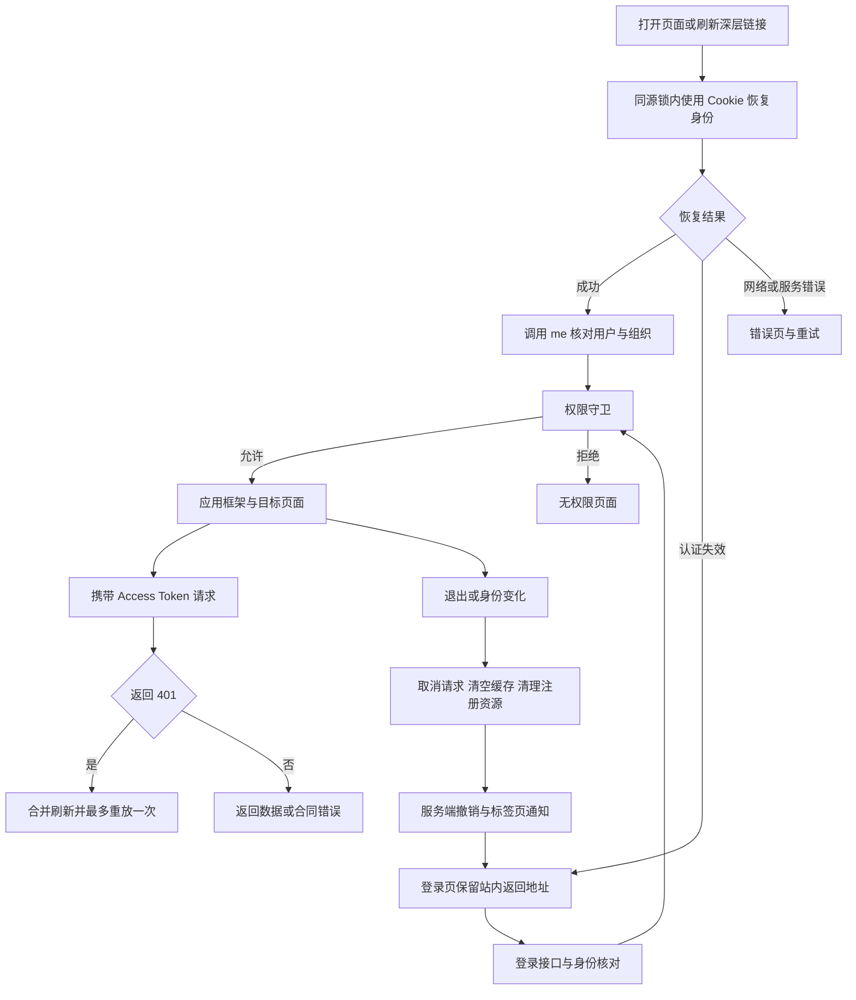
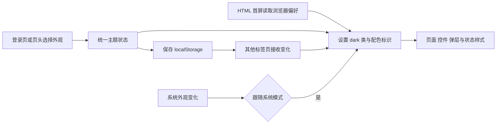

# 前端第 3 步交付说明：工程、登录与主题

日期：2026-09-27。状态：**已完成，验收通过**。用户以“来吧 做第三步”批准[实施清单](前端第3步实施清单.md)及其中的主题补充方案。主代理单独实施，依赖安装、升级、卸载均为 0。

## 1. 本步交付

`ai-data/apps/web` 已成为可启动、检查和构建的 Vue 3 应用。登录、身份恢复、退出、路由权限、统一错误状态和 Element Plus 外观已经接通。

| 交付       | 实际行为                                                                                                                                     |
| ---------- | -------------------------------------------------------------------------------------------------------------------------------------------- |
| 登录页     | 组织用户名和密码登录、字段校验、回车提交、密码显示、重复提交合并、接口错误与请求编号                                                         |
| 身份恢复   | 通过 HttpOnly Cookie 调用刷新接口，再以 `/auth/me` 校验身份；刷新保留已注册深层页面                                                          |
| 应用框架   | 桌面侧栏、页头、账号展示、退出、390px 抽屉导航、模块容器、403 与 404 页面                                                                    |
| 权限入口   | 菜单与路由使用同一权限判断；`system_admin`、`models:manage`、`agents:manage`、`user:manage`、`catalog:manage`、`knowledge:manage` 按入口应用 |
| 认证请求   | 同源 fetch、Bearer、JSON、204、超时、取消、共享错误合同；并发 401 合并刷新，每个原请求最多重放一次                                           |
| 身份清理   | 退出和账号切换使旧身份请求失效，终止注册请求，清理 Vue Query 缓存及注册资源；旧响应不能提交到新身份                                          |
| 标签页协调 | Web Locks 协调登录、刷新与退出；BroadcastChannel 传递身份变化事件                                                                            |
| 主题       | 亮色、暗色、跟随系统；橄榄绿、海蓝、青绿、紫罗兰；默认亮色橄榄绿                                                                             |
| 主题保存   | 登录页与页头均可切换；localStorage 保存当前浏览器选择，标签页同步，HTML 首屏脚本提前应用外观                                                 |
| 工程       | Vite、Vue TSC、Vitest、Playwright、Vue ESLint、格式检查与生产构建                                                                            |

分析工作台、报表和各管理模块目前提供正式路由与容器，业务功能按第 4—10 步继续接入。图表、Markdown、工具执行卡片和画布后续使用同一主题状态与身份清理入口。

## 2. 文件与职责

以下路径相对于 `ai-data/` 工作区。

| 路径                                                                      | 职责                                                                 |
| ------------------------------------------------------------------------- | -------------------------------------------------------------------- |
| `apps/web/package.json`、`index.html`、`vite.config.ts`、`tsconfig*.json` | 应用脚本、启动入口、首屏外观、代理和浏览器/Node 类型检查             |
| `apps/web/src/main.ts`、`src/app.vue`、`src/app/`                         | Vue、Pinia、Vue Query 装配；服务注入、路由、权限导航、框架与模块容器 |
| `apps/web/src/features/auth/`                                             | 登录页面、认证 Schema 与类型、身份状态和刷新协调                     |
| `apps/web/src/shared/http/`、`src/shared/session/`                        | 同源传输、合同错误、取消与统一资源清理                               |
| `apps/web/src/shared/theme/`、`src/shared/ui/`、`src/styles/`             | 主题偏好、公共状态、外观控件及 Element Plus 变量映射                 |
| `apps/web/tests/`、`vitest.config.ts`、`playwright.config.ts`             | 单元、组件、路由与浏览器验收；测试服务启动和关闭                     |
| `apps/api/tests/support/web-auth-server.ts`                               | API 自己的真实认证路由与服务、内存账号仓储、临时 RSA 密钥            |
| `eslint.config.mjs`、`scripts/tests/eslint-rules.test.mjs`                | Vue SFC 类型导入、共享包公共入口与跨应用边界检查                     |
| `.gitignore`、`.prettierignore`、`apps/web/.prettierignore`               | 构建、浏览器临时结果与报告的忽略规则                                 |
| `apps/web/.env.example`、`apps/web/deploy/nginx.conf.example`             | API 地址和静态站点同源代理示例                                       |

测试服务由 API 自己维护，Web 通过 HTTP 使用。API 生产代码、数据库结构和发布目录本轮没有变更。

## 3. 启动和复验命令

在 PowerShell 中进入工作区：

```powershell
Set-Location D:\porject_new_2026\ai-data\ai-data
pnpm dev:web
```

默认 Web 开发地址为 `http://127.0.0.1:5173`。认证依赖实际 API，默认代理目标为 `http://127.0.0.1:3101`，与 API 示例端口一致。API 按现有部署配置启动后，使用组织实际账号登录。

如 API 地址不同，在 `apps/web/.env.local` 设置 `WEB_API_TARGET` 后重启 Vite；可参考同目录 `.env.example`。该变量由 Vite 服务端读取，不作为浏览器配置发布。

常规检查命令：

```powershell
pnpm --filter @ai-data/web typecheck
pnpm --filter @ai-data/web lint
pnpm --filter @ai-data/web test
pnpm --filter @ai-data/web test:e2e
pnpm --filter @ai-data/web format:check
pnpm --filter @ai-data/web build
pnpm test:engineering
```

`test:e2e` 自动启动隔离 API（4318）和 Vite（5317），占用端口时直接报告冲突，结束后关闭自身进程。测试用户与会话仅保存在该进程内存中，密钥每次生成；测试账号不属于实际 API。浏览器检查不要求启动开发数据库。

生产产物为 `apps/web/dist/`。`preview` 用于检查静态产物；部署时以 `deploy/nginx.conf.example` 为同源代理参考，填写站点、证书和 API 地址。

## 4. 认证与请求流程

Access Token 和用户摘要保存在内存。Refresh Token 使用 API 的 `Path=/auth; HttpOnly; SameSite=Lax` Cookie；响应中的刷新令牌不另行写入浏览器存储。生产环境采用 HTTPS，以使用 API 的 Secure Cookie 和浏览器安全上下文能力。

退出首先进入待完成状态并清理业务资源。若令牌已过期，刷新一次后撤销服务端会话；撤销失败显示“退出尚未完成”并允许重试。服务明确返回认证失效时回到登录。401 之外的网络和业务错误不触发自动刷新。



开发与部署路径规则一致：

| 浏览器路径                        | API 收到的路径          |
| --------------------------------- | ----------------------- |
| `/auth/login`、`/auth/refresh` 等 | 保留 `/auth/`           |
| `/api/reports` 等业务请求         | `/reports`，去掉 `/api` |
| `/reports/example/edit` 等页面    | Web SPA 路由            |

Nginx 示例为业务代理关闭缓冲并配置长连接超时，保留默认请求头转发。实际服务器上的 HTTPS、流式推送与代理联调归第 11 步验收。

## 5. 主题与后续接入

显示模式与配色分别保存，存储键为 `ai-data.appearance.v1`。无偏好或偏好损坏时回到亮色橄榄绿；存储不可用时仍可在本页切换。退出保留外观选择。



后续 feature 通过 `useServices()` 取得认证、请求、QueryClient 和资源清理入口。业务请求走 `services.request('/api/...')`；SSE 或其他长连接注册清理函数，并在组件卸载时注销。查询缓存归当前身份，退出统一取消和清除。

主题的语义变量由 `src/styles/theme.css` 维护。后续 ECharts、Markdown 和画布组件读取同一模式、配色及语义变量，为数据序列保留可辨识的独立色板。

## 6. 验证结果

实际执行使用已经安装的 CLI，没有运行依赖安装命令。

| 检查                                                            | 结果                                                                    |
| --------------------------------------------------------------- | ----------------------------------------------------------------------- |
| Web `vue-tsc -p tsconfig.app.json`、`tsc -p tsconfig.node.json` | 通过                                                                    |
| API `tsc -p tsconfig.json`                                      | 通过，包含新增测试服务                                                  |
| 工作区 `eslint .`                                               | 通过，包含所有应用与共享包                                              |
| Web `vitest run`                                                | 5 个文件、22 项通过                                                     |
| 工程 `node --test scripts/tests/*.test.mjs`                     | 37 项通过；Vue 规则调整后相关 17 项复验通过                             |
| Chromium `playwright test`                                      | 6 项全部通过，最终运行 32.6 秒，测试服务自动关闭                        |
| Web 格式检查                                                    | 通过                                                                    |
| Web `vite build`                                                | 通过；入口 JS 267.35 kB（gzip 85.92 kB），CSS 68.78 kB（gzip 11.12 kB） |

浏览器场景：

1. 窄屏登录、字段校验、回车提交、外观键盘选择与 Esc 焦点返回；8 种外观下主按钮普通与悬停文字对比度均至少 4.5:1。
2. 错误与正确登录、HttpOnly Cookie、刷新轮换、深层链接、代理 JSON 错误与退出清除 Cookie。
3. 普通身份菜单、管理地址拒绝、390px 导航、长展示名和 A/B 账号切换。
4. 多标签页同时刷新、退出传播、新身份传播。
5. 四套配色的亮暗效果、弹层、刷新持久化、标签页同步与系统模式变化。
6. 初始断网重试、退出服务失败重试。

本轮先编写认证与主题测试，首轮 12 项中 11 项预期失败，实现后全部通过；随后扩展为 22 项单元与组件测试。浏览器验收定位并修复了首次路由与身份恢复竞态、外观面板焦点和亮色按钮悬停对比度问题。

本机 Playwright 默认测试服务回收一度未自动结束，已改为直接启动和关闭自身 Node 子进程，随后运行能自动结束。服务实现、隔离仓储和代理语义保持一致。

锁文件 SHA-256：`85367538b87c00cca84d526c83974188b5ff536717f6495406834c4f03dc3750`；安装元数据 SHA-256：`dc5e02c4d6684163fa02822d29bd122e56f649a20abb4242b8385a47ccbdae15`。两者与本轮开始前一致。

本轮认证浏览器验收使用真实 API 认证实现和隔离内存仓储。实际 SQL 账号联调、Nginx 实机部署、其他浏览器以及真实分析业务留在对应后续验收阶段。

## 7. 界面截图与接续

截图保存在[第 3 步验收目录](前端第3步验收/)。

- [默认登录页](前端第3步验收/login-light-olive.png)
- [暗色外观面板](前端第3步验收/theme-dark-olive.png)
- [390px 工作空间](前端第3步验收/workspace-mobile.png)
- [390px 暗色登录](前端第3步验收/login-mobile-dark.png)
- [1024px 工作空间](前端第3步验收/workspace-1024.png)

四套配色分别保留 `theme-light-*.png` 与 `theme-dark-*.png`。

下一步为第 4 步“分析工作台”：先提交会话、Agent 选择、消息、SSE、取消恢复、工具状态、Markdown、表格图表与证据的具体实施清单；内容渲染器的免费许可、依赖与安装命令随清单核对，获准后实施。
