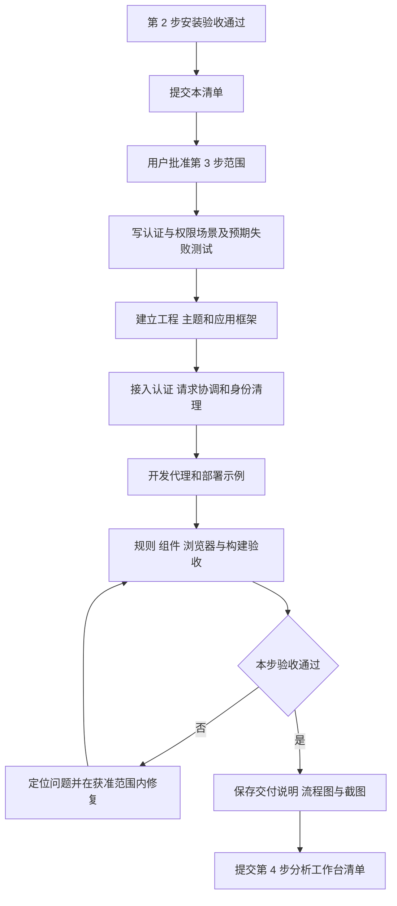
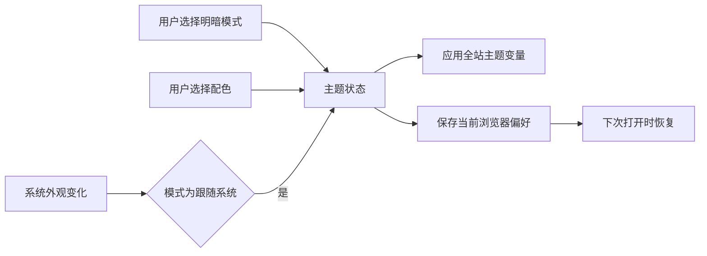

# 前端第 3 步实施清单：工程与登录

日期：2026-09-27。状态：**已完成，验收通过**。用户回复“来吧 做第三步”，采用第 8 节的三种显示模式、四套配色、默认亮色橄榄绿和当前浏览器保存方案。由主代理单独实施，依赖操作为 0；实际改动、验证结果与流程图见[第 3 步交付说明](前端第3步交付说明.md)。

## 1. 目的与交付

建立可启动、可检查、可构建的 Vue 3 正式应用，沿用已确认的白色内容区、浅灰导航、橄榄色主操作与青绿色数据展示，接通现有 API 的登录、身份恢复和退出流程。

本步交付为：登录页、应用框架、按权限显示的导航入口、统一基础状态、认证请求层、同源开发代理、静态部署代理示例，以及对应的行为测试和浏览器检查。分析消息、结果表格、报表操作及管理表单继续按[总流程](前端实施流程.md)的后续步骤接入。

## 2. 已核实的前提

- Web 的 TypeScript 实装为 `6.0.3`，Vue TSC 包为 `3.3.11`，直接执行本地 `vue-tsc --version` 返回 `Version 6.0.3`，退出码 0。
- Vite `8.2.2`、ESLint `10.9.0`、Vitest `4.1.11`、Playwright `1.63.0` CLI 正常；Chromium `153.0.8010.12` 启动、页面交互与关闭通过。
- 6 个工作区包的声明与锁文件一致，80 项外部依赖声明与本地安装版本一致。API、DAS、contracts、metadata 继续使用 TypeScript `7.0.2`。
- 当前 Web 只有包文件。根 `dev:web`、递归检查与构建入口已存在；根 ESLint 配置尚需接入 `.vue`。
- 现有 API 提供全部四个认证端点。认证响应暂未在共享 contracts 中提供独立 Schema，Web 将维护其接入边界校验；共享错误合同继续从 `@ai-data/contracts` 公共出口读取。

## 3. 实施内容

### 3.1 工程与检查入口

建立 `index.html`、Vue 入口、路由和应用装配；配置 Vite、Vue SFC、TypeScript、Vitest 与 Playwright。Web 提供 `dev`、`build`、`preview`、`typecheck`、`lint`、`test`、`test:e2e`、`format`、`format:check` 脚本，接入已有根工作区入口。

Web 的 TS 配置继承工作区通用选项，并分别覆盖浏览器源码和 Node 配置文件。单元测试限定 `tests/**/*.test.ts`，浏览器测试独立收集，避免 Vitest 执行 Playwright 用例。生产构建输出 `apps/web/dist`。

根 ESLint 为 `.vue` 接入已安装的 Vue 插件与解析器，同时保留类型导入和工作区依赖边界规则。用实际 `.vue` 虚拟源码验证合法共享导入、跨应用导入拒绝及纯类型导入规则。浏览器全局声明按 Web 文件范围配置。

### 3.2 主题、框架与基础页面

| 内容       | 本步行为                                                                                                        |
| ---------- | --------------------------------------------------------------------------------------------------------------- |
| 统一主题   | 从[已确认原型](前端原型/styles.css)提取颜色、字体、间距、圆角和层级变量，映射 Element Plus 的主色及交互状态     |
| 控件       | Element Plus 负责表单、按钮、输入、提示、菜单、抽屉和弹层；中文语言配置，组件及对应 CSS 显式引入                |
| 图标与字体 | 使用已有 Lucide；沿用系统中文字体                                                                               |
| 登录页     | 用户名、密码、显示密码、提交中状态、校验与接口错误；支持回车提交及键盘操作                                      |
| 应用框架   | 侧栏、页头、当前用户、退出入口、窄屏导航；内容区采用路由视图                                                    |
| 路由       | `/login`、默认 `/analysis`、`/forbidden`、404，以及页面地图中各模块的路由容器；已有深层路径可刷新并恢复访问目标 |
| 模块容器   | 展示模块标题与统一状态，供对应步骤接入业务页面；当前操作按钮随可用功能开放，业务数据由后续接口接入提供          |
| 公共状态   | 页面加载、空态、服务错误、无权限与找不到页面；请求 ID 可用于定位接口错误                                        |

登录成功后的展示名来自登录或刷新响应中的 `user`，权限来自 `/auth/me`；先核对用户和组织标识一致，再装配界面。普通用户与管理用户的导航按实际权限区分，路由直达同样校验。权限码按当前 API 核对，例如 `models:manage`、`agents:manage`、`user:manage`；系统管理角色为 `system_admin`。每个管理入口使用对应能力规则，API 继续执行最终授权。

主题覆盖焦点、悬停、禁用、错误和加载状态，检查长用户名及窄屏布局。主题映射依据 [Element Plus CSS 变量说明](https://element-plus.org/en-US/guide/theming.html#by-css-variables)；路由守卫采用 [Vue Router 官方机制](https://router.vuejs.org/guide/advanced/navigation-guards.html)。

### 3.3 认证与身份生命周期

依据：[认证路由](../ai-data/apps/api/src/routes/auth-routes.ts)、[认证服务](../ai-data/apps/api/src/auth/auth-service.ts)、[身份结构](../ai-data/apps/api/src/auth/auth-types.ts)。

| 端点                 | 当前合同与接入方式                                                                                                                                 |
| -------------------- | -------------------------------------------------------------------------------------------------------------------------------------------------- |
| `POST /auth/login`   | 提交 `{ username, password }`；返回 `accessToken`、`refreshToken`、`expiresIn`、`user`，同时设置刷新 Cookie                                        |
| `POST /auth/refresh` | 浏览器提交空对象，通过 HttpOnly Cookie 刷新；成功后更新 Access Token、用户摘要和身份上下文                                                         |
| `GET /auth/me`       | 携带 Bearer Token，读取 `userId`、`organizationId`、`sessionId`、`roles`、可选 `roleIds`、`permissions`、`dataPolicies` 和可选 `permissionContext` |
| `POST /auth/logout`  | 携带有效 Bearer Token，成功返回 204，并撤销服务端会话、清除刷新 Cookie                                                                             |

Access Token 与用户快照保存在内存；响应中的 Refresh Token 不另行持久化，刷新使用服务端 Cookie。重载页面时先完成一次身份初始化，再决定进入目标页面或登录页；网络错误提供重试，明确的认证失效进入登录。

并发 401 共用一次刷新；请求记录所用令牌，遇到其他请求已经刷新完成时复用新令牌，每次原请求最多重放一次。登录、刷新本身的失败直接分类处理。网络失败和业务写入不进行无条件自动重试，后续业务幂等键由各功能维护。

浏览器标签页共享刷新 Cookie，使用原生 Web Locks 协调同源标签页的刷新，BroadcastChannel 通知退出和身份变化。登录、退出和身份切换推进身份代次；旧请求或旧刷新响应不能提交到新身份。

退出先完成服务端撤销；遇到 Access Token 过期时沿统一刷新流程处理。撤销失败明确提示并提供重试，保持退出待处理状态，避免显示成功。退出成功或会话明确失效后，停止原身份请求与注册的长连接清理项，取消查询并清空缓存及展示状态。后续 SSE 和大结果组件通过该清理入口接入；本步以可观察测试替身验收清理行为。

返回地址只接受站内已注册路由，登录后的目标仍须通过权限检查。密码不进入 URL、日志或持久化存储；失败时保留用户名和有意义的错误提示。

### 3.4 请求、代理与部署约定

请求层采用浏览器原生 `fetch`，统一处理 Bearer Token、JSON、204、超时与取消、认证刷新、合同错误和网络错误。错误结构复用当前 `{ code, message, request_id }`，以 API 的 401、403、429、5xx 等实际语义呈现。

采用以下固定路径分工，避免页面路由与业务 API 路径冲突：

| 浏览器路径     | 代理行为                                  | 示例                                  |
| -------------- | ----------------------------------------- | ------------------------------------- |
| `/auth/*`      | 保持完整路径转给 API                      | `/auth/refresh` → API `/auth/refresh` |
| `/api/*`       | 去掉 `/api` 前缀后转给 API                | `/api/reports` → API `/reports`       |
| 页面及静态资源 | 交给 Web；页面深层链接回退到 `index.html` | `/reports/example-id` 加载 Web 路由   |

API 当前没有注册 CORS；上述同源方案直接使用现有接口。刷新 Cookie 保持后端的 `Path=/auth; HttpOnly; SameSite=Lax`，生产 `Secure` 依赖 HTTPS。开发代理目标通过 Web 的 `.env.example` 中 `WEB_API_TARGET` 说明，仅读入 Vite 服务端配置。

第 3 步提供同样路径规则的 Nginx 静态部署配置示例：认证和业务 API 优先于 SPA 回退；保留认证、Cookie、事件游标及响应头；业务代理支持流式响应、关闭缓冲并设置适合长连接的超时。配置示例不启动或安装部署服务，目标服务器验收属于第 11 步。开发代理依据 [Vite server.proxy](https://vite.dev/config/server-options#server-proxy)，API Cookie 行为以项目认证路由为准。

### 3.5 后续能力的接入位置

| 能力                                 | 分工与接续                                                                                             |
| ------------------------------------ | ------------------------------------------------------------------------------------------------------ |
| 表单、按钮、弹层、普通管理表格       | Element Plus 与项目主题统一提供                                                                        |
| 图标、图表                           | Lucide 与 ECharts / vue-echarts，沿用已安装依赖                                                        |
| AI 消息、工具执行卡片、运行状态      | 由分析 feature 组织业务组件，使用统一控件、图标和状态样式                                              |
| Markdown、流程图、查询画布、文件生成 | 分别放在内容渲染、编辑器和导出模块；免费且许可允许商用的具体组合提前形成选型清单，再按对应步骤审核安装 |
| 大表与流式结果                       | 接入统一的身份清理和结果生命周期；第 4 步起按既定行数与容量预算验收                                    |

本步固定应用装配、主题、请求和身份边界，未来能力通过 feature 接入。渲染器选型与版本仍需独立核对，不把全部 AI 展示能力归给 Element Plus。

## 4. 拟新增、修改文件

以下是批准后允许实施的文件范围；同一职责的文件可按开发规范细分，扩大职责或增加依赖时再报清单。

| 操作 | 路径                                                                                                                                                                    | 用途                                                                                       |
| ---- | ----------------------------------------------------------------------------------------------------------------------------------------------------------------------- | ------------------------------------------------------------------------------------------ |
| 修改 | `ai-data/apps/web/package.json`                                                                                                                                         | 增加本步脚本，沿用当前依赖版本                                                             |
| 新增 | `ai-data/apps/web/index.html`、`vite.config.ts`、`tsconfig.json`、`tsconfig.app.json`、`tsconfig.node.json`、`vitest.config.ts`、`playwright.config.ts`、`.env.example` | 工程、开发代理、类型与测试配置                                                             |
| 新增 | `ai-data/apps/web/src/main.ts`、`app.vue`、`env.d.ts`、`app/`                                                                                                           | 应用装配、路由、导航、框架与模块容器                                                       |
| 新增 | `ai-data/apps/web/src/styles/`、`shared/ui/`                                                                                                                            | 主题、Element Plus 样式映射、公共页面状态                                                  |
| 新增 | `ai-data/apps/web/src/features/auth/`                                                                                                                                   | 登录页、请求与响应 Schema、推导类型、身份状态与认证流程                                    |
| 新增 | `ai-data/apps/web/src/shared/http/`、`shared/query/`、`shared/session/`                                                                                                 | fetch 客户端、查询装配、请求取消与身份清理                                                 |
| 新增 | `ai-data/apps/web/tests/app/`、`tests/features/auth/`、`tests/shared/`、`tests/support/`、`tests/e2e/`                                                                  | 镜像职责的规则、组件、浏览器与代理测试                                                     |
| 新增 | `ai-data/apps/api/tests/support/web-auth-server.ts`                                                                                                                     | API 自己的测试服务入口，使用真实认证路由、错误出口与认证服务，搭配隔离的内存仓储和测试身份 |
| 修改 | `ai-data/eslint.config.mjs`、`scripts/tests/eslint-rules.test.mjs`                                                                                                      | Vue 检查范围和导入边界的验证                                                               |
| 修改 | `ai-data/.gitignore`、`.prettierignore`                                                                                                                                 | 排除 Web 的浏览器测试报告与临时产物                                                        |
| 新增 | `ai-data/apps/web/deploy/nginx.conf.example`                                                                                                                            | 静态资源、同源 API 与流式代理配置示例                                                      |
| 维护 | 本清单、`任务交接/前端实施流程.md`、`任务交接/README.md`                                                                                                                | 记录阶段状态和入口，README 追加                                                            |
| 新增 | `任务交接/前端第3步交付说明.md`、`任务交接/前端第3步验收/`                                                                                                              | 实际命令、验证结果、流程图及必要截图                                                       |

现有原型用于视觉参照。API 变更范围仅为上表测试辅助入口；Web 通过 HTTP 接入，不跨应用导入 API 源码。各层 Schema 和推导类型分文件，测试放在对应 `tests` 目录。

## 5. 依赖与执行分工

- **新增、升级、卸载依赖均为 0**，使用现有 Vue、Element Plus、Router、Pinia、Vue Query、Zod、Lucide 及质量检查工具。HTTP 与标签页协调使用浏览器现有能力。
- Web 的 TypeScript 继续直接声明 `6.0.3`，catalog 维持其余共用版本。若工程实测发现新的兼容问题，先记录影响和调整清单。
- 主代理单独实施。依赖操作继续由用户执行；本清单没有新的安装命令。
- 开发库、实际账号与部署环境沿用各自明确授权范围。测试身份在隔离测试服务中建立，测试结束关闭相关进程；真实 SQL 或现网环境结果单独记录。

## 6. 验收场景与方式

业务行为先写 BDD 场景和测试，确认预期失败后实现。

| 场景                                 | 验收预期                                                                                       |
| ------------------------------------ | ---------------------------------------------------------------------------------------------- |
| 正确、错误和重复登录提交             | 正确身份进入目标页面；错误可读；进行中的提交不重复发送                                         |
| 首次打开、刷新、深层链接             | 初始化结束后再决定页面；恢复成功保留目标地址，失效回到登录                                     |
| 多请求同时 401                       | 同一批请求只协调一次刷新，使用新令牌且每个请求最多重放一次                                     |
| 多标签页刷新与退出                   | 刷新 Cookie 轮换按序进行；退出和身份变化通知其他页面清理旧身份                                 |
| 刷新失败与断网                       | 认证失效和网络异常分别处理；没有循环刷新或反复跳转                                             |
| 退出时令牌过期、退出失败             | 过期可按流程续期后撤销；失败可重试且不显示成功退出                                             |
| A 账号退出后 B 登录、旧响应迟到      | A 的查询缓存、长连接清理项与请求被终止，迟到结果不能进入 B 的界面                              |
| 普通身份与管理身份、手工输入管理地址 | 菜单和路由判断一致，无权限进入权限页，服务端拒绝正常显示                                       |
| Cookie 与代理                        | 浏览器真实收到 HttpOnly Cookie；刷新使用 Cookie；退出后 Cookie 清除；API 错误不被 SPA 页面替代 |
| 主题与可访问性                       | 1440px、1024px、390px 下检查表单与导航；键盘焦点可见、标签完整、错误可感知、长文本可读         |
| 质量检查                             | Vue SFC 类型检查、格式、lint、工程规则、单元与组件测试、Chromium 端到端、Web 生产构建通过      |

浏览器端到端通过 Vite 代理访问 API 所属的测试服务，实际覆盖认证 HTTP 路由和 Cookie，仓储使用内存测试替身。测试代码和原型数据不进入正式业务入口。SQL 持久化与实际部署环境未运行时明确记录，不能把测试替身验收写成真实数据库联调通过。

Agent 直接使用已安装的 CLI 验证，避免调用包管理器触发安装。修改根 ESLint 后运行其工程规则用例与受影响的 lint；Web 构建限定当前包，API/DAS 发布程序按原发布流程维护。

## 7. 执行流程与批准点

原清单及以下主题补充项已获准，范围包括 Web 工程和登录实现、根 Vue 检查配置、API 测试辅助入口、代理示例及对应验收。`src/shared/theme/`、主题测试、Web 局部格式忽略文件及测试服务生命周期辅助文件纳入对应职责范围。

## 8. 主题切换补充讨论

用户已要求加入亮色、暗色与多套配色，并以“来吧 做第三步”批准实施以下方案。原讨论内容保留在本节，最终采用：三种模式、四套配色、首次亮色橄榄绿、登录页与页头入口、当前浏览器保存。

### 建议的选择方式

- **明暗模式**：亮色、暗色、跟随系统。跟随系统时，系统外观变化同步应用。
- **配色方案**：建议先提供 4 套，每套分别定义亮色与暗色所需的色阶。

| 配色候选 | 视觉方向                                       |
| -------- | ---------------------------------------------- |
| 橄榄绿   | 延续已确认的原型，沉稳、柔和，建议作为默认配色 |
| 海蓝     | 清晰、克制，适合表单与数据工作台               |
| 青绿     | 清爽，与现有图表的视觉方向接近                 |
| 紫罗兰   | 提供更鲜明的主操作与选中状态                   |

建议首次默认“亮色 + 橄榄绿”。暗色采用深灰背景和分层面板，重新核对文字、边框及控件对比度。配色作用于主操作、链接、选中和焦点状态；成功、警告、错误保留稳定语义。

### 建议的交互与保存

登录页与应用页头均提供“外观”入口，打开紧凑面板：模式选择、带名称和选中标识的配色色块，选择后立即生效。登录前后沿用同一选择。

建议本阶段以当前浏览器为保存范围，使用 localStorage 记住模式和配色，刷新后恢复；同源标签页同步选择，首次渲染前应用主题，减少亮暗闪烁。跨设备账号同步需要核对独立的界面偏好存储接口，并列出后端影响。

### 工程影响与验证建议

使用已安装的 Element Plus 暗色变量和项目 CSS 变量维护主题。依据：[Element Plus 暗色模式](https://element-plus.org/en-US/guide/dark-mode.html)、[CSS 变量主题](https://element-plus.org/en-US/guide/theming.html#by-css-variables)。本方案新增依赖为 0。

在既定 `src/styles/` 中维护模式与配色色阶，在 `src/shared/theme/` 中集中主题状态、加载和保存；登录页与应用框架接入同一外观选择组件，测试放在 `tests/shared/theme/` 及浏览器用例中。以上文件范围已并入第 4 节对应职责。

页头、侧栏、表单、菜单、弹层、空态和错误提示使用同一套变量。后续图表、Markdown、工具执行卡片和画布接入相同主题状态；数据序列的语义映射保持稳定，各模式分别适配文字、网格线、背景与可辨识度。

验收拟覆盖：4 套配色各自的亮暗效果、系统模式变化、选择持久化、首屏主题、标签页同步、存储不可用时的默认回退，以及弹层和窄屏操作。业务实现与主题追加方案的验收结果分别记录。

