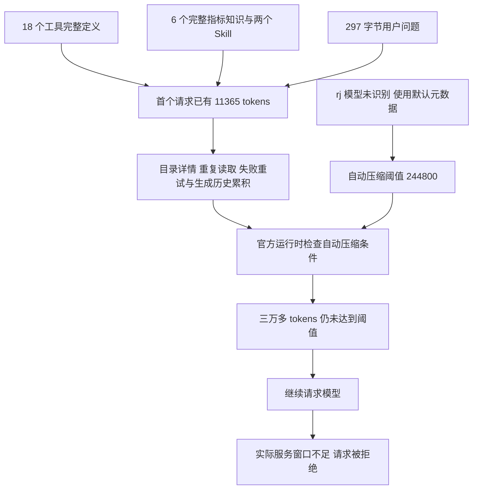

# 上下文增长与自动压缩诊断

日期：2026-09-27。用户要求重点查明上下文增长来源及自动压缩没有触发的原因。本轮读取项目代码、Codex 0.154.0 运行记录及日志数据库，保存诊断证据；运行配置和生产代码保持原状。

## 已确认的结论

初始请求包含较多预先加载的工具定义和知识；后续目录详情、重复读取及失败调用继续增加上下文。自动压缩检测实际执行了，但使用未知模型的默认元数据，阈值为 **244,800 tokens**，在三万多 tokens 时判断仍未达到阈值。

证据见[上下文诊断证据](上下文诊断证据.json)。该文件仅保存体积统计、公开工具名称及压缩判断日志，不复制完整模型内部推理。

## 初始请求为什么已有 11,365 tokens

成功费用运行的第一个模型请求由服务端报告 11,365 个输入 tokens。项目装配时同时传入 18 个工具、个人/企业知识快照和两个业务 Skill。

| 内容                  |    实际规模 | 来源                                                           |
| --------------------- | ----------: | -------------------------------------------------------------- |
| 18 个工具定义         | 37,925 字节 | Agent 允许的完整工具集合，在新线程注册 dynamicTools            |
| 其中保存报表定义      | 12,294 字节 | 含完整报表与查询结构                                           |
| 其中提交知识候选      |  7,272 字节 | 含业务规则与指标结构                                           |
| 其中通用查询          |  6,132 字节 | 含多种 DSL 查询形态                                            |
| 其中保存偏好          |  4,977 字节 | 含偏好类型与业务条件结构                                       |
| 初始 memory           |  9,511 字节 | 包括 6 个已发布指标的完整知识记录，knowledge 部分为 8,968 字节 |
| 两个 Skill 的注入文本 |  5,224 字节 | query-analysis 2,308；query-dsl 2,916，含包装与路径            |
| 用户问题正文          |    297 字节 | 原住院费用问题                                                 |

以上是 UTF-8 字节统计，工具按独立 JSON 序列化计量，不能直接相加作为 token 数，也不能按固定比例归算实际请求的 token 份额。11,365 是服务端实际请求统计。

保存报表、提交知识和保存偏好这三个工具的定义合计 24,543 字节，占工具定义原始字节约 64.7%；当前费用运行没有调用它们。单次 list_sources 对照使用同一 Agent，也预先带着这套工具集合。

对应代码：

- `ai-data/apps/api/src/runtime/analysis-tools.ts` 的 `definitions()` 按 Agent 允许名单生成全部 JSON Schema。
- `ai-data/apps/api/src/runtime/tool-contracts.ts` 复用完整业务合同，包括报表、指标候选与偏好结构。
- `ai-data/apps/api/src/memory/memory-runtime.ts` 的 `snapshot()` 将可见已发布知识取前 30 条装入上下文，本次实际为 6 条，未按本轮问题选择相关知识。
- `ai-data/apps/api/src/runtime/analysis-executor.ts` 将 memory、问题及证据序列化为输入；新线程由 Harness 同时注入两个 Skill。

## 后续增长来源

成功费用运行初始输入为 11,365 tokens，最终一次请求输入为 20,756，最后输出 3,198，单次输入加输出为 23,954。本轮工具输出共 36,184 字节，其中：

| 工具输出         | 次数 |                                      合计字节 |
| ---------------- | ---: | --------------------------------------------: |
| list_datasets    |    2 |                                        24,600 |
| list_metrics     |    1 |                                         6,430 |
| describe_dataset |    1 |                                         2,728 |
| describe_metric  |    1 |                                         1,294 |
| query_metric     |    2 | 1,120（包含一次日期格式失败；成功结果 1,035） |
| search_catalog   |    1 |                                  12（空列表） |

目录工具 `list_datasets` 和 `search_catalog` 返回 `item.dataset`，包含完整列结构；`describe_dataset` 又提供字段和关系详情。当前目录发现和详情读取存在内容重叠。

模型曾使用 `支付流水 支付 payment` 搜索。`business-catalog-service.ts` 的 `searchAuthorized()` 对整个字符串执行 `includes(keyword)`，没有拆分多关键词，因此本次搜索返回空；模型随后读取两页目录再定位支付表。

初始 memory 已带完整指标定义，随后又通过 list_metrics 和 describe_metric 读取指标。调用路径遵循当前 Skill 指引，但与自动知识注入存在重复。

此前超限的费用运行执行 28 次工具调用，其中 12 次对同一对象重复提交相同且不支持的参数化查询。该轮工具输出共 68,646 字节，累计生成 10,571 tokens。重复失败、进一步目录探索与生成内容都在增加历史；不能仅把那 12 条短错误消息看作全部开销。

`total_token_usage` 会累计多次请求中的相同历史；判断单次窗口需使用 `last_token_usage` 或对应压缩检测值，不能将累计用量作为一次请求长度。

## 自动压缩为什么没有触发

官方日志先记录：

```text
Unknown model rj-model-v1 is used. This will use fallback model metadata.
```

在此前超限运行准备继续调用模型前，日志记录：

```text
total_usage_tokens=36408
auto_compact_scope_tokens=36408
auto_compact_scope_limit=Some(244800)
full_context_window_limit=Some(258400)
full_context_window_limit_reached=false
token_limit_reached=false
model_needs_follow_up=true
```

随后服务端因实际输入 34,612 超过可用 32,768 返回错误。36,408 是运行时在其检查时点的上下文计数，34,612 是服务端请求计数；二者的计量实现/时点不同，应各按来源解释。两者均远低于运行时错误沿用的压缩阈值。

项目没有给 rj 模型设置可用窗口元数据，也没有设置 `model_auto_compact_token_limit`。`agent-runtime.ts` 仅从 Agent 或模型的可选 `context_window` 读取值；`codex-analysis-harness.ts` 仅在该值存在时传递 `model_context_window`。当前 v1 两处都未填写，因而使用了官方运行时针对未知模型的默认元数据。

OpenAI Docs 说明：`model_auto_compact_token_limit` 控制自动历史压缩阈值，未设置时使用模型默认值；`model_context_window` 描述模型可用上下文窗口。[官方配置参考](https://learn.chatgpt.com/docs/config-file/config-reference)。本项目实际阈值取自当前安装的 0.154.0 日志，未按最新文档猜测数值。

项目中的 `onCompaction` 与 `contextCompaction` 处理负责保存、展示官方已发生的压缩事件，不负责主动触发压缩。所核对的两条费用线程中没有压缩模块日志，公开运行记录也没有压缩事件；相应检测明确显示阈值未达到。

现有 `max_context_bytes: 65536` 检查的是本次交给 Harness 的业务输入 JSON；工具返回还有独立的单次 65,536 字节限制。两者都不是官方线程累计 token 用量的压缩条件。



## 后续处理方向

### 模型上下文可以通过现有服务接口读取

2026-09-27 对当前 `http://192.168.110.208:8000` 执行只读能力探测，两个接口均返回 HTTP 200。结果保存在[模型能力探测](模型能力探测.json)，仅保留能力字段，不保存认证信息或完整聊天模板。

| 接口             | 字段                                | 实际返回 | 含义                                   |
| ---------------- | ----------------------------------- | -------: | -------------------------------------- |
| `GET /v1/models` | `data[0].meta.n_ctx`                |   32,768 | 当前服务可用上下文                     |
| `GET /props`     | `default_generation_settings.n_ctx` |   32,768 | 当前服务可用上下文，与模型接口一致     |
| `GET /v1/models` | `data[0].meta.n_ctx_train`          |  262,144 | 模型训练上下文，不能代替当前服务可用值 |

llama.cpp 官方文档提供上述两个查询接口，并说明 `GET /props` 默认可读；开启修改全局属性的启动选项针对 POST，不是本次查询的前提。[官方服务接口说明](https://github.com/ggml-org/llama.cpp/blob/b10603/tools/server/README.md)。当前部署实际返回的字段以探测文件为准，不推断其构建版本。

当前 `apps/api/src/models/model-service.ts` 的 `resolve()` 只从数据库配置读取可选 `context_window`，没有向服务端探测。服务端已有可用信息，项目尚未将它传给运行时。不同提供方的兼容接口不保证返回相同扩展字段，后续能力发现需要按提供方处理，并保留显式配置作为回退。

### 按需读取目前只覆盖部分环节

数据查询和 Skill 子文档由模型调用工具时读取，但初始装配仍预先注册 Agent 允许的全部工具定义，并注入已发布知识快照。目录发现还返回完整字段，之后描述工具再次读取详情。因此当前实现没有贯穿“先发现、再读取相关详情”的流程。

后续应让目录和知识发现优先返回简要索引，详情按问题相关性读取；工具定义精简或按需加载需先核对当前官方运行时协议支持，不能假定同一线程可随意追加动态工具。服务能力探测应将实际窗口传给运行时，并据此预留输出及压缩余量，再通过真实压缩与继续执行验证。

### 待审批的实施范围

实施前按项目审批规则细化具体文件与验证清单：

1. 精简初始工具与知识注入，区分当前场景需要的能力和可按需读取的定义，保留原有业务能力与权限校验。
2. 调整目录发现与详情读取的内容边界，处理实际出现的多关键词搜索和重复无效调用路径。
3. 为运行时提供与当前模型一致的能力元数据及合理压缩触发依据，让长任务通过压缩继续执行；阈值应来自模型配置与可用能力，而不是在业务代码里固定一个 32K 截止值。
4. 在隔离配置下验证压缩确实触发、完成后保留问题/日期/指标口径/证据引用，并继续调用工具和完成答复，再验证刷新及后续追问。

本轮完成原因定位，尚未改动这四项行为。此前 CUDA 超时属于另一条故障链，本次上下文证据不能替代 GPU 根因诊断。
