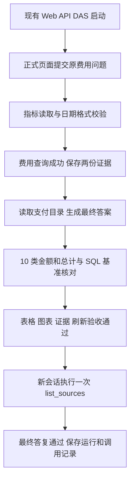

# 费用查询与单次工具调用复验

日期：2026-09-27。用户要求在当前模型配置下复验，并核对少量工具调用与此前失败的关系。主代理单独执行，沿用已安装依赖。

## 本轮结果

| 场景           | 工具调用 | 模型运行耗时 | 最后一次请求输入 / 输出 tokens | 结果                                     |
| -------------- | -------: | -----------: | ------------------------------ | ---------------------------------------- |
| 原住院费用问题 |        8 |   242.681 秒 | 20,756 / 3,198                 | completed，最终答案、查询证据与页面通过  |
| 单次目录查询   |        1 |    10.708 秒 | 11,396 / 37                    | completed，返回 1 个数据源 clinical-demo |

费用运行 ID：`6f02114c-04d3-4fe6-b4f6-1dc78d412674`；会话 ID：`dba37d95-3e09-402f-8e38-d1ab70e37c28`。

单工具运行 ID：`357fbae4-560a-4443-8d82-0c3ce05f2658`；会话 ID：`e0f93fac-4bba-4a56-96f5-8f165c93d188`。

费用的 10 类金额及总计均与此前独立 SQL 基准逐项一致，最终回答中的分转元也一致：226,315,800 分，即 **2,263,158.00 元**。正式页面的表格、柱状图、证据、刷新恢复和退出登录通过，SSE 返回 200，页面异常为 0。详情见[费用结果核对](费用结果核对.json)、[完整运行与事件](fees-模型验收.json)、[结果截图](fees-结果.png)和[图表截图](fees-图表.png)。

单工具场景通过同一正式 API、同一验收账号、同一 Agent v1 运行；实际仅调用 `list_sources` 一次并返回最终答复。见[单工具结果](单工具复验.json)及[复验脚本](单工具复验.mjs)。

## 实际调用过程

费用问题要求同时解释费用与支付流水，模型除金额查询外还读取了支付目录：

1. `list_metrics`、`describe_metric` 读取指标。
2. 首次 `query_metric` 使用纯日期，被现有指标日期时间校验拒绝。
3. 第二次 `query_metric` 改为完整时间，成功取得 v2 的分组和总计。
4. `search_catalog`、两次分页 `list_datasets`、`describe_dataset` 读取支付相关目录。
5. 生成费用分类表、总计及费用与支付流水的说明。

这一过程共 8 次工具调用，其中金额查询尝试 2 次、成功 1 次。工具调用数包含目录与指标说明，不能只统计实际 SQL 查询。

## 历史失败与当前证据

从官方运行记录中仅提取公开工具调用、返回大小、token 统计和终态，保存在[工具与上下文对照](工具与上下文对照.json)。

| 历史费用运行 | 实际工具次数 | 已确认事实                                                                                                                      |
| ------------ | -----------: | ------------------------------------------------------------------------------------------------------------------------------- |
| 19:18 启动   |           16 | 没有最终答复；最后一次输入 31,226、输出 1,541，合计 32,767 tokens，接近服务端上限。缺少明确结束原因，不能仅凭统计认定截断原因。 |
| 19:25 启动   |           28 | 对同一不支持参数化查询的对象重复提交 12 次相同查询；之后服务端明确拒绝 34,612 tokens 的请求，上限为 32,768。                    |
| 19:35 启动   |            9 | 已取得正确费用证据，最终答复前流中断。用户提供的服务日志包含 CUDA 执行超时与进程中止。                                          |

当前模型与 Agent 都为 v1，管理接口读回仍未设置 `context_window`。Agent 限制为 `timeout_ms: 600000`、`max_tool_calls: 30`、`max_context_bytes: 65536`。运行记录中的 `model_context_window` 实际为 **258,400**，与服务端 32,768 不一致。费用首个请求已有 11,365 输入 tokens；工具输出与后续生成继续增加上下文。累计 `total_token_usage` 包括重复传入的历史，不能当作单次请求长度；本记录使用各次 `last_token_usage` 对照窗口。

这项窗口配置缺口属于项目运行时适配问题，配置调整仍按[既有接续清单 B](../../费用模型复验与第5步接续清单.md)审核。本轮没有发布配置版本。

用户确认当前及之前均设置了 `GGML_CUDA_DISABLE_GRAPHS=1`，因此本轮成功不能归因于新关闭 CUDA Graphs。另经核对 b10603 源码，日志中的 `graphs reused` 来自 `llama_perf_context(...).n_reused`，统计上层计算图复用；它不能单独证明 CUDA Graphs 已开启。此前依据该日志判断开关状态的说法应予纠正。[服务日志来源](https://github.com/ggml-org/llama.cpp/blob/b10603/tools/server/server-context.cpp#L562)、[复用计数实现](https://github.com/ggml-org/llama.cpp/blob/b10603/src/llama-context.cpp#L1229)。

本轮两组请求均完成，未复现 CUDA 崩溃；此前服务端 CUDA 超时的底层触发原因仍未定位，不能据此宣称长期稳定性问题已修复。

## 执行范围与接续

- 恢复现有 `pnpm dev`，Web 5173、API 3101、DAS 3102 健康检查通过。开发服务保留运行。
- 新建两个验收会话及相应运行、事件、证据；业务数据库执行只读查询。
- 使用既有费用浏览器脚本，新建本目录内的单工具复验脚本及结果；旧费用记录先保存为 [fees-复验前.json](fees-复验前.json)。
- 生产代码、模型启动参数、模型/Agent/Skill 版本保持本轮开始状态；依赖操作与子代理数量为 0。
- 第 4 步费用原场景本轮已通过。第 5 步原实施批准继续有效，本轮按用户要求完成模型测试与故障定位，第 5 步页面尚未实施。
