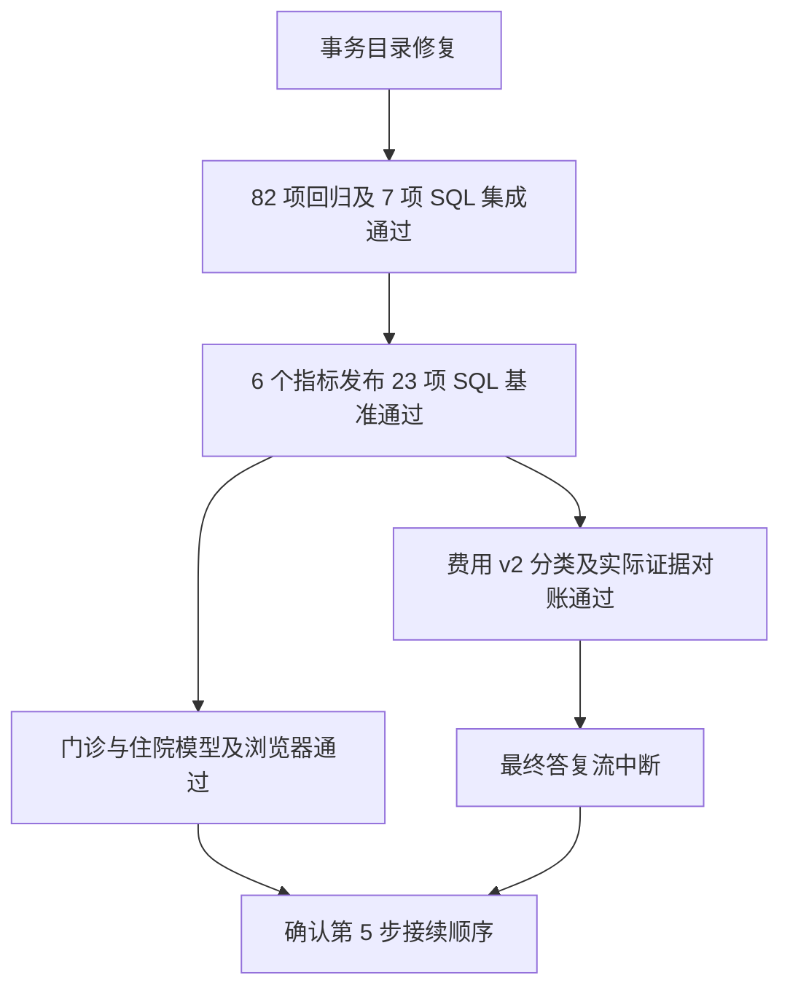
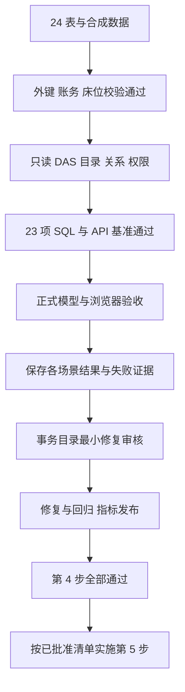

# 演示业务库与第 4 步真实验收

日期：2026-09-27。执行者：主代理。最新状态：费用原问题本轮已完整通过，10 类金额、总计、最终答复及浏览器与 SQL 基准一致；单次工具调用对照也通过。第 5 步原批准继续有效，页面尚未实施。运行时窗口与服务端窗口不一致的配置问题已确认，CUDA 历史崩溃本轮未复现。详细结果、调用数、token 统计及流程图见[模型复验说明](20260927-模型复验/复验说明.md)。以下保留前次复验记录。

## 模型恢复后的最新复验

用户回复“模型修复了，继续”后，完成三个 API 生产文件的事务目录修复。新单元测试和单连接 SQL 事务场景先复现失败，再完成修复；82 项相关普通测试、7 项真实 SQL 集成及类型、lint、格式检查通过。见[修复交付与流程图](../前端第4步事务目录修复交付.md)。

| 项目           | 最新结果                                                                                                                                        |
| -------------- | ----------------------------------------------------------------------------------------------------------------------------------------------- |
| 正式 SQL/API   | 修复后 23 项全部复验通过。                                                                                                                      |
| 门诊           | 模型 completed，各科室及 763 人次／763 人与 SQL 完全一致。消化科 61 人次；刷新后追问无新增查询。表格、图表、依据、SSE、退出通过，页面异常为 0。 |
| 住院           | 已通过的入院 40、出院 0、在院 200 及浏览器结果保留。                                                                                            |
| 指标           | 6 个指标已发布；门住院费用 v2 补齐费用分类维度，保留原 v1。重复运行准备脚本可读取候选当前状态并正常结束。                                       |
| 费用 v2 对账   | 门诊 9 月 8,964,558 分；住院 1 月 1 日至 9 月 27 日 226,315,800 分。各自 10 个分类与独立 SQL 一致。                                             |
| 费用真实模型   | 最新运行正确执行 v2，日期、10 类金额和总计均通过证据核对；最终答复前 Responses 流中断，端到端验收未通过。                                       |
| 造数与指标测试 | 5 项通过。分类维度用例先失败，再补配置通过。                                                                                                    |
| Web 回归       | 11 个测试文件、66 项通过；第 5 步测试准备已归档，应用测试入口保持通过。                                                                         |
| 依赖及分工     | 安装、升级、卸载为 0，锁文件和依赖元数据哈希保持不变；主代理单独实施。                                                                          |

费用本次三轮记录分别为：模型结束但没有最终答复；服务明确返回 34,612 tokens 超过 32,768 上下文；v2 取得正确证据后流中断。记录见[公开终态](费用复验失败记录.json)、[v2 基准](费用指标v2基准.json)、[实际证据核对](费用查询证据核对.json)及 `fees-模型验收.json`。两次先前失败另存 `fees-空答复失败.json`、`fees-第二次空答复失败.json`。

模型和 Agent 均未显式设置 `context_window`。`max_context_bytes: 65536` 为业务输入字节限制，不是 token 窗口。当前保持模型／Agent 配置，等待接续顺序或窗口适配范围确认。



以下保留首轮阶段事实，状态以本节最新复验为准。

## 已完成

- 在本机 SQL Server 新建 `ai_bi_demo`，24 张表共 **475,793 行**合成记录。API/DAS 系统库继续为 `ai_to_bi`。
- 数据字典、主外键、索引、字段说明和账务校验已保存。数据库读回验证表数量、外键、结算金额、付款与退款、预交金抵扣及床位占用区间。
- `ai_bi_demo_reader` 对业务表仅有 SELECT；DAS 数据源标识 `clinical-demo`，24 个对象已暴露，122 条定向关系已发布。
- `demo_full` 可查询全部 24 个对象；`demo_dept` 可查询 23 个对象，患者档案拒绝，其余业务表按科室 1 限制。
- 正式 SQL/API **23 项基准通过**：门诊人次与去重、挂号／就诊不同时间、LEFT JOIN、多明细去重、入院／出院／在院、门住院费用分类、费用冲销、结算及收退款的独立日期口径、预交金、空结果、100 行截断、门诊及住院科室权限。

## 首轮真实模型与浏览器记录

| 场景     | 实际状态                                                                                                                                                                |
| -------- | ----------------------------------------------------------------------------------------------------------------------------------------------------------------------- |
| 门诊首轮 | 失败。反复提交缺少分组输出列的预聚合查询，最终超过 30 次工具预算。按科室的成功查询遗漏日期范围，不能用于本次问题。首次记录和截图已独立保留。                            |
| 住院     | 模型 completed；9 月入院 40、出院 0、截止 9 月 27 日 18 点在院 200，与独立 SQL 基准一致。实际条件、5 份证据、表格、柱状图、刷新同一会话和退出登录通过；浏览器异常为 0。 |
| 门诊复验 | 失败。目录工具调用成功后，模型 `/v1/responses` 返回 HTTP 503，本轮没有 SQL 证据。                                                                                       |
| 费用     | 失败。目录与 Skill 读取成功后，模型流连接中断，底层错误为 `error decoding response body`，本轮没有 SQL 证据。                                                           |

住院首次结果读取曾返回 500。代码和运行日志显示，5 份证据同时复核目录，超过新源最初配置的 2 个活动／2 个排队任务。演示源通过既有管理接口调整为并发 16、连接池 8，30 秒超时及 5,000 行上限保持原配置。随后恢复同一运行，结果读取和浏览器流程通过。此配置用于本机演示验收，尚未做多用户容量测量。

另已复现正式指标提交失败：DAS 健康且普通目录返回 24 个对象，但 `/admin/metrics` 返回 `503 DATA_SOURCE_UNAVAILABLE`。事务目录重新创建空会话服务导致此问题，报表复用该工厂。拟修改 3 个 API 文件及补回归测试，见[事务目录修复清单](../前端第4步事务目录修复清单.md)。API 生产代码尚未修改，等待该额外范围审核。

模型服务最后只读探测：访问 `192.168.110.208:8000/health` 时，目标端口拒绝连接，未取得 HTTP 响应。最初沙箱内探测被网络权限阻止，获准提权后的探测明确为连接拒绝；两者不混为同一故障。需服务恢复后继续真实模型验收。底层终态错误见[模型服务失败记录](模型服务失败记录.json)。

## 本轮检查结果

| 检查                 | 结果                                                                |
| -------------------- | ------------------------------------------------------------------- |
| 造数与指标粒度测试   | 4 项通过；费用指标按 `charge_id` 去重，避免合并金额相同的不同费用。 |
| SQL/API 基准         | 容量配置调整后复验，23 项通过。                                     |
| 住院真实模型／浏览器 | 模型结果、表格、图表、证据及刷新恢复通过。                          |
| 门诊真实模型／浏览器 | 首轮查询构造失败，复验遇模型 503，未通过。                          |
| 费用真实模型／浏览器 | 模型流中断，未通过。                                                |
| 指标发布             | 事务目录缺陷导致 503，未通过。                                      |
| ESLint               | 本轮脚本及测试通过。                                                |

第 4 步整体尚未通过，当前未开始第 5 步业务代码。

## 文件与运行

| 位置                                                  | 用途                                                                         |
| ----------------------------------------------------- | ---------------------------------------------------------------------------- |
| `ai-data/scripts/demo-data/schema.mjs`、`fixture.mjs` | 24 表定义、确定性生成及关系／账务校验。                                      |
| `ai-data/scripts/demo-data/database.mjs`、`seed.mjs`  | 固定目标保护、建库、批量写入及数据库读回。                                   |
| `ai-data/scripts/demo-data/api.mjs`、`provision.mjs`  | 正式 API 接入、目录、关系及验收身份配置；保存完成检查点。                    |
| `ai-data/scripts/demo-data/query-acceptance.mjs`      | 专用只读账号的独立 SQL 与正式 API 查询比对。                                 |
| `ai-data/scripts/demo-data/browser-acceptance.mjs`    | 正式页面、当前 rj 模型、证据与刷新恢复验收，支持读取已知运行继续浏览器验证。 |
| `ai-data/scripts/demo-data/metrics.mjs`               | 6 项指标准备与审核发布流程；当前因事务目录问题未发布成功。                   |
| `ai-data/scripts/demo-data/diagnose.mjs`              | 保存健康目录与指标错误对照，以及首轮门诊公开工具输入／输出。                 |
| `ai-data/scripts/tests/demo-data.test.mjs`            | 生成约束、错误金额、目标库保护、费用去重键测试。                             |

生成凭据分别保存在已被 Git 忽略的 `apps/data-access/secrets/clinical-demo.json` 和 `apps/api/secrets/clinical-demo-accounts.json`。DAS 的本地配置增加 `clinical-demo` SQL Server 传输配置。现有管理 API 未提供角色创建，准备脚本初始化两个演示角色；其他接入配置通过现有管理接口完成。

在 `D:\porject_new_2026\ai-data\ai-data` 下使用现有依赖执行：

```powershell
node --test scripts/tests/demo-data.test.mjs
node scripts/demo-data/query-acceptance.mjs
node scripts/demo-data/browser-acceptance.mjs outpatient
node scripts/demo-data/browser-acceptance.mjs inpatient
node scripts/demo-data/browser-acceptance.mjs fees
node node_modules/eslint/bin/eslint.js scripts/demo-data scripts/tests/demo-data.test.mjs
```

造数入口 `node scripts/demo-data/seed.mjs` 检查固定库名、创建标记及表数量；已有库只在标记匹配后继续读回验证。接入入口 `node scripts/demo-data/provision.mjs` 按检查点跳过已完成配置。

## 接续流程



本轮新增依赖、安装、升级及卸载为 0；子代理为 0。第 5 步的批准继续有效。
