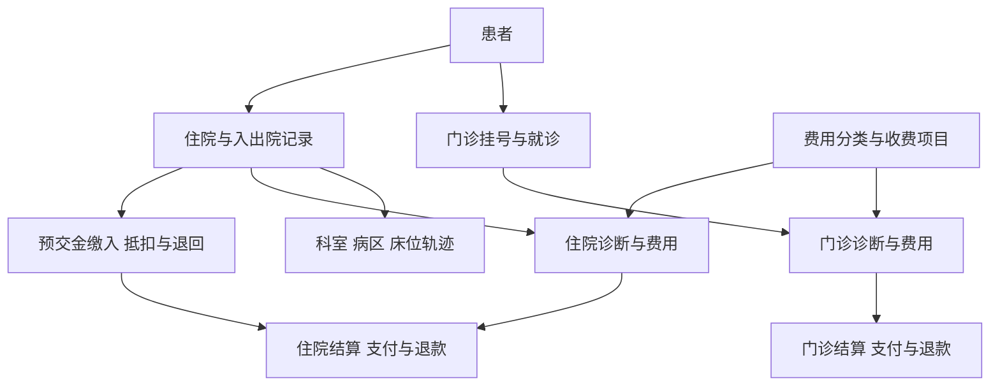

# 前端第 4 步业务造数与验收讨论稿

日期：2026-09-27。状态：**用户已批准 24 表方案并要求验收成功后直接实施第 5 步，当前执行中。**

执行进度：独立库 `ai_bi_demo` 已创建，24 张表共 475,793 行已导入；外键、金额对账、床位区间经数据库读回校验通过。专用登录 SELECT 为 1，INSERT／UPDATE／DELETE 均为 0。正式服务接入和模型浏览器验收继续执行；实际结果见[数据库验收](前端第4步业务造数与验收/数据库验收.json)。

用户已批准 **24 张表，约 48 万行合成数据**，包含门诊、住院、费用、结算、预交金与收退款；验收成功后继续第 5 步。本稿保留获准建设范围，实际执行结果补充在[阶段记录](前端第4步业务造数与验收/阶段记录.md)。

## 1. 创建位置

| 项目            | 已核对事实／建议                                                                                       |
| --------------- | ------------------------------------------------------------------------------------------------------ |
| SQL Server 实例 | 当前配置为 `127.0.0.1:1433`。                                                                          |
| 系统元数据库    | API 与 DAS 当前均使用 `ai_to_bi`，保存账号、模型、会话、目录、权限、执行与审计等系统记录。             |
| 拟新增业务库    | **`ai_bi_demo`**，建在同一 SQL Server 实例，业务表使用 `dbo` Schema。                                  |
| 本轮只读检查    | 已连接 `master` 检查库名与权限：当前 `ai_bi_demo` 不存在，现有配置账号具备创建数据库与登录的权限。     |
| 接入标识        | 拟新增 DAS 数据源 `clinical-demo`，目标库明确为 `ai_bi_demo`。                                         |
| 凭据分工        | 建库、造数由准备脚本使用现有配置凭据；DAS 使用新建的只读登录 `ai_bi_demo_reader`，授权限于演示业务表。 |

`ai_to_bi` 继续承担系统存储。接入演示库时，通过现有管理 API 在系统库新增数据源、对象目录、关系、权限及验收账号；业务明细存入 `ai_bi_demo`。确认后实施前再次检查目标库名；如果已出现同名库，停止并核对，不覆盖既有内容。

## 2. 建议 24 张关联表

表数量由 **7 张基础字典与档案 + 7 张门诊表 + 10 张住院表** 组成。首批目标共 475,793 行，约 48 万行；实际生成数量和校验结果在实施后单独记录。

### 2.1 基础字典与档案：7 张

| 表                  | 中文含义     | 目标行数 | 关联与主要用途                                                   |
| ------------------- | ------------ | -------: | ---------------------------------------------------------------- |
| `campuses`          | 院区         |        3 | 院区维度，与科室关联。                                           |
| `departments`       | 科室         |       18 | 归属院区；用于工作量、费用归属及行权限。                         |
| `doctors`           | 医生         |       90 | 归属科室；用于门诊与住院医生工作量。                             |
| `patients`          | 合成患者档案 |   15,000 | 门诊与住院共用患者 ID，支持复诊、再次住院和跨场景去重。          |
| `diagnoses`         | 诊断字典     |      200 | 合成分类代码和名称，供门诊及住院诊断引用。                       |
| `charge_categories` | 费用分类     |       10 | 药品、检查、检验、治疗、手术、护理、床位、材料、诊察、其他。     |
| `charge_items`      | 收费项目     |      300 | 关联费用分类，记录项目、规格及计价单位；实际单价保存在费用明细。 |

### 2.2 门诊业务及费用：7 张

| 表                          | 中文含义     | 目标行数 | 关联与主要用途                                                                           |
| --------------------------- | ------------ | -------: | ---------------------------------------------------------------------------------------- |
| `registrations`             | 挂号记录     |   30,000 | 关联患者、挂号科室及医生；记录挂号时间和取消状态。                                       |
| `visits`                    | 门诊就诊记录 |   24,000 | 关联挂号，记录就诊科室、医生、时间及状态；每个挂号至多一条就诊。                         |
| `visit_diagnoses`           | 门诊诊断明细 |   36,000 | 就诊与诊断的关联表，区分主诊断；验证多明细关联与去重。                                   |
| `outpatient_charge_details` | 门诊费用明细 |   96,000 | 每条费用关联就诊、项目、开单及执行科室／医生；保存数量、单价、金额、发生时间和有效状态。 |
| `outpatient_settlements`    | 门诊结算单   |   22,000 | 关联就诊；保存结算时间、费用合计、优惠、患者与医保等应付分摊。                           |
| `outpatient_payments`       | 门诊支付流水 |   30,000 | 关联结算单，记录付款方、渠道、金额、成功状态和时间；允许分次支付及待收款。               |
| `outpatient_refunds`        | 门诊退款流水 |    2,000 | 关联原支付及结算单，记录退款状态、金额和时间，支持部分及跨月退款。                       |

### 2.3 住院业务及费用：10 张

| 表                               | 中文含义           | 目标行数 | 关联与主要用途                                                                                     |
| -------------------------------- | ------------------ | -------: | -------------------------------------------------------------------------------------------------- |
| `wards`                          | 病区               |       12 | 关联院区和科室，提供住院空间维度。                                                                 |
| `beds`                           | 床位               |      360 | 关联病区，记录床号和启用状态。                                                                     |
| `admissions`                     | 住院记录           |    4,000 | 每次住院一个 ID，关联患者；包含入出院时间、入出院科室、主管医生、在院／出院状态。                  |
| `inpatient_stays`                | 住院科室与床位轨迹 |    6,500 | 按住院 ID 保存连续的科室、病区、床位及起止时间，覆盖首次入科、转科和转床。                         |
| `inpatient_diagnoses`            | 住院诊断明细       |   10,000 | 关联住院与诊断，区分入院／出院诊断及主诊断。                                                       |
| `inpatient_charge_details`       | 住院费用明细       |  180,000 | 按住院关联项目、发生科室、开单与执行科室／医生、费用日期、数量、单价和金额；保留冲销关联。         |
| `inpatient_settlements`          | 住院结算单         |    4,200 | 关联住院，覆盖中途和出院结算；保存应收、优惠、患者／医保分摊、预交金抵扣和结算状态。               |
| `inpatient_deposit_transactions` | 住院预交金台账     |   10,000 | 关联住院，区分缴入、结算抵扣、抵扣撤回和余额退回；抵扣关联结算单，撤回关联原抵扣，退回关联原缴入。 |
| `inpatient_payments`             | 住院支付流水       |    4,500 | 关联结算单，记录患者补缴及医保等实际到账；与预交金台账分别保存。                                   |
| `inpatient_refunds`              | 住院退款流水       |      600 | 关联原结算款项，记录结算后退款；原款项明确指向支付流水或已抵扣的预交金台账。                       |

科室字段明确区分挂号、就诊、入院、出院、费用发生、开单和执行归属。住院转科后按轨迹确定相应时间的归属；查询按所选口径统计，关联和权限配置同步遵循该口径。

### 2.4 费用与金额如何对齐

- **费用明细**保存发生了什么项目、数量、单价、金额与发生时间，按费用分类分析药费、检查检验费、治疗费等。部分冲销单独留记录并关联原费用，金额使用有界的整数分进行造数和基准对账。
- **结算单**归集有效费用并记录优惠及应付分摊。每条费用至多归属一张有效结算单，未结算费用允许暂不关联；同次就诊或住院可以有多次结算。费用冲销和结算撤销保留原单关系与状态。
- **支付与退款**记录实际现金流，结算的医保应付额与医保实际到账分别保存。结算单应收及费用金额不与支付流水相加。
- **预交金台账**分别记录缴入、抵扣、抵扣撤回和余额退回；抵扣只减少预交金余额并增加结算已付，不重复计作现金收入。撤销结算时，关联原抵扣并恢复相应余额；余额退款与结算后退款采用各自流水，避免同一退款重复记录。
- **基准对账**分别核对有效费用与结算金额、患者／医保等应付分摊、到账及欠款、预交金余额与退款。已完成结算和部分支付采用各自的状态约束。
- **统计时间**分别使用费用发生、结算、支付、退款及入出院时间。例如期间净现金流为同期成功收款减成功退款，结算抵扣不计作新收款；费用分类占比使用有效费用口径。

## 3. 数据如何生成

- 时间范围建议为 **2025-01-01 至 2026-09-27**，保存固定造数基准日期和随机种子；执行时按最终获准日期落文件，验收问题使用明确时间范围。
- 保留月份波动、科室差异、复诊、取消挂号、未就诊、未收费、部分缴费、部分退费、跨日就诊和跨月退费等场景。
- 住院增加跨月住院、仍在院、已出院、同日入出院、再次住院、转科转床、中途结算、预交金多次缴入、抵扣和余额退回场景。每位患者可以有多次独立住院，住院轨迹时间连续且同一床位的占用区间不重叠。
- 设置有外连接缺失项的有效业务记录、可空说明字段和没有业务记录的维度，验收空结果与 LEFT JOIN；主外键和业务金额约束保持有效。
- 固定少量可人工复核的样例，另外生成规模数据。固定样例包含多条诊断与多条收费，验证多明细 Join 时人次、人数及金额不被重复累计。
- 日期、状态、主外键和金额保持一致：原款项累计成功退款不超过其可退金额，抵扣不超过可用预交金，结算实付及欠款与有效应付对应；取消、冲销和未完成记录按明确口径计入或排除。
- 全部为合成业务记录；名称使用测试标识，联系方式等字段如需验证脱敏使用明确虚构格式。
- 配置主键、外键、唯一约束及日期／科室／关联键索引，保存数据字典、字段注释、统计口径和验收 SQL。

## 4. 第 4 步的最后验收

先生成独立 SQL 基准结果，再从正式浏览器登录，通过当前 rj 模型、API 和 DAS 查询演示库，对比页面、证据与基准。验收完成后保留演示库，供后续报表阶段使用。

| 场景                       | 验收点                                                                                                              |
| -------------------------- | ------------------------------------------------------------------------------------------------------------------- |
| 指定月份按科室统计就诊人次 | 按已完成就诊记录计数，表格、柱状图和证据一致。                                                                      |
| 同一月份人次与患者人数     | `visit_id` 计人次、`patient_id` 去重计人数，复诊不会误算。                                                          |
| 挂号时间与就诊时间         | 跨日／跨月样例结果不同；问题含糊时明确或澄清日期口径。                                                              |
| 诊断、收费与就诊多表关联   | 一对多及多明细关联不放大计数／金额，保留所需未匹配记录。                                                            |
| 入院、出院与指定时点在院   | 分别按入院时间、出院时间和住院区间统计；跨月住院及同一患者再次住院的口径正确。                                      |
| 住院天数、转科与床位轨迹   | 演示口径使用出院日期减入院日期，同日入出院计 1 天；在院天数使用指定截止日期单独统计。转科前后记录及费用归属可核对。 |
| 门诊与住院费用分类         | 分别核对各月各科室的药品、检查、检验、治疗、手术、护理、床位、材料等费用、分类占比和次均费用；分母与筛选人群一致。  |
| 费用发生、结算与到账       | 分开核对有效费用、优惠、患者／医保应付及实际收款；跨月和未结算记录可追溯。                                          |
| 预交金、退款与净现金流     | 验证缴入、抵扣、余额退回及结算后退款；同一抵扣不重复计收入，退款不重复扣减。                                        |
| 明细和空条件               | 验证样本、完整已交付证据、虚拟表格、分页、截断与空结果；遵守现有 5,000 行／2 MiB 结果预算。                         |
| 工具与分析过程             | 实际目录发现、查询、证据、模型答复及 SSE 终态均可追溯。                                                             |
| 刷新恢复与同会话追问       | 恢复同一对话；依赖已有结果的问题检查复用，改变筛选的问题检查新查询。                                                |
| 权限和账号切换             | 新建演示全量／单科室两个测试角色及对应账号；只在演示数据源授予对象、列和行范围，检查结果与缓存隔离。                |

准备工作包括：在 DAS 注册只读凭据和单库数据源、发现并暴露这 24 张表、通过 API 维护中文目录说明和批准关系、设置演示角色及必要指标口径。测试角色覆盖门诊和住院各自的科室归属，费用明细的执行／发生科室按批准口径限制。全部沿用现有管理接口。真实模型运行失败或统计不符时记录具体环节，在已批准范围内排查；需要修改合同、后端能力或扩大范围时另提调整清单。

## 5. 拟涉及文件和配置

| 操作             | 范围                                                                                  | 内容                                                                                     |
| ---------------- | ------------------------------------------------------------------------------------- | ---------------------------------------------------------------------------------------- |
| 新增             | `ai-data/scripts/demo-data/`                                                          | 建库与建表、确定性造数、接入准备及基准校验脚本；执行目标固定为获准库名，凭据运行时读取。 |
| 新增             | `ai-data/scripts/tests/` 中对应测试                                                   | 验证造数约束、重复运行保护和统计基准；使用现有工具。                                     |
| 修改             | `ai-data/apps/data-access/config/das.config.json`                                     | 为 `clinical-demo` 增加所需 SQL Server 传输配置，必要时重启 DAS 生效。                   |
| 新增系统记录     | 既有 API／DAS 管理接口                                                                | 数据源、凭据引用、对象白名单、中文目录、关系、验收角色／账号和必要统计口径。             |
| 新增本地私密文件 | 已被 Git 忽略的 secrets 目录                                                          | 保存生成的演示只读账号及验收账号凭据，交接与日志仅保留引用。                             |
| 新增／更新       | `任务交接/前端第4步业务造数与验收/`、第 4 步交付说明、正式联调记录、前端流程与 README | 数据字典、验收问题、SQL 基准、截图、执行结果及交接流程图；README 追加。                  |

计划由主代理单独实施，子代理为 0；新增依赖及安装操作为 0。沿用已安装的 SQL Server 驱动、Node 和 Chromium。建库及数据准备脚本支持检查和继续已确认的准备步骤；不自动删除或重建数据库。

## 6. 执行顺序

目标库 `ai_bi_demo` 已按获准范围建立并接入。SQL/API 基准 23 项通过；真实模型与浏览器验收继续执行。发现事务目录误判 DAS 不可用，具体复现、最小后端修复范围及审核点见[修复清单](前端第4步事务目录修复清单.md)。
