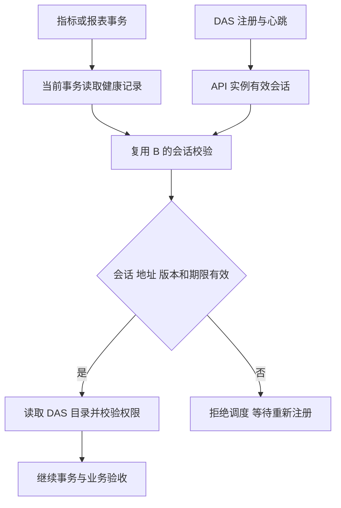

# 第 4 步真实验收：事务目录修复清单

日期：2026-09-27。状态：用户回复“模型修复了，继续”后已完成本清单的最小修复和回归。交付见[事务目录修复交付](前端第4步事务目录修复交付.md)。门诊与住院通过，费用模型最终答复仍待通过；第 5 步原批准保留。

## 已复现的问题

- 正式 API 的 DAS 注册状态健康，`clinical-demo` 的 24 张表可读取；11 项正式 `/query` 与独立 SQL 基准核对通过。
- 通过 `/admin/metrics` 提交指标时返回 503，提示当前没有可用的数据访问服务。
- `create-memory-services.ts` 每次建立事务目录时都会新建 `DataAccessSessionService`。该对象的有效会话存在实例内存中，新对象没有注册会话，因而把数据库中的健康记录全部过滤掉。
- 报表装配复用同一组事务目录／授权工厂，后续报表定义及执行的权限核对也受影响。
- 首轮真实模型另有独立问题：重复构造不合法的预聚合查询，工具已返回“分组字段必须作为非聚合输出列”，最终超过 30 次工具预算。期间成功的 9 月汇总为 763 人次／763 人；其按科室查询遗漏日期条件，不能算业务验收通过。会话和失败记录保留。

## 拟修复范围

目的：事务内读取目录时复用 API 实例的有效 DAS 会话，同时保持事务 SQL executor 和既有认证约束。

| 文件                                                                        | 改动                                                                                             |
| --------------------------------------------------------------------------- | ------------------------------------------------------------------------------------------------ |
| `ai-data/apps/api/src/data-access/data-access-session-service.ts`           | 允许健康发现使用调用方提供的只读健康仓储；有效会话、地址、凭据版本与过期检查仍由原服务实例执行。 |
| `ai-data/apps/api/src/memory/create-memory-services.ts`                     | 注入启动时创建的会话服务，事务目录通过当前 SQL executor 查询健康记录，复用其会话校验。           |
| `ai-data/apps/api/src/index.ts`                                             | 将已有 DAS 会话服务注入记忆／指标／报表共用装配。                                                |
| `ai-data/apps/api/tests/data-access/`、`tests/memory/` 及必要的隔离集成用例 | 覆盖有效会话复用、过期／禁用／换地址拒绝、API 重启需重新注册、事务连接复用。                     |
| 本清单、任务交接记录及验收目录                                              | 保存前后复现结果、测试结果与流程图。                                                             |

主代理单独实施，新增依赖、安装、卸载、数据库结构变更均为 0。正常开发 watcher 会重启 API，随后等待 DAS 重新注册。模型、Agent 与 Skill 配置调整不包含在本修复清单中。

## 验证顺序

1. 先写行为测试并确认当前装配无法复用已注册会话。
2. 完成最小修复，验证事务查询使用指定 executor，过期及不可信会话继续拒绝。
3. 运行受影响 API 测试、类型、lint 与格式检查；使用隔离 SQL 环境检查事务连接约束。
4. 正式 API 重启后确认 DAS 自动重新注册；发布演示指标并读取验证。
5. 继续门诊、住院、费用的真实模型与浏览器验收；对比独立 SQL 基准。
6. 第 4 步全部通过后按已经批准的清单继续第 5 步。

申请依据：项目根 `AGENTS.md` 要求“额外想法、优化、架构调整和超出已批准清单的改动，先提出并等待用户确认”；第 5 步清单明确将 API 生产代码排除在其文件范围外。因此先提交本次实际缺陷的最小调整清单。
