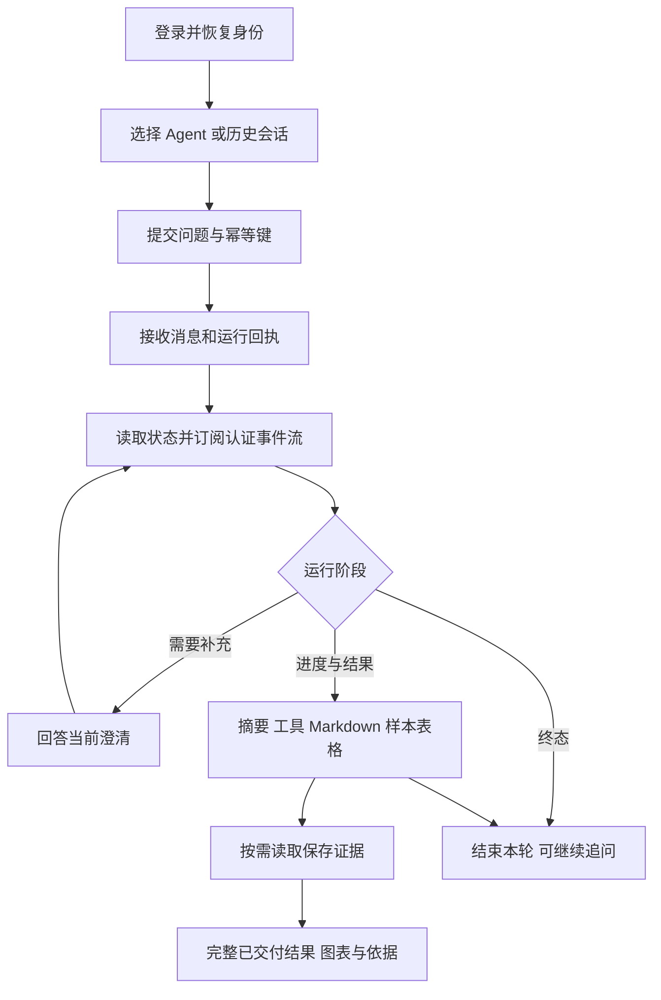
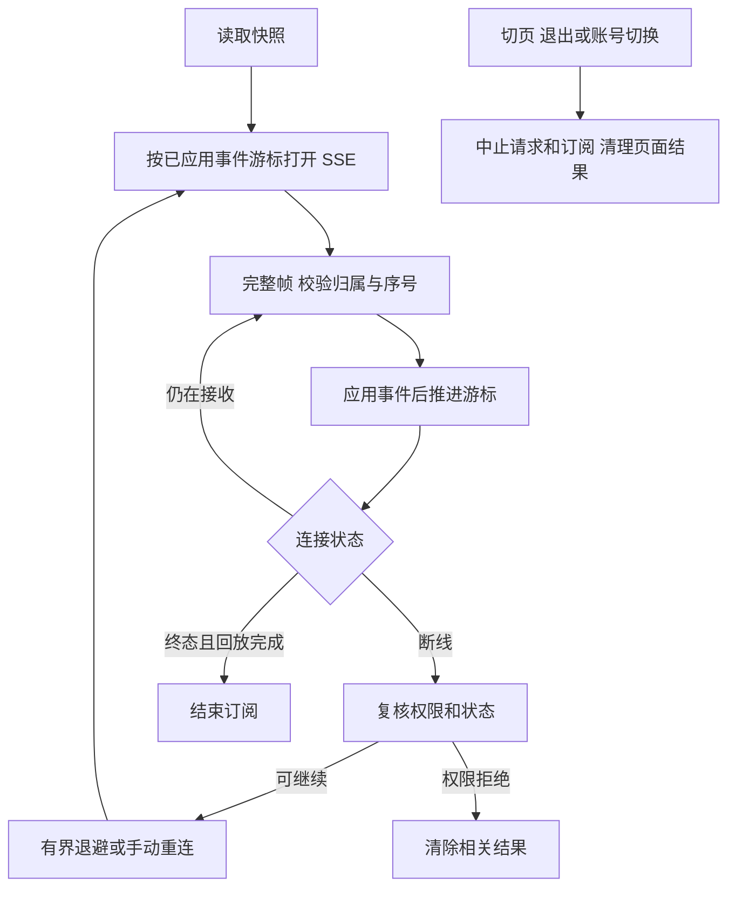

# 前端第 4 步交付说明：分析工作台

日期：2026-09-27。状态：**分析工作台开发、自动化验收和正式模型对话已完成；当前讨论独立业务库造数方案，准备最后的业务查询验收。** 最新安排见[造数与验收讨论稿](前端第4步业务造数与验收讨论稿.md)，第 5 步清单暂放。

正式 Web/API/DAS 已启动，使用实际 SQL 账号的浏览器登录、刷新恢复和退出已通过。已通过管理 API 发布 rj 模型和默认 Agent，并在真实浏览器完成工具调用、答复、SSE、刷新恢复及同会话追问；当前数据源为空，业务查询结果仍待配置后验证，最新进度见[正式联调记录](开发启动命令交付说明.md#11-模型发布与真实浏览器对话通过)。本文原有测试数量与通过结论仍描述对应自动化验收范围。完整管理页面按总流程第 8、9 步实施，当前前台提供导航与模块占位。

用户随后确认“数据没有，这部分先放着吧”。真实业务 SQL、表格和证据联调保留待办，后续有数据及授权范围时补验；按此安排推进[第 5 步报表中心与详情清单](前端第5步实施清单.md)，业务代码待清单审核后实施。

用户批准[第 4 步实施清单](前端第4步实施清单.md)，自行安装四个渲染依赖后回复“安装好了，开始吧”。本步由主代理单独完成，子代理数量为 0；本轮 Agent 依赖安装、升级、卸载操作均为 0。

## 1. 已交付功能

| 范围         | 实际行为                                                                                                                                               |
| ------------ | ------------------------------------------------------------------------------------------------------------------------------------------------------ |
| 会话与 Agent | `/analysis` 新建会话、筛选最近会话；`/analysis/:id` 恢复历史与固定 Agent 版本。新建只选择启用配置，空列表有提示。                                      |
| 问题与澄清   | 提问、追问、选项回答、自定义回答、服务端偏好确认、停止分析。中文输入法组合期间回车不发送；草稿在切换会话时保留，退出清理。                             |
| 提交恢复     | 消息和澄清使用稳定幂等键；回执丢失重试复用原内容与键。新建会话无幂等接口，响应不确定时刷新列表并提供明确的再次新建入口。                               |
| 运行展示     | 公开阶段摘要、工具输入／输出摘要、澄清历史、上下文整理状态、最终答复。工具按调用 ID 配对，完成以运行终态为准。                                         |
| 连接恢复     | Bearer 认证的 fetch SSE；解析分片 UTF-8、CRLF/LF/CR、多行 data、注释心跳。校验归属与连续序号、去重和恢复游标；退出、切页、权限拒绝释放相关请求与结果。 |
| 内容         | Markdown、SQL/JSON/JavaScript/TypeScript 代码高亮和复制、可见时加载 Mermaid 流程图、长文本展开。错误流程图保留原始代码，复制失败有反馈。               |
| 结果         | Table V2 虚拟表格与 50/100/200 行本地分页；样本、已交付量及截断说明；长单元格展开；柱状、折线、饼图及维度／数值选择。                                  |
| 分析依据     | 按需读取保存证据和验证步骤，匹配 evidence_id 替换样本。展示来源、实际查询条件、指标版本、生成时间与数据新鲜度。                                        |
| 主题与布局   | 沿用 Element Plus 主题，覆盖橄榄绿、海蓝、青绿、紫罗兰的亮暗模式；桌面三栏，窄屏会话和依据通过抽屉打开。                                               |

## 2. 关键实现与边界

### 2.1 接口与运行

会话、消息回执按 API 的 camelCase 和 ISO 时间校验；运行快照、事件、查询证据复用公共合同。应用服务持有身份范围内的浅层状态，迟到响应通过页面代次和 AbortSignal 阻止提交。

快照 sequence 与成功应用事件的游标分开保存。刷新后从 0 回放事件，即使快照已完成也先重建正文。断流先复核快照，按已应用游标续接；连接建立超时 20 秒，无数据空闲超时 45 秒，心跳续期。连续失败采用 1/2/4/8/15 秒退避，五次重试后显示手动重连。损坏帧、归属错误、权限拒绝立即停止当前订阅。

`final_answer` 展示完整正文；`run_completed`、`run_failed`、`run_cancelled` 决定终态。同一会话保持串行。依据请求合并重复点击，运行有新增结果或进入终态后允许刷新，避免缓存运行中读到的空证据。

### 2.2 内容与结果

Markdown 关闭原始 HTML，输出经 DOMPurify 清洗；外部图片显示替代文字。代码高亮和 Mermaid 按可见区域加载。流程图限 flowchart/graph、20,000 字符、200 条边，拒绝内容覆盖渲染配置及交互链接。Mermaid 使用严格模式、SVG 文字、应用主题色，清洗后只保留 SVG 内部资源引用。

| 数据入口         | 预算               | 页面处理                                         |
| ---------------- | ------------------ | ------------------------------------------------ |
| SSE 表格样本     | 100 行、256 KiB    | 明确标注样本和实际已交付量                       |
| 单份分析证据结果 | 5,000 行、2 MiB    | 权限复核后按需读取，匹配原样本                   |
| 共享表格容量验收 | 100,000 行、32 MiB | 使用独立合成数据检查虚拟节点、本地分页和页面释放 |

图表仅从校验后的列和用户选择构造配置；重复分类、空值、非数值及不适用的饼图数据给出说明。超过 5,000 行提示缩小范围，表格仍可查看已交付数据。图表保留样本与截断说明，横轴较多时使用缩放窗口。当前 `chart.spec` 未形成严格映射合同，因此事件配置仅提示用户通过结果控件选择图表。

### 2.3 文件

| 目录／文件                                                             | 职责                                                   |
| ---------------------------------------------------------------------- | ------------------------------------------------------ |
| `apps/web/src/features/analysis/`                                      | API 响应校验、会话状态、分析页面、运行与澄清、依据组件 |
| `apps/web/src/shared/stream/`                                          | SSE 解析、认证传输、重试和终态回放                     |
| `apps/web/src/shared/content/`                                         | Markdown、安全清洗、代码高亮、Mermaid                  |
| `apps/web/src/shared/results/`                                         | 分页模型、虚拟表格、受控 ECharts                       |
| `apps/web/src/app/`、`src/main.ts`、`src/styles/`                      | 分析路由与服务装配、中文控件、布局和主题样式           |
| `apps/web/tests/`                                                      | 单元、浏览器、合成数据容量与服务生命周期辅助程序       |
| `apps/api/tests/support/web-analysis-fixture.ts`、`web-auth-server.ts` | 真实认证和 HTTP 路由配套的隔离内存仓储、确定性分析事件 |

API 业务代码、数据库、实际配置和发布目录的既有内容保持原范围。测试服务启动与结束均直接管理自己的 Node 子进程；端口被占用时拒绝使用已有服务。

## 3. 安装核对

| Web 专用直接依赖 | 实装及锁定版本 | 直接许可              |
| ---------------- | -------------- | --------------------- |
| markdown-it      | 15.0.2         | MIT                   |
| DOMPurify        | 3.4.16         | MPL-2.0 或 Apache-2.0 |
| highlight.js     | 11.12.0        | BSD-3-Clause          |
| Mermaid          | 12.0.0         | MIT                   |

四个包均为免费开源本地库，自带类型。Node 24.19.0 满足 Mermaid 的 >=22.12.0 要求。用户安装后的 package.json 使用 `^` 声明，本轮保留声明，验收依据为上述锁文件和实际版本；Web 专用依赖未加入 catalog。已核对类型导入、最小浏览器构建和实际生产构建。

本轮前后 SHA-256 一致：

- `pnpm-lock.yaml`：`C01291736EB04195950E7A79EA7C8AFE072FE2D2F7C5F5E99BAC41E48B51AEDA`。
- `node_modules/.modules.yaml`：`83D7465D2FF13624F3D947A3FB20DC99CEADCF16DD6E7EE450E30DDF01F6769F`。

## 4. 验收结果

| 检查                       | 结果                                                                                           |
| -------------------------- | ---------------------------------------------------------------------------------------------- |
| Web 单元与组件             | 11 个文件、66 项通过                                                                           |
| Chromium 端到端            | 17 项通过：8 项分析交互、6 项原工程认证主题、2 项内容渲染、1 项表格容量                        |
| 最终主题复验               | 1 项通过；逐套核对 SVG 文字、主题边框颜色及图表，截图等待主题完成                              |
| 生产产物浏览器             | 2 项通过：提问／澄清／结果／历史／追问，八种主题组合及图表                                     |
| API 相关路由与会话         | 3 个文件、12 项通过                                                                            |
| 共享 SSE／分析／Agent 合同 | 3 个文件、18 项通过                                                                            |
| 工程规则                   | 37 项通过                                                                                      |
| 编译与静态检查             | Web Vue TSC、Node 测试配置 TSC、API TSC、全工作区 ESLint、相关 Prettier、git diff --check 通过 |
| Web 生产构建               | 通过，产物位于 `ai-data/apps/web/dist/`                                                        |

浏览器使用 Chromium 153.0.8010.12，检查 1440×1000、1024×768、390×844，覆盖真实 Cookie 认证、SSE 刷新、断流游标、请求丢失重试、跨账号拒绝、权限收窄、IME、取消、自定义澄清并发冲突、空结果、截断、失败、复制与安全回退。

初始四份测试曾因对应模块不存在而预期失败；随后实现并通过行为断言。浏览器验收定位并修复了 Mermaid 12 的 SVG 文字配置、清洗后样式保留及主题混色适配。图表首次加载有等待与失败反馈。测试中使用了合同中的 `UNAUTHORIZED` 权限码，避免把无效测试响应当成业务错误。

构建保留大于 500 kB 的分块提示：图表分块约 608.30 kB（gzip 206.61 kB），Mermaid 部分布局分块更大。分析路由、图表与流程图均按需加载；产物目录大小不等于首次进入页面的下载量。本步未承诺弱网加载时延或部署性能指标。

浏览器截图、容量数据和测量限制见[验收记录](前端第4步验收/检查记录.md)。

## 5. 验证命令

使用已有 Node CLI，未调用依赖安装命令。以下命令按所在目录运行。

```powershell
Set-Location D:\porject_new_2026\ai-data\ai-data\apps\web
node node_modules/vitest/vitest.mjs run
node node_modules/vue-tsc/bin/vue-tsc.js -p tsconfig.app.json
node node_modules/typescript/bin/tsc -p tsconfig.node.json
node node_modules/@playwright/test/cli.js test
node node_modules/vite/bin/vite.js build
$env:WEB_E2E_PREVIEW = '1'
node node_modules/@playwright/test/cli.js test tests/e2e/analysis.spec.ts --grep '提问、澄清|四套'
Remove-Item Env:WEB_E2E_PREVIEW
node ../../node_modules/prettier/bin/prettier.cjs --check . ../api/tests/support/web-auth-server.ts ../api/tests/support/web-analysis-fixture.ts

Set-Location D:\porject_new_2026\ai-data\ai-data\apps\api
node node_modules/typescript/bin/tsc -p tsconfig.json
node node_modules/vitest/vitest.mjs run tests/routes/analysis-routes.test.ts tests/routes/agent-routes.test.ts tests/conversations --pool=threads --maxWorkers=1

Set-Location D:\porject_new_2026\ai-data\ai-data\packages\contracts
node node_modules/vitest/vitest.mjs run tests/sse/sse-events.test.ts tests/analysis/analysis-contracts.test.ts tests/agents/agent.test.ts --pool=threads --maxWorkers=1

Set-Location D:\porject_new_2026\ai-data\ai-data
node node_modules/eslint/bin/eslint.js .
node --test scripts/tests/*.test.mjs
git diff --check
```

## 6. 执行流程





## 7. 验证边界与接续

本步 HTTP 验收使用真实认证、会话服务和路由，运行调度与查询结果由隔离的内存测试实现提供。本轮未运行真实 SQL、真实模型或服务器部署联调；已有后端专项结果仍以各自记录为准。

10 万行仅验证共享表格的合成数据容量；分析证据接口仍是单份 5,000 行／2 MiB。移动端分页和横向滚动已经检查，堆内存观测为浏览器粗粒度估计，不能据此证明无泄漏。

下一步为[前端实施流程](前端实施流程.md)中的第 5 步“报表中心与详情”，按项目规则先提供具体清单再实施。

## 8. 独立业务库与正式链路补验（2026-09-27）

用户批准建立门诊、住院及费用演示库，并要求验收成功后继续已批准的第 5 步。当前已完成 `ai_bi_demo` 的 24 表 475,793 行、正式数据源接入、中文目录及关系、全量／单科室权限；正式 SQL/API 基准 23 项通过。

住院场景通过真实模型及浏览器验收，入院、出院和指定时点在院分别为 40、0、200，与 SQL 基准一致。门诊与费用尚未通过；模型服务末次探测端口拒绝连接。指标发布另受事务目录缺陷阻塞，最小后端修复清单已提交审核。

实际结果、复现、文件范围、验证命令及流程图见[业务造数与验收阶段记录](前端第4步业务造数与验收/阶段记录.md)。第 4 步整体仍待收尾，第 5 步业务代码尚未开始。

## 2026-09-27 模型恢复后的业务复验

事务目录修复已完成，相关普通测试 82 项、真实 SQL 集成 7 项通过。6 项指标已发布；门住院费用 v2 支持费用分类，保留 v1。造数与指标测试 5 项、正式 SQL/API 基准 23 项及两个费用分类指标的独立 SQL 对账通过。

门诊模型得到 763 人次／763 人，各科室值与 SQL 一致；消化科 61 人次。表格、图表、依据、刷新追问和退出通过，追问无新查询。住院入院 40、出院 0、在院 200 的已通过结果保留。

费用模型最新运行正确取得 10 类费用及总计 2,263,158.00 元，证据与 SQL 完全一致，但最终答复前流中断。此前复验另有空答复及明确的 32k 上下文超限。因此费用端到端仍未通过，第 5 步页面尚未实施。

完整证据与流程图见[业务验收阶段记录](前端第4步业务造数与验收/阶段记录.md)，修复见[事务目录交付](前端第4步事务目录修复交付.md)，接续范围见[费用模型复验与第 5 步接续清单](费用模型复验与第5步接续清单.md)。本轮主代理单独实施，依赖操作为 0。
