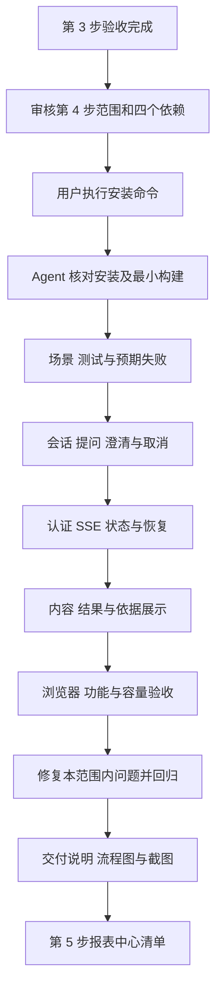

# 前端第 4 步实施清单：分析工作台

日期：2026-09-27。状态：**已完成实现与验收**。用户回复“开始吧”批准本清单，自行安装依赖后回复“安装好了，开始吧”。主代理单独完成六项工作，子代理数量为 0。实际功能、验证结果和边界见[第 4 步交付说明](前端第4步交付说明.md)，截图和容量记录见[验收记录](前端第4步验收/检查记录.md)。

## 1. 目的与页面范围

把 `/analysis` 和 `/analysis/:id` 从模块容器接成可以完成“选 Agent → 提问 → 澄清 → 查看进度 → 阅读结果与依据 → 追问”的正式工作台。

延续[已确认的页面设计](前端页面设计方案.md)：最近会话位于左侧，消息与结果在主区，依据在右侧。使用第 3 步的 Element Plus 控件、系统字体、三种显示模式和四套配色。窄屏将会话与依据收为可打开的抽屉，保留输入、停止和结果切换操作。

## 2. 六项实施工作

| 顺序 | 工作             | 本步交付与关键行为                                                                                                                                 |
| ---- | ---------------- | -------------------------------------------------------------------------------------------------------------------------------------------------- |
| 1    | 会话与 Agent     | 新建分析、可用 Agent 选择、最近会话、本地筛选、历史消息和深层链接；新会话绑定所选版本，旧会话显示实际绑定版本；空 Agent 列表提供明确说明           |
| 2    | 提问、澄清与取消 | 输入、发送、重复提交保护、稳定幂等键、选项或自定义澄清、偏好确认、停止运行、失败重试；同一会话串行，保留未提交输入；中文输入法组合期间回车不误发送 |
| 3    | SSE 与恢复       | 携带 Bearer 与游标的流式连接、事件解析、去重、断线恢复、终态收敛、页面刷新恢复、上下文压缩提示；切换账号清理订阅与缓存                             |
| 4    | AI 内容展示      | 进度、用户可读的阶段摘要、工具执行卡片、Markdown、代码高亮与复制、Mermaid 流程图；长内容按需展开，内容渲染失败保留可读文本                         |
| 5    | 结果与依据       | Element Plus Table V2、本地分页、受控 ECharts 图表；显示样本与截断范围，读取完整已保存证据；查询条件、时间依据、来源、指标版本和分析步骤可追溯     |
| 6    | 验证与交付       | BDD/TDD、接口与 SSE 场景、权限与账号隔离、长内容和大表、主题与窄屏、构建；保存交付说明、流程图、截图和实际验证边界                                 |

会话重命名、删除、归档的独立接口目前尚未提供，页面操作按已有能力开放。报表保存与完整管理在第 5 步、查询画布在第 6 步、文件导出在第 7 步接入。

## 3. 已核实的接口与合同

以下为 API 实际路径；Web 请求统一加 `/api` 前缀，经现有代理去掉前缀。

| 功能       | 接口                                                              | 本步用法                                                                         |
| ---------- | ----------------------------------------------------------------- | -------------------------------------------------------------------------------- |
| Agent 选择 | `GET /agents`、`GET /agents/:id?version=...`                      | 读取本组织配置；新会话选择启用项，既有会话读取固定版本                           |
| 新建与列表 | `POST /conversations`、`GET /conversations`                       | 提交标题、Agent 与版本；展示接口返回的当前用户会话                               |
| 会话恢复   | `GET /conversations/:id`                                          | 读取会话及有序消息，通过 `analysisRunId` 关联已保存运行                          |
| 发送问题   | `POST /conversations/:id/messages`                                | 提交 `content` 和 `idempotency_key`，读取 `message` 与 `analysisRun` 回执        |
| 运行状态   | `GET /analysis-runs/:id`                                          | 使用共享 `analysisRunSchema` 校验快照、状态、序号及当前澄清                      |
| 事件流     | `GET /analysis-runs/:id/events`                                   | `Authorization: Bearer ...` 与 `Last-Event-ID`；服务端持久化回放、心跳和终态关闭 |
| 澄清回答   | `POST /analysis-runs/:id/answers`                                 | 当前 `clarification_id`、稳定幂等键，以及 `option_id` / `custom_input` 二选一    |
| 取消       | `POST /analysis-runs/:id/cancel`                                  | 按服务端返回的运行状态更新页面，再对齐快照和终态                                 |
| 依据       | `GET /analysis-runs/:id/evidence`、`GET /analysis-runs/:id/steps` | 读取权限复核后的 QueryEvidence 与分析步骤                                        |

核对来源：[会话路由](../ai-data/apps/api/src/routes/conversation-routes.ts)、[运行与 SSE 路由](../ai-data/apps/api/src/routes/analysis-routes.ts)、[Agent 路由](../ai-data/apps/api/src/routes/agent-routes.ts)、[会话服务与返回类型](../ai-data/apps/api/src/conversations/conversation-types.ts)、[事件合同](../ai-data/packages/contracts/src/sse/sse-events.ts)、[证据合同](../ai-data/packages/contracts/src/evidence/evidence.ts)。

### 3.1 需要准确处理的接口差异

- 会话与消息响应当前是 camelCase，时间由 API 的 Date 序列化为 ISO 字符串；运行快照和事件采用 snake_case、东八区时间合同。Web 在边界分别校验并用 dayjs 统一展示，不直接混用。
- 发送回执中的 `analysisRun.id` 是运行标识；运行快照中的字段是 `analysis_run_id`。会话响应尚无完整公共响应 Schema，本步在 Web 的 API 适配层维护对应 Schema 与推导类型。
- 当前 `final_answer` 是完整正文事件，流中另有阶段摘要、进度、工具、表格和运行状态。按已存在的事件展示，不把前端打字动画作为模型逐 token 推送。
- 新建会话接口没有幂等键；超时后先检查会话列表，由用户确认后再创建。消息与澄清接口有幂等键，同一次不确定提交的重试复用原键，用户新操作使用新键。
- 会话与消息列表当前没有服务端分页，采用现有列表读取及前端按需渲染；旧消息若缺少运行标识，显示已保存正文并说明该条运行详情不可恢复。
- `chart.spec` 当前只是开放记录，缺少稳定的字段映射合同。不能直接把它当完整 ECharts Option 执行。本步图表从已校验结果和用户所选字段构建；无法识别的事件配置显示说明并保留表格。若后续要求模型稳定生成图表配置，另列共享合同与 API 改动。

本清单的 API 文件变更仅涉及测试辅助服务与测试仓储。开发库、API/DAS 生产行为、迁移及发布目录维持各自已有实施范围。

## 4. 认证流、状态和资源边界

### 4.1 流式传输

第 3 步的传输层针对 JSON，默认 20 秒超时。新增独立的 `fetch + ReadableStream + TextDecoder` SSE 客户端，复用现有认证刷新和身份代次，不将长连接交给 JSON 解析器。

- 增量解析 UTF-8、跨 chunk 的行、CRLF/LF、多行 `data`、注释心跳与空行分帧；收到完整并通过 `sseEventSchema` 校验的事件后才推进游标。
- 以运行 ID 和 sequence 去重，核对 SSE `id`、`event` 与数据体的一致性；不匹配或损坏事件停止当前流并核对状态，不能静默跳过后继续推进游标。
- 当前运行快照的 sequence 与“已渲染事件游标”分开维护。页面重载后从服务端消息与事件重建内容，重建完成前不使用上次游标跳过历史；终态快照不会阻止尚未完成的历史回放。
- 断线先读取运行快照并经过认证处理，再按最后已处理序号重连；遇到授权失败清理相关结果并展示状态。EOF 后核对终态，普通网络失败采用有界退避，超过预算提供手动重连。
- 建议连接建立超时 20 秒、无数据空闲超时 45 秒，重连间隔 1/2/4/8/15 秒，连续 5 次失败后交由用户重试。心跳刷新空闲计时，不作为业务进度。
- 页面切换关闭该页订阅，服务端运行继续；重新进入时恢复。退出或账号切换经统一资源入口终止全部旧身份订阅、请求和缓存，迟到事件不得提交。

### 4.2 运行与消息

`created`、`running`、`waiting_clarification`、`cancelling`、`completed`、`failed`、`cancelled` 分别映射为明确状态。`final_answer` 只更新答复正文，完成以服务端终态为准。取消请求期间显示“正在停止”，取消失败提供重试；完成与取消竞争按服务端最终状态呈现。

工具调用优先按 `tool_call_id` 配对；历史事件缺少标识时按顺序展示，避免把同名工具的结果错配。只显示公开进度和脱敏输入/输出摘要。待澄清时禁用新一轮提问，回答绑定当前问题；过期选项提交冲突后重新读取快照。

输入草稿、待确认提交及幂等键按账号、会话区分保存在当前页面内存；切换会话可保留，退出清理。刷新恢复以 API 持久化内容为准。消息回执和最终持久化消息按 ID / 运行关联去重，避免回放生成重复回答。

## 5. 内容、表格和图表

### 5.1 内容渲染

- Markdown 支持段落、标题、列表、引用、表格、链接和代码块；关闭原始 HTML，输出再经 DOMPurify 清洗，链接限制安全协议，外部图片不自动请求。
- 代码高亮按需加载 SQL、JSON、JavaScript、TypeScript 等已注册语言；其他语言回退纯文本。复制按钮复制原始代码，显示可感知的成功或失败状态。
- Mermaid 在完整代码块出现且可见时按需加载；首批支持流程图。采用严格安全配置、关闭 HTML 标签，拒绝内容修改渲染器配置，SVG 再经清洗；语法错误显示原始代码与提示。
- 建议高亮单代码块上限 20,000 字符、流程图文本上限 20,000 字符、边数上限 200；超限回退可读代码，测试记录实际行为。长消息使用折叠与按需渲染，减少重复解析。
- 主题切换覆盖 Markdown、代码、流程图、工具状态和图表。流程图只是展示能力，查询画布编辑按第 6 步接入。

### 5.2 结果边界

现有[结果交付设计](../需求文档/result-delivery-and-export.md)必须保持：

| 数据类别         | 现有预算                | 页面行为                                                              |
| ---------------- | ----------------------- | --------------------------------------------------------------------- |
| SSE 表格样本     | 最多 100 行、256 KiB    | 快速预览，显示 `sampled`、`result_row_count` 和 `result_truncated`    |
| 单条运行证据     | 最多 5,000 行、2 MiB    | 按需读取已保存证据，替换对应样本；截断仍保留截断状态                  |
| 普通查询完整交付 | 最多 100,000 行、32 MiB | 作为共享结果组件的容量验收边界；本步分析证据仍遵循上行的 5,000 行限制 |

缺少 `evidence_id` 的历史样本只显示已收到范围；不得猜测它对应哪条证据，也不从样本行数推导业务总量。证据接口一次返回某运行的全部证据，因此按需读取、请求合并和及时释放整份结果，避免反复缓存多份大数组。

表格采用 Table V2 加本地分页，默认每页 100 行，可选 50/100/200；页大小变化修正页码，翻页不重新查询数据库。长单元格提供展开读取，保留 NULL、数值和日期的含义。行数据使用浅层状态持有，渲染窗口与分页切片共用同一份来源。

图表由现有 ECharts / vue-echarts 实现柱状、折线、饼图和表格切换，允许从已返回列中选择维度和数值。只按受控映射生成配置，不执行字符串函数、任意 formatter 或远程资源。空结果、非数值指标、重复分类、负值饼图等给出可读说明；不擅自求和、转换统计口径或把未绘制的数据冒充完整图表。

依据区展示已保存条件、时间范围、数据源/数据集、指标版本、数据新鲜度和结果范围。查询/生成时间与数据更新时间分别标注；接口缺少字段时如实显示未提供。

## 6. 依赖与安装分工

清单阶段只读核对 npm 官方元数据。用户安装后，四个包的实际版本、类型、最小构建和正式 Web 生产构建均已验收，版本及声明归属见交付说明。

| 新增到 Web 的运行依赖 | 精确候选版本 | 用途                                    | 直接依赖许可                                |
| --------------------- | ------------ | --------------------------------------- | ------------------------------------------- |
| `markdown-it`         | `15.0.2`     | Markdown 解析，自带类型                 | MIT                                         |
| `dompurify`           | `3.4.16`     | HTML / SVG 输出清洗，自带类型           | MPL-2.0 或 Apache-2.0，可按 Apache-2.0 使用 |
| `highlight.js`        | `11.12.0`    | 代码高亮，自带类型                      | BSD-3-Clause                                |
| `mermaid`             | `12.0.0`     | 流程图，自带类型；Node 要求 `>=22.12.0` | MIT                                         |

四个包均采用免费开源库的本地运行方式；现有 Node `24.19.0` 满足已声明的 Node 范围。Markdown 15 已自带类型，本次不需要额外的 `@types/markdown-it`。这些依赖仅供 Web 使用，直接写入 Web 的 package.json，不加入 catalog。Element Plus、Lucide、ECharts、Vue Query、Pinia、Zod 和 dayjs 沿用已安装版本。

许可依据：[markdown-it](https://github.com/markdown-it/markdown-it/blob/master/LICENSE)、[DOMPurify](https://github.com/cure53/DOMPurify/blob/main/LICENSE)、[highlight.js](https://github.com/highlightjs/highlight.js/blob/main/LICENSE)、[Mermaid](https://github.com/mermaid-js/mermaid/blob/develop/LICENSE)。版本依据为 npm Registry 对应包的 `dist-tags.latest` 与版本元数据，读取日期 2026-09-27；安装后按最终锁文件复核依赖与许可，发布时保留要求的版权与许可声明。

**原安装命令记录（用户已完成安装）：**

```powershell
Set-Location D:\porject_new_2026\ai-data\ai-data
pnpm --filter @ai-data/web add --save-exact markdown-it@15.0.2 dompurify@3.4.16 highlight.js@11.12.0 mermaid@12.0.0
```

该命令更新 Web 包文件及工作区锁文件。安装完成后，Agent 核对实际版本、声明、锁文件、类型导入和最小渲染构建。遇到兼容或安装策略问题先报告具体原因与调整项，保持现有供应链策略。

## 7. 拟新增、修改文件

同一职责允许按开发规范进一步细分；API 生产能力和技术路线的额外变更先另列清单。

| 操作         | 路径                                                                                                                  | 用途                                                                                                  |
| ------------ | --------------------------------------------------------------------------------------------------------------------- | ----------------------------------------------------------------------------------------------------- |
| 用户安装更新 | `ai-data/apps/web/package.json`、`ai-data/pnpm-lock.yaml`                                                             | 四个 Web 专用依赖与解析结果                                                                           |
| 新增         | `ai-data/apps/web/src/features/analysis/`                                                                             | 会话、消息、Agent 选择、运行状态、澄清、工具卡片和依据面板；包含 API Schema、推导类型、状态与页面组件 |
| 新增         | `ai-data/apps/web/src/shared/stream/`                                                                                 | SSE 帧解析、认证订阅、游标与重连，接入身份清理                                                        |
| 新增         | `ai-data/apps/web/src/shared/content/`                                                                                | Markdown、代码、Mermaid 渲染与清洗边界                                                                |
| 新增         | `ai-data/apps/web/src/shared/results/`                                                                                | 分页虚拟表格、结果完整性和图表适配                                                                    |
| 修改         | `ai-data/apps/web/src/app/router.ts`、`app-layout.vue`、`services*.ts`                                                | 分析路由接线、页面布局、流式请求服务注入                                                              |
| 修改/新增    | `ai-data/apps/web/src/shared/http/`、`src/shared/session/`、`src/styles/`、`src/main.ts`                              | 共用错误处理与资源清理、所需 Element Plus 样式、分析和内容样式                                        |
| 新增         | `ai-data/apps/web/tests/features/analysis/`、`tests/shared/stream/`、`tests/shared/content/`、`tests/shared/results/` | 对应领域的单元与组件用例                                                                              |
| 修改/新增    | `ai-data/apps/web/tests/e2e/`、`tests/support/`、`playwright.config.ts`                                               | 对话链路、SSE、故障、隔离与性能样例的浏览器验收                                                       |
| 修改/新增    | `ai-data/apps/api/tests/support/web-auth-server.ts` 及同目录 Web 分析测试辅助文件                                     | 复用真实认证/会话/运行 HTTP 路由，配套内存仓储与确定性运行事件，避免 Web 跨应用导入源码               |
| 维护         | 本清单、`任务交接/前端实施流程.md`、`任务交接/README.md`                                                              | 状态与接手入口，README 追加                                                                           |
| 新增         | `任务交接/前端第4步交付说明.md`、`任务交接/前端第4步验收/`                                                            | 实际命令、流程图、截图、性能记录与待验收项                                                            |

## 8. 验收清单

先写场景和可执行测试、确认预期失败，再实现与回归。

| 场景                                               | 预期                                                                                               |
| -------------------------------------------------- | -------------------------------------------------------------------------------------------------- |
| 首次进入、Agent 空列表、固定版本与旧会话           | 状态清楚；有效会话沿用绑定版本，禁用的新配置不能被选作新会话                                       |
| 发问、中文输入法、重复发送、请求回执丢失           | 输入不会误提交；同次重试复用幂等键，消息与运行不重复                                               |
| 澄清选项、自定义回答、偏好确认、过期问题           | 回答绑定当前问题；冲突后恢复服务端状态；不另造偏好确认逻辑                                         |
| UTF-8 分片、多行数据、心跳、重复/损坏事件          | 完整解析后更新游标；归属与序号准确；异常可恢复并有提示                                             |
| 刷新、断线、Access Token 过期、服务恢复            | 重建正文和结果后续接事件；终态与 API 一致；无无限重连                                              |
| 最终答案早于终态、取消与完成竞争                   | 正文和运行状态分别收敛，旧事件不能覆盖新终态                                                       |
| 两个账号、两个会话、后台切页、权限收窄             | 请求和结果按身份/会话隔离；权限拒绝移除旧展示，不泄漏缓存                                          |
| Markdown、代码、恶意链接/HTML/SVG、错误 Mermaid    | 安全内容可读；危险内容不执行；失败可回退；复制反馈明确                                             |
| 100 行样本、5,000 行证据、空结果、截断和缺失元数据 | 样本、已交付量与业务总量准确区分；证据读取不重复查询业务库                                         |
| 结果组件 1,000 / 10,000 / 50,000 / 100,000 行      | 使用满足 32 MiB 的合成数据单独验证分页和虚拟渲染；不把组件容量结果表述为分析 API 可返回 100,000 行 |
| 长文本、多列、页大小变化、滚动、页面释放           | 页码不越界、虚拟节点数有界；记录首次可交互、长任务和内存情况；不虚构性能结论                       |
| 四套配色、亮暗模式、1440 / 1024 / 390px、键盘      | 输入与停止可达，表格横向滚动，图表/代码/流程图可读，焦点与反馈可感知                               |
| 工程与交付                                         | 类型、lint、格式、单元/组件、相关 API 路由与 SSE 合同、Chromium、Web 构建通过并保存记录            |

浏览器核心链路采用真实 HTTP 路由、认证与确定性测试运行，服务与仓储替身的覆盖范围在交付中明确记录。实际 SQL 与真实模型验证须使用明确获准的账号、模型和隔离环境，专项记录结果与耗时；前端测试通过不等同于真实模型业务验收通过。

## 9. 执行流程与审核点



第 2 节六项实施范围、第 6 节四个 Web 依赖和第 7 节文件范围均已获准，并按本流程完成。本步保持主代理单独实施、依赖由用户操作；下一步先提交报表中心与详情的具体清单。
