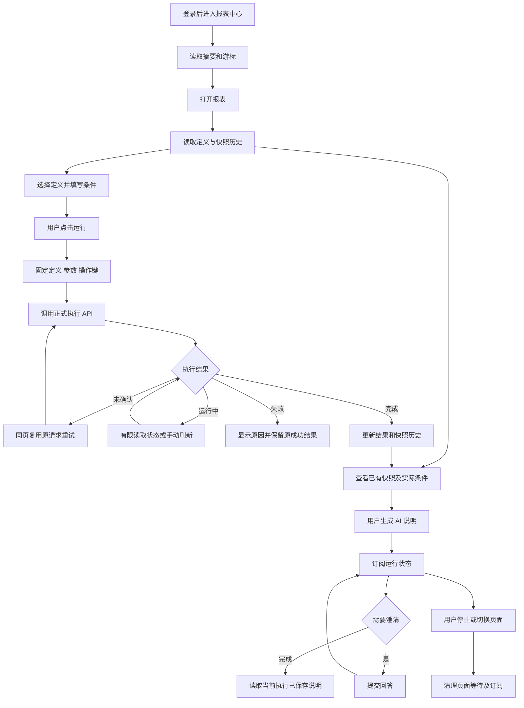
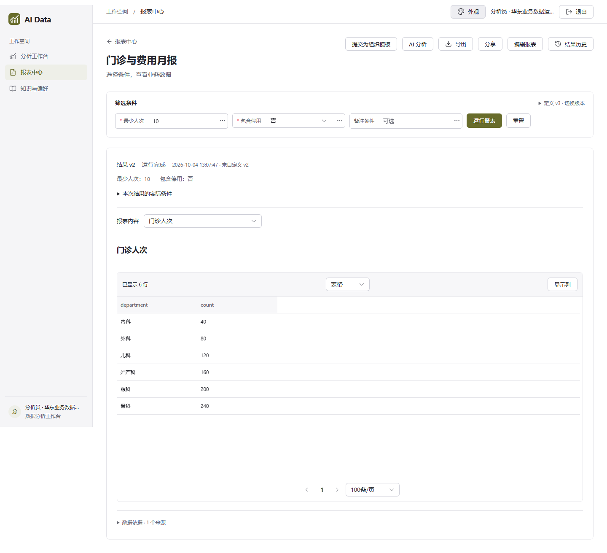
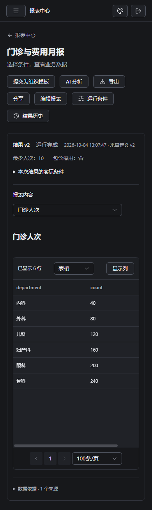

# 前端第 5 步交付说明：报表中心与详情

日期：2026-09-28。状态：**已完成实施及本步验收**。依据：[已批准清单](前端第5步实施清单.md)。用户回复“开始”后由主代理单独实施，依赖操作为 0。

## 1. 交付功能

`/reports` 已实现报表列表，按游标加载更多，并明确标题筛选只作用于已加载报表。列表显示定义版本、结果版本和创建时间，提供真实空状态及错误重试。

`/reports/:id` 已实现定义版本选择、参数侧栏、结果区、历史抽屉和 AI 说明。窄屏通过抽屉填写参数。亮暗模式及橄榄绿、海蓝、青绿、紫罗兰四套配色沿用现有主题。

| 操作                 | 实际行为                                                                                                                                      |
| -------------------- | --------------------------------------------------------------------------------------------------------------------------------------------- |
| 切换定义、修改条件   | 更新待运行内容，已有结果继续显示它自己的定义版本、时间和实际参数。                                                                            |
| 点击运行             | 提交固定定义版本、参数与操作键。区分未覆盖默认值、空字符串、NULL、false 和 0；校验日期、数值、枚举、多值与范围。相对日期由 API 在运行时解析。 |
| 回执未确认           | 保留上次成功结果；同页相同条件重试沿用同一操作键。修改条件后生成新键。                                                                        |
| 执行失败             | 显示失败状态和错误码，保留上次成功结果及其条件。                                                                                              |
| 已知执行尚在运行     | 每 2 秒读取状态，最多自动读取 10 次，并提供手动刷新。执行请求单独使用 150 秒等待，通用请求维持 20 秒。                                        |
| 刷新或回看历史       | URL 保存已收到的执行 ID；重新读取并校验访问权。历史抽屉展示已保存快照。                                                                       |
| 查看结果             | 执行结果按 query_id 关联区块，旧快照按 evidence_id 关联；表格分页、图表和列映射复用已有组件，显示截断范围和来源查询。                         |
| 生成分析说明         | 用户主动提交要求，任务绑定当前成功执行；支持澄清、停止、断流恢复和页面刷新。完成后读取该执行已保存的说明。                                    |
| 切换报表、执行或账号 | 中止相应请求和订阅，清理页面数据，迟到响应不能恢复旧内容。权限拒绝立即清除对应受限内容。                                                      |

旧快照可独立阅读。定义中引用旧执行的文字显示来源执行标识。生成说明期间显示任务状态和进度，已保存的正文始终来自当前执行的说明列表。

## 2. 主要文件

路径相对于 `ai-data/` 工作区。

| 文件或目录                                                             | 职责                                                           |
| ---------------------------------------------------------------------- | -------------------------------------------------------------- |
| `apps/web/src/features/reports/api/`                                   | 说明列表及运行回执的合同校验。                                 |
| `apps/web/src/features/reports/models/`                                | 参数解析、范围校验、区块来源映射及 5,000 行／2 MiB 结果预算。  |
| `apps/web/src/features/reports/stores/`                                | 列表、版本、执行、幂等重试、有限状态刷新、说明任务和身份清理。 |
| `apps/web/src/features/reports/pages/`、`components/`                  | 中心、详情、参数表单、结果区块及说明交互。                     |
| `apps/web/src/app/router.ts`、`services.ts`、`services-types.ts`       | 正式路由、应用服务及生命周期装配。                             |
| `apps/web/src/shared/http/`                                            | 请求级等待时间和上限校验，复用已有认证与中止信号。             |
| `apps/web/src/styles/reports.css`、`src/main.ts`                       | 报表布局和响应式主题样式。                                     |
| `apps/web/tests/features/reports/`、`tests/shared/http.test.ts`        | 参数、版本、执行、结果映射、权限和生命周期行为测试。           |
| `apps/web/tests/e2e/reports.spec.ts`                                   | 报表的 8 个 Chromium 场景。                                    |
| `apps/api/tests/support/web-report-fixture.ts`                         | 隔离内存仓储与真实报表 HTTP 路由。                             |
| `apps/api/tests/support/web-auth-server.ts`、`web-analysis-fixture.ts` | 测试进程复用认证、分析运行、澄清与 SSE。                       |

## 3. 操作流程



切页清理的是前端请求及订阅；已提交的报表执行由服务端继续管理。整页刷新且首次回执尚未取得时，先查看已保存结果历史。

## 4. 验收结果

| 检查                    | 结果                                                                                                                                              |
| ----------------------- | ------------------------------------------------------------------------------------------------------------------------------------------------- |
| Web 单元及组件测试      | 15 个文件、85 项通过。                                                                                                                            |
| API 报表服务与路由测试  | 8 个文件、33 项通过。                                                                                                                             |
| 报表公共合同            | 3 个文件、7 项通过。                                                                                                                              |
| 工程规则                | 42 项通过。                                                                                                                                       |
| Web 与 API 类型检查     | 通过。                                                                                                                                            |
| Web 与测试支撑文件 lint | 通过。                                                                                                                                            |
| 相关文件格式            | 通过。                                                                                                                                            |
| Web 生产构建            | 通过，生成 `apps/web/dist/`。                                                                                                                     |
| Chromium 原有功能回归   | 18 项通过，覆盖分析工作台、认证、主题、内容及大表渲染。                                                                                           |
| 报表 Chromium 场景      | 8 项在生产构建产物上全部通过，包含 21 秒执行、回执重试、断流澄清、刷新恢复、历史切换、权限清理、账号切换、四套亮暗配色和 1440／1024／390px 布局。 |
| 正式服务                | 配置账号登录、报表中心空状态、不存在报表错误及退出通过。                                                                                          |

先恢复交接目录的行为测试草稿并确认预期失败，再实现参数、执行及结果映射。说明任务同样先验证缺失实现的失败。浏览器初轮修正了 Element Plus 下拉框的测试定位和主题名称；补充断流验收时，测试改为读取 SSE 首帧后断开，以便继续回答澄清。

正式库本次报表列表为 0 条。列表与详情异常已在正式服务验证；参数执行、多版本、五千行结果、AI 说明及异常恢复通过隔离仓储和真实 HTTP 路由验收。测试数据由独立浏览器验收进程管理，日常 `pnpm dev` 继续使用项目正式配置。

构建保留既有图表、Mermaid 布局等较大异步分块提示。结果组件仍按需加载。

主要命令（在 `ai-data/` 执行）：

```powershell
pnpm --filter @ai-data/web test
pnpm --filter @ai-data/web test:e2e
pnpm --filter @ai-data/web build
```

生产产物复验：

```powershell
$env:WEB_E2E_PREVIEW = '1'
pnpm --filter @ai-data/web exec playwright test reports.spec.ts
Remove-Item Env:WEB_E2E_PREVIEW
```

浏览器验收使用 4318／5317 端口；正式开发服务使用 API 3101、DAS 3102、Web 5173。[验收目录](前端第5步验收/)保存截图、正式检查脚本和 JSON 结果。

## 5. 查看方式与接续

本轮已经启动 `pnpm dev`，可打开 [报表中心](http://127.0.0.1:5173/reports)。以后从 `D:\porject_new_2026\ai-data\ai-data` 执行 `pnpm dev` 即可启动三项开发服务。

下一步是前端第 6 步：新建与编辑报表，接入表单、画布及对话对同一报表定义的编辑。对应步骤先给出清单再实施。




