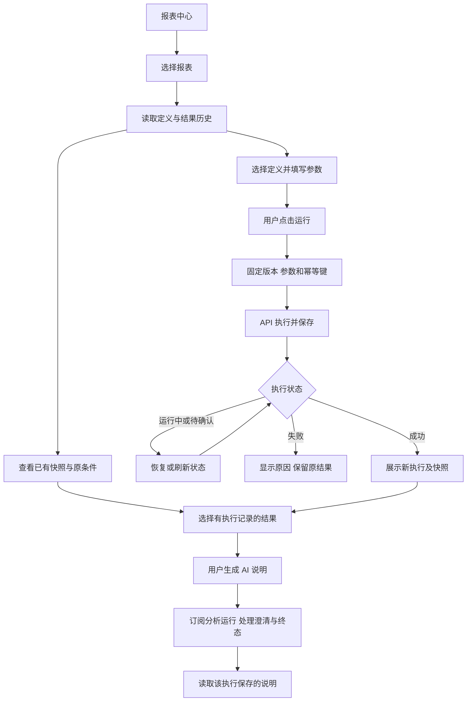

# 前端第 5 步实施清单：报表中心与详情

日期：2026-09-27；执行更新：2026-09-28。状态：**第 4 步及上下文修复已完成，用户再次回复“开始”后，第 5 步已按本清单完成实施和验收。**

2026-09-28：报表中心、详情、参数执行、历史结果及 AI 说明已完成。Web 85 项、报表 API 33 项、报表合同 7 项、工程规则 42 项通过；Chromium 原有 18 项回归与新增报表 8 项构建产物验收通过。正式配置登录、真实报表空列表及详情错误处理通过。类型、lint、相关格式与 Web 构建通过，结果与流程图见[第 5 步交付说明](前端第5步交付说明.md)。以下 2026-09-27 的进展为当时记录。

最新进展：业务库、事务目录修复、指标、门诊及住院已通过；费用查询证据正确，模型最终答复仍因流中断未通过。已准备参数、执行生命周期、结果映射与请求等待的行为测试草稿，业务页面尚未实施。接续顺序见[费用模型复验与第 5 步接续清单](费用模型复验与第5步接续清单.md)。

最新安排见[第 4 步业务造数与验收讨论稿](前端第4步业务造数与验收讨论稿.md)。本清单已经批准，第 4 步通过后直接实施。

本清单承接[前端实施流程](前端实施流程.md)第 5 步。演示业务库已经准备，先完成第 4 步真实业务 SQL、表格和证据联调，再推进本步。

## 1. 目的与实施范围

让用户在报表中心找到已有报表，查看定义与历史结果，填写参数并显式执行，再为某次结果生成分析说明。日常启动沿用 `pnpm dev`，页面通过现有认证与代理访问正式 API。

| 工作             | 页面行为与验收目标                                                                                                                                |
| ---------------- | ------------------------------------------------------------------------------------------------------------------------------------------------- |
| 报表中心         | 实现 `/reports`，展示标题、创建时间、定义版本和结果版本；按游标加载更多，支持对已加载报表按标题筛选；提供加载、空列表、失败重试与无权限状态。     |
| 详情与历史       | 实现 `/reports/:id`，显示所选定义、参数区、结果区和历史抽屉。分别选择定义版本与结果快照版本，明确结果对应的定义版本、执行 ID、实际条件和时间。    |
| 参数与执行       | 根据合同生成 Element Plus 表单，点击运行后提交固定定义版本、参数和幂等键；展示运行状态、成功或失败，允许同次操作安全重试。                        |
| 表格、图表与依据 | 按报表展示定义排列文字、表格和图表，复用第 4 步的 Markdown、虚拟表格和 ECharts；按查询 ID／证据 ID 对齐结果，展示已交付量、截断、来源及查询条件。 |
| AI 分析说明      | 为选定的成功执行生成分析说明，展示流式运行状态、澄清、停止及完成后的说明；说明始终绑定该执行及其结果，切换历史时同步读取对应说明。                |
| 状态与视觉验收   | 沿用已确认的布局风格、亮暗模式与四套配色；覆盖窄屏、键盘、刷新恢复、并发点击、请求失败和身份切换。                                                |

详情采用顶部报表信息与版本、参数侧栏、主结果区和历史抽屉；窄屏参数通过抽屉打开。沿用现有设计文档、主题变量和组件风格。

第 6 步负责新建及编辑定义、表单／画布／对话统一编辑；第 7 步负责分享和文件导出；管理页面仍按第 8、9 步推进。本步报表来自已有保存记录，空库显示真实空状态。

## 2. 已核对的接口

以下为 API 原始路径，Web 经 `/api` 代理访问；响应复用 `@ai-data/contracts` 公共合同校验。

| 接口                                     | 本步用途                                                                     |
| ---------------------------------------- | ---------------------------------------------------------------------------- |
| `GET /reports?limit=20&cursor=...`       | 当前账号有权读取的报表摘要及下一游标。                                       |
| `GET /reports/:id/definition?version=N`  | 读取指定版本定义；省略版本读取最新定义。                                     |
| `GET /reports/:id/versions`              | 读取定义版本与已保存结果快照列表。                                           |
| `GET /reports/:id?version=N`             | 读取指定结果快照；省略版本读取最新快照。                                     |
| `POST /reports/:id/execute`              | 提交 `definition_version`、`parameters`、`idempotency_key`，执行并保存结果。 |
| `GET /report-executions/:id`             | 读取已知执行及其固定定义、实际参数、状态和结果。                             |
| `POST /report-executions/:id/narratives` | 提交提示词、幂等键及可选 Agent，返回分析运行和会话定位。                     |
| `GET /report-executions/:id/narratives`  | 读取该执行已保存的分析说明。                                                 |
| 现有分析运行、SSE、澄清与取消接口        | 复用第 4 步运行能力，处理说明生成和断线恢复。                                |

核对依据：`ai-data/REPORTS.md`、API 的报表管理／执行路由及服务、共享报表合同、现有 Web 请求层与结果组件。

### 2.1 列表和版本的实际边界

- 列表接口提供游标，未提供总数、全库搜索及排序参数。页面使用“加载更多”；标题筛选标注作用范围为“已加载报表”。
- 定义版本、结果快照版本与执行 ID 分别展示。修改参数或切换定义只改变待执行内容；已有结果继续显示它原有的条件，用户点击运行后才触发业务查询。
- 历史接口提供定义和快照，尚未提供全部执行记录列表。历史入口展示已保存结果；当前已知的失败或运行中执行单独显示，不将快照列表标为完整执行日志。
- 旧报表可能只有快照，没有统一定义或执行 ID。此类报表可查看原结果；仅在具备对应定义／执行时提供运行和 AI 说明入口。
- 读取定义与读取结果分别处理失败。遇到权限拒绝立即移除对应受限结果及缓存。

### 2.2 参数与运行规则

- 按合同处理文本、整数、小数、布尔、日期、日期时间、Base64 值，以及查询绑定需要的多值和范围参数；覆盖必填、默认值、允许值与上下界。
- 区分未填写、`0`、`false`、空字符串和 `null`；使用默认值时按合同省略覆盖参数。相对时间由服务端在执行时解析，结果展示返回的实际值。
- 同次执行保存固定输入与幂等键。重复点击或回执丢失后的同页重试复用原请求；修改条件后发起新执行，避免用旧键提交新条件。
- 当前报表执行请求会等待业务执行，服务端默认执行预算 120 秒；Web 通用请求目前固定 20 秒。拟为传输选项增加有上限的请求等待时间，仅报表执行使用 150 秒，其他请求沿用 20 秒，并保留用户退出和切页的中止信号。
- 请求超时表示结果尚未确认；拿到执行 ID 后按接口读取状态，有限重试并提供手动刷新。切页中止前端等待，不将其描述为服务端执行取消。
- 已收到的执行 ID 写入详情页 URL，刷新后经权限校验恢复。首次回执尚未取得时，同页可复用幂等键重试；整页刷新后先只读核对结果历史，不自动补发执行请求。
- 执行失败时保留上次成功结果及其原条件，明确当前失败状态。成功后切换新执行，刷新快照历史与对应说明。

### 2.3 结果和说明规则

- 执行结果按 `query_id` 匹配，快照按 `evidence_id` 匹配；表格列与图表轴使用对应结果字段。缺失字段或不适用的数据给出具体提示。
- 复用分页虚拟渲染与图表预算；遵守服务端本次执行整体 5,000 行／2 MiB 结果上限。界面翻页和切换视图读取已保存数据。
- 用户主动点击才生成 AI 说明。生成期间复用认证 SSE、终态判定和澄清／停止流程，成功后重新读取保存的说明；读取和切换说明不发起新的业务 SQL。
- 切换报表、执行或账号时清理对应订阅和请求；迟到响应不能覆盖当前页面。说明内容及其来源执行始终对应，定义中引用旧执行的文字保留来源标识。

## 3. 文件增删改

主代理单独实施，子代理数量为 0。文件按现有 feature 结构拆分；同一职责的具体文件名可按开发规范细化。

| 操作       | 路径                                                                                                                  | 用途                                                                                                                             |
| ---------- | --------------------------------------------------------------------------------------------------------------------- | -------------------------------------------------------------------------------------------------------------------------------- |
| 新增       | `ai-data/apps/web/src/features/reports/`                                                                              | `api/` 响应边界、`stores/` 页面与执行状态、`models/` 参数和结果映射、`pages/` 中心与详情、`components/` 表单／历史／结果／说明。 |
| 修改       | `ai-data/apps/web/src/app/router.ts`、`services.ts`、`services-types.ts`                                              | 报表路由与身份范围内的服务装配、销毁。                                                                                           |
| 修改       | `ai-data/apps/web/src/shared/http/transport.ts`、`http-types.ts`                                                      | 为报表执行提供单次请求等待时间，保持现有默认值和认证流程。                                                                       |
| 按需修改   | `ai-data/apps/web/src/shared/results/`、`src/shared/stream/`                                                          | 仅补充本步复用需要的图表映射、状态或组件接口；保持现有分析工作台行为。                                                           |
| 新增／修改 | `ai-data/apps/web/src/styles/`、`src/main.ts`                                                                         | 报表布局及所需 Element Plus 组件样式，沿用主题变量。                                                                             |
| 新增／修改 | `ai-data/apps/web/tests/features/reports/`、`tests/shared/http.test.ts`、`tests/app/router.test.ts`、相关结果／流测试 | 参数、请求、版本映射、生命周期、路由和组件行为验收。                                                                             |
| 新增／修改 | `ai-data/apps/web/tests/e2e/reports.spec.ts`、必要的既有浏览器测试                                                    | 报表操作、主题、窄屏、恢复与权限场景。                                                                                           |
| 新增／修改 | `ai-data/apps/api/tests/support/web-report-fixture.ts`、`web-auth-server.ts`                                          | 在现有隔离测试入口接入真实报表路由与测试仓储、确定性说明事件，复用现有浏览器测试启动流程。                                       |
| 维护       | 本清单、`任务交接/前端实施流程.md`、`任务交接/README.md`                                                              | 阶段进度和交接入口，README 追加记录。                                                                                            |
| 新增       | `任务交接/前端第5步交付说明.md`、`任务交接/前端第5步验收/`                                                            | 实际改动、命令与结果、流程图、截图及待验收项。                                                                                   |

文件删除为 0；API 生产代码、数据库结构及实际业务数据调整均未纳入本清单。若发现现有接口无法满足以上行为，先报告具体缺口与调整清单，再审核实施。

## 4. 依赖与验证

**新增依赖、安装、升级和卸载均为 0。** 使用已安装的 Element Plus、ECharts、Markdown 渲染、共享合同及测试工具，本步无需用户执行安装命令。

先写行为场景及测试并确认预期失败，再实现和回归。主要验收如下：

| 场景                                                | 预期                                                                                           |
| --------------------------------------------------- | ---------------------------------------------------------------------------------------------- |
| 空库、多个游标页、已加载范围筛选                    | 空状态准确，加载去重，筛选范围明确，失败可重试。                                               |
| 仅定义、仅旧快照、定义与快照不同版本                | 可读取的内容正常展示，动作条件清楚，版本与参数不混用。                                         |
| 参数 `false`／`0`／空值、多值／范围、日期／相对时间 | 类型、边界和默认值遵循合同，实际参数取自执行记录。                                             |
| 重复运行、回执丢失、超过 20 秒、执行失败            | 幂等键稳定，等待配置生效，失败不覆盖旧成功结果。                                               |
| 刷新、快速切换报表和执行、退出／换号、403           | 恢复已知执行，旧响应与订阅被隔离，受限缓存清理。                                               |
| 多查询、多区块、空结果、截断、错误图表字段          | 数据与区块映射准确，分页不触发业务查询，异常可读。                                             |
| AI 说明、澄清、断流、停止、终态、切换历史           | 说明归属固定，重复提交可恢复，成功后读取保存说明。                                             |
| 亮暗模式、四套配色、1440／1024／390px、键盘         | 参数、运行、版本选择与反馈可达；表格横向滚动，图表和说明可读。                                 |
| 回归与工程                                          | Web 单元／组件及 Chromium、受影响的 API／合同和工程规则、类型、lint、相关格式与 Web 构建通过。 |

使用现有本地 CLI 执行测试、检查和构建。正式环境验证登录、报表入口、空状态和错误处理；业务结果、异常和历史行为通过隔离仓储配合真实 HTTP 路由验收。真实业务验证使用已获准的演示库，交付时分别记录自动化及真实业务验证状态。

## 5. 操作流程与审核点

实施顺序：第 4 步验收通过 → 行为测试与预期失败 → 列表与历史 → 参数执行与结果 → AI 说明 → 浏览器及工程验收 → 交付说明与流程图。

本清单已经批准，第 4 步真实业务验收前置条件已于本轮之前通过。
