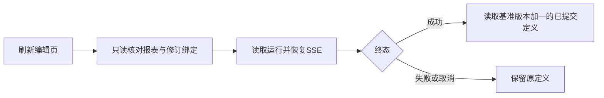

# 第 6 步 AI 修改恢复补充清单

日期：2026-09-28。状态：用户回复“可以”批准本补项，主代理已单独完成实施和验收，第 6 步整体完成。

## 已确认的接口缺口

补项实施前，修订回执只有会话 ID 和运行 ID；`GET /analysis-runs/:id` 包含账号、组织和会话，但没有报表 ID 与基准版本。报表修改成功后保存的定义也未记录本次修订运行 ID。刷新编辑页时，需要通过本补项让 API 核对任务与报表、基准版本的绑定，衔接恢复及成功版本定位。

## 最小补项

新增只读 `GET /reports/:id/revisions/:runId`，返回 `{ report_id, analysis_run_id, expected_version }`。服务端读取现有报表修改上下文，复核当前组织、账号、报表访问和作者身份，确认模式为 revision 且报表 ID 匹配。未找到或不匹配时拒绝；响应禁止缓存。

前端先通过该接口核对绑定，再使用原运行读取／SSE 接口恢复会话与状态。成功运行对应已提交的 `expected_version + 1`，通过现有定义版本接口读取；失败、取消和不匹配时不替换草稿。

## 文件与验证

- 修改 `ai-data/packages/contracts/src/reports/report-definition.ts`、配套类型及公共 `src/index.ts`：补充严格响应合同。
- 修改 `ai-data/apps/api/src/reports/report-revision-service.ts`：基于已有 repository.get 和 definitions.get 增加只读核对方法。
- 修改 `ai-data/apps/api/src/routes/report-execution-routes.ts`、`src/app-types.ts`：公开读取路由及装配类型。
- 补充对应合同／服务／路由测试，维护受影响测试替身和第 6 步浏览器验收。
- 验证正确绑定可恢复；同账号另一报表、另一组织／账号、分析说明运行及非作者拒绝；读取不新建运行、不修改定义、不执行业务查询。

无新增依赖、数据库结构或 DAS 调整，依赖操作为 0，主代理单独实施。

## 交付与验收

只读绑定路由、公共合同及前端恢复已落地。覆盖澄清、取消、失败、完成、读取重试、身份和任务切换；恢复不重复 POST 修改。Web 109 项、报表及绑定 API 40 项、报表合同 8 项、真实 SQL 集成 7 项和生产浏览器 34 项通过，类型、lint、格式与 Web 构建通过。

正式页面恢复此前 rj 完成的门诊报表 v2，业务写请求为 0，定义、快照及运行记录保持一致。交付及总流程见[第 6 步交付说明](前端第6步交付说明.md)，命令和证据见[验收记录](前端第6步验收/验收记录.md)。

