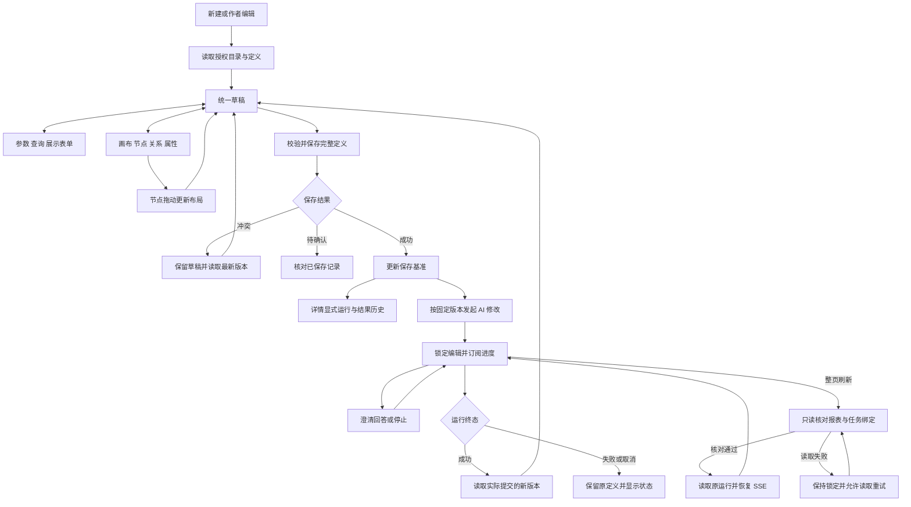
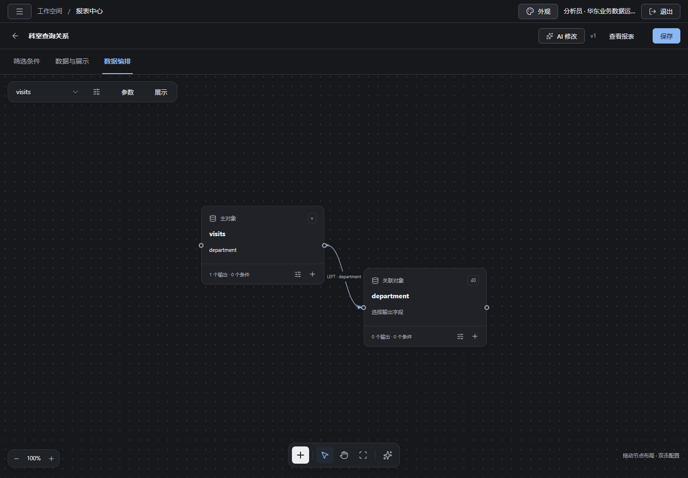
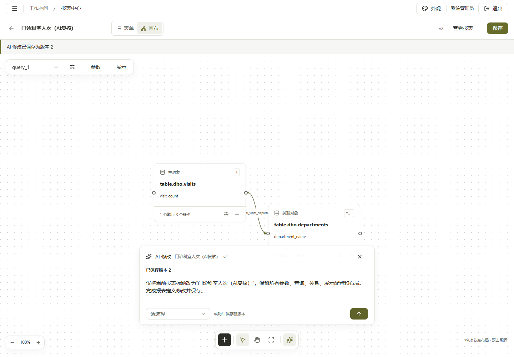
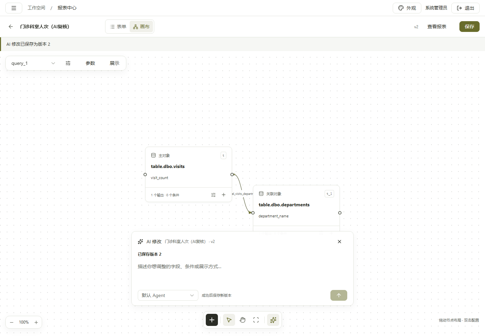

# 前端第 6 步交付说明：表单与查询画布

日期：2026-09-28。状态：**表单、查询画布、版本保存及 AI 修改刷新恢复均完成验收，第 6 步整体完成。**

依据：[已批准实施清单](前端第6步实施清单.md)、[画布参考](前端第6步参考/画布参考.png)及用户回复“可以”批准的[恢复补充清单](前端第6步AI修改恢复补充清单.md)。主代理单独实施；子代理数量、Agent 依赖安装／升级／卸载操作均为 0。

## 1. 已交付行为

报表中心增加“新建报表”，作者可从详情进入编辑。`/reports/new` 和 `/reports/:id/edit` 使用同一编辑器；表单、画布和属性面板共享草稿及保存基准。

| 内容       | 实际行为                                                                                                                                 |
| ---------- | ---------------------------------------------------------------------------------------------------------------------------------------- |
| 参数与查询 | 编辑标识、标签、类型、必填、默认值、枚举及范围；日期支持相对时间。支持关系查询、参数化数据集和指标查询。                                 |
| 查询语义   | 可选授权源和对象、批准关系、输出与聚合、分组排序、嵌套条件、对象预过滤、ON 条件、对象预聚合及参数绑定。更换主对象前显示需要重建的内容。  |
| 引用维护   | 参数／查询／别名改名联动结构化引用；删除处理关联依赖及展示引用。已有固定块来源在正常编辑与保存中保留。                                   |
| 画布       | 点阵工作区、浮动查询选择与属性、底部工具栏、缩放、平移、节点拖动。端口拖向空白或已有节点后选择批准关系；坐标随定义保存。                 |
| 连线光流   | 自定义 SVG 曲线、方向箭头、移动高亮光段和渐隐拖尾。光段随连线变化；页面隐藏暂停，减少动态效果时保留静态连线。                            |
| 展示配置   | 分区、文字、表格、柱状／折线／饼图、字段和顺序。结构预览显示配置，历史预览显示原定义／结果／执行版本，只读取已有结果。                   |
| 保存       | 新建写入 v1；编辑提交完整定义、来源、分享名单和基准版本。冲突保留两份内容供选择；创建回执丢失进入待确认状态。                            |
| AI 修改    | 已保存报表按固定版本发起，运行期间锁定编辑。支持进度、澄清、停止、同页重连和整页刷新恢复；成功后读取实际保存版本，失败或取消保留原定义。 |
| 身份与主题 | 作者校验、身份切换清理、迟到响应丢弃；沿用亮暗模式及橄榄绿、海蓝、青绿、紫罗兰，覆盖桌面和窄屏。                                         |

新增普通用户 `GET /catalog/sources`：从健康注册源中去重、按游标分页，并逐个核对当前用户是否有可见对象。目录读取失败返回错误；响应禁止缓存。

新增只读 `GET /reports/:id/revisions/:runId`：从既有修订记录读取绑定，核对组织、账号、报表、当前权限及作者身份，仅返回报表 ID、运行 ID 和基准版本。刷新编辑页先核对该绑定，再恢复原运行和 SSE；恢复读取不会重新提交 AI 修改。读取失败保持编辑锁定并提供重试，切换任务或身份后丢弃旧响应。

## 2. 预览入口

开发服务沿用工作区根目录的 `pnpm dev`，Web 为 [报表中心](http://127.0.0.1:5173/reports)。进入报表，点击“编辑报表”，再切换“画布”。新建入口为 [新建报表](http://127.0.0.1:5173/reports/new)。

正式验收的三份报表归当前配置的验收管理员账号，初始分享名单为空：

| 报表                                                                                         | 定义版本    | 对账结果                                             |
| -------------------------------------------------------------------------------------------- | ----------- | ---------------------------------------------------- |
| [门诊科室人次（AI复核）](http://127.0.0.1:5173/reports/6590692f-afe6-44aa-abe9-b3c6519708c1) | v2，v1 保留 | 17 组，24,000 人次；当前查询覆盖演示表全部就诊记录。 |
| [住院情况](http://127.0.0.1:5173/reports/4be90771-90a6-4598-9454-077cffed9762)               | v1          | 入院 1,480、出院 1,280，分别 12 组。                 |
| [门住院有效费用](http://127.0.0.1:5173/reports/47dfa9e0-8e34-4999-b9be-475732e75dc2)         | v1          | 门诊 118,115,274 分，住院 226,315,800 分。           |

住院和费用的日期范围为 `2026-01-01 00:00:00` 至 `2026-09-27 23:59:59`，费用金额使用已发布指标的“分”单位。所有数据来自现有合成业务库 `ai_bi_demo`，经正式 API/DAS 读取。

真实 rj 模型完成门诊报表标题修改，生成 v2，随后再次执行成功。只读复核确认：v1 原定义仍在；v2 除标题外，参数、查询、关系、展示与布局均保持一致；旧执行和快照保留。原始记录见[正式业务验收](前端第6步验收/正式业务验收.json)、[SQL 对账](前端第6步验收/SQL对账.json)及[版本与历史复核](前端第6步验收/版本与历史复核.json)。

本次恢复补项使用上述真实 rj 任务进行只读复验：直接进入及刷新编辑页均恢复已提交 v2，并可继续编辑；前后定义、快照和运行记录一致，业务写请求为 0，浏览器错误为 0。记录见[正式刷新恢复](前端第6步验收/正式刷新恢复.json)。

## 3. 执行流程

## 4. 文件范围

以下路径相对于 `ai-data/` 工作区；没有删除文件。

| 文件或目录                                                                                                     | 本步职责                                                                     |
| -------------------------------------------------------------------------------------------------------------- | ---------------------------------------------------------------------------- |
| `apps/web/src/features/reports/pages/report-editor.vue`                                                        | 编辑路由、统一草稿入口、保存／离开确认、画布和 AI 面板装配。                 |
| `apps/web/src/features/reports/stores/report-editor*.ts`、`report-revision*.ts`                                | 作者、保存版本、冲突、待确认、目录、AI 生命周期与身份清理。                  |
| `apps/web/src/features/reports/models/definition-editor*.ts`、`query-editing.ts`、`query-graph*.ts`            | 引用维护、查询变换、稳定节点标识与坐标。                                     |
| `apps/web/src/features/reports/components/` 新增编辑组件                                                       | 参数、条件、类型值、查询／关系／指标、展示、画布节点、流光边和 AI 修改。     |
| `apps/web/src/features/reports/api/editor-schema.ts`                                                           | 授权对象与指标响应校验。                                                     |
| `apps/web/src/app/`、`src/main.ts`、`src/styles/report-editor.css`                                             | 路由、服务、布局模式、按需样式和主题。中心／详情页新增编辑入口。             |
| `apps/api/src/catalog/authorized-source*.ts`、`src/routes/catalog-source-routes.ts`、`src/app.ts`              | 普通身份数据源发现和正式装配。                                               |
| `packages/contracts/src/catalog/source-list*.ts`、`src/index.ts`                                               | 严格输入／输出合同、类型和公共导出。                                         |
| `apps/api/src/reports/report-revision-service.ts`、`src/routes/report-execution-routes.ts`、`src/app-types.ts` | 修订只读绑定、认证路由及装配类型。                                           |
| `packages/contracts/src/reports/report-definition*.ts`、`src/index.ts`                                         | 修订绑定响应合同、类型和公共导出。                                           |
| Web／API／contracts 测试及 API `tests/support/`                                                                | 行为测试、真实 HTTP 隔离仓储、授权源及浏览器验收。编辑场景使用独立内存账号。 |

画布库实装 `@vue-flow/core 1.48.2`，Web 包声明沿用用户安装的 `^1.48.2`，不放入 catalog；MIT 免费许可。现有 Vue `3.5.43`、TypeScript `6.0.3` 均沿用安装结果。

## 5. 验证结果

恢复补项验证：Web 109 项、报表及绑定路由 API 40 项、报表 contracts 8 项、真实 SQL 报表流程 7 项通过。Web／API／contracts 类型检查、本次文件 lint 和格式检查及 Web 生产构建通过；Chromium 刷新恢复定向 3 项及生产应用回归 34 项全部通过，其中编辑页 11 项。前期授权源、工程规则、内容与容量验收结果保留在[验收记录](前端第6步验收/验收记录.md)。

恢复验收覆盖运行中、等待澄清、成功、失败、取消及临时读取故障。拒绝其他报表、账号、组织及分析说明运行，成功只加载已提交的基准版本加一；刷新后的回答和停止继续作用于原任务。

正式 SQL 六项对账和真实模型修改通过。51 节点／50 条关系验证了渲染、选择、缩放和暂停动效，未测量帧率。构建保留既有图表／流程图大分包警告。

