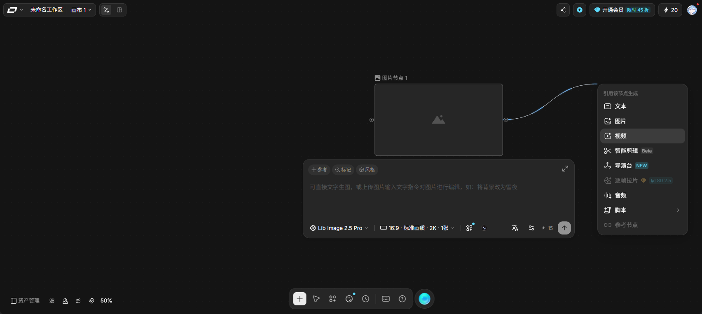
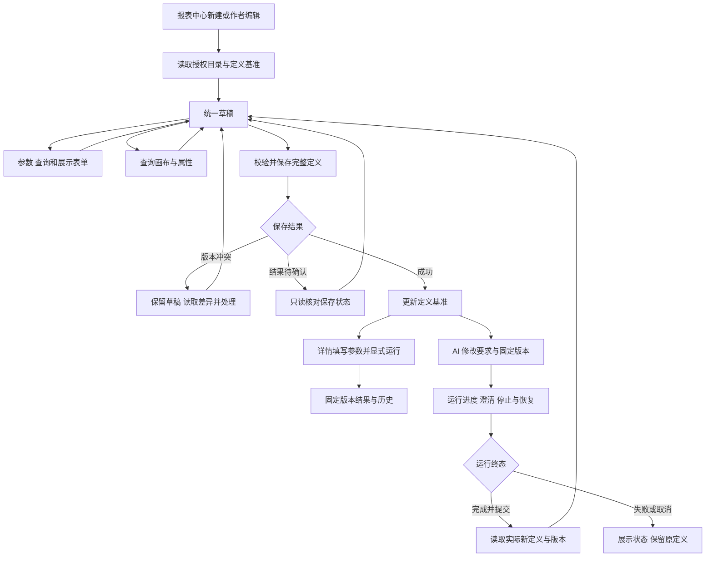

# 前端第 6 步实施清单：新建与统一编辑报表

日期：2026-09-28。状态：**用户批准整步清单、画布流光方案及 AI 刷新恢复补项后，主代理已完成全部实施和验收，第 6 步整体完成。** 用户已自行安装 Vue Flow，声明为 `^1.48.2`，锁文件和实装为 `1.48.2`；安装核对通过，Agent 依赖操作为 0。实际结果见[交付说明](前端第6步交付说明.md)，恢复接口范围见[已完成的补充清单](前端第6步AI修改恢复补充清单.md)。

承接[前端实施流程](前端实施流程.md)第 6 步及[第 5 步交付说明](前端第5步交付说明.md)。用户确认先准备本步清单，实施按项目“清单审核后执行”的规则推进。拟由主代理单独完成，子代理数量为 0。

## 1. 目标与六项工作

用户能够创建报表，用表单和查询画布连续编辑，保存后通过 AI 修改同一报表，再回到第 5 步详情填写参数、显式运行及查看历史。

| 工作                  | 目的与交付                                                                                                          |
| --------------------- | ------------------------------------------------------------------------------------------------------------------- |
| 1. 编辑入口与统一草稿 | 增加 `/reports/new`，实现 `/reports/:id/edit`，接通报表中心及作者的详情编辑入口；表单与画布共用一份草稿和保存基准。 |
| 2. 参数与查询表单     | 编辑标题、参数、三类查询、参数绑定；引用变更联动校验，错误定位到对应查询或字段。                                    |
| 3. 查询关系画布       | 展示当前查询的对象、别名、批准关系及连接方式；支持添加对象、连接、拖动、缩放、选中配置和坐标恢复。                  |
| 4. 展示配置与版本保存 | 编辑分区、文字、表格、图表和顺序；完整保存定义与既有分享名单，处理版本冲突及保存结果待确认。                        |
| 5. AI 对话修改        | 已保存报表按固定版本发起修改，接入进度、澄清、停止与断线恢复；运行成功后读取实际保存的新定义。                      |
| 6. 验收与交付         | 覆盖权限、跨入口一致性、主题、窄屏、异常恢复；用现有演示库完成真实新建、修改、执行与历史验证，落交付说明和流程图。  |

### 页面与视觉

- 沿用现有 Element Plus、亮暗模式以及橄榄绿、海蓝、青绿、紫罗兰四套配色。
- 顶部显示报表标题、基准版本、未保存状态、“保存”和“查看报表”，提供表单／画布切换。已保存报表提供“AI 修改”。
- 表单模式使用参数、查询、展示分区导航和属性编辑区；画布模式采用下方参考图的布局，画布铺满编辑工作区，目录与属性面板按需展开。
- 画布选择关系时展示起点、终点、字段对和允许的连接方式。关系的方向与业务含义可见，颜色同时配合文字及箭头。
- 1024px 收起辅助区域；390px 使用分区导航、属性抽屉及底部操作面板。添加对象、选择关系、修改属性均有表单操作，键盘用户也能完成编辑。
- 新报表先通过表单或画布形成可保存定义，首次保存后启用 AI 修改。保存完成可进入详情；运行由用户在详情页明确触发。

### 画布参考与布局落点

用户于 2026-09-28 提供以下截图，并说明来自 livtb，补充要求参考其沿连线流动的光效。原图已保存到项目，后续实现及视觉验收同时覆盖布局、交互和连线动效。



| 参考元素                     | 本项目的具体用法                                                                                                                 |
| ---------------------------- | -------------------------------------------------------------------------------------------------------------------------------- |
| 大面积可平移、缩放的点阵画布 | 画布占据编辑工作区，点阵随视口变换，节点和工具浮于其上。进入画布时应用导航折叠为入口，退出画布恢复正常布局。                     |
| 左上角紧凑标题栏             | 返回报表、报表标题、当前查询选择及表单／画布切换；右上角集中版本、未保存状态、保存和主题入口。                                   |
| 节点及左右连接端口           | 数据对象节点显示名称、别名、已选字段和条件摘要；参数化查询与指标节点显示各自查询摘要。端口可点击，也可拖动。                     |
| 平滑曲线、流光与选中高亮     | 连线标注批准关系和连接类型，箭头表达方向；带渐隐拖尾的高亮光段沿曲线从起点流向终点，选中时强化当前主题色。字段对在就近面板查看。 |
| 拖线后就近展开的菜单         | 从对象端口拖到空白处，列出当前可执行的批准关系和目标对象；选择后创建节点及关系。拖到已有节点时筛选两者之间的可用关系。           |
| 底部居中的悬浮工具栏         | 添加对象／查询、选择、平移、适应视图与 AI 修改入口；缩放比例及加减按钮位于左下角。图标配提示及键盘焦点。                         |
| 节点附近的操作区域           | 选中节点显示简短操作条，复杂字段、筛选和预聚合由可关闭的属性浮层展开；节点摘要保持可扫读。                                       |
| 宽幅 AI 输入面板             | 用户打开 AI 修改时，在底部工具栏上方展开输入栏，显示报表、基准版本、Agent 和发送／停止；进度与澄清可展开，收起后保留运行状态。   |

画布采用现有中性色和主题变量：暗色模式以深色底和较浅节点区分层级，亮色模式使用浅底；文字、端口和选中轮廓保持可辨识对比。主题色用于当前选择、焦点和主要动作。

连线动效采用稳定的曲线底线叠加移动光段：亮点前端清楚、尾部渐隐，平缓循环流过，悬停或选中时增强可见度。光段沿实际连接方向运行，节点拖动和视口缩放时与曲线路径同步；常态流光表示关系方向，执行状态依据真实接口回执展示。实现使用 Vue Flow 自定义边及 SVG/CSS，沿用本步依赖清单。

系统设置减少动态效果时采用静态高亮与方向箭头；页面隐藏或画布离开时停止动效。浏览器验收覆盖亮暗主题、不同时间帧的光段移动、拖动后的路径对齐，以及 51 节点／50 条关联场景的交互表现。

节点随画布平移缩放，工具栏及面板固定在视口；右键菜单、连线菜单和属性浮层靠近目标并自动避让边界。AI 输入及菜单内的滚轮、拖选和空格输入不会触发画布平移；Escape 关闭当前临时菜单并恢复焦点。移动端将浮层切换为底部面板，一次呈现一个主要编辑区域。

此布局沿用第 2 节的查询图语义与整份报表版本保存方式。AI 面板明确针对当前报表发起修改，节点点击和连线操作由用户直接编辑统一草稿。

## 2. 编辑行为与实际合同

本节以现有 `ReportDefinition`、报表保存／修订服务和目录路由为依据。表单及画布修改同一对象，AI 修改提交到同一 `report_id` 的版本链。

### 2.1 草稿、身份和入口

- 草稿与服务端基准分别保存；草稿允许暂时不完整，提交前使用公共 Schema 与引用校验。
- 切换表单、画布及属性面板保留所有编辑内容。画布节点是查询对象的可视表达，坐标写入 `editor_layout.nodes`，关系和筛选写入查询本身。
- 新建路由单独注册，避免将 `new` 作为报表 ID 读取。已有报表编辑默认读取最新定义；历史定义继续在第 5 步查看。
- 编辑权依据实际作者身份；页面入口和直接访问均检查，最终由 API 再次授权。只有旧快照的报表继续提供原有查看能力。
- 未保存内容离开编辑页时提示保存或放弃；刷新使用浏览器离开提醒。草稿保存于当前页面内存，整页刷新后重新读取已保存版本。
- 切页、退出或切换账号时中止读取与订阅，清除对应草稿和目录缓存；旧请求的晚到响应不能写回新身份或新报表。

### 2.2 参数与三类查询

| 内容       | 编辑范围                                                                                                                     |
| ---------- | ---------------------------------------------------------------------------------------------------------------------------- |
| 报表参数   | 名称、显示标签、类型、必填、固定默认值、允许值、上下界；日期支持合同中的相对时间及范围端点。覆盖标量、多值、范围和显式空值。 |
| 关系查询   | 数据源、主对象及别名、批准关系、输出字段及别名、聚合、分组、排序、行数上限、嵌套 AND/OR 条件。                               |
| 条件位置   | 区分查询筛选、主对象预过滤、关联对象预过滤及 ON 条件；高级属性中编辑对象预聚合的分组和输出，保持外连接及统计粒度语义。       |
| 参数化查询 | 按数据集声明显示命名参数、类型与必填条件；固定输出由目录/API 决定，编辑命名输入及报表参数绑定。                              |
| 指标查询   | 选择有权读取的已发布指标、固定版本或运行时使用的当前版本、分组或总计、日期与维度；日期可绑定报表参数。                       |
| 参数绑定   | 明确绑定到筛选位置、命名输入或指标日期端点；显示同一参数被哪些查询使用。                                                     |

参数、查询或别名改名时同步其结构化引用；删除前列出受影响项，用户选择一并移除或取消。查询 ID、分区及块 ID 保持稳定。涉及固定块引用时同时校验 `query_id_map` 和 `parameter_map`，完整保留现有依赖及来源信息。

保存前检查重复标识、断开的引用、参数类型、缺失字段和合同容量。当前合同最多 100 个参数、100 个查询；单个关系查询最多 50 条关联，布局最多 1,000 个节点。前端使用共享约束，API 负责当前目录和权限的最终校验。

### 2.3 查询画布

- 通过悬浮工具栏“添加”打开数据源与授权对象选择面板，当前查询按需展开一层关系。选择新对象时读取对应详情和普通用户关系接口。
- 关系查询按“查询 ID + 对象别名”定位节点，同一表可有多个别名。多字段关系完整显示所有字段对。
- 拖动连接后在落点附近选择目录已批准的关系、方向与连接方式；空白落点可由批准关系带出目标对象，已有节点间仅显示匹配关系。无可执行关系时说明原因，取消关闭菜单。入向关系可以浏览，执行仍须具有对应出向批准关系。
- 添加关联顺序满足 `source_alias` 引用已有节点的合同。删除节点或关系时先列出字段、条件、参数绑定及后续关联依赖。
- 选择节点后在属性浮层编辑字段、条件与对象预聚合；选择边后编辑允许的连接方式及 ON 条件。浮层关闭后保留节点选择及已录入内容；表单和画布立即反映同一草稿。
- 参数化查询及指标查询在画布中显示为独立查询节点，属性区编辑各自参数；跨查询通过展示块引用组合。
- 节点拖动只更新布局。重新打开恢复位置；缺少坐标时采用固定的初始排列。画布按需加载，打开报表列表不会加载画布模块。

### 2.4 展示、保存与冲突

- 编辑分区标题、分区／块顺序及块标题，提供文字、表格、折线图、柱状图、饼图；表格选择显示列，图表选择对应查询的 X/Y 字段。
- 表格和图表引用一个查询，文字可引用多个查询。已有文字绑定的 `source_execution_id` 保留并显示来源，新的执行说明仍按第 5 步生成。
- 展示配置的结构预览复用现有渲染组件；有历史数据时明确展示其原执行和定义版本，没有结果时显示布局及字段占位。预览本身不请求业务执行。
- 创建调用 `POST /report-definitions`；修改提交完整定义和 `expected_version`，并保留 `shared_with`、`source_analysis_run_id`、`source_artifact_id` 等现有保存信息。
- 保存成功用服务端返回值更新基准和草稿，刷新中心及版本信息；保留详情历史结果与原条件。
- `409 CONFLICT` 时保留本地草稿，另外读取最新定义展示差异。用户可采用服务端版本，或明确将当前草稿作为待保存内容、以最新版本继续处理；分享名单取最新服务端值。再次保存仍经过版本和权限校验。
- 保存期间防止重复提交。现有创建接口没有幂等键：回执丢失时标记“保存结果待确认”，保留草稿，先引导核对报表中心，不能自动再次创建。已有报表可读取最新版本及内容核对是否保存成功。

### 2.5 AI 修改

- 使用 `POST /reports/:id/revisions`，提交 `expected_version`、修改要求、幂等键和可选 Agent。画布通过底部悬浮 AI 面板发起，表单模式使用同一修改组件；页面明确提示：运行成功会保存新定义版本。
- 有未保存改动时，先明确选择保存再发起，或放弃改动后基于已保存版本发起；保存失败则不启动 AI。
- AI 运行期间锁定当前编辑器的定义修改与保存，保留基准版本。其他页面或账号的并发修改仍由服务端版本检查处理。
- 复用认证 SSE、澄清、停止及重连。回执写入编辑页 URL，刷新只恢复已知运行，不重新发起修改；同次请求结果待确认时沿用原输入与幂等键。
- 刷新先调用获准补项 `GET /reports/:id/revisions/:runId` 核对报表、身份和基准版本，再恢复原运行；成功读取 `expected_version + 1` 的实际已提交定义。
- 工具暂存成功不等于报表已保存。运行完成后重新读取定义与版本链，核对实际版本，再替换编辑基准和展示变化。失败、取消及冲突显示实际状态，保留原定义。
- 第 5 步的“AI 分析说明”继续绑定执行结果；本步“AI 修改”改变定义，两者分别提供明确入口。

## 3. 接口复用与必要补项

下表为 API 路径，Web 经现有 `/api` 同源代理调用。

| 接口                                                             | 用途及状态                                                         |
| ---------------------------------------------------------------- | ------------------------------------------------------------------ |
| `GET /catalog/sources?limit=20&cursor=...`                       | **拟新增**：普通用户选择当前可用且有授权对象的数据源。             |
| `GET /catalog/datasets/:sourceId`、`.../search`、`.../:objectId` | 复用授权目录列表、搜索和详情。按当前选定源读取，切换身份清理缓存。 |
| `GET /catalog/:sourceId/objects/:objectId/relations`             | 复用普通用户一层关系图，保留双方对象及连接字段的授权过滤。         |
| `GET /metrics`、`GET /metrics/:id?version=N`                     | 复用可见指标列表与指定版本。                                       |
| `POST /report-definitions`                                       | 复用首次创建，返回报表 ID 和定义版本。                             |
| `GET/PUT /reports/:id/definition`、`GET /reports/:id/versions`   | 复用读取、乐观锁保存、版本核对及冲突处理。                         |
| `POST /reports/:id/revisions`                                    | 复用绑定已保存报表与基准版本的 AI 修改。                           |
| `GET /reports/:id/revisions/:runId`                              | 已获准并完成的恢复补项：只读核对任务与报表及基准版本绑定。         |
| 现有运行、SSE、回答与取消接口                                    | 复用第 4、5 步的运行生命周期。                                     |
| 第 5 步详情和执行接口                                            | 保存后由用户进入详情显式执行，结果绑定实际定义版本。               |

### 数据源列表补项

当前普通目录接口需要已知 `sourceId`；管理诊断列表面向管理员。现有模型工具 `list_sources` 已采用“健康源 + 当前身份有可见对象”的筛选逻辑，本步拟以同一授权语义补齐普通 HTTP 入口。

- 输入：`limit` 默认 20、最大 100，及有长度上限的游标；严格拒绝未知字段。
- 输出：`{ items: [{ source_id }], next_cursor? }`。按源 ID 稳定排序、去重和分页。
- 每次请求按登录身份重新检查健康实例和对象／列权限；只返回至少有一个可见数据集的数据源。页面使用返回的源 ID 作为选项。
- 返回内容不包含连接配置、DAS 地址、凭据或管理诊断详情；列表反映当前可用范围。目录读取失败与真实空列表分别处理。
- 复用现有健康实例注册和业务目录服务；新增路由、薄服务及共享响应合同，数据库结构与 DAS 协议沿用现状。

这是本清单明确提出的后端补项，随本清单一并审核。分享对象选择、文件导出及管理功能继续按第 7—10 步推进。

## 4. 文件增删改

以下为本步拟实施范围；组件和类型按现有 feature 目录细分，类型文件采用 `*-types.ts`。

| 操作         | 路径                                                                                                                                         | 内容                                                                                           |
| ------------ | -------------------------------------------------------------------------------------------------------------------------------------------- | ---------------------------------------------------------------------------------------------- |
| 修改         | `ai-data/apps/web/package.json`                                                                                                              | 新增精确版本的画布依赖。                                                                       |
| 用户安装生成 | `ai-data/pnpm-lock.yaml`、本地依赖目录                                                                                                       | 用户安装后核对实际解析、许可及版本变化。                                                       |
| 新增         | `ai-data/apps/web/src/features/reports/pages/report-editor.vue`                                                                              | 统一新建／编辑页面。                                                                           |
| 新增         | `ai-data/apps/web/src/features/reports/stores/report-editor.ts`、`report-revisions.ts` 及类型文件                                            | 草稿、保存、冲突、AI 修改和生命周期。                                                          |
| 新增         | `ai-data/apps/web/src/features/reports/models/definition-editor.ts`、`query-graph.ts` 及类型文件                                             | 引用变更、校验、草稿与图节点映射、差异展示。                                                   |
| 新增／修改   | `ai-data/apps/web/src/features/reports/api/`、`components/`                                                                                  | 授权目录响应，参数／查询／条件／展示编辑器、画布节点边、悬浮工具栏、属性浮层、冲突及 AI 面板。 |
| 修改         | `ai-data/apps/web/src/features/reports/pages/report-center.vue`、`report-detail.vue`                                                         | 新建、作者编辑、保存后回到详情及版本刷新。                                                     |
| 修改         | `ai-data/apps/web/src/app/router.ts`、`services.ts`、`services-types.ts`                                                                     | 新建路由、编辑器服务及身份资源装配。                                                           |
| 修改         | `ai-data/apps/web/src/app/app-layout.vue`、`layout-store.ts`、`src/styles/app.css`                                                           | 画布模式下折叠应用导航、展开工作区；离开后恢复布局，保留导航、主题和身份操作入口。             |
| 新增／修改   | `ai-data/apps/web/src/styles/report-editor.css`、`src/main.ts`                                                                               | 编辑器布局、主题变量与所需样式。                                                               |
| 按需修改     | `ai-data/apps/web/src/features/reports/components/report-block.vue`、现有 reports 状态及公共流组件接口                                       | 仅补本步结构预览、保存后刷新和 AI 生命周期复用所需接口。                                       |
| 新增         | `ai-data/apps/api/src/catalog/authorized-source-service.ts` 及类型文件、`src/routes/catalog-source-routes.ts`                                | 面向当前身份的可用数据源列表。                                                                 |
| 修改         | `ai-data/apps/api/src/app.ts`                                                                                                                | 注册源列表路由，传入现有认证、注册和目录依赖。                                                 |
| 新增／修改   | `ai-data/packages/contracts/src/catalog/source-list.ts`、`source-list-types.ts`、`src/index.ts`                                              | 列表输入／输出合同及公共导出。                                                                 |
| 新增／修改   | `ai-data/apps/web/tests/features/reports/`、`tests/app/`、`tests/e2e/report-editor.spec.ts`                                                  | 草稿、表单、图、保存、AI、路由、画布布局切换与浏览器场景。                                     |
| 新增／修改   | `ai-data/apps/api/tests/catalog/`、`tests/routes/catalog-source-routes.test.ts`、`tests/support/web-report-fixture.ts`、`web-auth-server.ts` | 源授权服务、真实路由和隔离浏览器测试数据。                                                     |
| 新增／修改   | `ai-data/packages/contracts/tests/catalog/source-list.test.ts`、受影响的既有报表测试                                                         | 合同、边界与相关回归。                                                                         |
| 维护         | 本清单、`任务交接/前端实施流程.md`、`任务交接/README.md`                                                                                     | 更新状态，README 追加。                                                                        |
| 已保存参考   | `任务交接/前端第6步参考/画布参考.png`                                                                                                        | 用户提供的原图，用于后续布局和交互验收。                                                       |
| 新增         | `任务交接/前端第6步交付说明.md`、`任务交接/前端第6步验收/`                                                                                   | 行为场景、真实验收脚本、结果、截图及流程图。                                                   |

文件删除为 0。正式验收仅在系统库新增本步报表、版本及执行记录，业务数据查询使用现有只读演示源。发现其他接口或合同无法承载上述行为时，先提交具体调整清单。

## 5. 依赖与用户安装命令

拟新增 **1 项 Web 直接依赖：`@vue-flow/core@1.48.2`**，用于交互查询画布。现有 Element Plus 提供属性表单、按钮、抽屉和缩放操作入口；图标、Markdown、图表继续使用已安装依赖。

2026-09-28 已只读核对 [npm 精确版本元数据](https://registry.npmjs.org/@vue-flow%2fcore/1.48.2)、[Vue Flow 官方说明](https://vueflow.dev/guide/)和[MIT 许可](https://github.com/bcakmakoglu/vue-flow/blob/master/LICENSE)：该包免费，许可允许商业使用并要求保留声明；Vue peer 为 `^3.3.0`，覆盖项目 `3.5.43`。发布包未声明 `preinstall/install/postinstall`。实际安装、间接依赖和 Web 编译兼容性在安装后验证。

依赖直接写入 `apps/web/package.json`，不放入 catalog。执行顺序：**用户批准清单 → Agent 准备依赖声明 → 用户安装 → Agent 核对并实施**。

以下命令须在依赖声明准备完成后由用户执行：

```powershell
Set-Location -LiteralPath 'D:\porject_new_2026\ai-data\ai-data'
pnpm --version
# 预期为项目声明的 11.22.0。
pnpm install --no-frozen-lockfile
if ($LASTEXITCODE -ne 0) { throw '安装失败，请保留完整报错。' }
pnpm --filter @ai-data/web list @vue-flow/core --depth 0
```

预期显示 `@vue-flow/core 1.48.2`。如果 pnpm 版本不匹配，使用项目既有的 `npm exec --yes --package=pnpm@11.22.0 -- pnpm ...` 方式执行对应命令。若出现新的构建脚本许可或依赖冲突，先核对具体包和脚本再处理。

## 6. 验收与完成标准

按开发规范先写 BDD 场景及测试，确认目标行为的预期失败，再实施并运行相关回归。使用已安装 CLI 验证。

| 场景                                        | 验收预期                                                                                                               |
| ------------------------------------------- | ---------------------------------------------------------------------------------------------------------------------- |
| 新建、保存、进入详情、显式运行              | 同一报表形成定义 v1；保存不执行业务查询；执行结果引用该版本和实际参数。                                                |
| 表单修改后切到画布，再保存重开              | 参数、查询、条件、展示、块引用和坐标完整保留；两种视图语义一致。                                                       |
| 参数／查询／别名改名与删除                  | 所有绑定、字段、展示及固定块映射准确处理，失效引用阻止保存。                                                           |
| 同表多别名、多字段关系、入向关系            | 节点独立，字段对完整，批准方向和连接方式不能绕过。                                                                     |
| 外连接、对象过滤、ON 条件、预聚合           | 条件位置及统计粒度保持正确；复用后端相关查询回归。                                                                     |
| 参数化查询和固定版本指标                    | 类型与输出来源准确，日期绑定和分组／总计正确；复杂输入切换编辑入口不丢失。                                             |
| 非作者、受限账号、权限更新及源失联          | 入口及直接访问正确；源、对象和关系按当前授权返回；错误不会伪装成正常空列表。                                           |
| 并发版本更新、分享版本更新、保存回执丢失    | 草稿保留，冲突处理显式，分享名单正确，待确认状态不触发重复创建。                                                       |
| AI 修改、澄清、停止、失败、断线和刷新       | 绑定固定报表与版本，暂存不冒充保存，成功读取已提交版本，刷新不重复提交。                                               |
| 保存或 AI 修改后查看旧结果                  | 旧结果和原定义／参数保持对应，只有新执行才生成新结果。                                                                 |
| 退出、换号、快速切换报表                    | 草稿、目录与订阅正确隔离，晚到响应无效。                                                                               |
| 亮暗模式、四套配色、1440／1024／390px、键盘 | 导航、属性、错误提示和保存可达；画布及抽屉可操作。                                                                     |
| 参考图布局、平移缩放、工具栏与浮层          | 点阵及节点随视口变换，工具栏固定；连线菜单在落点附近且不超出屏幕，面板滚动及输入不触发画布操作；关闭后恢复焦点。       |
| 连线流光、主题及减少动态效果                | 光段和渐隐拖尾沿曲线方向移动，拖动／缩放后保持对齐；亮暗配色可辨识，减少动态效果时静态呈现；页面隐藏及离开后停止动效。 |
| 画布与表单切换、展开 AI 输入                | 草稿保持一致，应用导航正确恢复，底部面板与工具栏不遮挡主要操作；窄屏依次打开主要编辑区域。                             |
| 51 节点关系查询与多查询定义                 | 当前查询按需渲染，可选择、拖动和恢复；容量边界给出清楚错误。                                                           |
| 工程回归                                    | Web 单元／组件及 Chromium、源列表 API／合同和相关报表回归、工程规则、类型、lint、相关格式与 Web 构建通过。             |

### 正式业务验收范围

使用当前正式 Web/API/DAS 配置和已批准的 `ai_bi_demo`，通过界面创建最多三份报表：门诊科室人次、住院情况、门住院费用。报表归验收账号，初始分享名单为空；记录报表 ID、定义版本、执行 ID 和 SQL 对账结果，保存供用户查看。

至少一份覆盖参数和批准关系，费用报表复用已发布指标；验证保存、表单／画布切换、再次编辑、执行和历史结果。使用现有 rj 模型及默认 Agent 完成至少一次真实 AI 定义修改，确认版本提交后能再次运行。模型实际成功／失败与确定性自动化结果分别记录，失败不标记为整步通过。

完成时交付主要改动、运行流程图、依赖实际版本、测试命令与结果、浏览器截图和真实报表链接。

## 7. 流程与实施顺序



实施顺序：清单审核 → 准备依赖声明并由用户安装 → 行为测试 → 授权源接口及统一草稿 → 表单和画布 → 保存与冲突 → AI 修改 → 自动化与正式业务验收 → 交付落文件。
