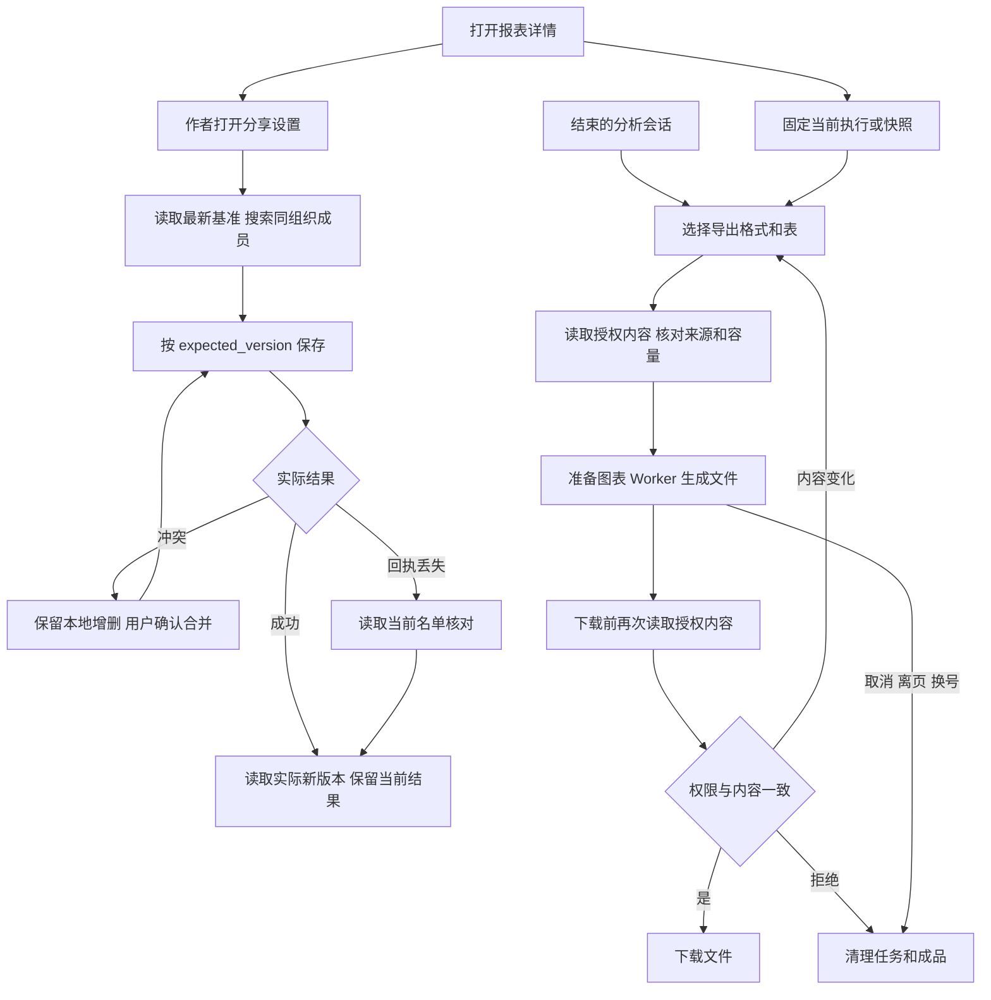

# 前端第 7 步交付说明：分享与文件导出

日期：2026-09-28。状态：**第 7 步完成。分享、三种文件导出及正式只读、Word 实机、中文分页和容量验收通过。**

用户批准[实施清单](前端第7步实施清单.md)后，由主代理单独实施。六项依赖由用户安装；用户随后授权 Agent 按原方案下载静态 Noto Sans SC。Agent 包安装、升级及卸载操作为 0。

## 1. 已交付功能

报表详情增加“分享”和“导出”，分析工作台增加会话导出。沿用 Element Plus 及现有亮暗模式、四种配色。桌面使用右侧抽屉，390px 窄屏可完整操作。

- 分享：作者搜索和分页选择同组织活跃成员，保存或撤回分享，复制报表／当前结果链接。使用最新分享版本，保留跨页选择；并发冲突保留草稿，由用户确认合并。保存回执丢失时先读取实际结果核对。
- Excel：所选完整来源按证据去重，导出全部返回列及全部行，包含来源说明页。保留数值、布尔、前导零文本、空值及东八区日期语义；公式样字符串仍为文本，空表保留列头。
- Word：真实可编辑段落、标题、列表、链接、代码和表格，图表与受控 Mermaid 流程图嵌入图片。普通文档采用纵向页面，宽表采用横向并分列组，保留行号。
- PDF：静态中文常规／粗体字体嵌入，文字可选择，表头跨页重复并带页码。长标题正文完整保留，页眉显示摘要。
- 来源与权限：导出当前显示的成功执行或明确快照版本；会话等待运行结束后导出。生成前与下载前重新读取授权内容，内容变化要求重新生成；取消、离页、换号和权限拒绝清理任务及成品。

生成库与字体按需加载，压缩和文件生成在 Worker 中执行。下载前仅复核已有内容包；用户需通过正常运行入口显式产生新的查询结果。

## 2. 资源与依赖

Web 专用依赖直接声明在 [Web package.json](../ai-data/apps/web/package.json)：ExcelJS 4.4.0、docx 9.7.1、pdfmake 0.3.11；开发验收工具为 @types/pdfmake 0.3.3、fflate 0.8.3、pdfjs-dist 6.3.289。六项均已由用户安装并核对实际版本。

字体取自 Noto CJK Sans2.004，使用 OFL-1.1 免费许可，保留原始 LICENSE：

| 文件                   |    字节数 |
| ---------------------- | --------: |
| NotoSansSC-Regular.otf | 8,331,336 |
| NotoSansSC-Bold.otf    | 8,543,168 |
| LICENSE                |     4,301 |

两份字体合计约 16.1 MiB。资源位于 [public/fonts/noto-sans-sc](../ai-data/apps/web/public/fonts/noto-sans-sc/README.md)，随 Web 构建部署，PDF Worker 从同源路径读取。官方来源、版本和 SHA-256 见[依赖核对记录](前端第7步依赖核对.json)。本机可变字体的不兼容记录见[字体调整清单](前端第7步字体兼容调整清单.md)，最终采用已验证的静态字体。

## 3. 主要文件与接口

以下路径相对于 `ai-data/`，完整行为与边界见[实施清单](前端第7步实施清单.md)。

| 范围       | 文件及职责                                                                                                                                                                                        |
| ---------- | ------------------------------------------------------------------------------------------------------------------------------------------------------------------------------------------------- |
| 共享合同   | `packages/contracts/src/reports/report-sharing*.ts` 及 `src/index.ts`：分享设置、成员状态、搜索分页严格合同。                                                                                     |
| API        | `apps/api/src/reports/report-sharing-service.ts`、`report-sharing-types.ts`、`sql-report-sharing-repository.ts`：作者核对、当前设置与候选读取；`create-report-services.ts`、`app-types.ts` 装配。 |
| 路由       | `apps/api/src/routes/report-management-routes.ts`：新增两个 GET；相关分享和导出入口刷新身份，读取禁止缓存。                                                                                       |
| 分享 UI    | `apps/web/src/features/reports/components/report-sharing.vue`、`stores/report-sharing*.ts`：抽屉、分页、冲突、待确认和生命周期。                                                                  |
| 导出       | `apps/web/src/features/exports/`：授权来源与内容转换、Markdown 文档模型、图表准备、Worker、三种生成器、导出控制器和面板。                                                                         |
| 页面装配   | 报表 `report-detail.vue`、分析 `analysis-page.vue`、`src/app/services*.ts`：入口、固定来源与身份清理。                                                                                            |
| 渲染与构建 | `src/shared/content/diagram.ts`：复用受控 Mermaid，增加打印配色；`vite.config.ts`：模块 Worker 支持动态分包。                                                                                     |
| 资源与验收 | `public/fonts/noto-sans-sc/`、contracts/API/Web 测试及 `tests/support/exports/`，外层 `任务交接/前端第7步验收/` 保存样例、截图和脚本。                                                            |

新增 `GET /reports/:id/sharing` 和 `GET /reports/:id/share-candidates`，仅作者可访问；候选来自同组织活跃账号，排除作者，搜索值参数化并转义 LIKE 通配符。保存复用 `PUT /reports/:id/sharing` 和 `expected_version`。

导出复用固定执行、快照及会话的三个 `export-content` 接口。此次实施沿用现有数据库结构与 DAS 协议；分享写入在隔离测试环境验证，正式报表及会话只读验收。

## 4. 使用与执行流程

现有依赖和字体已准备好，直接在项目目录启动：

```powershell
Set-Location -LiteralPath 'D:\porject_new_2026\ai-data\ai-data'
pnpm dev
```

打开终端显示的 Web 地址并登录。在报表详情点击“分享”选择成员；点击“导出”选择格式、表和摘要行数，生成后下载。分析工作台进入已结束的会话后可导出会话。



## 5. 验证结果

| 检查              | 结果                                                                                                       |
| ----------------- | ---------------------------------------------------------------------------------------------------------- |
| API 普通测试      | 637 项通过。                                                                                               |
| contracts         | 173 项通过。                                                                                               |
| Web               | 完整回归 128 项、后补长标题 1 项通过，累计 129 项；模型与文件相关 11 项及最终文件 5 项复验通过。           |
| 工程规则          | 42 项通过。                                                                                                |
| 隔离 SQL 报表集成 | 9 项通过，包含候选分页、特殊字符搜索和成员状态。                                                           |
| Chromium          | 41 项生产应用场景与 3 项开发专用组件场景通过；最新生产分享／导出 7 项复验通过。                            |
| 正式已有结果      | 门诊、住院、费用各导出三种格式；Excel 逐单元格与授权结果核对，分别 17／24／29 行。                         |
| 正式已有会话      | 当前账号的费用会话三种格式通过；按实际已存消息验证。用户／助手及澄清完整顺序另由专用会话场景覆盖。         |
| 正式只读边界      | 验收前后 10 张元数据表数量完全相同，业务写请求为 0；analysis_runs 25、analysis_evidence 34、工具审计 147。 |
| Word 实际打开     | 普通样例两页，200 行宽表样例 29 页；本机 Word 打开、原生编辑、保存及 PDF 排版通过。                        |
| PDF               | 正式三份报表各两页，中文、固定筛选条件、数值、重复表头、页码及换行检查通过。                               |
| 容量              | 20 表 × 5,000 行生成 100,000 行 XLSX，全部行和末列回读通过；约 4.83 秒、2.25 MB。                          |
| 取消与响应        | 容量任务取消约 0.69 秒，Worker 关闭；完整生成期间主线程继续响应，采样最大间隔 93 ms。                      |
| 代码检查          | API／contracts／Web 类型及 ESLint 通过，Web 生产构建通过；最终复验详见验收记录。                           |

测试记录、曾发现的问题及修复后的复验结果集中保存在[验收记录](前端第7步验收/验收记录.md)。

最终补查修正长标题页眉和 Word 宽表列宽；385 字标题、45 行代码、两个图形、7 列 200 行及空文档通过生成和内容检查。PDF 宽表 20 页、Word 宽表 29 页，首／中／尾页及长备注换行已查看。最终生产产物的三格式下载再次通过。

## 6. 当前边界

本地生成预算为最多 100 表、100,000 行、32 MiB 表格 JSON 和 2 MiB 正文。Word／PDF 每表摘要可选 50／100／200 行，总计最多 2,000 行；Excel 保留所选完整表全部行。截断证据明确排除，超过 XLSX 单元格容量时报错。

上述是文件生成预算；API 单次查询仍按既有 5,000 行／2 MiB 证据上限处理。十万行容量样例只衡量本地生成器，未扩大查询协议。

生产构建保留大分包提示，浏览器已验证初始页面不请求生成库或字体。项目全量 Prettier 仅剩用户安装产生的 `pnpm-lock.yaml` 格式提示；本轮实现文件格式检查通过，锁文件未因格式操作重写。

## 7. 证据入口

- [正式报表只读结果](前端第7步验收/正式只读导出.json)、[正式会话只读结果](前端第7步验收/正式会话只读导出.json)。
- [费用 Excel](前端第7步验收/正式报表/费用.xlsx)、[费用 Word](前端第7步验收/正式报表/费用.docx)、[费用 PDF](前端第7步验收/正式报表/费用.pdf)。
- [Word 实机记录](前端第7步验收/Word实际打开验证.json)、[Word 编辑后文件](前端第7步验收/Word编辑验证.docx)。
- [容量结果](前端第7步验收/导出容量验证.json)、[中文兼容验证](前端第7步验收/依赖兼容性验证.json)、[版式边界验证](前端第7步验收/文件版式边界验证.json)。

下一阶段为第 8 步管理页面，按项目规则先整理实施清单再审核执行。
