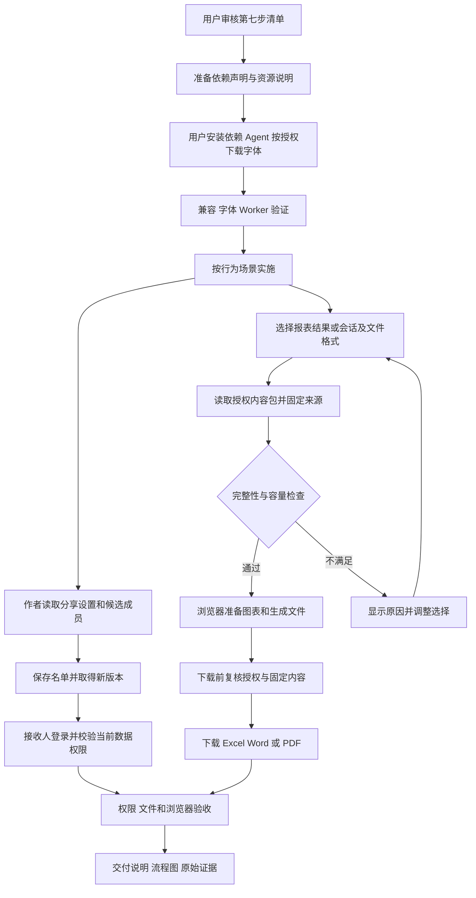

# 前端第 7 步实施清单：分享与文件导出

日期：2026-09-28。状态：**清单已批准并完成实施。分享、Excel／Word／PDF、正式只读及容量验收通过，最终交付见[第 7 步交付说明](前端第7步交付说明.md)。**

承接[前端实施流程](前端实施流程.md)第 7 步及[第 6 步交付说明](前端第6步交付说明.md)，遵循[结果交付与文件导出设计](../需求文档/result-delivery-and-export.md)。本步由主代理单独实施，子代理数量为 0；依赖安装由用户操作，字体资源按用户后续明确授权由 Agent 下载。

## 1. 目标与六项工作

用户可以把报表分享给组织内成员，并把选定的报表结果或分析会话下载为 Excel、Word、PDF。文件中的条件、时间、版本与数据范围能追溯到实际来源。

| 工作              | 交付内容                                                                                       |
| ----------------- | ---------------------------------------------------------------------------------------------- |
| 1. 依赖与资源准备 | 准备三个免费文件生成库、类型及验收工具；提供固定中文字体和用户安装命令，核对实际兼容性。       |
| 2. 分享设置       | 作者选择、搜索组织内成员，保存或撤回分享，复制登录后访问的报表链接；处理并发版本和结果待确认。 |
| 3. 导出内容与入口 | 报表详情和分析工作台接入已有授权导出接口；固定选中来源，展示完整性与文件内容预览。             |
| 4. Excel          | 从完整结果生成多工作表 XLSX，覆盖全部可导出行和列，保留值类型、条件、时间及来源。              |
| 5. Word 与 PDF    | 输出分析文档、可编辑文字和表格、图表及必要汇总；处理中文字体、长表表头、页码和分页。           |
| 6. 验收与交付     | 权限、撤回、历史版本、文件内容、中文排版、容量和异常恢复验收；保存交付说明、流程图及证据。     |

本步涉及 Web、API 分享读取及导出授权边界、共享合同和测试。沿用现有数据库结构与 DAS 查询协议。模型与 Agent 管理页面按第 8 步推进。

## 2. 现有能力与需要补齐的接口

以下为实际 API 路径；Web 继续通过 `/api` 同源代理调用。

| 接口                                                       | 当前情况与本步处理                                                                                                                   |
| ---------------------------------------------------------- | ------------------------------------------------------------------------------------------------------------------------------------ |
| `PUT /reports/:id/sharing`                                 | 已有，提交 `{ expected_version, shared_with }`。有定义时生成新定义版本；仅快照时生成新快照版本。复用作者、同组织活跃账号及版本校验。 |
| `GET /reports/:id/sharing`                                 | **已完成**：供作者读取当前分享基准及已选成员名称、状态。                                                                             |
| `GET /reports/:id/share-candidates`                        | **已完成**：供当前报表作者按关键字和游标选择同组织活跃成员。                                                                         |
| `GET /report-executions/:id/export-content`                | 已有，返回固定执行、完整结果、实际参数和该执行的分析说明；复用。                                                                     |
| `GET /reports/:id/export-content?version=N`                | 已有，`N` 是快照版本，返回固定快照与证据表；复用。                                                                                   |
| `GET /conversations/:id/export-content`                    | 已有，返回按序用户／助手消息、运行状态、成功运行产物和证据表；复用。                                                                 |
| `GET /reports/:id/definition`、`GET /reports/:id/versions` | 复用最新版本读取、分享冲突核对及页面刷新。                                                                                           |

### 2.1 分享读取补项

已有 `/admin/users` 要求用户管理权限，响应也包含管理字段。普通报表作者需要报表范围内的专用选择入口。

**当前分享设置：** `GET /reports/:id/sharing` 返回严格合同：`report_id`、`basis: definition | snapshot`、`expected_version`、`owner_user_id`、`shared_with` 和已选成员 `members`。其中 `expected_version` 始终取当前头记录，不取页面正在查看的历史版本；成员只返回 `user_id`、`username`、`display_name`、`status`。已选成员停用时标记停用；账号已不存在时保留 ID 并标记不可用，便于作者移除。

**候选成员：** `GET /reports/:id/share-candidates?search=...&limit=20&cursor=...`。`search` 可省略，去除两端空白后最长 80 字；`limit` 默认 20、最大 100；`cursor` 使用最长 128 字的上一条用户 ID，按 ID 稳定排序。用户名和展示名称采用参数化查询，转义 LIKE 通配符；变更搜索条件后重置游标。响应为 `{ items: [{ user_id, username, display_name }], next_cursor? }`。

两个入口先核对当前组织、报表访问与作者身份。候选只包括同组织活跃账号，排除作者本人；已选列表最多 1,000 项，与既有分享合同一致。仓储仅读取所需字段，成员读取不经过管理账号全量接口。

分享保存继续由既有 PUT 最终核对成员有效性。停用或失效的已选成员需要移除后保存；候选列表读取成功不代表之后保存一定成功。分享赋予报表访问权，历史数据仍按接收人的当前对象、列、行范围与脱敏权限复核。

### 2.2 现有路由的必要调整

代码核对发现：执行导出服务已调用 `refreshContext`；快照导出、会话导出及分享路由当前直接使用 `loadContext`，快照／会话导出未显式设置 `Cache-Control: no-store`。

本清单一并提出：分享相关 GET／PUT 和快照／会话导出使用当前刷新后的身份；三个导出读取入口及新分享读取入口统一禁止缓存。复用既有完整来源授权逻辑，补充权限撤回后的读取测试。此次调整限定在这些分享与导出入口。

## 3. 页面与交互

沿用 Element Plus、Lucide、现有亮暗模式及橄榄绿／海蓝／青绿／紫罗兰配色。用户在办公桌面核对数据、整理材料，主界面维持现有密度；文件采用适合阅读和打印的浅色版式。

### 3.1 分享设置

- 报表详情顶部增加作者可见的“分享”。右侧抽屉显示报表名称、当前分享基准、已选成员及搜索结果；窄屏改为全宽抽屉。编辑页继续通过详情管理分享。
- 成员搜索防抖、可继续加载；已选项不因翻页消失。同名账号同时显示登录名区分，键盘可搜索、选择和删除。
- “保存分享”明确提示会生成新版本。收到服务端回执后重新读取当前分享基准和版本列表，当前正在查看的结果仍绑定原执行／快照。旧快照保存可能经现有同步逻辑建立统一定义，前端以实际返回的 `basis` 和版本继续操作，不自行推算版本号。
- 保存前后名单相同时不发送 PUT。版本冲突保留本地名单并重新读取最新设置，展示差异，由用户再次确认合并后的名单；不自动覆盖。
- 保存回执丢失时先读取当前设置核对。名单已等于目标则采用实际版本；不一致则提示核对／重试，防止连续重复生成版本。
- 分享撤回提交移除后的完整名单；全部撤回提交空数组。其他页面的未保存编辑仍通过原 `expected_version` 检查处理冲突。
- 提供“复制报表链接”和“复制当前结果链接”；结果链接明确带 `execution` 或 `snapshot`。接收人需登录并通过权限检查，复制链接本身不改变分享名单。
- 接收人可以在授权范围内查看或按自己的权限显式运行报表；修改定义和分享名单仍由作者操作。已下载文件属于用户本地副本，撤回分享影响后续在线访问。

### 3.2 导出入口与来源固定

- 报表详情的“导出”对应**当前显示的结果**。优先以实际 `displayExecution.execution_id` 请求执行内容包；旧快照使用确定的 `snapshot.version`。只保存定义、尚无结果时说明需要先运行。
- 分析工作台增加“导出会话”，支持会话文档及完成运行的结果表。服务端已把澄清问题、选项及回答保存为有序消息，可直接组织为文档；内部工具参数和隐藏推理不进入文档。
- 有未结束运行时，界面提示等待完成或停止后再导出，避免把正在增长的回答标成最终内容。失败／取消后的可见消息可保留并注明状态，结果表只使用成功运行的授权证据。
- 导出面板显示格式、标题、定义版本／执行 ID／快照版本、查询或表数量、实际行数及完整性。会话表按运行分组；Excel 可选择要导出的完整表，默认选中全部完整表，截断项注明原因。
- 点击生成时重新读取授权内容包，生成独立内容模型；使用 `query_id`／`evidence_id` 关联并去重。切换报表、结果、会话或账号时取消当前导出，迟到响应和旧 Blob 不能写回。
- 每页只运行一个文件生成任务。显示“核对数据 → 准备图表 → 生成文件 → 可下载”等真实阶段；不模拟百分比。提供取消、重试和明确失败原因。
- 下载前再次通过相同只读入口核对授权与固定来源；内容已变化则重新生成。401／403 清理任务和成品。认证刷新复用当前客户端，读取和文件生成均不调用 `/execute`、`/query` 或模型。

## 4. 三种文件的具体行为

### 4.1 Excel：全部可导出数据

使用 ExcelJS 的浏览器文档模型，按表生成工作表；文件含“导出说明”页，记录选中来源、条件、生成时间、数据更新时间（如有）、完整性和字段说明。数据表冻结表头、启用筛选，控制列宽和长文本换行。

- 每张所选完整表写入全部行、全部返回列；页面分页、虚拟窗口和报表展示列不改变原始数据表的导出范围。
- 空结果仍包含列头，并明确 0 行。截断表不能作为完整明细导出；用户可选择其他完整表，或显式重新运行以取得完整结果。
- 数字、布尔、文本和空值按合同写入。日期／时间使用 dayjs 按项目东八区语义转换，验收 Excel 显示值与原数据一致；数字状字符串及带前导零编码保持文本。
- 以 `=`、`+`、`-`、`@` 开头的文本始终以文本单元格写入，不生成公式。非法或重复工作表名、31 字符上限、文件名特殊字符均统一处理。
- 单元格文本超过 XLSX 可承载范围时报告对应表／字段并停止该次导出，不静默截断。普通数值按当前合同处理，高精度十进制继续按项目既有范围安排。

### 4.2 Word：可编辑的分析材料

使用 docx 生成真实 DOCX 段落、标题、列表、超链接、代码段和表格；图表／受控流程图以图片嵌入并附标题及来源。报表按固定结果的分区顺序组织，会话按消息顺序组织问题、澄清、回答和状态，执行分析说明只加入其实际绑定的执行。

文字和表格可以在 Word／兼容软件继续编辑。复用 markdown-it 解析基础 Markdown，再转成结构化文档元素；外部图片沿用当前替代文本策略，流程图沿用现有受控规则。图片生成失败时给出明确错误，不悄悄丢失图表。

### 4.3 PDF：中文阅读与打印

使用 pdfmake 0.3 生成可选择、可搜索的文字和真实表格，嵌入 Noto Sans SC 常规／粗体字体；复用 Word 的文档内容模型。默认 A4，包含标题、页码、来源、条件和时间。长表重复表头，标题与后续正文保持合理分页。

Word／PDF 默认每表展示前 100 行摘要，面板可选 50／100／200 行，并显示“文档展示 N 行／该表共 M 行”，整份文档摘要合计最多 2,000 行。宽表按列组续表并保留行号，必要时采用横向页；全部明细通过 Excel 交付。摘要额度和字段分组在生成前可见，表内总计只采用已有可靠结果。

图表根据固定内容重新绘制为浅色导出图，完整读取目标表数据，不截取页面当前滚动窗口。复用现有 ECharts 及安全 Mermaid 能力；代码片段保留可读文本。中文字体加载失败时允许重试，不能生成缺字的“成功”文件。

### 4.4 容量与任务生命周期

浏览器组装内容后、启动生成前检查去重结果总量，拟定单次选择最多 100 张结果表、100,000 行、表格 JSON 合计 32 MiB；原始消息文本另限 2 MiB。达到边界时要求缩小所选表或内容范围，完整性语义不变。这是浏览器导出任务预算，不扩大 API 查询与持久化合同。

当前运行证据每份仍受 5,000 行／2 MiB 限制，报表展示目前也有总量保护。导出不从页面 DOM 或其分页切片取数；预算内直接使用授权内容包。100,000 行能力用生成器及浏览器容量样例验证，不能宣称现有 AI 运行已经能交付 100,000 行证据。

三个生成库按需加载，重的序列化／压缩工作使用 Web Worker；图表和流程图在受控离屏区域分批准备并及时释放。取消、换号、离页时终止 Worker、丢弃缓冲并释放对象 URL。先验证所选库的浏览器 Worker 兼容性；如实际不兼容，按项目规则提交调整清单。

## 5. 免费依赖、字体及用户命令

2026-09-28 已只读核对 npm 官方元数据与官方文档。以下是**待安装验证的固定候选版本**，专用于 Web，均直接写入 `apps/web/package.json`，不进入 pnpm catalog。

| 依赖             | 版本      | 位置            | 用途与许可                                               |
| ---------------- | --------- | --------------- | -------------------------------------------------------- |
| `exceljs`        | `4.4.0`   | dependencies    | 浏览器 XLSX；MIT。                                       |
| `docx`           | `9.7.1`   | dependencies    | 可编辑 DOCX；MIT。选择已发布较久的固定版本作为兼容基线。 |
| `pdfmake`        | `0.3.11`  | dependencies    | 中文 PDF、自动分页及表头；MIT。                          |
| `@types/pdfmake` | `0.3.3`   | devDependencies | 对应 0.3 API 的类型；MIT。                               |
| `fflate`         | `0.8.3`   | devDependencies | 检查 XLSX／DOCX 压缩包与 XML 内容；MIT。                 |
| `pdfjs-dist`     | `6.3.289` | devDependencies | PDF 文本提取与逐页渲染验收；Apache-2.0。                 |

六个直接候选包的发布元数据均没有 preinstall／install／postinstall 脚本。`pdfjs-dist` 声明可选 `@napi-rs/canvas`，最终传递依赖和安装脚本以用户安装后的锁文件核对；不批量放行构建脚本。本机 Node `24.19.0` 满足已声明的 Node 范围，Vite、TypeScript、Worker 和字体组合仍需实际验收。

方案依据：[ExcelJS 浏览器支持](https://github.com/exceljs/exceljs#browser)、[docx 浏览器 Blob 生成](https://docx.js.org/api/classes/Packer.html)、[pdfmake 浏览器入口](https://pdfmake.github.io/docs/0.3/getting-started/client-side/)及[跨页表头](https://pdfmake.github.io/docs/0.3/document-definition-object/tables/)。版本、包元数据地址及字体校验值见[依赖核对记录](前端第7步依赖核对.json)。

中文字体固定为 Noto Sans SC `Sans2.004` 的两份原始 OTF，合计约 16.1 MiB；采用 [OFL-1.1 许可](https://github.com/notofonts/noto-cjk/blob/Sans2.004/LICENSE)。资源随 Web 部署，从同源路径按需加载，并保留许可证和来源信息。Word 指定中文字体族及常用替代字体；PDF 嵌入字体，不依赖阅读机器预装。实际缺字检查是安装后首项验收之一。

### 5.1 操作顺序

1. 用户审核本清单；Agent 准备上述精确依赖声明和字体资源目录说明。**已完成。**
2. 用户执行依赖安装与字体下载命令，生成锁文件和实际资源。**依赖已安装；字体及许可证待下载。**
3. Agent 核对安装结果、版本、许可、脚本及字体哈希，运行最小中文文件生成、Worker 和生产构建验证。
4. 验证通过后，在获准范围内按 BDD／TDD 实施余下功能与验收。

**本轮依赖安装已核对通过，接下来只需执行下方字体下载命令。** 安装命令保留供复现；阶段交付、验证结果及接续流程见[第 7 步交付说明](前端第7步交付说明.md)。

```powershell
Set-Location -LiteralPath 'D:\porject_new_2026\ai-data\ai-data'
pnpm --version
# 预期使用项目声明的 11.22.0
pnpm install --no-frozen-lockfile
if ($LASTEXITCODE -ne 0) { throw '依赖安装失败，请保留报错。' }
```

终端版本与项目声明不一致时，按既有第 2 步约定调用固定版本，替换上面的安装命令：

```powershell
npm exec --yes --package=pnpm@11.22.0 -- pnpm install --no-frozen-lockfile
if ($LASTEXITCODE -ne 0) { throw '依赖安装失败，请保留报错。' }
```

同目录下载固定字体并核对 SHA-256；只写项目静态资源目录：

```powershell
$ErrorActionPreference = 'Stop'
$exportManifest = Get-Content -LiteralPath '..\任务交接\前端第7步依赖核对.json' -Raw | ConvertFrom-Json
$exportFontDir = Join-Path (Get-Location).Path 'apps\web\public\fonts\noto-sans-sc'
New-Item -ItemType Directory -Path $exportFontDir -Force | Out-Null
foreach ($exportFont in $exportManifest.fonts.files) {
    $exportFile = Join-Path $exportFontDir $exportFont.name
    if ($exportFont.source_path) {
        Copy-Item -LiteralPath $exportFont.source_path -Destination $exportFile
    } else {
        Invoke-WebRequest -Uri $exportFont.url -OutFile $exportFile -TimeoutSec 120
    }
    $exportHash = (Get-FileHash -LiteralPath $exportFile -Algorithm SHA256).Hash.ToLowerInvariant()
    if ($exportHash -ne $exportFont.sha256) { throw "字体资源校验失败：$($exportFont.name)" }
    Write-Host "已核对 $($exportFont.name)"
}
```

本步不需要更改现有 Node、TypeScript、UI 库或 Chromium 版本。若安装产生冲突或供应链策略提示，先根据实际结果给出调整清单。

## 6. 文件增删改范围

以下业务路径相对于 `ai-data/`；文件按职责细分，Schema 与类型分离并维护公共出口。本清单不安排删除文件。

| 操作       | 文件范围                                                                                                                                         | 职责                                                                              |
| ---------- | ------------------------------------------------------------------------------------------------------------------------------------------------ | --------------------------------------------------------------------------------- |
| 修改       | `apps/web/package.json`；用户生成 `pnpm-lock.yaml`                                                                                               | 声明、安装并锁定 Web 专用候选依赖。                                               |
| 新增       | `apps/web/public/fonts/noto-sans-sc/`                                                                                                            | 常规／粗体字体、LICENSE 及来源说明；字体文件由用户按命令下载。                    |
| 新增       | `packages/contracts/src/reports/report-sharing.ts`、`report-sharing-types.ts`；修改 `src/index.ts`                                               | 分享设置、成员摘要、搜索分页的严格合同及公共导出。                                |
| 新增       | `apps/api/src/reports/report-sharing-service.ts`、`report-sharing-types.ts`、`sql-report-sharing-repository.ts`                                  | 作者核对、当前分享设置及成员选择；仅读取现有元数据表。                            |
| 修改       | `apps/api/src/routes/report-management-routes.ts`、`src/reports/create-report-services.ts`、`src/app-types.ts`、`src/app.ts`                     | 新读取入口和装配；分享／导出刷新身份与禁止缓存。                                  |
| 新增       | `apps/web/src/features/reports/components/report-sharing.vue`、`stores/report-sharing*.ts`                                                       | 分享抽屉、成员搜索、冲突、待确认和身份清理。                                      |
| 新增       | `apps/web/src/features/exports/` 下 `api`、`models`、`generators`、`workers`、`stores`、`components`                                             | 授权内容、统一文档模型、格式生成、任务生命周期及导出面板。类型使用 `*-types.ts`。 |
| 修改       | `apps/web/src/features/reports/pages/report-detail.vue`、`stores/report-workspace.ts` 及类型                                                     | 分享／导出入口、版本同步及固定结果来源。                                          |
| 修改       | `apps/web/src/features/analysis/pages/analysis-page.vue`、`src/app/services*.ts`                                                                 | 会话导出及身份资源清理装配。                                                      |
| 按需修改   | `apps/web/src/shared/content/markdown.ts`、`diagram.ts`、`shared/results/result-chart.vue` 及相关模型                                            | 复用安全 Markdown、流程图和图表逻辑，抽取文件导出所需的纯内容转换。               |
| 新增／修改 | `apps/web/src/styles/exports.css`、`reports.css`、`src/main.ts`；必要的 `vite.config.ts` 配置                                                    | 主题、窄屏、打印样式及 Worker 入口装配，采用现有按需构建。                        |
| 新增／修改 | contracts 分享测试、API 分享／导出路由与 SQL 集成、Web 同目录镜像测试、`tests/e2e/report-sharing.spec.ts`、`exports.spec.ts`、现有 HTTP fixtures | 先场景后测试，实现后回归；测试生成器与真实服务分别记录。                          |
| 新增／追加 | 外层 `任务交接/前端第7步验收/`、`前端第7步交付说明.md`、README 与总流程                                                                          | 原始文件样例、截图、检查结果和交付流程。                                          |

清单整理阶段（批准前）仅新增本清单和依赖核对 JSON，并追加交接入口、总流程进度。获准后的实际改动与进度记录在第 7 步交付说明中。`ai-book` 的读者文档按单独获准范围维护。

## 7. 行为与验收清单

| 场景                   | 通过标准                                                                                                   |
| ---------------------- | ---------------------------------------------------------------------------------------------------------- |
| 作者／接收人／其他组织 | 作者可管理分享；接收人只读名单管理入口被拒绝；跨组织记录不可见。                                           |
| 成员分页及状态变化     | 搜索、翻页、同名账号、已选 1,000 项、失效账号和保存前停用均准确处理；未知字段及越界输入拒绝。              |
| 分享与并发编辑         | 名单变更产生实际新版本，原结果保留；手工编辑或 AI 修改引发冲突时保留本地名单并要求重新确认。               |
| 分享回执丢失与撤回     | 先读取核对，重复点击不反复生成版本；撤回后对原链接、旧快照和执行导出均重新授权。                           |
| 数据范围不足           | 有报表访问权但缺少对象／列／行覆盖范围时，原快照与文件读取被拒绝；不能拿部分数据冒充原结果。               |
| 固定来源               | 定义 v2 页面查看 v1 执行、多个快照、切换历史、会话追问后，下载来源与选择一致；分析说明绑定正确。           |
| Excel 内容             | 空表、跨页全部行、多表、重名、日期、中文、空值、编码前导零和公式样文本通过；逐单元格核对，不只检查扩展名。 |
| 完整性与预算           | 截断项不能选为完整明细；5,000／100,000 行、100 表、32 MiB 及超界生成器样例验证；记录真实耗时与取消响应。   |
| Word 内容              | 解包检查段落与真实表格、样式和图片；打开样例确认文字表格可编辑、标题层级和分页可读。                       |
| PDF 内容               | PDF.js 检查中文文本、页数与关键数值，逐页渲染并检查表头、长行、宽表、图表、页码和字体缺字。                |
| 文件阅读版式           | 空文档、长标题、长代码、200 行跨页表和多图表，检查首／中／尾页；Word／PDF 的摘要范围明确。                 |
| 生命周期               | 字体失败、网络中断、权限撤销、生成失败、取消、换号、离页与晚到 Worker 消息，不出现旧账号文件下载。         |
| UI 与包加载            | 八种主题组合、1024／390px、键盘及焦点恢复；未使用导出时不加载生成库和字体，生成期间主页面仍可操作。        |
| 正式只读复验           | 复用第 6 步门诊、住院、费用结果和已有完成会话导出，数值与已保存 SQL 对账一致；业务查询和模型运行数不增加。 |

按项目 BDD／TDD 顺序：保存行为场景 → 写测试并确认目标失败 → 实现 → 回归。权限和分享使用隔离 SQL 测试库、隔离账号；正式三份报表用于只读文件验收，分享写入先在隔离环境验证。全部文件样例与截图保存在第 7 步验收目录，清除测试生成的敏感认证信息。

使用用户安装后的本地 CLI 完成相关 contracts／API／Web 单元测试、SQL 集成、Chromium 实际下载、类型、lint、格式与生产构建。测试不能以生成了文件或 HTTP 200 代替内容和版式检查；浏览器内的 PDF.js 检查沿用已安装 Chromium，办公软件实机打开结果单独记录，缺少环境时如实列为待验收。

本次在常见安装路径检测到现有 Word 可执行文件，后续优先用它检查 DOCX 实际打开及编辑；目前仅确认文件存在，尚未验证自动化调用或实际打开结果。

## 8. 执行流程



## 9. 本次只读核对与审批范围

已核对分享写入、定义版本、三类导出包、澄清消息保存、页面结果选择及身份清理代码；已核对六项依赖的官方元数据，读取固定字体计算哈希。当前确认的是方案依据，安装、Worker、中文生成和文件版式尚待实施验证。

本轮 Markdown／JSON 格式检查通过，三段 PowerShell 命令语法检查通过；相关文档 118 处本地链接目标存在。README 与总流程均通过原文前缀校验，本次仅追加入口和进度。

用户本次批准的实施范围包含第 2 节两个只读接口及限定路由调整、第 3—4 节交互与文件行为、第 5 节精确候选依赖和资源、第 6—7 节文件及验收。主代理单独实施；依赖操作由用户执行，字体按用户后续明确授权由 Agent 下载。新增范围或兼容路线调整继续按项目规则提交确认。

## 10. 实施完成更新

以上保留审批时的目标、命令及验收依据；前置核对段落中的“尚待”描述属于清单阶段。六项依赖已安装，静态 Noto 常规／粗体及 OFL 已下载并核对哈希；分享读取和保存、固定来源导出、三个生成器及生命周期已实现。实际文件按职责放在 `features/exports/` 内，生成器和 Worker 按需加载。

正式门诊、住院、费用三份既有报表及当前账号已完成会话导出通过；Word 已在本机实际打开和编辑，PDF 中文排版、十万行容量、取消、权限与八种主题验收通过。结果、边界、文件和流程图见[交付说明](前端第7步交付说明.md)及[验收记录](前端第7步验收/验收记录.md)。
