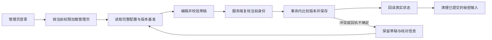
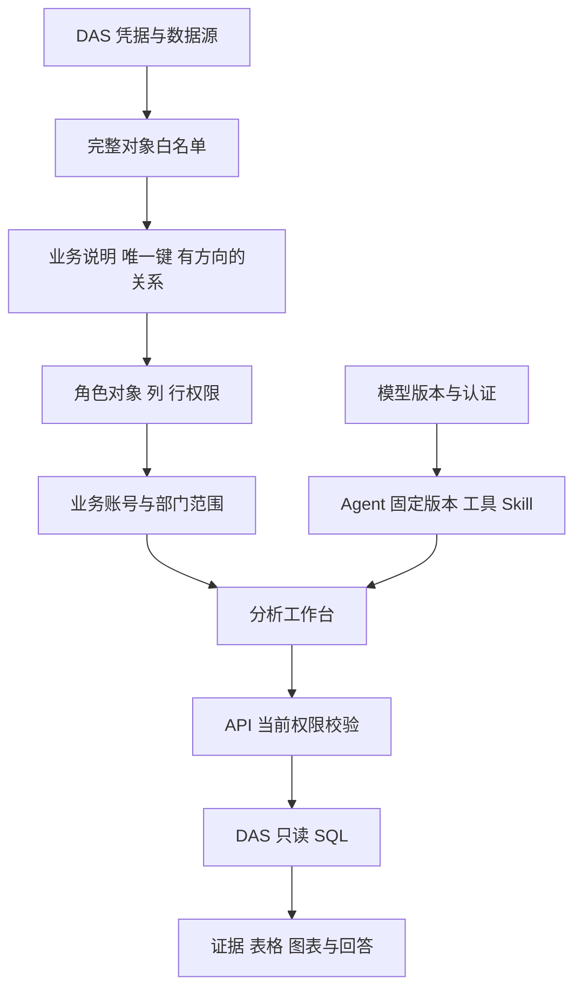

# 前端第 8—9 步交付说明

日期：2026-09-30。依据[联合实施清单](前端第8-9步联合实施清单.md)，用户回复“干”后由主代理单独实施，随后批准[整数部门兼容补充清单](前端第8-9步部门整数类型补充清单.md)。**第 8、9 步功能和联合验收已完成。** 五个管理入口已接入 API/DAS；本机目标数据库自动发现受证书配置限制，具体边界见第 5 节。

## 1. 已实现的页面

| 入口                    | 交付内容                                                                                                       |
| ----------------------- | -------------------------------------------------------------------------------------------------------------- |
| `/settings/models`      | 模型列表、历史版本、创建与复制发布、完整认证确认、启停、版本冲突及回执核对                                     |
| `/settings/agents`      | 固定模型版本、工具与 Skill 目录、源文档预览、运行预算、版本发布及启停                                          |
| `/settings/users`       | 本组织用户、创建时分配已有角色和例外、授权详情、部门 ID 维护、授权版本冲突、启停                               |
| `/settings/data`        | DAS 在线/异常/失联状态、注册凭据、数据库凭据引用、数据源配置、对象发现与完整白名单、业务目录及有方向的关系发布 |
| `/settings/permissions` | 角色对象/字段/行规则、实际当前规则、版本历史和授权 DSL 预览                                                    |

页面沿用 Element Plus、现有亮暗模式与四种配色。资源和字段按页展示；管理权限同时控制菜单、直达页面、数据管理子页及服务端操作。角色定义及组织结构继续使用既有配置，用户页维护可分配角色与业务部门 ID。

模型新版本显式提交该版本完整认证。复制历史版本时凭据值留空；公开响应只返回是否有密钥和请求头名称。发布成功后新会话可选择新 Agent 版本，既有会话继续保留固定绑定。新 Agent 默认预算为 600 秒、30 次工具调用、64 KiB 本次输入；选择 Skill 时补齐 `read_skill_reference`。

## 2. API、DAS 与保存流程

- 管理请求重新读取当前身份，公开管理读取及凭据响应使用 `no-store`。
- 新增本组织角色/例外/部门选项、用户授权详情、全部曾注册 DAS、完整数据源与白名单、完整业务目录和实际当前策略读取。
- 用户及初始绑定在同一事务内创建；校验角色/例外归属和特权角色可分配性，失败整体回滚。部门更新按授权版本比较并递增。
- 数据源及白名单使用公开配置 SHA-256 修订指纹。配置与白名单共享源锁，版本比较和写入在同一事务完成；修改源目标后旧白名单基准失效。
- 白名单保留逻辑 ID、物理映射、发现/查询开关、显式空能力及过程定义。保存时重新发现物理对象，校验能力只能收窄。
- 业务配置使用现有配置版本，普通说明编辑保留关系；关系整批发布使用现有版本和事务。策略从实际权限表读取，即使没有历史也显示规则与版本 0。
- 查询行策略读取可信部门上下文时，按受控目录的整数字段进行规范十进制、安全整数的无损转换；任一 ID 无效则整体拒绝。字符串字段保留原 ID，其他身份上下文和固定条件沿用既有规则。
- 模型/Agent、用户创建、凭据及配置写入遇到不确定回执时回读核对。模型认证无法回读，公开字段一致仍标记待核对；再次发布由用户明确决定。
- 普通校验失败和并发冲突保留草稿。换号、退出、401/403 和离页放弃会清理当前资源、秘密及草稿，并忽略旧身份迟到响应。





## 3. 文件与环境

业务实现位于 `ai-data/apps/web/src/features/{models,agents,users,permissions,data-management}/`、公共 `shared/management/`；相关 API/DAS 管理路由、仓储及共享合同按联合清单 A—H 补齐。测试位于各包镜像测试目录，证据集中在[验收目录](前端第8-9步验收/)。

依赖安装/升级/卸载 0 项；包声明、锁文件、catalog 的本轮变更 0 项；应用表结构和迁移 0 项；子代理 0 个。已有未提交改动保留。`ai-book` 本轮修改 0 项。

实际管理写入在随机隔离 API/DAS 元数据库及独立密钥、运行目录中执行。`ai_bi_demo` 仅做读取和 SQL 对账。验收脚本关闭本轮子进程、删除对应随机临时库，并校验临时目录边界后清理。

## 4. 工程与浏览器验证

| 检查             | 本轮结果                                                    | 证据                                                                                               |
| ---------------- | ----------------------------------------------------------- | -------------------------------------------------------------------------------------------------- |
| API 普通测试     | 86 文件、667 项通过                                         | [API 测试](前端第8-9步验收/api-test.txt)                                                           |
| DAS 普通测试     | 45 文件、414 项通过                                         | [DAS 测试](前端第8-9步验收/das-test.txt)                                                           |
| 共享合同         | 25 文件、175 项通过                                         | [合同测试](前端第8-9步验收/contracts-test.txt)                                                     |
| Web 单元测试     | 30 文件、148 项通过                                         | [Web 测试](前端第8-9步验收/web-test.txt)                                                           |
| 工程规则         | 42 项通过                                                   | [工程测试](前端第8-9步验收/engineering-test.txt)                                                   |
| API 隔离 SQL     | 管理、Agent 固定版本及关系相关 17 项通过                    | [API SQL](前端第8-9步验收/api-sql.txt)                                                             |
| DAS 隔离 SQL     | 管理配置及修订事务 3 项通过                                 | [DAS SQL](前端第8-9步验收/das-sql.txt)                                                             |
| 浏览器管理场景   | 开发服务器 6 项、生产预览 8 项通过                          | [开发场景](前端第8-9步验收/browser-test.txt)、[生产预览](前端第8-9步验收/browser-preview.txt)      |
| 整数部门授权回归 | 4 文件、179 项通过，包含全量 API 测试中新增的 19 项授权用例 | [修复前失败](前端第8-9步验收/整数部门修复前.txt)、[授权回归](前端第8-9步验收/整数部门授权回归.txt) |
| 类型与 lint      | API、DAS、contracts、Web 类型检查通过；相关包 lint 通过     | [lint 输出](前端第8-9步验收/lint.txt)                                                              |
| Web 生产构建     | 通过，保留已有大 chunk 提示                                 | [构建输出](前端第8-9步验收/web-build.txt)                                                          |

浏览器覆盖版本发布、完整认证、Agent 固定绑定、用户和部门保存、白名单别名与能力保持、业务配置、策略版本跳号、回执失败、草稿保留、离页确认与权限撤回清理。五个管理页在 1440/1024/390px 下检查整体无横向溢出，模型页同时覆盖亮暗×四配色。大资源列表采用每页 20 项，列表减少后的页码回落有独立行为测试。

真实操作发现数字组件的辅助禁用属性在加载后未同步，已在管理表单内按实际原生属性同步，并用单元测试及浏览器操作验证。模型和关系对象选择器补充了明确的可访问名称。关系图在新增节点及容器尺寸变化后重新适配视口；新增发布场景先复现裁切，修复后在三种宽度下验证两端节点完整可见，见[修复前记录](前端第8-9步验收/关系图修复前.txt)、[回归记录](前端第8-9步验收/关系图回归.txt)和[关系图截图](前端第8-9步验收/relations-graph-light.png)。

## 5. 真实环境核对与验证边界

真实 DAS 注册、凭据保存与白名单、浏览器模型和 Agent v1/v2 发布、两个部门账号创建及部门保存、住院到科室的关系发布均通过。修复后使用同一业务角色、不同账号的 `permission_context.department_ids` 执行住院及费用查询，结果如下：

| 用户范围 | 住院人次 | 住院有效费用（分） | 结果                        |
| -------- | -------- | ------------------ | --------------------------- |
| 部门 1   | 334      | 50,833,965         | API 查询与只读 SQL 基准一致 |
| 部门 2   | 334      | 50,837,225         | API 查询与只读 SQL 基准一致 |

隐藏的 `patient_id` 查询返回 403，发布后的住院→科室关联查询与 SQL 一致。实际 rj 完成 3 轮：旧会话 Agent v1 查询住院人次 334、新会话 Agent v2 查询部门 2 费用 50,837,225 分、升级后的旧会话继续以 v1 追问且没有新增查询证据。管理资源、真实执行、权限范围分别留有记录。

[部门上下文真实结果](前端第8-9步验收/隔离业务验收.json)记录 8 组检查通过、3 轮模型运行完成和 `cleaned_up: true`，并保留服务端授权 DSL 中的整数部门范围。此前[固定值真实结果](前端第8-9步验收/隔离固定值业务验收.json)也完成相同链路和清理。真实模型查询页面见[真实费用分析](前端第8-9步验收/真实费用分析.png)。

1. **目标数据库发现**：本机 SQL Server 使用自签名证书；现有服务器级发现采用证书校验，驱动复核返回 `ESOCKET / self-signed certificate`。页面可输入已知目标库名继续配置，数据源按部署配置正常读取。见[TLS 核对](前端第8-9步验收/目标发现TLS核对.json)。该环境的自动发现尚未通过，后续如调整连接策略需另列范围。
2. **其他数据库**：本轮实机验收覆盖 SQL Server。MySQL/PostgreSQL/Oracle 沿用合同及连接器分支测试，未声明其真实服务器已通过。
3. **整体格式基线**：相关新增/修改文件已格式化；扫描四个包时，既有 `apps/api/tests/support/web-editor-catalog-fixture.ts` 仍报告格式差异，本轮保留该文件。见[格式扫描](前端第8-9步验收/format-final.txt)。

## 6. 本机查看

进入 `D:\porject_new_2026\ai-data\ai-data` 执行：

```powershell
pnpm dev
```

登录后从左侧模型管理、Agent 管理、用户管理、角色与权限、数据管理进入。日常启动读取现有正式配置。验收使用的临时账号、模型和数据源随隔离环境清理，测试数据不会成为日常管理列表内容。
