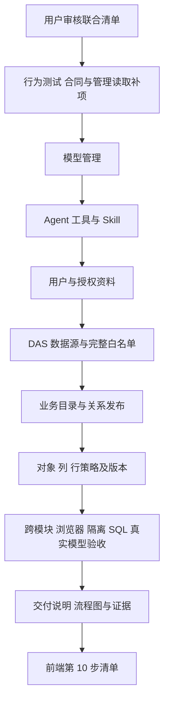

# 前端第 8—9 步联合实施清单：分析配置与管理后台

日期：2026-09-30。状态：**用户回复“干”批准联合清单，主代理已完成实施和联合验收。** 用户随后批准的整数部门兼容补项也已通过；交付、流程图及本机数据库自动发现的证书限制见[交付说明](前端第8-9步交付说明.md)。下文的申请语句保留作为获准范围依据。

用户要求将前端第 8、9 步一起执行。本清单替代原来的分步安排，保留原编号用于交付追踪：第 8 步为模型与 Agent 管理，第 9 步为用户、权限与数据管理。第 1—7 步成果沿用，完成本轮后进入第 10 步知识、偏好与后台任务。

计划由主代理单独实施，**子代理 0 个，依赖操作 0 项**。五个现有占位入口接入真实 API；与页面流程直接相关的 API、DAS 和共享合同补项在本文一并申请审核。总流程见[前端实施流程](前端实施流程.md)，前序结果见[第 7 步交付说明](前端第7步交付说明.md)。

## 1. 合并后的八项执行工作

| 顺序 | 工作                         | 目的与完成标准                                                                                         |
| ---- | ---------------------------- | ------------------------------------------------------------------------------------------------------ |
| 1    | 管理合同、读取接口和权限装配 | 补齐选项、授权详情、完整管理配置读取；管理请求使用当前身份，五个入口按实际权限显示。                   |
| 2    | 模型管理                     | 列表、历史版本、新建、发布新版本、启停；凭据按版本显式提交并加密保存。                                 |
| 3    | Agent、工具与 Skill          | 固定模型版本、工具与 Skill 选择、源文档预览、运行限制、版本发布和启停。                                |
| 4    | 用户与授权资料               | 用户列表、创建、详情、启停；选择已有角色和例外范围，维护业务部门 ID，保存后回读。                      |
| 5    | DAS 与数据源                 | 查看在线、异常、失联实例；保存数据库凭据、发现目标库、维护数据源、发现对象并保存完整白名单。           |
| 6    | 业务目录与关系               | 维护业务说明、字段含义、粒度、唯一键、脱敏及能力限制；发布有方向、有版本的关系。                       |
| 7    | 对象、列、行权限             | 选择现有角色配置策略，查看当前规则及历史，预览授权 DSL；再用实际业务账号验证数据范围。                 |
| 8    | 联调、验收与交付             | 连通“数据接入 → 配置权限 → 模型与 Agent → 用户分析”，完成异常、主题、浏览器、隔离 SQL 和真实模型验证。 |

每项先编写行为场景和必要的失败测试，再实施及回归。底层合同先定，页面按上述顺序逐项完成，最后进行跨模块验收。

## 2. 页面与管理权限

沿用 Element Plus、Lucide、系统界面字体、亮暗模式及现有四种配色。采用现有后台风格：可筛选列表、按需详情、分组表单、固定主要操作；复杂编辑使用独立详情区，窄屏切换为全宽内容。资源数多时采用分页、按需展开和已有虚拟列表能力。

| 入口                    | 页面内容                                       | 管理权限                                                                      |
| ----------------------- | ---------------------------------------------- | ----------------------------------------------------------------------------- |
| `/settings/models`      | 模型、版本、认证状态、启停                     | `models:manage` 或系统管理员。                                                |
| `/settings/agents`      | Agent、固定模型、工具、Skill、运行限制         | `agents:manage` 或系统管理员。                                                |
| `/settings/users`       | 组织用户、已有角色及例外绑定、部门范围、启停   | `user:manage` 或系统管理员。                                                  |
| `/settings/permissions` | 角色选项、对象／列／行策略、策略历史、角色预览 | `catalog:manage` 或系统管理员，与现有后端策略权限一致。                       |
| `/settings/data`        | DAS 实例、数据源、对象白名单、业务目录、关系   | `data-access:manage`、`catalog:manage` 任一或系统管理员可进入；子页分别授权。 |

调整导航合同，使菜单与直达路由支持“任一权限”，并让数据页按子功能检查权限。数据接入子页要求 `data-access:manage`，业务目录与关系子页要求 `catalog:manage`。DAS 注册凭据签发继续只供系统管理员使用；数据库连接凭据沿用数据接入管理权限。

模型和 Agent 的公开配置读取继续服务于已认证用户的分析选择器。页面授权与服务端授权同时验收。用户及其部门资料按当前组织限定；DAS 实例、数据源和业务配置沿用现有平台资源范围，界面说明其共享影响。

## 3. 第 8 步：模型、Agent 与资源

### 3.1 模型

- 列表显示名称、稳定 ID、服务端模型名、最新版本和启停状态；名称／ID／状态筛选作用于已加载的最新配置。
- 详情按版本读取。创建 v1 或从任一公开版本复制为草稿，发布版本取服务端最新版本加 1。已发布定义只读。
- 现有协议为 `responses`；填写服务地址、服务端模型名及可选上下文窗口。窗口范围为 4,096—2,097,152 tokens，留空按现有运行逻辑探测。
- 密钥和额外请求头使用专门表单。API 只返回 `has_api_key` 与 `header_names`，新版本需要该版本完整认证；复制配置时认证值留空，由用户重新填写或显式选择取消该认证。
- 凭据只保留于当前表单内存和本次请求，成功、放弃、离页、退出及身份失效时清理；服务端复用既有加密入库。
- 发布成功表示配置已保存；连接及实际运行通过分析工作台验证。模型状态作用于整个模型资源及其各版本。

### 3.2 Agent、工具与 Skill

- 配置名称、职责、指令，明确绑定 `model_id` 和 `model_version`；模型新版本发布后，原 Agent 仍保留原绑定。
- 工具和 Skill 从服务端目录读取。新建时默认选择目录中存在的 `get_tool_schema`；复制历史配置保留原选择。选择 Skill 时联动必需的 `read_skill_reference`。
- 缺失或下线资源保留原名称并提示处理，发布前校验；Skill 预览复用安全 Markdown，子文档按合法相对路径读取。
- 页面标明预览为当前源库文档；历史 Agent 显示绑定名称及固定指纹，运行仍使用发布时的快照。
- 新建表单建议初值：单轮 600 秒、30 次工具调用、64 KiB 本次 JSON 输入上限。复制版本保留原值。tokens 窗口和字节输入容量分别展示。
- 时限范围 1—600 秒，工具调用 1—100 次，JSON 输入 4,096—1,048,576 字节；可选窗口范围与模型一致。
- 上下文沿用既有逻辑：Agent 配置优先于模型配置，再与服务实际窗口取较小值，压缩阈值为有效窗口的 75%。页面区分已配置值与运行探测结果。
- Agent 发布形成固定版本和 Skill 快照；新会话选择新版本，旧会话保留原绑定。启停影响后续启动的运行，已启动运行通过分析页停止。

模型／Agent 表单边界、凭据校验和回执核对的详细约定沿用[原第 8 步清单第 3、4 节](前端第8步实施清单.md#3-页面与表单)，纳入本次联合范围；实施顺序、文件范围及审核状态以本文为准。

## 4. 第 9 步：用户与授权资料

### 4.1 页面操作

- 用户列表支持用户名、显示名、状态筛选，创建用户、查看详情、启用／停用。
- 创建表单填写用户名、显示名、初始密码，选择已有角色和个人例外范围。后台一次事务写入用户及初始绑定；任何绑定无效则整体失败。
- 详情新增读取角色、例外范围及部门 ID。角色和例外显示其实际绑定；本轮沿用创建时设置角色／例外的能力，已有账号可维护部门范围和启停。
- 部门范围采用可搜索、可输入的 ID 集合，支持整体替换，空集合表示撤回部门范围；保存前展示增删差异。
- 部门保存携带读到的 `authorization_version` 作为并发基准，服务端在用户行锁内检查并递增；失败保留草稿，冲突后重新核对。
- 创建密码不回显，用户详情不返回密码哈希；启停及范围变更后读取真实状态，当前账号授权失效时走既有登录恢复流程。

### 4.2 角色、部门和例外选项的实际来源

当前数据库的角色和例外范围使用全局主键，部门只保存用户绑定的业务 ID。页面按这些实际结构提供选项：

| 选项     | 本轮来源与规则                                                                                                                                |
| -------- | --------------------------------------------------------------------------------------------------------------------------------------------- |
| 角色     | 查询当前组织可用的已有角色；目录策略选择沿用“存在本组织成员且没有其他组织成员”的现有归属规则。用户绑定选项由服务端单独标记可分配性。          |
| 特权角色 | `system_admin` 及带管理权限的角色只允许系统管理员授予；普通用户管理员只能分配服务端判定可分配的业务角色。提交时重新核对，不能仅依赖选项过滤。 |
| 部门     | 提供本组织已绑定过的部门 ID，并允许管理员输入新的真实业务部门 ID；页面直接展示 ID，空组织也能维护。                                           |
| 个人例外 | 从现有 `data_scopes` 及角色／用户绑定推导本组织可用范围，展示资源、字段、操作和值；跨组织或归属不明的范围不进入可分配集合，提交时再次验证。   |

角色定义及功能权限字典继续由现有配置维护；本轮页面负责已有角色选择、授权查看和数据策略配置。部门是业务数据范围标识，独立组织架构和部门名称字典属于后续功能。个人例外按当前服务的强制范围语义展示，不能将它描述为自动放宽权限。

## 5. 第 9 步：DAS 与数据接入

### 5.1 实例状态与注册凭据

- 管理实例列表从持久化注册记录读取，展示服务 ID、版本、地址、最近心跳、上报状态及数据源摘要；按既有心跳阈值计算在线、异常、失联。
- 已失联实例保留最后心跳快照，并标明快照时间。列表覆盖曾注册实例；仅签发凭据、从未心跳的实例不计为已注册。
- 系统管理员可按既有接口签发指定服务 ID 的注册凭据，结果只在本次页面内存展示、按需复制；离页后清理。签发后等待 DAS 实际注册及心跳。
- 数据接入操作继续由 Web → API → 签名请求 → DAS 执行。离线实例无法读取当前 DAS 配置时显示读取失败和最后心跳摘要。

### 5.2 数据库配置流程

1. 选择 DAS，读取该实例完整数据源配置，包含启用、停用及异常连接的数据源。
2. 新建或选择已有 `secret_ref`。新建／更新数据库凭据填写连接器、主机、端口、账号和密码，由 DAS 加密保存；选择已有引用时沿用其密文。
3. 使用已保存引用发现目标库，选择一个目标并保存独立 `source_id`。Oracle 按 SID／Service Name 字段维护，其他数据库按库名维护。
4. 编辑超时、连接池、并发、行数上限和启停状态。历史 `cost_limit` 原值保留，界面按其现有语义处理。
5. 保存后回读配置，再发现对象。目录读取成功与数据源健康分别显示，失败明确指出停留在哪一阶段。

支持现有管理写入合同中的 SQL Server、MySQL、PostgreSQL、Oracle。已有 HTTP API 数据源在完整清单中只读展示其公开配置。秘密读取接口仅返回引用及存在状态；修改共享凭据前显示受影响的数据源，因为既有运行器会关闭引用它的旧连接器。

### 5.3 对象发现与完整白名单

- 按需发现表、视图及存储过程，用筛选、计数、分页／虚拟列表和展开字段控制大目录渲染。
- 同时读取当前完整白名单；按逻辑对象 ID、物理映射和对象类型匹配，保留已有逻辑 ID、发现／查询开关、查询能力和过程定义。
- 新增对象采用发现结果给出的物理映射。已有自定义逻辑 ID 保持稳定；物理对象丢失时提示处理，禁止静默重映射。
- 服务端校验映射属于当前源的实际发现结果，保存的能力受对应连接器和对象能力约束；客户端不能通过提交物理名称或能力字段扩大执行范围。
- 存储过程通过现有严格 Schema 编辑其参数、输出等定义。未配置可执行签名时保留只发现状态。
- 保存前展示新增、保留、移除及变化项；这是完整集合替换，空集合需要明确确认其清空效果。保存成功后回读完整配置再更新页面。
- 数据源配置和白名单增加基于持久化公开配置的修订指纹及 `expected_revision` 比较更新。DAS 在同一事务／锁内检查基准并写入，冲突返回 409；前端保留草稿供核对。

## 6. 第 9 步：业务目录、关系与数据权限

### 6.1 业务目录

- 管理目录通过 `catalog:manage` 的专用读取入口，查看 DAS 已暴露的完整对象和字段，能够配置尚未对业务角色开放的对象。
- 业务表单维护说明、字段含义、粒度、唯一键、字段默认脱敏及免脱敏角色；高级分组维护能力收窄、参数策略和已验收的权限参数绑定。
- 使用现有 `apiDatasetConfigSchema` 校验，保存完整配置并显式提交 `expected_version`。继承能力与显式空能力集合保留各自含义。
- 管理读取同时返回持久化配置及一致的配置版本；尚无业务配置时返回空配置与版本 0，允许首次配置。
- 业务说明编辑保留已有 `approved_relations` 和其他未编辑字段；关系维护统一走下述关系发布入口，成功后刷新业务配置基准。

### 6.2 关系发布

- 查看对象的入向／出向关系；编辑起点、目标、字段对、业务说明、基数和允许连接方式。
- 使用现有发布接口逐项声明 `create`、`update` 或 `disable`，更新与停用提交当前关系版本；整批中任何一项失败则整体回滚。
- 一对一、多对一等基数由现有字段和唯一键规则校验。入向展示保留原方向；多对多等可能放大行数的关系显示其实际基数。
- 复用第 6 步现有 Vue Flow 和主题样式提供关系浏览，表单负责编辑并显式发布。发布后验证画布的可用关系与真实查询一致。

### 6.3 对象、列和行策略

- 按“数据源 → 角色 → 对象”选择当前规则；对象允许／拒绝，字段允许／拒绝及其可用操作，行条件按合同编辑字段、操作符、固定值或可信上下文引用。
- 行策略沿用每角色、每对象一条条件的保存／替换能力；对象和列按现有 allow／deny 覆盖维护。独立规则删除和历史一键回滚未纳入本次接口范围。
- 当前规则从实际权限表读取，即使尚未产生版本记录也能显示；历史页继续读取现有不可变快照和审计摘要。
- 写入携带该角色当前策略版本，保存一项后回读。版本号由组织与数据源内的策略提交顺序生成，同一角色的版本可以跳号。
- 角色预览输入受控 DSL，展示最终授权 DSL 和脱敏规则；页面操作名为“预览权限规则”。依赖真实用户或部门的条件，使用具体用户登录后的查询进行验收。
- 实际数据验证通过原有分析／报表查询链路完成，继续由 API 执行对象、字段、行范围与脱敏检查。

## 7. 本次明确申请的后端与合同补项

以下是拟新增或调整的行为，**均待本清单获准后实施**。现有实现证据见[用户路由](../ai-data/apps/api/src/routes/user-admin-routes.ts)、[目录路由](../ai-data/apps/api/src/routes/catalog-routes.ts)、[策略服务](../ai-data/apps/api/src/catalog-admin/catalog-admin-service.ts)、[DAS 管理代理](../ai-data/apps/api/src/data-access/data-access-management-client.ts)和[DAS 管理服务](../ai-data/apps/data-access/src/data-sources/data-source-management-service.ts)。路径为 API 原始路径，Web 统一加同源 `/api` 前缀。

| 编号 | 缺口                                             | 拟补充与影响                                                                                                                                                                                                                               |
| ---- | ------------------------------------------------ | ------------------------------------------------------------------------------------------------------------------------------------------------------------------------------------------------------------------------------------------ |
| A    | 管理身份可能命中旧缓存，部分响应未明确禁止缓存   | 本轮模型、Agent、工具、Skill、用户、目录策略、关系和数据管理的用户认证请求，加载身份后调用既有 `refreshContext`；配置和凭据响应统一 `no-store`。DAS 机器注册和心跳继续使用服务认证。                                                       |
| B    | 用户响应缺少绑定，选择器缺少可靠来源             | 新增 `GET /admin/users/:id/authorization` 返回角色、例外、部门及授权版本；新增 `GET /admin/users/assignment-options` 返回服务端可分配选项；新增 `GET /admin/catalog/role-options` 供目录管理员选择可管理角色，避免要求其拥有用户管理权限。 |
| C    | 用户创建逐条写入，绑定验证及并发部门维护不足     | 新建用户及角色／例外绑定改为同一事务，验证存在性、归属和可分配性；部门写入增加可选 `expected_authorization_version`，Web 总是提交，旧调用省略时保留原行为。复用授权版本递增及缓存失效。                                                    |
| D    | 仅有健康实例列表                                 | 新增 `GET /admin/data-access/services`，读取所有曾注册实例并计算失联状态；SQL 和内存注册表增加完整读取。原健康列表继续用于运行时服务发现。                                                                                                 |
| E    | 数据源和白名单有写入接口，缺完整回读             | 新增 API 管理代理的配置列表、源详情、完整白名单及凭据引用读取；DAS 提供对应严格签名的内部读取，公开 DTO 包含停用配置但不含秘密原文。                                                                                                       |
| F    | 白名单替换会重建映射与能力，DAS 配置缺少并发基准 | 扩展对象选择合同以保留已有映射、能力、开关和过程定义；服务器重新验证物理对象。配置／白名单读取返回修订指纹，写入在事务内比较 `expected_revision`，增加 409 映射；保持原简化请求兼容。                                                      |
| G    | 目录管理员需要完整目录及尚未初始化的配置         | 新增 `GET /admin/catalog/sources`、`GET /admin/catalog/datasets/:sourceId`、`GET /admin/catalog/datasets/:sourceId/:objectId`；读取当前可用管理目录和完整配置／版本。源选项只包含管理目录所需信息，DAS 地址及凭据留在数据接入权限内。      |
| H    | 策略历史接口不能覆盖尚无版本记录的已有规则       | 新增 `GET /admin/catalog/policies/:sourceId/:roleId`，一致读取实际规则快照及该角色当前版本；无历史时版本为 0，规则仍按实际表返回。复用现有版本历史和保存接口。                                                                             |

E 项拟采用的 API 读取路径为：

- `GET /admin/data-access/services/:serviceId/data-sources`
- `GET /admin/data-access/services/:serviceId/data-sources/:sourceId`
- `GET /admin/data-access/services/:serviceId/data-source-objects/:sourceId`
- `GET /admin/data-access/services/:serviceId/data-source-secrets`，仅返回引用、存在状态及关联源等公开元数据。

DAS 使用对应 `/internal/admin/...` 路径，仍校验方法、路径、服务 ID 和请求摘要。GET 请求的签名与客户端传输增加明确合同，避免凭据或请求体进入查询字符串。新读取以元数据库为依据，源连接失败也应能读配置；调用前提是 DAS 管理服务本身可达且通过现有服务状态检查。

新建共享 Schema 放入 `packages/contracts`，必要时将现有 DAS 管理 Schema 从应用内移入共享包供 Web/API/DAS 复用，并在公共入口导出；类型放 `*-types.ts`。过程定义等传递结构保持完整严格校验。

本方案复用现有 API/DAS 元数据表：用户、绑定、策略版本、注册记录、数据源及白名单；修订指纹由配置快照计算，**计划数据库表结构变更 0 项，迁移 0 项**。如实施发现必须增加持久化结构或改变角色归属、授权模型，先提交实际问题与调整清单。

## 8. 写入、冲突与生命周期

| 场景                 | 执行规则                                                                                                                                                           |
| -------------------- | ------------------------------------------------------------------------------------------------------------------------------------------------------------------ |
| 模型／Agent 版本冲突 | 提交前刷新最新版本，409 时保留草稿及新基准，用户核对后再发；服务端事务为最终判断。                                                                                 |
| 配置／策略／关系冲突 | 使用各自实际版本或修订指纹；表单显示变化目标，重新读取后核对，不以空表覆盖旧配置。                                                                                 |
| POST 回执丢失        | 模型／Agent 按目标 ID 和版本读回。模型认证无法回读，公开字段一致仍显示“发布结果待核对”；不自动递增再发。用户创建结果通过当前组织用户列表核对，未确认前不重复创建。 |
| DAS 凭据回执丢失     | 引用存在只能证明有记录，不能证明秘密值相同；显示待核对，由用户显式重新提交或通过目标发现验证可用性。                                                               |
| 启停及最终状态写入   | 等待服务端响应再刷新；网络不确定时先回读。停用数据源、模型、Agent 或账号前说明本次影响对象。                                                                       |
| 多步接入失败         | 标明已保存凭据、已保存源、已发现目录等完成点，允许从失败处继续；不把整段流程描述为单一事务。                                                                       |
| 身份变化             | 退出、换号、401／403、权限撤回时清理当前资源、草稿和秘密；中止请求并忽略旧身份迟到响应。                                                                           |
| 离页与普通失败       | 有修改时提示；明确放弃后清理。普通校验／网络失败保留输入并提供请求编号。                                                                                           |
| 敏感验收资料         | 真实密码、密钥、注册凭据不写入持久草稿、URL、日志、截图或浏览器 trace；测试秘密使用隔离值。                                                                        |

## 9. 文件增删改范围

业务路径相对于内层 `ai-data/`。本轮申请的业务文件范围如下；文件按现有目录规范拆分，避免把多个管理模块合并成单个大页面。

| 操作       | 路径范围                                                                                                         | 用途                                                                     |
| ---------- | ---------------------------------------------------------------------------------------------------------------- | ------------------------------------------------------------------------ |
| 新增       | `apps/web/src/features/{models,agents,users,permissions,data-management}/{api,stores,components,pages}/`         | 五个管理模块及严格 API 边界、草稿、状态和页面。                          |
| 新增／修改 | `apps/web/src/shared/` 中实际共用的管理列表、状态和表单组件；`styles/management.css`、`src/main.ts`              | 复用主题、密集表单、窄屏和公共交互。                                     |
| 修改       | `apps/web/src/app/{router,services,services-types,navigation,navigation-types}.ts`                               | 路由、任一权限、子功能权限、服务装配及身份清理。                         |
| 限定修改   | Web `features/analysis/`、`features/reports/` 和现有画布公共组件                                                 | 管理后刷新 Agent／目录／关系选项，验证既有会话和报表的固定绑定。         |
| 新增／修改 | `packages/contracts/src/{admin,data-access,catalog}/`、对应 `*-types.ts` 及 `src/index.ts`                       | 新的用户选项、管理读取、DAS 修订和完整白名单合同。                       |
| 新增／修改 | API `routes/` 中模型、Agent、用户、目录、策略、关系及数据接入路由；新增管理读取路由                              | 第 7 节 A—H 的接口与身份／缓存调整。                                     |
| 修改／新增 | API `auth/`、`catalog/`、`catalog-admin/`、`data-access/` 对应服务与仓储；`app-types.ts`、`app.ts`、相关创建工厂 | 选项及绑定读取、创建事务、范围校验、策略一致快照、完整注册表和代理装配。 |
| 新增／修改 | DAS `data-sources/`、`metadata/`、`routes/data-source-management-route.ts`、装配入口及内部签名传输相关代码       | 完整配置读取、白名单回读与保持、修订比较更新、错误映射。                 |
| 新增／修改 | Web/API/DAS/contracts 镜像测试目录、HTTP fixtures、隔离 SQL 和浏览器场景                                         | 真实合同、权限、并发、秘密、映射保持及端到端验证。                       |
| 新增／追加 | 外层 `任务交接/前端第8-9步验收/`、`前端第8-9步交付说明.md`、README 和总流程                                      | 实际验收结果、截图、交付与流程图。                                       |

删除文件 0 项；包声明、锁文件和 pnpm catalog 变更 0 项。本次仅请求管理功能实施和任务交接范围，`ai-book` 继续按用户另行发起的集中文档任务维护。

## 10. 依赖与验收

现有 Vue、Element Plus、Lucide、Zod、dayjs、Markdown、Vue Flow、虚拟渲染及测试工具足够，**现在无需执行安装命令**。发现新增依赖或兼容调整时，按协作规则先报告，依赖操作仍由用户执行。

| 验收组             | 必须覆盖的结果                                                                                                                     |
| ------------------ | ---------------------------------------------------------------------------------------------------------------------------------- |
| 模型与 Agent       | v1 → v2、完整认证、工具／Skill 约束、源文档与历史指纹、启停、旧会话固定绑定、新会话选新版本。                                      |
| 用户与选项         | 创建成功／整事务失败、错误角色与例外 ID、组织隔离、特权角色分配限制、部门空集合／冲突／新 ID、账号启停、密码不回显。               |
| 管理权限           | 模型管理员、Agent 管理员、用户管理员、目录管理员、DAS 管理员和普通用户分别验证菜单、直达路由及 API；撤回权限后旧缓存不能继续写入。 |
| DAS                | 在线／异常／失联、停用源可回读、无连接时配置可读、注册凭据、密文引用复用及更新影响、数据库目标字段校验。                           |
| 白名单             | 自定义逻辑 ID、物理映射、查询能力、开关及过程定义回读保持；发现后物理对象变化、清空确认、完整替换和并发冲突。                      |
| 业务目录与关系     | 首次配置版本 0、全字段编辑保持、能力收窄、脱敏、唯一键和基数、关系方向、整批回滚、画布使用新发布关系。                             |
| 数据策略           | 有／无历史记录的实际规则、版本跳号与冲突、对象拒绝、字段操作、固定值／上下文行范围、预览与实际业务账号查询各自正确。               |
| 数据安全与生命周期 | 400／401／403／404／409／500、超时断网、回执丢失、离页、换号、迟到响应；秘密不进入公开响应、持久缓存或真实 trace。                 |
| 页面               | 亮暗 × 四种配色，1440／1024／390px，键盘、焦点、空状态、长名称；大字段／对象集合按需渲染，页面整体无横向溢出。                     |
| 工程               | 相关 Web/API/DAS/contracts 测试、隔离 SQL、类型、lint、格式、工程规则、Web 生产构建及产物浏览器检查。                              |

### 端到端验收环境与链路

- 使用本次独立的临时 API/DAS 元数据库、资源目录和进程进行管理写入、权限变更、停用及并发验收。
- 使用已有 `ai_bi_demo` 合成业务库做只读查询；接入配置保存于隔离元数据库。正式既有账号、模型、Agent、数据源和策略用于只读对照。
- 真实模型复用此前获准的 rj 服务。在隔离环境通过页面发布模型 v1/v2、Agent v1/v2，创建两个不同部门范围的业务账号，完成住院／费用类查询，并与 SQL 基准对账。
- 验证隐藏字段、限制部门、关系发布后的查询，以及旧会话追问和新版本选择。服务不可用时标记相应真实环境待验收，保留确定性测试的独立结果。
- SQL Server 做真实联调；其他数据库类型至少覆盖合同、表单、代理和连接器分支测试，交付时单独列明是否具备实机环境。
- 结束时只清理本轮创建的临时库、资源及进程，保留可复核的脱敏证据。交付说明报告实际检查数、通过／失败项及待验证条件。

## 11. 执行与业务流程图

本次审核对象为上述八项工作、A—H 后端补项、文件范围和验收；批准后由主代理顺序实施。原前端第 8、9 步合并验收，交付中仍分别标明完成内容。

## 12. 本轮清单验证

联合清单的 8 处本地引用目标存在，2 段 Mermaid 流程图使用已安装的解析器与 DOM 环境验证通过。联合清单及原第 8 步清单通过 Markdown 格式检查；交接 README 与总流程仅追加并逐字节核对原文前缀，相关文件的 Git 空白检查通过。

本轮修改范围为联合清单、原第 8 步清单的指引、README 和总流程四份任务交接文件；业务代码、依赖和数据库操作在联合清单获准后开展。本轮检查结果属于清单验证，功能验收按第 10 节执行。
