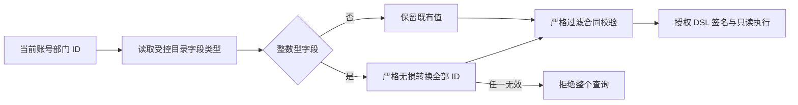

# 部门上下文与整数业务字段兼容补充清单

日期：2026-09-30。状态：用户回复“批准追加整数部门兼容修复”，主代理已完成实施及授权、SQL、rj 验收。

## 已复现的问题

隔离 API/DAS 元数据库、浏览器创建的两个部门账号、已批准的 rj 模型及 `ai_bi_demo` 只读业务库联调时，账号部门范围保存为 `['1']`、`['2']`，这是现有用户授权合同的字符串 ID。业务库住院及费用表的 `department_id` 为整数。

行策略使用 `value_from: permission_context.department_ids`，现有 `row-policy-filters.ts` 直接将字符串数组放入整数类型过滤，严格合同校验拒绝，返回 `403 POLICY_REJECTED`。该问题影响使用数字型部门字段的实际查询；用户创建、部门保存、模型与 Agent 发布和关系发布已通过。现有固定整数行条件可以独立验证。

## 拟追加的改动

1. 在 API 行策略解析阶段，读取真实字段类型；仅对可信 `permission_context.department_ids` 与整数型字段组合，严格转换可无损表达的十进制整数 ID。
2. 拒绝空串、空白、指数、小数、非数字、超出 JavaScript 安全整数范围等输入；任一值无效则整体拒绝，禁止过滤掉无效项或取消行限制。
3. 字符串业务字段保留原值；用户 ID、组织 ID及管理员直接配置的固定值维持既有行为。权限条件仍由服务端构造并签名。
4. 增加关键授权测试和 SQL 场景，使用两个真实部门账号复验住院及费用，与只读 SQL 基准对账。

## 文件、操作与验证

| 项目               | 范围                                                                                                    |
| ------------------ | ------------------------------------------------------------------------------------------------------- |
| 修改               | `ai-data/apps/api/src/query/row-policy-filters.ts`；必要时在同目录提取专用转换函数                      |
| 测试               | `ai-data/apps/api/tests/query/query-policy-authorization.test.ts` 及隔离业务验收脚本                    |
| 交付               | 本清单、联合交付说明、脱敏验收结果与流程图                                                              |
| 依赖、表结构、迁移 | 0 项                                                                                                    |
| 执行者             | 主代理，子代理 0 个                                                                                     |
| 验证               | 先补失败用例，再验证严格转换、无效 ID 整体拒绝、字符串字段保持；授权回归、类型检查、真实 SQL 和 rj 查询 |

需确认原因：根 `AGENTS.md` 规定“额外想法、优化、架构调整和超出已批准清单的改动，先提出并等待用户确认”。原联合清单的后端范围为管理读取、写入及 A—H 补项，本项进入查询授权规则，因此单独提出审核。

## 执行结果

用户批准后，在 `row-policy-filters.ts` 完成局部转换。新增 19 项授权用例，验证 `in`/`not_in`、安全整数边界、16 类非法 ID 整体拒绝，以及字符串字段、固定值和其他身份上下文的行为保持。修复前复现 2 项失败，修复后查询目录 179 项通过，全量 API 667 项通过，类型及 lint 检查通过。

同一角色下两个账号分别保存部门 `1`、`2`，授权 DSL 中分别注入整数 `[1]`、`[2]`。两部门住院人次均为 334；有效费用分别为 50,833,965 分、50,837,225 分，全部与独立 SQL 一致。隐藏字段拒绝、已发布关系查询、rj 三轮新旧 Agent 固定版本对话均通过，临时数据库和进程清理完成。

详见[联合交付说明](前端第8-9步交付说明.md)、[授权回归](前端第8-9步验收/整数部门授权回归.txt)及[真实验收结果](前端第8-9步验收/隔离业务验收.json)。
