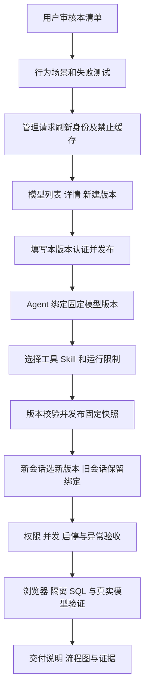

# 前端第 8 步实施清单：模型与 Agent 管理

> 2026-09-30 更新：用户要求第 8、9 步一起执行。当前审核入口改为[第 8—9 步联合实施清单](前端第8-9步联合实施清单.md)；本文保留原方案及模型／Agent 表单细则，执行范围和状态以联合清单为准。

日期：2026-09-30。状态：**待用户审核；本轮完成代码核对和清单，功能实施尚未开始。**

承接[前端实施流程](前端实施流程.md)第 8 步及[第 7 步交付说明](前端第7步交付说明.md)。本步使管理员能在页面中维护模型和 Agent，并在分析工作台使用发布后的固定版本。计划由主代理单独完成，子代理 0 个，依赖操作 0 项。

## 1. 六项工作

| 顺序 | 工作                 | 完成后的能力                                                                                     |
| ---- | -------------------- | ------------------------------------------------------------------------------------------------ |
| 1    | 管理页面与接口装配   | 将 `/settings/models`、`/settings/agents` 从占位页接入真实 API，复用登录、权限、主题和身份清理。 |
| 2    | 模型管理             | 查看配置及历史版本，新建模型、发布新版本、启停；完整提交该版本凭据。                             |
| 3    | Agent 管理           | 配置名称、职责、指令、固定模型版本及运行限制，新建和发布新版本。                                 |
| 4    | 工具与 Skill         | 从服务端目录选择工具和 Skill，查看描述及当前 Skill 源文档，检查绑定约束。                        |
| 5    | 版本、权限与异常处理 | 处理并发发布、回执丢失、启停影响、权限撤回、离页和换号；核对新旧会话版本。                       |
| 6    | 联调、验收与交付     | 隔离 SQL、浏览器及真实模型验证，保存交付说明、流程图、截图和记录。                               |

第 9 步负责用户、角色、部门、数据权限、DAS 和业务目录；第 10 步负责知识、偏好与后台任务。本步围绕模型和 Agent 两个管理入口推进。

## 2. 已核对的能力与后端补项

依据：[模型路由](../ai-data/apps/api/src/routes/model-resource-routes.ts)、[Agent 路由](../ai-data/apps/api/src/routes/agent-routes.ts)、[模型合同](../ai-data/packages/contracts/src/agents/model-configuration.ts)、[Agent 合同](../ai-data/packages/contracts/src/agents/agent.ts)、[运行装配](../ai-data/apps/api/src/runtime/agent-runtime.ts)。以下为 API 原始路径，Web 通过同源 `/api` 前缀访问。

| 接口                                       | 本步使用方式                                                            |
| ------------------------------------------ | ----------------------------------------------------------------------- |
| `GET /models`                              | 读取本组织各模型最新版本的公开配置；搜索和列表分页在已返回数据上进行。  |
| `GET /models/:id?version=N`                | 省略版本取最新，指定版本读取历史；保留模型 ID 与所读版本。              |
| `POST /models`                             | 发布模型 v1 或最新版本加 1；返回 201，版本冲突由服务端拒绝。            |
| `PATCH /models/:id/status`                 | 提交 `{ enabled }`，成功 204；随后读取实际状态。                        |
| `GET /agents`、`GET /agents/:id?version=N` | 列表取最新版本，详情按版本读取；同时供分析工作台选择和恢复绑定。        |
| `POST /agents`                             | 发布固定模型版本、工具、Skill 和预算；服务端校验资源并固定 Skill 快照。 |
| `PATCH /agents/:id/status`                 | 修改 Agent 当前开关，成功后复核实际状态。                               |
| `GET /agent-tools`                         | 读取当前注册工具名称和说明，作为选择器依据。                            |
| `GET /skills`、`GET /skills/:id?path=...`  | 读取当前公共源库的 Skill 元信息、入口及合法相对路径子文档。             |

### 本次明确提出的后端调整

现有两个路由文件通过 `loadContext` 读取身份，该方法可能命中缓存；部分 Agent／工具响应也未显式禁止缓存。本清单包含以下限定调整，随本步一起审核：

1. 这两个路由文件中的模型、Agent、工具和 Skill 请求，在加载身份后调用既有 `refreshContext`，再执行原服务，及时检查账号、会话及当前授权。
2. 本组配置、资源读取和发布响应统一设置 `Cache-Control: no-store`，启停响应也采用同一约定。
3. 补充路由回归：缓存身份仍有权限但数据库权限已撤回时拒绝发布／启停；刷新认证失败时不进入业务服务。

复用既有接口、版本仓储、凭据加密和 Skill 快照。当前列表接口返回全量最新配置，界面明确显示“筛选已加载配置”；历史按需读取指定版本，不批量拉取全部历史。沿用现有数据库结构和 DAS 协议。

模型与 Agent 的公开读取当前允许已认证组织成员使用，供分析和模型选择器调用；写入继续分别要求 `models:manage`、`agents:manage` 或系统管理员。前台管理入口遵循现有导航权限；只有 Agent 管理权限的人仍可在 Agent 表单里选择公开模型版本。

## 3. 页面与表单

沿用用户确认的 Element Plus、Lucide、系统界面字体、亮暗模式与四种配色。管理员在桌面核对连接、版本和密集参数，使用资源列表与详情／编辑区；窄屏将编辑区改为全宽。交互按已有产品界面规则组织，表单字段有标签、单位、限制和明确失败反馈。

### 3.1 模型管理

- 列表显示显示名称、模型 ID、服务端模型名、最新版本、启停状态；支持名称／ID 筛选、状态筛选及刷新。
- 详情展示协议、服务地址、配置的上下文窗口、密钥是否已配置、额外请求头名称。历史通过版本号选择按需加载；当前启停状态与历史配置分开显示。
- 新建填写稳定 `model_id`，版本固定为 1；“发布新版本”从所选公开配置复制，提交版本始终是重新读取的最新版本加 1。
- 表单区分“显示名称”与“服务端模型名称”；协议按现有合同为 `responses`。URL 仅接受无内嵌凭据的 HTTP(S) 地址。上下文窗口为可选正整数，范围 4,096—2,097,152 tokens。
- 发布只校验配置并持久化。服务可用性通过已发布 Agent 在现有分析工作台发起运行验证，页面以实际发布／启停状态描述配置。

### 3.2 凭据处理

现有 API 每个模型版本独立保存认证。`has_api_key` 和 `header_names` 仅为公开状态，省略认证项表示新版本不用该项，不代表继承。

- 密钥使用密码输入框；自定义请求头逐行填写名称和值，最多 20 项，校验名称、换行、重复名称和长度。
- 从旧版本创建新版本时，显示需要重新填写的认证类型及请求头名称，值保持空白；用户选择继续使用这些认证时须完整填写。切换为不使用认证是显式选择。
- 只发送表单里本次填写的值，不提交展示占位符。普通校验失败保留当前表单；确认发布成功、放弃编辑、离页、退出或身份失效时清空凭据。
- 凭据仅驻留当前页面内存及本次请求，不写入 URL、持久草稿、查询缓存、交接记录或真实凭据的录屏／网络追踪文件。服务端继续使用已有加密入库机制。

### 3.3 Agent 管理

- 列表显示名称、ID、最新版本、绑定模型及固定版本、启停状态；详情显示职责、指令、工具、Skill、限制与固定资源指纹。
- 新建或从已有版本创建草稿，编辑 `name`、`description`、`instructions`，选定明确的 `model_id` 和 `model_version`。模型选择器加载相应公开版本，停用模型保留状态提示并由服务端最终校验。
- 模型发布 v2 后，原 Agent 仍引用原模型版本。用户需要发布新 Agent 版本才能更新引用；历史详情始终显示自身绑定。
- 已发布内容只读，通过“发布新版本”维护；成功后读取实际返回版本和当前状态。资源处于停用状态时，发布新版本保持现有开关。
- 新建表单建议初值为 600 秒、30 次工具调用、64 KiB 本次输入上限；复制版本保留原值。提交转换回合同的毫秒／字节并校验整数边界。

| 运行字段            | 表单含义与范围                                                                                            |
| ------------------- | --------------------------------------------------------------------------------------------------------- |
| `timeout_ms`        | 单轮时限，1—600 秒，提交 1,000—600,000 毫秒。                                                             |
| `max_tool_calls`    | 单轮工具调用次数，1—100。                                                                                 |
| `max_context_bytes` | 本次提交 Harness 的 JSON 输入容量，包含所需消息、证据等，4,096—1,048,576 字节；与上下文 tokens 分开解释。 |
| `context_window`    | 可选 Agent 上下文配置，4,096—2,097,152 tokens；留空沿用模型配置／服务探测。                               |

上下文继续沿用既有运行逻辑：优先取 Agent 配置，否则模型配置；服务探测到实际窗口时再取较小值，压缩阈值为有效窗口的 75%。管理页显示已配置值与说明，实际探测结果和压缩状态沿用运行页展示，避免把未探测的配置值标成服务实际容量。

### 3.4 工具和 Skill

- 选择器从 `agent-tools` 和 `skills` 获取有效选项，按名称／描述搜索，显示已选数量；工具最多 32 个，Skill 最多 100 个，禁止重复。
- 新建 Agent 默认勾选目录中存在的 `get_tool_schema`，说明其用于大型工具按需读取参数。复制旧版本保留原选择；用户取消时提示大型参数定义将按既有兼容路径提供。
- 选择任意 Skill 时明确联动启用 `read_skill_reference`；仍有 Skill 被选择时不能单独移除该必需工具，提交前继续用共享 Schema 校验。
- 已选工具或 Skill 从目录消失时，保留名称并提示失效，发布前要求处理，不能悄悄删掉原配置。
- Skill 预览复用安全 Markdown／代码组件，默认按需读取 `SKILL.md`；相对 Markdown 引用转换为同一 Skill 的只读接口请求，路径由服务端最终校验。
- 标明预览为“当前源库文档”。历史 Agent 显示已绑定名称与固定 `skill_fingerprint`；当前源文件和历史运行快照分别说明。Skill 内容维护沿用现有文件流程。

## 4. 版本、启停与失败恢复

1. **并发发布**：打开草稿时记录基准，提交前刷新最新版本；目标版本变化或返回 409 时保留草稿，展示新基准，由用户确认后重新提交。模型、Agent 均由后端事务执行最终递增检查。
2. **回执丢失**：禁用重复提交，读取本次目标 ID／版本及最新版本。目标不存在时允许显式重试原目标；目标已存在时展示实际公开内容。模型凭据无法回读，公开字段相同不能证明认证相同，应保持“发布结果待核对”，由用户核对后决定采用或另发新版本；不自动递增再发。
3. **Agent 回执核对**：对比实际返回的可核对配置字段；有差异或 Skill 源资源已变化时显示差异及固定指纹，要求核对，不覆盖已存在版本。
4. **启停**：界面说明该开关作用于资源当前状态，包含所有历史版本。影响新会话及已有会话后续启动的运行；已启动运行不会由状态接口主动取消，停止操作在分析页完成。模型停用还会影响绑定它的 Agent。
5. **状态写入**：等待服务端结果后刷新，不预先宣布成功；网络不确定时先读实际状态。现有状态接口采用最终写入状态，不伪造 `expected_version`。
6. **草稿与身份**：有修改时离页提示；确认离开后中止请求、清理草稿和凭据。换号、退出、401／403 清理当前资源，迟到响应不能恢复旧身份内容。普通失败保留输入并显示请求编号。
7. **分析工作台**：返回工作台刷新可用 Agent；新会话明确选择新版本，旧会话按原 ID／版本读取。版本更新和启停产生的错误用现有运行反馈呈现。

## 5. 文件增删改范围

以下业务路径相对于 `ai-data/`。新文件按职责拆分，Schema 和类型分离，测试目录镜像功能目录。

| 操作       | 路径范围                                                                                                                       | 用途                                                                 |
| ---------- | ------------------------------------------------------------------------------------------------------------------------------ | -------------------------------------------------------------------- |
| 新增       | `apps/web/src/features/models/{api,stores,components,pages}/`                                                                  | 模型列表、版本读取、表单、凭据和状态控制。                           |
| 新增       | `apps/web/src/features/agents/{api,stores,components,pages}/`                                                                  | Agent 配置、工具／Skill 选择、只读预览和发布控制。                   |
| 修改       | `apps/web/src/app/router.ts`、`services.ts`、`services-types.ts`；按需 `navigation.ts`                                         | 替换两个占位入口，按权限装配和统一销毁资源。                         |
| 按需修改   | `apps/web/src/features/analysis/stores/analysis-workspace.ts` 及对应页面                                                       | 管理后刷新选项、核对新会话选择与旧绑定。                             |
| 新增／修改 | `apps/web/src/styles/model-agent-management.css`、`src/main.ts`                                                                | 复用主题变量、管理列表／表单与窄屏布局。                             |
| 修改       | `apps/api/src/routes/model-resource-routes.ts`、`agent-routes.ts`                                                              | 第 2 节限定的实时身份刷新和禁止缓存。                                |
| 新增／修改 | Web `tests/features/models/`、`tests/features/agents/`、`tests/e2e/model-agent-management.spec.ts`；API 对应路由及隔离集成测试 | 先行为测试，再实现；验证真实响应形态与状态边界。                     |
| 新增／修改 | `apps/api/tests/support/web-model-agent-fixture.ts`、现有 `web-auth-server.ts`／公共测试 fixtures                              | 确定性 HTTP 场景、权限变化、并发和回执丢失；与真实模型验收分开记录。 |
| 新增／追加 | 外层 `任务交接/前端第8步验收/`、`前端第8步交付说明.md`、README 和总流程                                                        | 场景、截图、记录、交付与流程图。                                     |

现有共享 Schema 覆盖发布内容；响应包装与 Skill 文档形态在 Web API 边界严格校验，从 Schema 推导类型。此清单不安排删除文件、增加依赖、改变数据库结构或新增业务接口。发现额外接口或技术路线需求时，列出实际缺口再审核。

## 6. 依赖与验收

复用已安装 Vue、Element Plus、Lucide、Zod、dayjs、Markdown 渲染及现有测试工具，**本步无需安装命令**。若实际实施发现兼容性问题，先给具体调整清单，依赖操作仍由用户完成。

先落 BDD 场景 → 编写测试 → 确认目标行为失败 → 实现 → 回归。重点验收如下：

| 场景         | 通过标准                                                                                              |
| ------------ | ----------------------------------------------------------------------------------------------------- |
| 权限与组织   | 只管理当前组织；分别覆盖模型管理员、Agent 管理员、普通用户和撤回权限；直达路由及 API 同时验证。       |
| 模型凭据     | 状态和原文分离；新版本认证显式填写或移除；表单清理、响应／日志不泄密，加密持久化回归。                |
| 版本与并发   | v1 → v2、历史读取、两个页面竞争发布、409 草稿保留、停用状态下发布、回执丢失均符合第 4 节。            |
| 资源选择     | 固定模型版本、停用模型、Skill 缺失、工具重复或下线、Skill 必需工具以及按需参数工具的选择正确。        |
| 源文档       | 当前源库预览与固定历史指纹区分；合法子文档可读，路径越界、恶意 HTML／链接和缺失文件可控。             |
| 运行与窗口   | 自动探测／显式配置／缺少有效窗口的行为与现有运行器一致，tokens 与字节上限分开，压缩逻辑回归。         |
| 新旧会话     | 新会话使用新 Agent 及绑定模型版本；旧会话保留旧绑定并可继续；停用后后续运行按当前状态拒绝。           |
| 异常生命周期 | 400、401、403、404、409、500、断网、超时、快速切换版本、离页和换号，迟到响应不会覆盖新状态。          |
| 界面         | 八种主题、1440／1024／390px，键盘、焦点恢复、长名称、表单错误、空列表和禁用状态；页面无整体横向溢出。 |
| 工程         | Web／API 相关测试、隔离 SQL、类型、lint、格式及 Web 生产构建；生产产物实际浏览器操作。                |

模型／Agent 发布与启停写入使用临时 SQL 元数据库及隔离资源目录。真实模型验收复用此前获准的 rj 服务：通过页面发布隔离模型 v1／v2 和 Agent v1／v2，创建前后两个会话，核对绑定，并验证一次工具调用及旧会话追问。生产现有模型和 Agent 用于只读展示核对。服务不可用时如实记录真实模型待验收，不能用模拟结果代替。

验收配置、真实密钥只放受忽略的临时位置／内存；结束时清理本次创建的临时库、目录和进程，正式资源保持原配置。交付说明列出实际检查数量、成功／失败结果、限制和证据。

## 7. 执行流程

本次申请审核范围为以上六项工作、两个管理路由文件的限定调整及验收；由主代理单独实施。当前仅提交清单，批准后按顺序执行。

## 8. 本轮清单验证

Markdown 格式检查通过，7 处本地引用目标存在，1 段流程图使用已安装 Mermaid 和 DOM 测试环境解析通过。交接 README 与总流程仅追加记录并核对原文前缀。本轮验证对象为清单，业务功能和运行验收在获准实施后进行。
