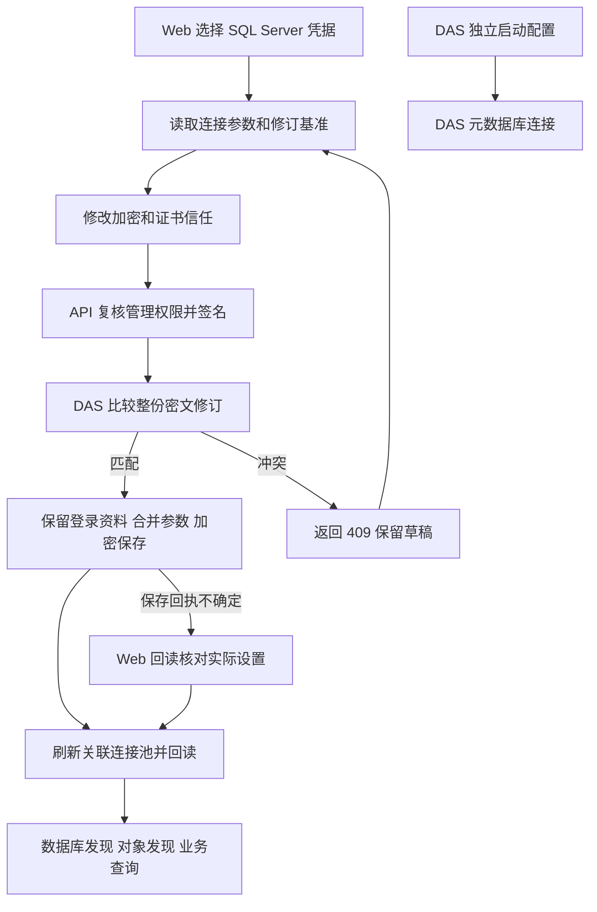

# 前端第 9 步补项：SQL Server 连接参数 Web 管理交付

日期：2026-10-03。用户回复“干”批准[实施清单](前端第9步SQLServer连接参数Web管理清单.md)，主代理完成实施与验收。

## 1. 页面交付

入口：**数据管理 → DAS 与数据源 → 选择 DAS 实例 → 保存数据库凭据**。

- 新建 SQL Server 凭据时，随登录资料保存“加密连接”和“信任服务器证书”。默认分别为开启、关闭。
- 在下方“业务 SQL Server 连接参数”选择已有凭据，可单独修改两个开关。服务器地址、账号和原密码保留在服务端。
- 两个开关分别保存。同一 DAS 内，共用该凭据引用的数据源共同生效；保存前列出刷新连接的影响范围。
- 旧凭据显示数据库发现的默认值，并列出关联数据源的部署配置来源。Web 保存后，数据库发现、对象发现和业务查询采用同一设置。
- 成功后显示回读结果；版本冲突保留草稿并要求读取新基准；保存回执丢失时先读取实际状态，确认已保存后结束操作。
- 沿用 Element Plus、亮暗主题与配色。离页确认、换号清理和权限撤回处理保持有效。

本机自签名证书连接可将两个开关都设为开启。“信任服务器证书”开启后跳过证书校验，传输仍请求加密。

## 2. 配置与调用边界

| 项目             | 本轮行为                                                                                       |
| ---------------- | ---------------------------------------------------------------------------------------------- |
| 保存位置         | DAS 的 `data_source_secrets` 加密 JSON，增加可选 `sqlserver_transport`。                       |
| 生效范围         | `secret_ref` 对应的业务 SQL Server 连接。                                                      |
| DAS 元数据库连接 | 继续使用独立启动配置 `metadata_sqlserver`。Web 两个开关不修改这条连接。                        |
| 已有数据源取值   | 凭据中的明确设置 → `sqlserver_transports[source_id]` → 加密开启、证书信任关闭。                |
| 数据库发现取值   | 凭据中的明确设置 → 默认值；服务器级发现尚无 `source_id`。                                      |
| 并发保护         | 修订指纹绑定整份密文；SQL 比较更新阻止旧参数覆盖新密码。完整凭据更新省略新字段时保留已存选项。 |
| 连接生效         | 保存后使关联连接池失效；初始化期间发生更新时，旧连接完成后关闭并拒绝进入缓存。                 |
| 管理权限         | 逐次刷新当前身份，要求系统管理员或 `data-access:manage`；内部请求签名，响应 `no-store`。       |

新增 API 代理路径：

```text
GET /admin/data-access/services/:serviceId/data-source-secrets/:secretRef/sqlserver-transport
PUT /admin/data-access/services/:serviceId/data-source-secrets/:secretRef/sqlserver-transport
```

DAS 对应路径为 `/internal/admin/data-source-secrets/:secretRef/sqlserver-transport`。PUT 只接受 `expected_revision` 和两个布尔连接参数。回读仅包含引用、SQL Server 类型、参数、来源、关联数据源与修订；登录资料和密文不回传。

证书校验失败映射为 `DATA_SOURCE_CERTIFICATE_INVALID`，API 提供脱敏提示。参数保存或写后回读的内部故障返回 500，供 Web 核对保存状态；版本冲突返回 409。

## 3. 实现文件

本轮涉及 40 个源码或测试文件，详见[文件清单](前端第9步SQLServer连接参数验收/变更文件.json)。主要模块：

- contracts：连接参数、管理回读、局部更新、数据库类型校验和错误码。
- DAS：统一选项解析、凭据合并和加密、SQL 比较写入、管理路由、连接池失效及初始化竞态。
- API：带签名的参数读写代理、当前身份复核、证书错误映射。
- Web：新凭据参数表单、已有凭据参数编辑器、读取及保存反馈、开关样式。

依赖操作、表结构与迁移操作、子代理均为 0。沿用已有运行工具；`ai-book` 按既定更新规则保持原状。

## 4. 验收结果

| 检查                | 结果与证据                                                                                                                                                                                                          |
| ------------------- | ------------------------------------------------------------------------------------------------------------------------------------------------------------------------------------------------------------------- |
| 全工作区类型与 lint | 通过：[类型](前端第9步SQLServer连接参数验收/typecheck-final.txt)、[lint](前端第9步SQLServer连接参数验收/lint-final.txt)。                                                                                           |
| 包级与工程回归      | contracts 185、metadata 28、API 670、Web 148、工程 42 项通过；DAS 最终 426 项通过。[全量记录](前端第9步SQLServer连接参数验收/tests.txt)、[DAS 最终记录](前端第9步SQLServer连接参数验收/tests-das-final.txt)。       |
| 隔离 SQL            | 4 项通过，包含同一引用并发首次创建、密码轮换后的旧密文拒绝。[记录](前端第9步SQLServer连接参数验收/sql.txt)。                                                                                                        |
| 浏览器              | 管理页整组 10 项通过；补充回执丢失场景后，连接参数 3 项通过（共 11 个不同场景）。[管理页](前端第9步SQLServer连接参数验收/browser.txt)、[参数最终检查](前端第9步SQLServer连接参数验收/browser-transport-final.txt)。 |
| 生产构建            | Web 构建通过，保留既有大 chunk 提示。API/DAS 当前源码通过生产方式 bundle 并用于真实隔离联调。[Web 构建](前端第9步SQLServer连接参数验收/build-web.txt)。                                                             |
| 格式                | 本轮文件检查通过；全工作区在 `apps/api/tests/support/web-editor-catalog-fixture.ts`、`pnpm-lock.yaml` 有两处格式提示，本轮未对它们做格式重写。[工作区检查](前端第9步SQLServer连接参数验收/format.txt)。             |
| TDD                 | 参数与缓存竞态先失败后通过；补充了保存回读故障的失败与通过记录，均保存在验收目录。                                                                                                                                  |

真实联调使用随机隔离 API/DAS 元数据库和临时运行目录，业务库 `ai_bi_demo` 只读。结果见[验收 JSON](前端第9步SQLServer连接参数验收/验收结果.json)，可复现脚本见[业务连接验收](前端第9步SQLServer连接参数验收/业务连接验收.mjs)。

1. 默认校验证书时，数据库发现返回脱敏的证书错误。
2. 在真实 Web 中开启证书信任并保存，回读两个选项均为 `true`，覆盖关联源旧部署选项。
3. 浏览器发现目标库成功，包含 `ai_bi_demo`；对象发现得到 24 项。
4. DAS 重启后选项保持，授权只读查询得到住院人次 **4,000**，与独立 SQL 基准 **4,000** 一致。
5. DAS 元数据库连接配置保持独立，项目实际配置保持原值。
6. 亮暗主题及 1440、1024、390px 检查通过。临时进程、元数据库和目录已清理。

初次验收的业务断言通过，清理目录遇到 Windows `EBUSY`。随后单独清理残留目录，补充子进程退出确认与有界重试后重新验收，最终记录为 `passed`、`cleaned_up: true`；保留[初次清理记录](前端第9步SQLServer连接参数验收/初次验收清理失败.json)。

## 5. 执行流程



API、DAS、Web 使用本轮配套版本。凭据保存新字段后，回滚应保持匹配版本或先恢复兼容凭据内容。更新连接选项会关闭关联旧池，正在执行的请求可能受影响，保存操作不自动重放业务查询。

本次完成第 9 步数据库发现补项。后续仍为前端第 10 步“知识、偏好与后台任务”，具体实施清单另行审核。
