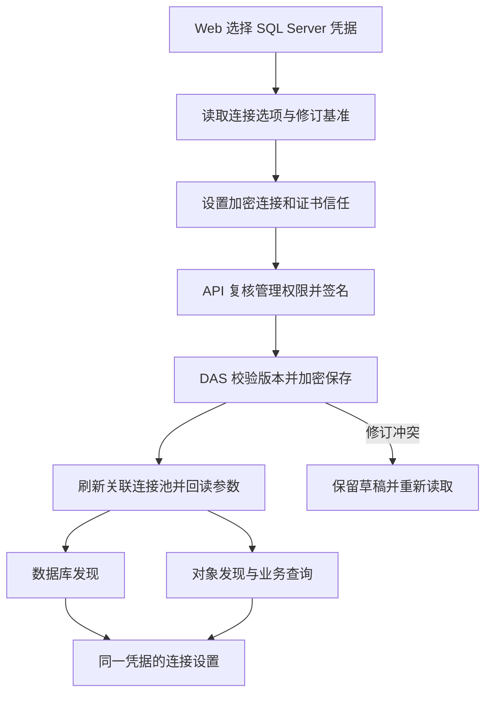

# 前端第 9 步补项：SQL Server 连接参数 Web 管理

日期：2026-10-03。状态：用户回复“干”批准本清单，已完成实施与验收，见[交付说明](前端第9步SQLServer连接参数Web管理交付说明.md)。依据：[联合交付说明](前端第8-9步交付说明.md)、[TLS 验收记录](前端第8-9步验收/目标发现TLS核对.json)。

## 1. 目标与页面操作

管理员在“数据管理 → DAS 与数据源 → 数据库凭据”配置**业务 SQL Server** 的连接选项。保存后，业务数据库发现、对象发现和业务查询使用已保存的设置。

这里区分两条连接：DAS → 业务数据库，由本次 Web 参数控制；DAS → DAS 自身元数据库，继续使用独立的启动配置。业务连接参数保存到 DAS 元数据库中的配置记录，只表示持久化位置，不会修改元数据库连接的加密或证书选项。

| 页面参数       | 提交字段                                       | 新建默认值 | 页面说明                                           |
| -------------- | ---------------------------------------------- | ---------- | -------------------------------------------------- |
| 加密连接       | `sqlserver_transport.encrypt`                  | 开启       | 请求加密连接；实际连接还受服务器强制加密配置影响。 |
| 信任服务器证书 | `sqlserver_transport.trust_server_certificate` | 关闭       | 开启后跳过服务器证书校验，可用于自签名证书连接。   |

这两个选项仅在 SQL Server 凭据下显示，采用现有 Element Plus 开关、主题和表单反馈。当前本机接入可选择“加密连接：开启；信任服务器证书：开启”。两项分别保存，不因切换加密选项而静默重置证书选项。

- **新建凭据**：与主机、端口、账号、密码一同提交连接选项。
- **已有凭据**：选择凭据引用，回读这两个参数及关联数据源，单独保存连接参数；保留服务器地址、账号和原密码。
- **共用范围**：连接选项归属 DAS 内的 `secret_ref`，引用它的多个数据源共同生效。沿用现有共享凭据更新提示，列明会刷新连接的数据源。
- **保存反馈**：成功后回读参数；失败保留草稿，版本冲突要求重新读取基准，回执不确定时先核对状态。离页、换号或权限撤回沿用管理页清理规则。

## 2. 保存、读取与旧配置兼容

1. 在现有 SQL Server 凭据加密 JSON 中加入可选的 `sqlserver_transport` 对象，两个值均为严格布尔值；与凭据一并使用现有 AES-GCM 保存到 `data_source_secrets`。
2. 新增连接参数读取、局部更新合同和 API/DAS 管理接口。读取只返回引用、数据库类型、连接选项、配置来源、关联源及修订基准；主机、账号、密码和密文不回传。
3. 局部更新只接受 SQL Server 连接选项及 `expected_revision`。服务端解密当前记录、合并参数并重新加密；按当前密文记录的修订指纹比较更新，防止用旧草稿覆盖最新密码或连接参数。
4. 凭据完整保存与参数局部保存协调同一引用的并发写入。旧调用方未传新字段时，保留已有连接选项；首次创建且未传选项时，沿用旧凭据语义。
5. 业务连接取值顺序：**凭据中已明确保存的 Web 设置 → 既有 `sqlserver_transports[source_id]` → 加密并校验证书的默认值**。旧凭据可直接读取，既有数据源配置继续有效。
6. 目标数据库发现尚无 `source_id`：优先使用凭据中保存的选项；旧凭据尚未在 Web 保存时沿用默认值。页面明确显示“尚未在 Web 设置”，并显示关联源的旧配置生效情况，避免把默认值误认为各数据源当前值。
7. Web 保存之后，同一凭据的目标发现与所有关联数据源使用相同选项，原文件配置作为旧凭据的兼容来源保留。
8. 本次 API、DAS、Web 配套更新。新格式凭据不能直接由旧版严格 JSON Schema 的 DAS 读取；回滚需保留匹配版本或先恢复兼容凭据内容。

## 3. 连接与权限边界

- 提取统一的 SQL Server 连接选项解析逻辑，目标发现与业务连接工厂共同调用；对象发现使用同一业务连接器。
- 参数保存后，按凭据引用使关联连接池失效，后续连接按新设置创建；覆盖更新时仍在初始化的连接，旧初始化结果不得重新成为有效缓存。
- 管理端显示连接刷新影响；已在执行中的请求如受旧池关闭影响，按现有错误流程返回，保存参数不自动重放业务查询。
- 参数读取和修改沿用数据接入管理权限、当前身份复核、API→DAS 请求签名和 `no-store`。
- 为本次 SQL Server 证书校验失败提供明确、脱敏的提示；错误响应不包含凭据或原始连接内容。
- DAS 自己的元数据库连接继续由部署配置管理。本次两个开关作用于业务 SQL Server 凭据。

## 4. 文件增删改与操作范围

以下路径均相对 `ai-data/`。按既有模块组织实现，测试镜像源码目录。

| 类型       | 文件范围                                                                                                                                             | 目的                                                           |
| ---------- | ---------------------------------------------------------------------------------------------------------------------------------------------------- | -------------------------------------------------------------- |
| 修改       | `packages/contracts/src/data-access/data-source-management.ts`、对应 `*-types.ts`、`src/index.ts`                                                    | 增加连接参数输入、公开回读、局部更新及类型出口。               |
| 修改       | `apps/api/src/routes/data-access-routes.ts`、`src/data-access/data-access-management-client.ts`                                                      | 增加受权管理代理读写，保持固定路径与签名。                     |
| 修改       | `apps/data-access/src/secrets/secret-resolver.ts`、`src/metadata/secret-repository.ts`                                                               | 读取兼容凭据、参数合并与修订比较写入。                         |
| 修改       | `apps/data-access/src/data-sources/data-source-management-service.ts`、`database-target-discovery.ts`、`data-source-manager.ts`                      | 保存与回读、目标发现使用统一设置、连接池失效与初始化竞态处理。 |
| 修改       | `apps/data-access/src/connectors/database-connector-factory.ts`、`database-drivers.ts`、`src/routes/data-source-management-route.ts`、`src/index.ts` | 接线、选项应用、管理端点及本次证书错误映射。                   |
| 新增       | `apps/data-access/src/connectors/sqlserver-transport.ts`，按需配套 `*-types.ts`                                                                      | 统一连接设置优先级与驱动参数转换。                             |
| 修改       | `apps/web/src/features/data-management/components/database-credentials.vue`、`data-source-manager.vue`、`api/data-access-api.ts`                     | 新建参数、已有凭据选项读取与独立保存、发现结果和反馈。         |
| 新增       | `apps/web/src/features/data-management/components/sqlserver-transport-form.vue`                                                                      | 复用两项参数的字段、说明和编辑状态。                           |
| 新增／修改 | 上述 API、DAS、contracts、Web 对应测试；Web `tests/e2e/management.spec.ts` 和管理夹具                                                                | 合同、授权、凭据保持、并发、驱动选项、页面和真实连接验证。     |
| 交接       | 本清单、后续补项交付说明和验收目录，追加交接 README 与前端流程入口                                                                                   | 保存实施结果、流程图及证据。                                   |

依赖安装、升级、卸载：**0 项**。表结构、迁移、现有数据库重建：**0 项**。删除文件：**0 项**。主代理单独执行，子代理 **0 个**。工作区既有修改保留。`ai-book` 依用户既定更新规则保持现状。

## 5. 行为场景与验收

先编写场景及失败测试，再实施和回归。

| 场景                            | 验收结果                                                            |
| ------------------------------- | ------------------------------------------------------------------- |
| 新建 SQL Server 凭据            | 页面默认值正确；只接受布尔值；保存后准确回读。                      |
| 切换数据库类型                  | 非 SQL Server 请求不携带或接受该类型专属参数。                      |
| 已有凭据只修改连接参数          | 原主机、账号、密码保持有效；参数回读不泄漏秘密。                    |
| 旧凭据与旧文件配置              | 原数据源连接行为保持；页面可区分旧来源与明确保存的 Web 设置。       |
| Web 值与旧配置不同              | 保存后的参数同时用于数据库发现、对象发现和真实查询。                |
| 同一凭据用于多个数据库          | 更新后所有关联源的新连接使用相同参数；未关联源保持原行为。          |
| 参数更新与密码更新并发          | 修订冲突可识别，局部参数更新不能覆盖已更新的密码。                  |
| 保存期间存在初始化中的连接      | 旧连接完成后被清理，下一次获取使用新设置。                          |
| 权限撤回、保存失败、离页与换号  | 服务端拒绝越权，页面按既有规则清理或保留可重试草稿。                |
| 自签名 SQL Server，信任开关关闭 | 目标发现给出明确证书失败；失败不改写保存的参数。                    |
| 同一连接，打开信任开关并保存    | 浏览器发现目标库成功，对象发现及只读 SQL 查询成功，结果与基准一致。 |

真实验收采用隔离 DAS/API 元数据、独立运行目录，业务库仅执行发现和只读对账；不修改服务器证书或正式业务记录。已有安装工具执行相关测试、类型、lint、格式、Web 构建，以及亮暗主题和 1440/1024/390px 浏览器检查。保存脱敏证据，清理临时环境。

## 6. 执行流程

审批依据：根 [AGENTS.md](../AGENTS.md) 要求“实施前先给用户清单，说明目的、影响范围、文件增删改、依赖操作和验证方式，取得明确批准后执行”。本清单已获用户明确批准，实施和验收按以上范围完成。
